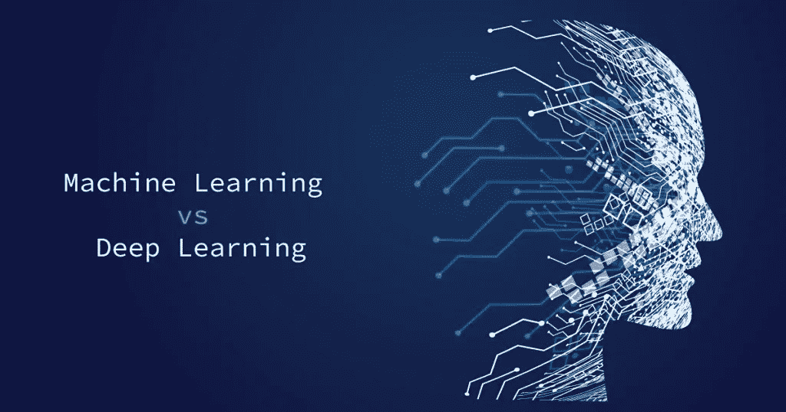
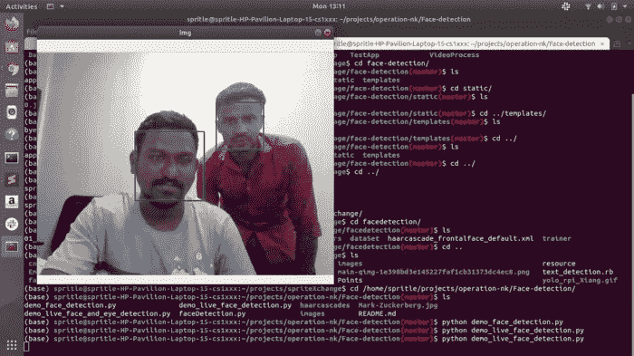

# 机器学习 Vs 深度学习

> 原文：<https://medium.com/analytics-vidhya/machine-learning-vs-deep-learning-1de05750dd3d?source=collection_archive---------8----------------------->

## 用一个简单的例子进行简单的解释

大家好，这个博客的目的很简单，很明显，我想做一个关于**机器学习**和**深度学习**的案例。我希望这个博客能够实现它的目标，甚至是有用的！！！

首先，机器学习和深度学习是**人工智能(AI)** 的一部分。但是，各有区别，让我们看看是什么。

**机器学习**和**深度学习**成为 21 世纪**最受欢迎的两项进化技术**。它获得了很多嗡嗡声。这已经成为现实。像**亚马逊**、**脸书**、**谷歌**这样的科技巨头正在利用机器学习和深度学习来减轻人类的任务，修改一些东西，让一切变得可行。

专家永远面临的一个困惑是，是被告知机器学习还是深度学习。嗯，学习每一种都没有限制。然而，我写作的目的是，从机器学习开始永远是更高的，因为它是具备诱导从深度学习开始的条件之一。

深度学习可以是一组机器学习。所以，你希望在进入深度学习之前掌握机器学习。利用机器学习，你将处理大量的结构化信息。然而，要知道机器学习的算法是如何工作的，你希望拥有关于统计和机会的明智信息。

你可以通过创建一些对连续值的预测分析来开始实现机器学习，比如预测由以前的销售趋势支持的东西的总销售额，或者预测支持这个**年龄**和**工作专长**的人的收入，等等。您将使用**直线回归**来支持任何输出可能是数字变量的预测分析。

然后，您将开始实现预测分类值的算法，如分析某人是否可以购买汽车或是否支持他的收入，以及它所属的财务收益类别。你将共同预测特定花所属的种类(一个例子可能是鸢尾花种类——**Setosa**、**弗吉尼亚**或**云芝**)。为了执行这样的分析，您将使用**供应回归**、**调用树**、 **k 最近邻居**等。

高于示例集的返回低于**有标签信息的监督学习算法**。

现在，机器学习中的约束算法集拥有**未标记的信息**。这返回下面的无人值守学习算法，并用于**模式识别**。这些算法用于电子商务公司的客户细分和有针对性的推广。这类算法的例子有 **K 均值聚类**、 **Apriori 算法程序**等。

如果你真的希望被告知深度学习，那么你希望诚实地理解深度学习是如何连接到**人工神经网络**和**人工节点执行操作**的。深度学习算法通常会修改大量的非结构化信息，如**图片**、**视频**、**音频**等。您希望更深入地了解**权重**、**偏差**、**激活函数**、**反向传播**、**值操作**等的工作原理。此外，你可能不得不被迫拥有至少一个深度学习库的信息( **TensorFlow** 、 **Keras** 、 **PyTorch** 、 **Theano** 等)。

# 什么是机器学习，如何实现？

机器学习可以是一套 **AI** 。它提供了系统被告知和从专家那里改进的能力，而不是被编程到它的水平。机器学习使用这些信息来训练模型，并实现项目的正确结果。机器学习专注于计算机病毒访问信息并使用它来告诉他们自己的事件。

机器学习可能是一个分支，它混合了统计学和工程科学，以帮助笔记本电脑从信息中学习。神经网络是机器学习规则的一种，在很大程度上支持大脑内部的神经网络。基本计划是尝试神经网络层之间的一系列映射，优化以使预测矩阵适合结果向量。

1.  机器学习是深度学习的一个超集
2.  机器学习是一个领域，其目标是放弃笔记本电脑系统用信息学习的能力，而不是被明确编程。
3.  与深度学习相比，机器学习中描述的信息完全不同，因为它使用结构化数据
4.  机器学习是**人工智能的进化**
5.  机器学习会用到几个工具。**支持向量机**、**贝叶斯分类器**、**调用树学习**等等。
6.  机器学习由**成千上万个知识点**组成。
7.  输出:数字价格，**就像分数的分类**
8.  使用各种机器驱动的算法，相互交流模型函数，并从信息中**预测未来的行动**。
9.  信息分析师检测算法来查看信息集中的**特定变量**。
10.  机器学习非常习惯于在竞争中学习新东西。

# 机器学习的例子

这里有一个简单的机器学习的例子，我指的是人脸检测。这段代码将有助于理解机器学习。

人脸检测示例代码

请查看下面的 GitHub 回购。在这里你可以找到完整的代码。

 [## karthick 965938/面部检测

### 在 GitHub 上创建一个帐户，为 karthick 965938/人脸检测开发做出贡献。

github.com](https://github.com/karthick965938/Face-detection) 

# 什么是深度学习，如何实现？

深度学习( **DL** )作为机器学习的一个**子领域诞生了。这是由越来越多的功能强大的计算机和更快的获取大量知识的方式的出现所激发的。square measure 算法是专门创建的，有点像机器学习，但它包含许多级别的算法。**

所有这些算法程序的网络统称为人工神经网络。用更简单的话来说，它**有点像人脑**，因为所有的神经网络都在大脑内连接，具体来说就是深度学习的**概念**。它在算法及其方法的帮助下解决所有高级问题。

机器学习可能是一种自动建立分析模型的知识分析技术。它是计算的一个分支，支持系统将从信息中学习的思想，**建立模式**，并在象征性的人工干预下创造选择。

1.  深度学习学习**多层次的信息说明**。
2.  深度学习中使用的数据说明是完全不同的，因为它使用神经网络( **ANN** )。
3.  深度学习是机器学习的**进化中的副学士学位。然而，基本上，它在机器学习方面很深入。**
4.  深度学习使用多个**层**，每个**应用/学习**他的变换。
5.  大数据:**很多信息点。**
6.  任何东西，从数值到自由形式的部分，比如自由文本和声音。
7.  使用神经网络通过过程**层传递信息，以解释信息选项和关系**。
8.  一旦投入生产，算法在很大程度上是在信息分析中自我描述的。
9.  深度学习**解决高级机器学习问题。**

> *深度学习可能是一种显式的 quite 机器学习，它通过学习将地球表示为嵌套的思想层次结构来实现国家和适应性，其中每个概念都以相关性更容易的思想来概述，并且许多抽象表示是关于不太抽象的思想计算的。*

# 深度学习的例子

这里有一个深度学习的简单例子，我的意思是创建一个深度学习对象检测模型。这段代码将有助于理解深度学习。

点击下面的链接获取 Google Colab 版本

 [## 谷歌联合实验室

### 编辑描述

colab.research.google.com](https://colab.research.google.com/drive/1fBHc0g5Cno9H8PyQeIDIWBMA1GIeD8TJ?usp=sharing) 

# 结论:

所以，我的结论是**先学习机器学习，然后再跳入深度学习**彻底理解。但是没有这样的强迫去遵循这个过程。

有什么问题，欢迎在下面评论出来！请不要犹豫，通过[Twitter](https://twitter.com/Karthick965938)[Linkedin](https://www.linkedin.com/in/karthick-nagarajan-44800710b/)或通过[电子邮件联系我们！](mailto:karthick965938@gmail.com)

***原载于*【www.spritle.com】**