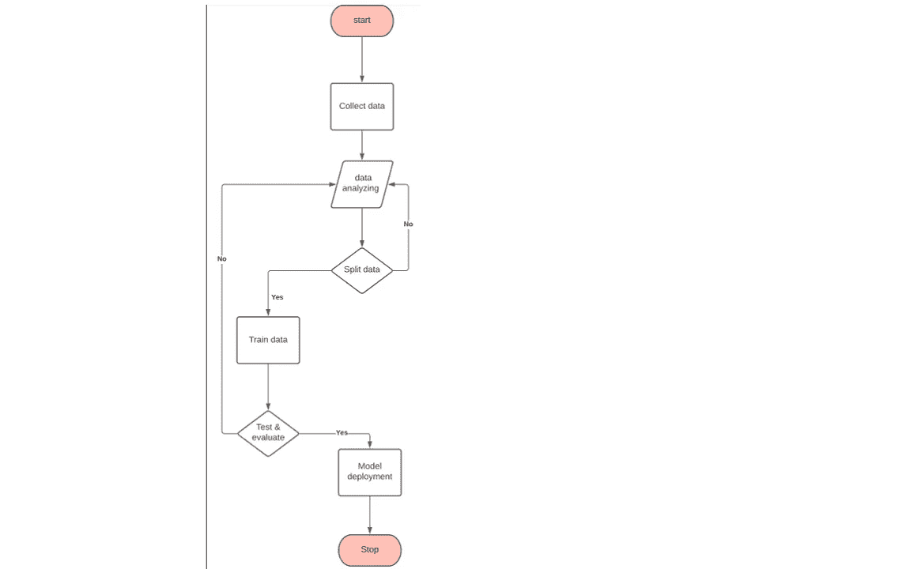
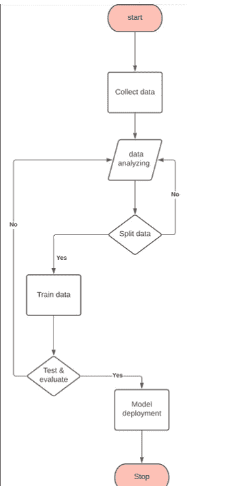

# 流程图机器学习

> 原文：<https://medium.com/analytics-vidhya/machine-learning-with-flowchart-696ff42f8aff?source=collection_archive---------2----------------------->

解决机器学习问题的逐步过程

拉蒙·萨利内罗在 [Unsplash](https://unsplash.com/s/photos/technology?utm_source=unsplash&utm_medium=referral&utm_content=creditCopyText) 上的照片

我们知道什么是机器学习，但简而言之就是定义机器学习

机器

解决机器学习问题的流程图

# **收集数据:-**

解决机器学习问题首先我们需要原始数据，因为没有原始数据我们就无法解决机器学习问题。我们通过与客户和数据科学家团队进一步讨论问题获得的原始数据我们专注于数据集成，数据集成是一项非常困难的任务，因为我们从多种资源收集数据，如结构化数据、非结构化数据、网络搜集等。收集的数据存储在数据仓库中，我们从数据仓库中获取数据。作为数据科学家，我们知道如何从多种资源中收集数据。我知道这项工作是由数据工程完成的，但作为数据科学家，我们知道。数据工程面临多源数据集成的问题

# **数据分析:-**

收集数据后，第二步是数据分析，这里我将介绍另外一点，即数据清理。

数据清理意味着删除或使用空值的估算函数。在数据集中有如此多的空值存在，我不知道当我们清理时有多少，这意味着我们正在删除空值，但有一些其他的技术，这是仅用于整数值的估算函数。

当我们使用 input 函数时，意味着我们正在删除空值并放入均值、中值函数。使用此函数时，我们将 int 值放入空值中，但此技术仅适用于整数数据集而非字符串。如果所有空值字符串都为空，则我们将清除数据并创建完美的数据集。

清理数据后，我们分析机器学习最适合该数据集的数据，并找出特征关系，这意味着数据适合线性回归、逻辑回归、聚类等方法

# **分割数据:-**

第三步是分割数据，因为我们分割数据用于训练和测试，几乎 80%的数据用于训练，20%用于测试，这是机器学习中的一个基本规则

# **列车数据**

在这一步中，我们为机器分析本身做训练数据，我们做的另一步是验证训练数据，因为训练数据集将产生过度拟合或拟合不足问题，这意味着假阳性输出或真阴性输出，这意味着过度拟合意味着当你去新的区域时，第一个人给予不尊重，你认为所有人都一样，这是过度拟合问题

# **测试和评估:-**

在测试阶段，我们使用交叉验证来测试模型，我们检查模型是否良好，是否正确，有一些交叉验证的技术(深入的我将在下一篇博客中分享)，我们使用混淆矩阵来检查模型的性能

# **模型部署** :-

这最后一步不是机器学习工程这一步对于数据科学家模型部署意味着在保存模型后，我们要么在 web 开发中使用 pickle 文件，要么使用 s/w。