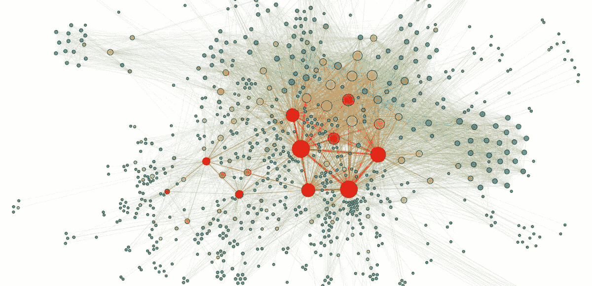

# 图的机器学习:课堂讲稿，第 2/4 部分

> 原文：<https://medium.com/analytics-vidhya/machine-learning-with-graphs-lecture-notes-part-2-4-elizaveta-lebedevas-blog-994260d7e92f?source=collection_archive---------18----------------------->

最近看完了[斯坦福课程 CS224W 机器学习带图](http://web.stanford.edu/class/cs224w/)。这是博客文章系列的第二部分，我在这里分享我观看讲座的笔记。其余的你可以在这里找到: [1](https://elizavetalebedeva.com/ml-with-graphs-notes-part-1/) ， *3，4* 。

节点分类的意思是:*给定一个在某些节点上带有标签的网络，将标签分配给网络中的所有其他节点*。这堂课的主要思想是看集体…