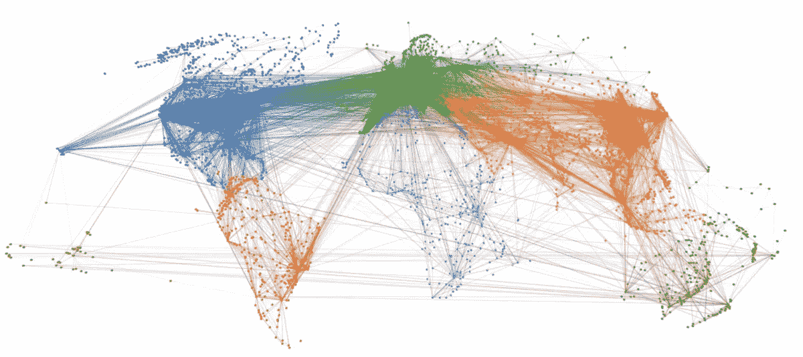

# 图的机器学习:课堂讲稿，第 3/4 部分

> 原文：<https://medium.com/analytics-vidhya/machine-learning-with-graphs-lecture-notes-part-3-4-be8f425bb29b?source=collection_archive---------24----------------------->

前段时间看完了[斯坦福课程 CS224W 机器学习带图](http://web.stanford.edu/class/cs224w/)。这是博客文章系列的第 3 部分，我在这里分享我观看讲座的笔记。其余的你可以在这里找到: [1](https://elizavetalebedeva.com/ml-with-graphs-notes-part-1/) ， [2](https://elizavetalebedeva.com/ml-with-graphs-notes-part-2/) ，4。

信息可以通过网络传播:像流行病一样从一个节点蔓延到另一个节点的行为:

*   级联行为。