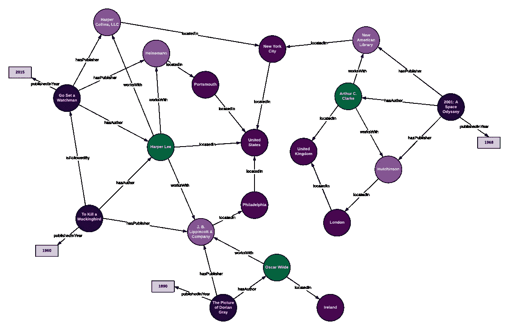

# 图的机器学习:课堂讲稿，第 4/4 部分

> 原文：<https://medium.com/analytics-vidhya/machine-learning-with-graphs-lecture-notes-part-4-4-77fc31d9b46e?source=collection_archive---------7----------------------->

前段时间看完了[斯坦福课程 CS224W 机器学习带图](http://web.stanford.edu/class/cs224w/)。这是博客文章系列的最后一部分，我在这里分享我观看讲座的笔记。其余的你可以在这里找到: [1](https://elizavetalebedeva.com/ml-with-graphs-notes-part-1/) 、 [2](https://elizavetalebedeva.com/ml-with-graphs-notes-part-2/) 、 [3](https://elizavetalebedeva.com/ml-with-graphs-notes-part-3/) 。

# 第 17 讲——知识图推理

[幻灯片](http://snap.stanford.edu/class/cs224w-2019/slides/17-knowledge.pdf)，[视频](https://youtu.be/TzbB80yKRGc)