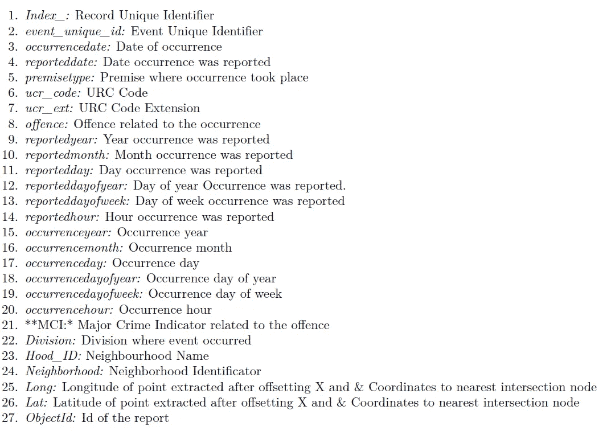
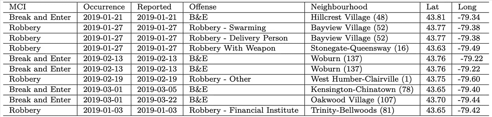
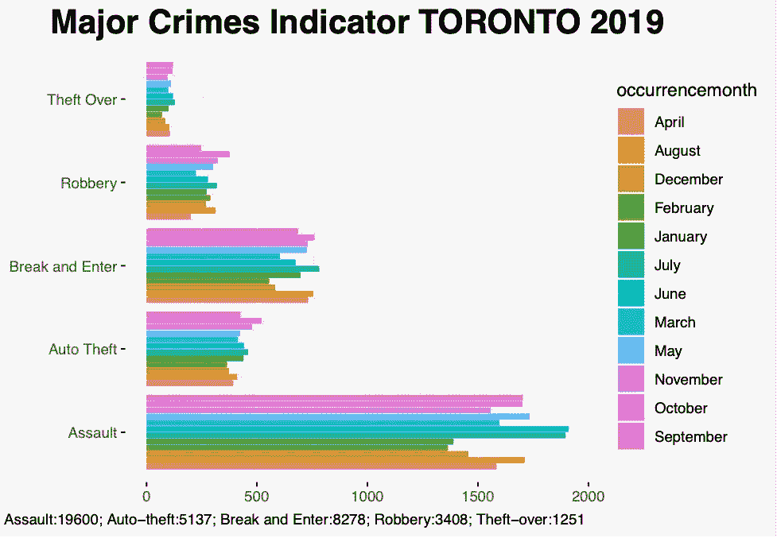
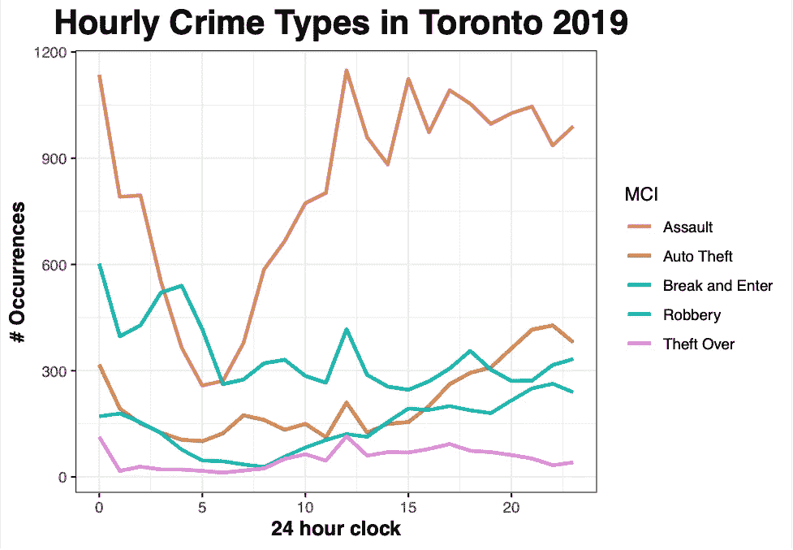
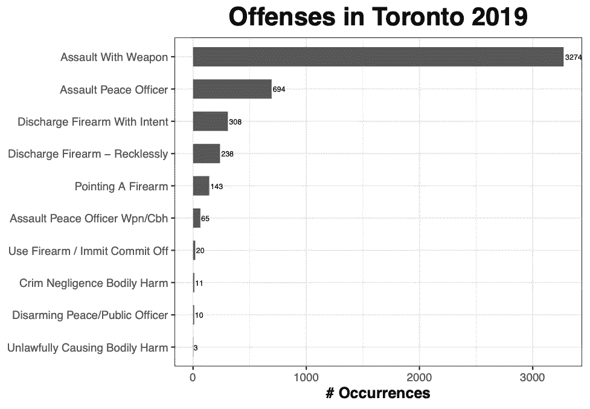
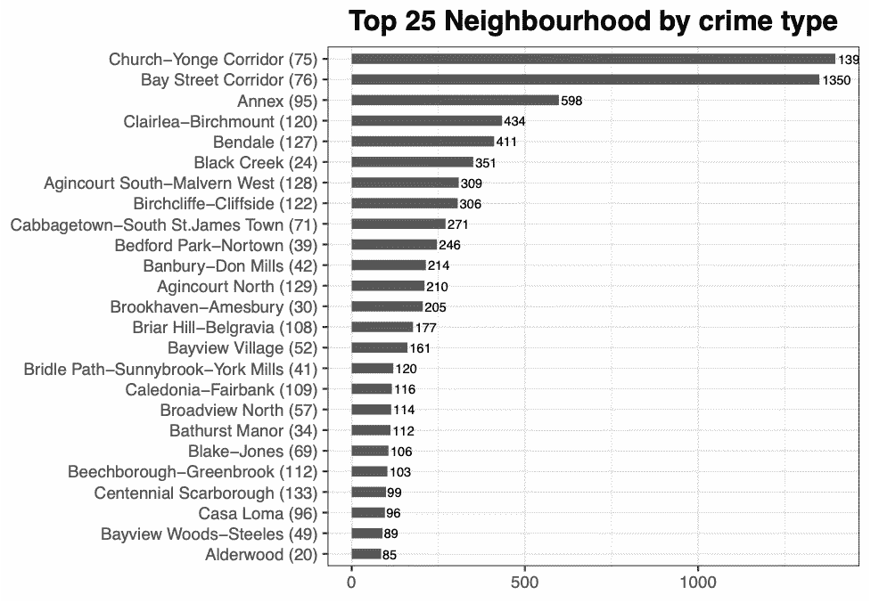
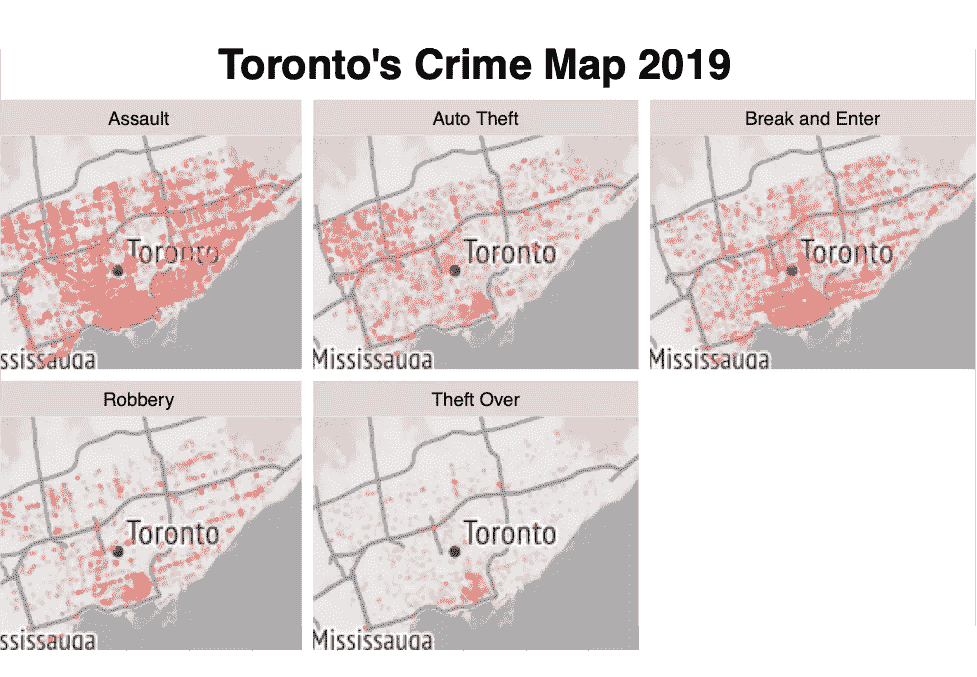

# 2019 年多伦多主要犯罪指标

> 原文：<https://medium.com/analytics-vidhya/major-crime-indicators-in-toronto-2019-dbbeaeb01d12?source=collection_archive---------9----------------------->

城市里哪些区域最危险，什么时间最危险？2019 年最常见的犯罪类型是什么？

基于[https://unsplash.com/photos/4dKy7d3lkKM](https://unsplash.com/photos/4dKy7d3lkKM)和[https://unsplash.com/photos/hRg1KL4-AUE](https://unsplash.com/photos/hRg1KL4-AUE)的图像合成

**摘要**

这份文件是“多伦多警察局”(公共安全数据门户 2020)对 2019 年发生在多伦多的犯罪进行的分析，并附有“多伦多开放数据”(多伦多，n.d .)的数据描述。

使用 R (R Core Team 2020)、编写的“tidyverse”包(Wickham 等人 2019)、编写的“dplyr”包(Wickham 等人 2021)、编写的“kableExtra”包(朱 2020)、编写的“ggplot2”包(Wickham 2016)、编写的“gg map”(Kahle 和 Wickham 2013)进行了分析。

# **简介**

本文揭示了来自原始同名数据集的所有主要犯罪指标(MCI ),其中包含 2014 年至 2019 年间按报告日期和相关罪行统计的数据。然而，分析将集中于 2019 年作为最近的相关案例。

主要犯罪指标(MCI)仪表板和其他信息可在“主要犯罪指标-多伦多 2014–1019”中获得。

报告的犯罪数据集旨在向社区提供有关公共安全和意识的信息。报告方提供给多伦多警察局的数据是初步的，可能还没有完全核实。

最后，在多伦多市的地图上展示了聚类结果。该情节试图根据地理位置表现一天中不同时间发生的犯罪类型。

[https://github.com/CROliveira/MCI_Toronto2019](https://github.com/CROliveira/MCI_Toronto2019)

**数据**

执行数据分析步骤是为了找到犯罪随时间推移的最佳时间和空间表现。结果显示了与其他地区和时间范围的比较，以便更好地了解情况。

**数据描述**

多伦多警方主要犯罪指标数据是在 2014 年至 2019 年期间收集的，在删除 X 和 Y 特征后，其分布如下:

图一。MCI 多伦多 2019 的数据描述

* **本次分析包含的 MCI** 类别有**袭击、破门而入、偷车、抢劫、**和**盗窃超过**。

本研究不打算穷尽相关性，也不打算寻找因果关系来支持与主要犯罪指标发生、顺序、动机、加重因素相关的任何证据，也不建议减轻措施。然而，它提出了一个 7(七)个变量的列表，我的目标是探索如下:

图二。数据集快照

这项研究不依赖于任何特定时间框架的分析，为了加快这一过程，我们将分析 2019 年全年的事件数据。 **reporteddate** 变量可能出现在同一时期，也可能出现在未来的某个时间。但是，这不会影响结果的准确性。

毫无疑问，袭击是多伦多全年最普遍的暴力犯罪形式，无一例外。在 6 月和 7 月，袭击事件似乎更多一些，1 月和 2 月发生的次数最少。

不清楚一年中的季节是否与发生次数相关，该分析仅考虑一年的数据，在这种情况下，可能不足以得出关于季节性相关性的进一步结论。

图 3。按月统计的 MCI(2019 年)

**研究问题:
1。多伦多的大多数犯罪发生在什么时候？**

我们正在分析变量 **occurrencehour** 和 **MCI** 来检查一天中的时间和犯罪数量之间的相关性。似乎最糟糕的时间是在中午和晚上 11 点到凌晨 3 点之间。因此，为了支持这一说法，我们可以在下面看到最常见的犯罪和一天中相应的时间。

图 4。每小时 MCI 事件

**2。一天中的时间和犯罪类型之间有什么关系？**

根据“STATS CAN”(加拿大 2020)，袭击是任何时候最常见的犯罪，在下午早些时候和深夜发生得更频繁。相反，破门而入在早上获得最高位置，从技术上讲，这时大多数人都在睡觉，然后是另一个高峰，在中午，人们在学校接孩子或为午餐采购食品。汽车盗窃是另一种达到高峰的犯罪类型，但不是在晚上八点之前，那时许多汽车刚刚停好，司机被家人和打开后备箱分散了注意力。所有的犯罪模式和时间线都有道理。

**3。十大突击小组有哪些**

在刑法和民法中:“攻击是指试图与某人进行有害或冒犯性接触或威胁这样做”，这是 2019 年多伦多最普遍的暴力犯罪形式。

攻击是一个广泛的类别，大多数犯罪都是这样分类的。下图显示了犯罪类型的隔离:袭击与变量 **MCI** 和与事件相关的子组变量**犯罪**。

图 5。攻击子群与 2019 年发生次数的对比

**4。这些犯罪最有可能发生在城市的什么地方？**

将 **MCI** 和**街区**从数据集(下图)中分离出来后，我们看到 Church-Yonge 和 Bay-Street corridor 是前两个最危险的街区。前者非常靠近瑞尔森大学和多伦多同性恋村，但这两个城市都是多伦多市中心的心脏，拥有最多的高层公寓、办公楼、公寓，是一个拥有餐厅、商店和酒吧的富人区。因此，随着犯罪率的不同，犯罪率确实非常高。

图 6。按犯罪类型划分的最佳社区

**多伦多犯罪地图**

下面的地图是受 Susan Li 的文章“探索、聚类和绘制多伦多的犯罪”(Li 2017)的启发，并收集了三个变量: **MCI、纬度、**和**经度**以显示多伦多市主要犯罪发生的位置。如前所述，在市中心的 Church-Yonge 和 Bay 街走廊发生了大量的袭击事件。东部和北部方向比其他地区更和平。因此，我们可以比较高密度和低密度区域，并使用以下地图优化可视化。

毫无疑问，市中心是各种犯罪的主要集中地。然而，值得注意的是，与其他地区相比，西北地区的汽车盗窃案数量较高。相反，打破和进入它的发生率最高，在市中心之后，在东北地区(斯卡伯勒等)。

图 6。2019 年多伦多犯罪地图

**结论**

这一分析启发了读者多伦多邻里关系、犯罪率、犯罪类型和不同时期的犯罪倾向之间的相互关系。聚类方法被应用于展示攻击罪中的犯罪子类，以向观众提供该城市更详细的概况。几个视觉表现被用来说明在这个初步分析中所谈到的内容。然而，似乎有必要采取其他步骤将它们与犯罪组合的其他方面(季节性、罪犯的种族、教育和就业水平等)交叉联系起来。)采取调查甚至预防的方法。

分析结果指出，某些社区特征与较高或较低的犯罪率有关。犯罪和发生地区之间存在空间对应关系，但这项研究并没有描述这种关联背后的复杂机制。要解决这些问题，分析更长时间内的数据以及收集经济和人口统计特征将有助于更好地理解与整个研究区域的较高或较低犯罪率相关的机制。

毫无疑问，多伦多重复了在世界各地看到的情况:大多数犯罪发生在商业区，在多伦多的情况下，这也是主要的居住密度。此外，这项研究确定了在某些时间和地点的危险热点，我希望它可以帮助更好的规划和安全措施，以防止犯罪率进一步上升。

源代码、数据集和其他文档可以在这里找到:[https://github.com/CROliveira/MCI_Toronto2019](https://github.com/CROliveira/MCI_Toronto2019)。

我们欢迎投稿！

**参考文献**

加拿大，统计。2020.*2019 年加拿大警方报告的犯罪统计*。[https://www 150 . stat can . GC .](https://www150.statcan.gc.)ca/n1/pub/85–002-x/2020 001/article/00010-eng . htm。

卡尔、大卫和哈德利·韦翰。2013." Ggmap:用 Ggplot2 实现空间可视化."*R 轴颈*5(1):144–61。[https://journal . r-project . org/archive/2013-1/kahle-Wickham . pdf](https://journal.r-project.org/archive/2013-1/kahle-wickham.pdf.)

李，苏珊。2017.*探索、聚类、映射多伦多的犯罪*。[https://towardsdatascience.com/](https://towardsdatascience.com/)探索-聚类-绘图-多伦多-犯罪-96336efe490f。

多伦多警察局公共安全数据门户。2020.*重大犯罪指标*。https://data . Toronto police . on . ca/pages/major-crime-indicators。

r 核心团队。2020.R:一种用于统计计算的语言和环境。奥地利维也纳:R 统计计算基金会。[https://www.R-project.org/.](https://www.R-project.org/.)

多伦多，开放数据。主要犯罪指标。[https://open.toronto.ca/dataset/major-crime-](https://open.toronto.ca/dataset/major-crime-)指标/。

威克姆，哈德利。2016. *Ggplot2:用于数据分析的精美图形*。纽约斯普林格出版社。https: //ggplot2.tidyverse.org。

韦翰、哈德利、玛拉·阿威克、詹妮弗·布莱恩、温斯顿·张、露西·达戈斯蒂诺·麦高恩、罗曼·弗朗索瓦、加勒特·格罗勒蒙德等人 2019。"欢迎来到 tidyverse "J *开源软件期刊 4* (43): 1686。h[ttps://doi . org/10.21105/joss . 01686](https://doi.org/10.21105/joss.01686.)

韦翰、哈德利、罗曼·弗朗索瓦、莱昂内尔·亨利和基里尔·米勒。2021.Dp *lyr:数据操作的语法。* ht [tps://CRAN。R-project.org/package=dplyr.](https://CRAN.R-project.org/package=dplyr.)

朱，郝。2020. *kableExtra:用‘Kable’和管道语法*构造复杂表。 [https://CRAN。r-](https://CRAN.R-)project.org/package=kableExtra.