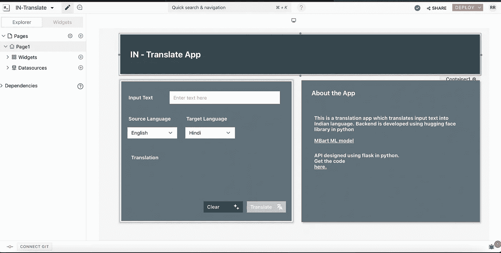
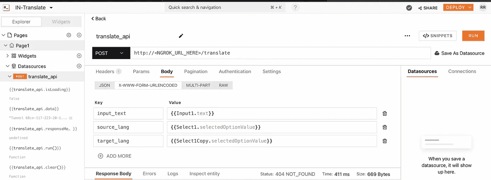
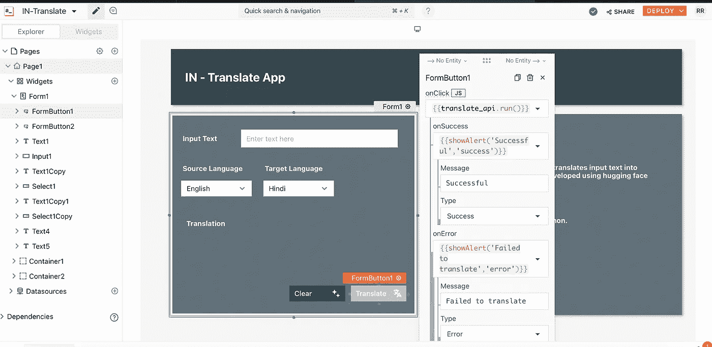
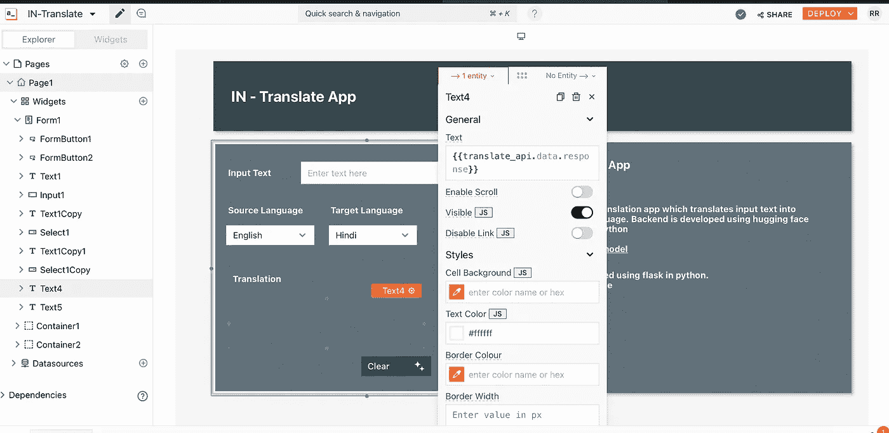
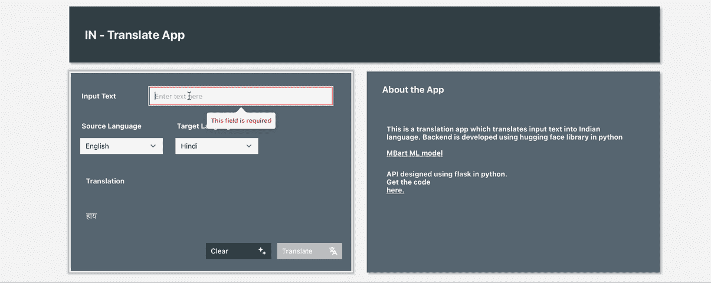

# 用拥抱脸变形金刚做个翻译应用

> 原文：<https://medium.com/analytics-vidhya/make-a-translate-app-with-huggingface-transformers-ce9203f84c79?source=collection_archive---------0----------------------->


# 介绍

我们依靠谷歌翻译服务来帮助我们将文本从一种语言翻译成另一种语言，我一直想开发一个这样的应用程序，并知道翻译如何在后端工作。

让我们列出翻译应用程序中将包含的组件。

这些是那些组件-

1.  多语言翻译模型。
2.  接受所有必要参数的 API 服务将这些参数发送给模型，并将翻译后的文本作为响应返回。
3.  一个前端应用程序，为用户提供一个图形用户界面进行交互。

理想的流程应该是用户在输入文本中键入文本，选择所需的目标语言，然后单击翻译按钮。单击按钮后，我们获取请求数据并将其发送给 API 服务，API 服务最终将数据传递给模型，并将结果作为响应返回。然后，响应会显示在 UI 中。

# 巨大的挑战

ML 模型将成为我们翻译应用背后的大脑。为了从头开始训练一个最先进的模型，我们需要以下东西-

1.  包含一种语言的文本及其在另一种语言中的翻译的大量训练数据。
2.  创建一个包含超过一百万个参数的神经网络模型。
3.  基于高端多 GPU 环境来训练该模型。
4.  时间。

但我在这里的目标是开发一个 MVP 或小型 POC，它可以帮助我理解和演示制作翻译应用程序的过程，并能够在一个周末内完成。

# 拥抱拯救之脸

解决方案是，我们可以使用一个预训练模型，该模型针对翻译任务进行训练，并且可以支持多种语言。

[*HuggingFace*](https://huggingface.co) 由各种变形金刚/预先训练好的模型组成。其中一个翻译模型是脸书 AI 研究团队在 2020 年提出的 MBart——[*神经机器翻译的多语种去噪预训练*](https://arxiv.org/abs/2001.08210) *。*

*太好了！！*现在我们已经有了一个预先训练好的模型。是时候把拼图放到正确的地方了。

# 后端

我们来看一下后端代码。

我定义了一个 Translator 类，它包含一个助手函数来执行翻译任务。

在初始化时，MBart 预训练模型和标记化器对象被初始化。translate 方法将输入文本、源语言和目标语言作为参数。

翻译者. py

我使用了 flask，这是一个用于创建 API 端点的 python 库。在运行时，它实例化 Translator 类，并使用 run_translation 函数生成文本翻译。我还使用了 flasgger，它是 Swagger 的 flask 包装器，用于测试 API 端点。

# 经营隧道服务

API 服务可以部署到 Heroku 或 AWS EC2 实例，以使端点可以通过 web 访问。另一种选择是我们可以在本地运行服务，并使用名为 [*ngrok*](https://ngrok.com) 的隧道服务。因此，前端会将所有请求发送到该隧道，该隧道的唯一工作是将所有请求路由到我们的系统。这可以通过暴露一个特定的端口来实现，在我们的例子中，这个端口是 flask 服务的默认端口号 5000。

首先，我们需要在 ngrok 网站注册为用户，并获得 auth key。然后，下载二进制文件并运行以下命令。

```
ngrok auth <YOUR_AUTH_KEY>
```

这将为 ngrok 服务身份验证创建一个配置，并且只需执行一次。接下来，我们运行另一个命令。

```
ngrok http <PORT_NUMBER>
```

这将创建一个可以路由所有请求隧道，如前所述。

# 前端

如果你知道 html，css，js 或者如果你知道 Angular 或者 React，你可以写一个代码来创建一个包含以下组件的表单。

1.  输入文本框
2.  下拉菜单选择源语言
3.  下拉菜单选择目标语言
4.  显示响应的文本标签
5.  清除并提交按钮

单击 submit，您可以通过 API 调用将它绑定到端点 url，并获得翻译后的文本作为响应。

我用了[app Smith来开发前端。它是一个低代码/无代码平台，用于设计前端 web 应用程序。此外，它还内置了将数据保存到数据库中的支持，并使用自定义 API 来与前端集成。](https://www.appsmith.com)

一旦你在 AppSmith 中创建了一个应用程序，你就会得到一个画布，在这里你可以从小部件中拖放不同的元素，添加一个新的页面并连接到一个数据源。



AppSmith 画布

将 API 配置到 AppSmith。转到 datasource 部分并添加一个 API，下面的 postman 窗口将会出现。添加您的 API 端点 url，并将请求方法类型称为 POST。在正文中，我从表单中的 HTML 小部件获取输入文本、源语言和目标语言。这是通过使用 [*小胡子模板*](https://mustache.github.io) 完成的。(参考下面截图)



AppSmith API

现在，最后一步是用提交按钮上的 onClick 方法绑定这个 API。



再添加一个文本标签来显示结果。一旦 API 调用成功，绑定到该标签的响应将自动在此显示翻译后的文本。



一旦一切就绪，点击顶部的部署按钮，应用程序就可以使用了。



翻译演示

# 结论

这就完成了我们翻译应用程序的开发。如果您对重用这些代码感兴趣。你可以在我的 Github [*这里*](https://github.com/iamrajatroy/IN-translate-app) 找到这个。

感谢你阅读这篇博客。