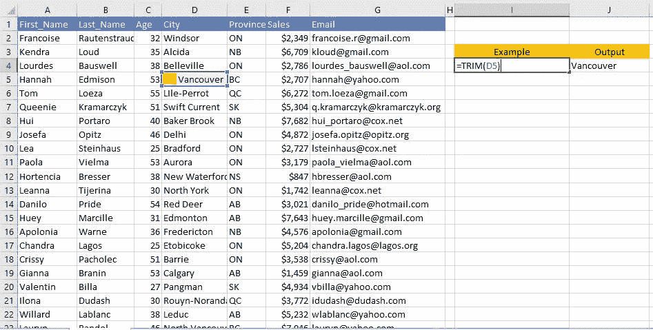

# 使用 Excel 简化数据分析

> 原文：<https://medium.com/analytics-vidhya/make-your-data-analysis-easy-by-using-excel-836cf7c95aab?source=collection_archive---------3----------------------->

## 包括简单而强大的 Excel 函数


米卡·鲍梅斯特在 [Unsplash](https://unsplash.com?utm_source=medium&utm_medium=referral) 上的照片

我使用的数据集是一个[虚拟数据集](https://www.briandunning.com/sample-data/)。这里和那里我包括提示，所以请确保你留意它们。参考图片中的例子，了解如何准确地使用公式。

# **1。CONCAT()**

连接多个区域或字符串中的文本。可以在连接文本时指定任何类型的分隔符。

```
Syntax: CONCAT(Text1, [Text2],…)In the example space delimiter used
```


作者图片:Excel 中的 CONCAT()

> **提示:**常见的分隔符有空格、逗号(，)、分号(；)、竖线(|)、斜线(/ \)、连字符(-)。这完全取决于需要使用什么样的分隔符。

# **2。TRIM()**

删除文本中的前导空格和尾随空格，单词间的单个空格除外。当您从其他来源获取数据时，经常会出现这种情况，它有许多空白，您必须删除这些空格，否则它将被视为唯一条目。

```
Syntax: TRIM(Text)In the example there is leading space
```



作者图片:Excel 中的 TRIM()

# **3。VALUE()**

将存储为文本的数字转换为数字。

```
Syntax: VALUE(Text)In the example see Age column value that stored as text 
```


作者图片:Excel 中的值()

> **提示:**默认情况下，数字总是在单元格的右侧，但**当数字存储为文本时，它在左侧。**

# 4.下()，上()，正确()

这三个函数分别将文本转换为小写、大写和句子大小写(每个单词大写的第一个字母)。这将有助于在进行数据分析项目时将不同的案例转换为单一案例。

```
Syntax: LOWER(Text)/ UPPER(Text)/ PROPER(Text)
```


作者图片:Excel 中的 UPPER()，LOWER()，PROPER()

# **5。LEN()、LEFT()、RIGHT()、MID()、FIND()**

LEN()函数返回字符串的长度。

```
Syntax: LEN(Text)
```

LEFT()，RIGHT()，MID()函数从字符串中返回指定数量的字符。

```
Syntax: 
LEFT(Text, [Length])  - Returns from left side

RIGHT(Text, [Length]) - Returns from right side

MID(Text, Start, Num) - Returns specified number of characters
```

FIND()函数返回字符串的位置。它可以与 len、left、right 和 mid 功能一起使用，以获得所需的输出

```
Syntax: FIND(Find_text, Within_text, [Start_num])
```

> 查找(想找什么，想找哪里，从哪里开始)


图片作者:LEN()，LEFT()，RIGHT()，MID()，FIND()在 Excel 中

# 6。COUNTIFS()、SUMIFS()

COUNTIFS()函数计算符合条件的项目数，并且可以指定任何条件。

```
Syntax: COUNTIFS(criteria_range1, criteria1, [criteria_range2, criteria2]…)
```

SUMIFS()函数将所有符合条件的值相加，可以指定任意数量的条件。

```
Syntax: SUMIFS(sum_range, criteria_range1, criteria1, [criteria_range2, criteria2], ...)
```

> **提示:**标准可以是
> 
> 1)通配符(*，？)
> 
> 2)表情(" > 20 "，"<5”, “=15", “<>红色")
> 
> 3)数值(10，1/10，23.2)
> 
> 4)文本字符串(“字符串”)
> 
> 5)布尔值(真或假)


图片作者:Excel 中的 COUNTIFS()、SUMIFS()

让我详细解释其中一个例子

```
=COUNTIFS(E2:E501,"ON",F2:F501,">5000",C2:C501,K8)Counts whose age is 33 from ON Province and sales greater than $5000\. 33 is in another cell (K8), you can use cell reference as well. See picture for reference. 
```

> **提示:选择整列-Ctrl+Shift+↓**
> 
> 要选择整列，首先选择要开始选择的单元格，然后按 Ctrl+Shift 和向下箭头。

# 7.IF()，NestedIFS，IFERROR()

IF()检查条件是否满足，如果满足则返回一个值，如果不满足则返回另一个值。嵌套的 IFS 也是可能的。

```
Syntax: IF(logical_test, [value_if_true], [value_if_false])
```

IFERROR()检查公式，如果计算结果为 ERROR，则返回您指定的另一个值。

```
Syntax: IFERROR(value, value_if_error)
```


图片作者:Excel 中的 IF()，IFERROR()

现在让我们深入研究一个例子

```
=IF(F8<2000,"NoDiscount",IF(F8<=2500,"2% Discount",IF(F8<=4000,"5% Discount",IF(F8<=7000,"10% Discount","12% Discount"))))This complex nested IF statement follows a straightforward logic:If the sales (in cell F8) is less than 2000, then they gets "NoDiscount"If the sales is less than or equals to 2500, then they gets "2% Discount"If the sales is less than or equals to 4000, then they gets "5% Discount"If the sales is less than or equals to 7000, then they gets "10% Discount"Otherwise "12% Discount"
```

# 8.VLOOKUP()，MATCH()，INDEX()

VLOOKUP()在指定的表数组中查找指定的值，并返回您正在查找的值。这是 excel 中最流行、使用最广泛的函数之一。

```
Syntax: VLOOKUP(lookup_value, table_array, col_index_num, [range_lookup])
```

> VLOOKUP(要查找的内容、要查找的位置、包含要返回值的范围中的列号、近似-真/精确匹配-假)

MATCH()返回给定范围内值的位置。

```
Syntax: MATCH(lookup_value, lookup_array,[match_type])
```

> 匹配(要查找的内容，要查找的位置，0 精确匹配/ 1 小于/ -1 大于)


图片作者:VLOOKUP()，Excel 中的 MATCH()

> **温馨提示:**
> 
> 1.Vlookup 垂直工作(见参考图片)
> 
> 2.始终确保 lookup_value 始终位于表的左侧，并且要返回的值始终位于表的右侧，否则 excel 会出错。

在该示例中，lookup_value(First_Name)在左侧，要返回的值(Sales)在右侧。使用 MATCH()动态返回的列的位置，请参考上图。

现在是详细解释的时候了

```
=VLOOKUP(I1,A2:F501,MATCH(H11,A1:F1,0),FALSE)VLOOKUP() looks for I1(Hui) value in the A2:F501 table array and returns value based upon the column index num returned by MATCH()MATCH() looks for H14(Sales) value in the A1:F1 table array (First_Name,Last_Name,Age,City,Province,Sales) and returns the column number
```

INDEX()返回二维范围内的特定值。适用于行和列。

```
Syntax: INDEX(array, row_num, [col_num])
```


作者图片:Excel 中的 INDEX()、MATCH()

示例详细说明

```
=INDEX(B2:D6,MATCH(B12,A2:A6,0),MATCH(B11,B1:D1,0))B2:D6 -> Returns value from this array, no need to include row and column headingsMATCH(B12,A2:A6,0) -> Returns row number
Looks for B12(Banana) in the A2:A6 array (Apple,Orange,Banana       Water Melon,Mango) and returns the row number when exact match foundMATCH(B11,B1:D1,0) -> Returns column number
Looks for B11(Jan) in the B1:D1 array(Jan,Feb,Mar) and returns the column number when exact match found
```

总结一下，

你得到的数据并不总是你想要的方式，需要清理你的数据，以获得准确的见解，使用功能涵盖在后。如果你掌握 COUNTIFS()、VLOOKUP()、MATCH()、NestedIFS 和 text 函数，一定会让你的数据分析过程更快。

**感谢您的阅读:)**