# MakeFile:制定规则并实现自动化

> 原文：<https://medium.com/analytics-vidhya/makefile-make-rules-and-automate-in-python-982a41c99275?source=collection_archive---------2----------------------->

更像是黑客和提示

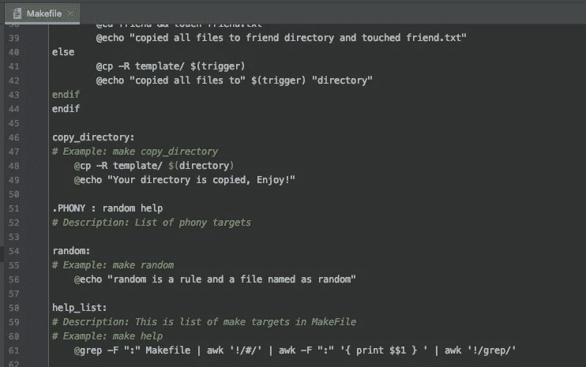

生成文件

四个月前我还不知道 ***MakeFile*** ，但随着我逐渐了解，我非常喜欢它，现在我用 Python 做的一切都是自动化的。这里有几个用例，我总是使用 ***Make*** 命令:

*   如果你不想记住任何有多个参数的长命令，那么在 MakeFile 中创建一个 Make 命令。
*   如果您想**一个接一个地运行一组命令**但不想一次又一次地复制粘贴，请将代码放在 ***Make*** 命令的块中
*   如果有**什么事情需要多个系统**运行，不用给出命令列表，只需给 ***Make*** 命令即可。
*   对于非开发人员来说，**不需要了解执行产品**的技术细节， ***Make*** 命令可以作为一个方便的执行命令
*   创建一个**备忘单**来记录指令并且不想放置可执行脚本块，然后创建 ***Make*** 命令并把它们写在备忘单中
*   想要**向少数人提供安装步骤**而不出错，使用**命令*使*命令**

我可以毫不夸张地继续下去，**用例是无穷无尽的**，如果你还没有尝试过***Make***MakeFile***中的*** 命令，那么我坚持“**继续，尝试并创造神奇的**”

# Make 命令到底是什么:

***Make*** 命令是可以为一个脚本或命令块设置的规则。可以把它看作是一个由一个单词组成的规则，你可以设置它来连续执行一系列命令。

## 设置规则的格式是

> **目标:先决条件**
> 
> **<标签>配方**

制作规则的示例

***目标*** 是单字规则，或者多个字串接成一个字。 ***目标*** 是用于调用该规则的名称。这里的一个例子是“再见”

***先决条件*** 是**可选**，这些都是依赖项，如果你想在这个目标之前运行任何文件或者其他 make 命令，那么就把它添加为先决条件。 ***先决条件*** 将在目标规则运行之前首先运行。截图中的一个例子是“你好

***配方*** 是该规则的主配方，凡是计划添加到规则中执行的都应该添加到配方中。 ***菜谱的一个例子是“*** 回显“再见，下次见”

# 什么是 MakeFile，它只适用于 Python 吗:

*MakeFile 是一个文件，它包含了所有*Make 的规则，作为一组指令由 ***Make*** 构建工具来遵循。理想情况下，如果您只运行" ***make"*** 到 ***CLI*** ，那么来自 ***MakeFile*** 的第一条规则将会运行。**

****

**你好规则**

**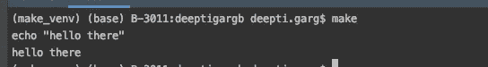**

**仅运行 make**

**如果通过***【CLI】***执行 ***make 规则*** ，那么该特定规则将运行。**

**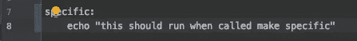**

**<specific_rule_name>特定的</specific_rule_name>**

**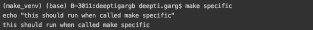**

**运行 make<rule_name></rule_name>**

**它可以用于几乎所有类似于 Python 的语言。我看到的，大多是用来编译文件的**。然而，我们通过**创建规则来运行 docker 执行命令或安装命令，或者用一个规则在许多地方进行更改**来使用它。基本上我们已经通过 ***MakeFile*** 中的 ***目标*** 实现了所有人工终端工作的自动化。****

# **MakeFile Make 命令的提示和示例:**

## **1. ***MakeFile*** 中的变量:**

*****MakeFile*** 是多功能的，它允许你添加变量，这些变量可以在一个文件中被多次调用，与规则无关。作为一个例子，VENV 在这里作为一个变量**

**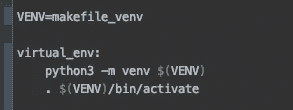**

**VENV 作为变量**

## **2.通过 ***CLI*** 传递的参数:**

**如果你不想在 ***MakeFile*** 中添加硬编码的值，你可以在 ***Make*** 命令中将这些值作为参数传递。我建议，不要传递超过四个参数，因为它会使 ***Make*** 命令的意义消失，从而使执行变得容易。更多的参数意味着需要记住更多的东西来运行那个 ***Make*** 命令**

**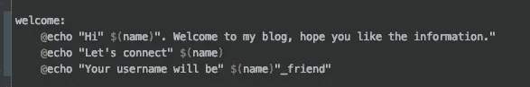**

**从 CLI 作为参数传递的名称变量**

****

**作为参数传递的名称表示命令受欢迎**

**例如，在上面的截图中，**名称**是通过 CLI**

## **3.使用 if 的条件规则:**

**可能会出现需要根据输入运行条件命令的情况。而 ***如果*** 这句话在 ***菜谱*** 的那些情况下就派上用场了**

**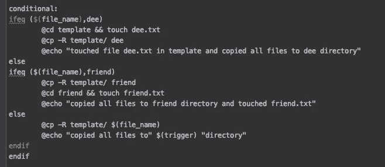**

**如何在 makefile 中使用 if 条件**

**在这里，我已经使用了 ***嵌套 if*** 语句来检查变量 ***file_name*** 的值，如果匹配的话遵循那些指令并触摸文件 ***else*** 只差一步**

**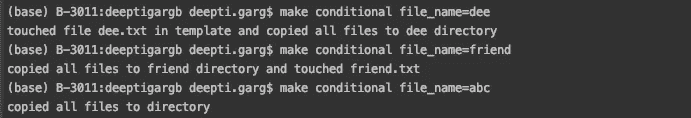**

**从 make conditional 运行不同的 if 子句**

**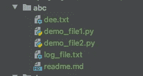****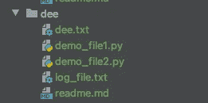****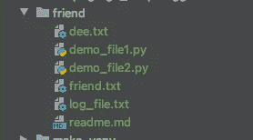

abc 目录从模板复制，dee 目录先摸 dee.txt 再从模板复制所有文件，friend 目录从模板复制所有东西再摸 friend.txt** 

**如上图所示，文件是按照 ***ifeq 块*** 中的指令复制和创建的**

## **4.运行依赖关系之前:**

**可能有一些 ***先决条件*** 来运行该命令，在这些情况下，在运行该命令之前处理任何依赖或检查变得非常容易。**

**一个简单的例子:' **bye** '对' **hello '，**有依赖关系，所以在执行' **bye** '时， **'hello'** 在 **'bye'** 之前运行**

**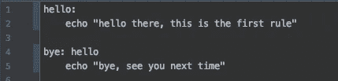**

**再见规则依赖于你好规则**

****

**你好规则在再见规则之前运行**

## **5.来自另一个的触发规则:**

**如果根据任何规则的结果有需要执行的作业，那么通过需要触发的规则来触发那些 ***制定*** 规则**

**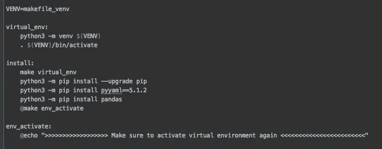**

**从安装规则触发了 env_activate 规则**

**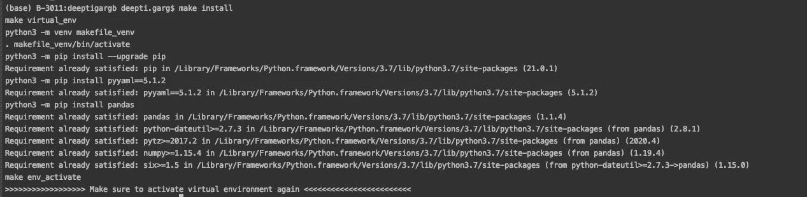**

**在所有步骤之后，它运行 env_activate 规则**

**如上所述， **env_activate** 规则由**安装**触发**

## **6.规则描述和示例:**

**为每条规则提供描述和例子是有好处的，这有两个好处。首先，业务用户很容易理解 ***Make*** 规则是关于什么的，他们也可以轻松地使用它。第二，即使是技术人员也想从示例中快速复制 ***Make*** 命令，这样他们就不必记住任何内容。**

**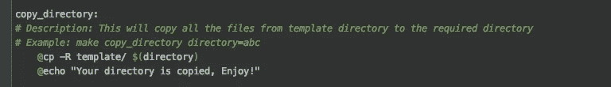**

**描述和示例**

## **7.在其他管道或作业中使用单行命令:**

**在需要几个命令来运行任何作业的情况下，那么使用 ***Make*** 命令，而不是给出作业中的命令集。**

****下面是一个从 **run_make.py** 调用 **make random** 的例子****

**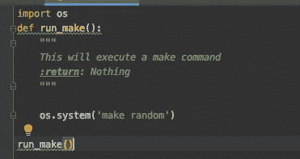**

**run_make.py 调用随机生成**

**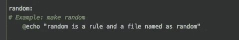**

**Makefile 中的随机规则**

****

**运行 run_make.py 显示随机规则的结果**

****另一个例子**:我们已经为 docker 构建、推送、拉取、运行、标记创建了 ***Make*** 规则。所有这些命令都是从 Kube-Jenkins 管道中直接调用的。**

## **8.用于备忘单或文档的一行命令:**

**如果有解释，但代码较少，文档看起来很容易理解。而且 **cheatsheet** 肯定是有很少的空间可以填写，避免用上百个命令来填写，而是用很少的 ***来制作*** 命令。**

****

**Cheatsheet 只需要小的单行命令**

# **MakeFile 的缺陷和不足:**

## **1.通过 Mac 使用制表符或空格:**

**如果你曾经得到这个错误，当配方**前有**空格**和**而不是<标签>** 时，就会发生这种情况。**当你系统的 **<页签>** 关键字把**空格**代替 **<页签>** 时就会出现这种情况**

> **makefile:78:* * * *缺少分隔符。停下来。**

****

*****缺少分隔符。停止错误**

****解决方案**:**

*   **这个问题主要与您正在使用的 IDE 有关，请尝试 Terminal/Putty**
*   **在记事本中按下 **<标签>** 并复制到 ***MakeFile*** 中。这真的有用。**
*   **安装 ***MakeFile*** 兼容插件**

## **2.编译后的命令还会显示**

**如果配方中的命令在执行 ***Make*** 命令后也得到显示，如截图中***echo“hello there”***也得到打印**

**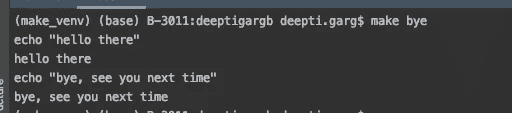**

**make 命令中的多余行**

****解决方案:**在每个配方前加上 **@****

**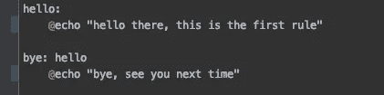**

**在回显前添加了@**

**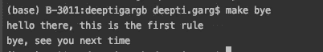**

**不需要的线条消失了**

## **3.太多的 Make 命令很难记住:**

**如果您觉得有太多的 make 命令需要记住，并且不可能在文档中维护它们**

****解决方案:**创建一个列出所有 make 命令的规则**

**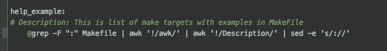**

**记住所有规则的最佳规则**

**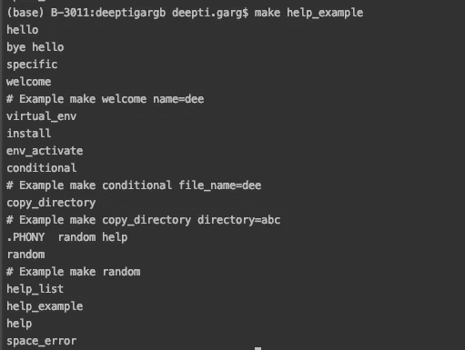**

**制作帮助 _ 示例**

## **4.相同的规则和文件名**

**如果您曾经得到这个错误，当我们创建相同的 ***目标*** 名称作为一个文件存在于这个位置时，就会发生这种情况。对于这种情况,“随机”文件已经存在，因此 ***MakeFile*** 只是检查该文件是否是最新的**

> **品牌:` random '是最新的。**

**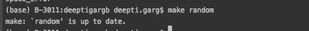**

**Makefile 正在随机读取一个文件**

****解:**加 ***。带有规则名称的假冒*** 语句，示例随机和帮助是两个具有相同名称文件的规则**

**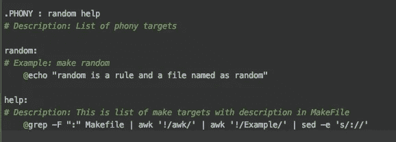**

**。虚假添加和随机成为 Makefile 的规则**

# **如何在 Python 中使用 MakeFile:**

*   **运行复杂的 docker exec、docker run 命令**
*   **运行 Python 虚拟环境指令**
*   **在所有系统上运行相同版本的 pip 安装**
*   **执行外壳命令/脚本**
*   **连接到不同的服务器**
*   **复制/删除文件/目录**
*   **运行复杂的 DBT 命令**
*   **调用任何 python 文件来执行**
*   **运行 PyTest 之类的测试命令**
*   **检查文件是否已更改或最新**

**基本上，无论通过 Shell 手动完成什么，都可以从 MakeFile 中调用。**

**希望这非常有帮助，希望听到你的评论。如果您想尝试，下面是 Makefile:**

**更多参考:**

> **[https://www.gnu.org/software/make/manual/make.html](https://www.gnu.org/software/make/manual/make.html)**