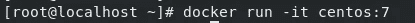
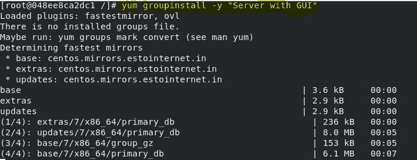
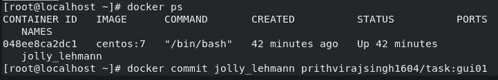
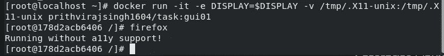
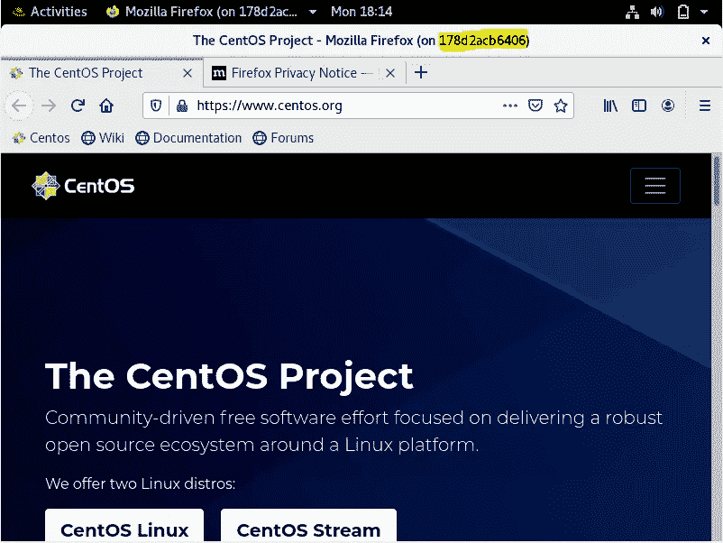
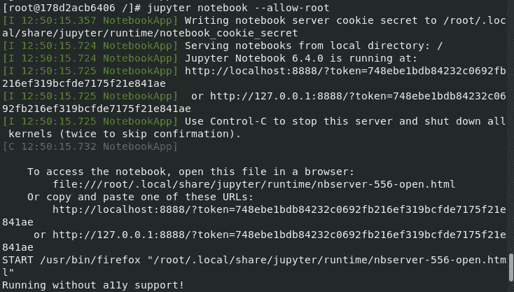
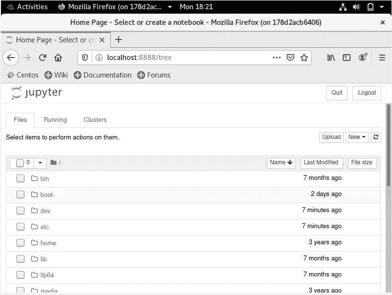

# 制作容器 go GUI

> 原文：<https://medium.com/analytics-vidhya/making-a-container-go-gui-60340e82197b?source=collection_archive---------6----------------------->


***任务* :**
🔅*在 GUI 模式下启动 docker 上的容器*
🔅*在容器上运行任何 GUI 软件*

GUI(图形用户界面)是计算机软件的交互式可视组件系统。GUI 显示传达信息的对象，并表示用户可以采取的动作。当用户与对象交互时，对象会改变颜色、大小或可见性。

但是为什么要使用 GUI 呢？GUI 虽然不像 CLI 或代码那样强大，但绝对更加用户友好。如果你是一名程序员，你可能知道没有 IDE 来开发代码的可怕之处，你可能希望有一个浏览器来检查你的 web 应用程序，一些像 Jenkins 这样的工具很难使用，除非你有一个合适的 CLI 来连接，你可能希望看到你的代码在一个奇妙的 GUI 风格的颜色显示中失败…可能性是无穷的！！！

但是我们如何才能让一个容器在其中运行 GUI 应用程序呢？让我们来看看……

通过简单的谷歌搜索，我们可以发现，当有人试图在一个容器上运行 GUI 应用程序时，错误是关于某个名为 X11 display 的缺失变量，进一步搜索该错误，我们可以了解到该错误是关于一个名为 display 的缺失环境变量，X11 需要该变量来运行 GUI 程序。为了解决这个问题，我们可以用-e 选项启动我们的容器来定义显示。在启动终端本身之前，变量 DISPLAY 需要准确地告知显示器的位置。
语法:

```
hostname:D.S
```

*其中*:

*   主机名是运行 X 服务器的计算机的名字。省略的主机名表示本地主机。
*   **D** 是一个序号(通常为 0)。如果有多台显示器连接到一台计算机，则它可以变化。
*   **S** 是屏幕号。一个显示器实际上可以有多个屏幕。通常只有一个屏幕，0 是默认值。

通常我们可以设置一个值正好等于主机显示值的变量，因此我们可以使用命令
`docker run <options> -e DISPLAY=$DISPLAY <image>`
来设置变量。

但这还不是全部。我们还需要配置 X11，为此我们可以再次使用基本操作系统中的配置来配置容器。怎么会？很简单，我们只需要将卷`/tmp/X11-unix`转发到容器内的相同位置。因此，该命令现在被转换为:
`docker run <OPTIONS> -e DISLAY=$DISPLAY -v /tmp/.X11-unix:/tmp/.X11-unix <IMAGE>`
这里. X11-unix 是一个套接字文件，X11 服务器需要它来连接到它的客户机(像 Firefox 这样的应用程序)

现在，这种方法可以用来使一些特定的容器与其中的 GUI 工具一起工作。但是，假设我们需要在一个容器中使用图形用户界面工具，比如 Centos:7，如果我们试图在那里执行这种类型的操作，我们又会遇到一堆错误，告诉我们我们的机器不支持图形用户界面或其他功能。现在该怎么办？我们找到的解决这个错误的简单方法是安装一些软件包组，这些软件包组将安装运行 GUI 应用程序所需的所有软件和工具。

现在，有了这些知识，让我们试着制作一个运行 Firefox 的 Centos:7 容器，如果可以，让我们看看是否可以运行一个像 Jupyter 这样的 IDE 来运行这个容器。


**步骤 1** :拉取所需图像…
为此，您可以使用命令`docker pull centos:7`

**步骤 2** :使用拉出来的图像启动一个容器…



我们将使用这个容器以 Centos:7 为基础制作一个支持 GUI 的图像。

**第三步**:安装包组。我们已经安装了一个名为“带 GUI 的服务器”的包组，因为它将为我安装 Firefox。



这一步可能需要一段时间…你可以考虑打个盹或者看个电影什么的，直到安装完成。你知道，这一步是我们想要制作图像的唯一原因。
安装完成后，我们有资格进入下一步

**第四步**:提交容器。现在你所要做的就是用你花了一天时间制作的容器制作一个图像。为此，我们可以运行一个命令`docker commit <container> <new image name>:<tags for your image>`
在我们的例子中，这个命令可能看起来像:



`docker ps`会帮你找到你形象的名字。

**步骤 5** :测试。为了测试您的映像，您可以启动一个包含新映像的容器。为此，我们将使用如下命令:



然后，您可以运行 GUI 应用程序进行测试，在我的例子中，我使用了 Firefox 命令，这将为我们启动 Firefox 浏览器。
注意容器的 ID 是 178d2acb6406，同样的 ID 可以在 Firefox 浏览器上看到…



ID 标在顶栏上

正如我们所看到的，容器 ID 与浏览器显示的 ID 相匹配，这表明 Firefox 是在容器上运行的，而不是在基本操作系统上运行的。

如果你想运行 Jupyter IDE，我们也可以这样做。只需使用下面的命令集来启动 IDE

1.  `yum install -y python3`
2.  `pip install jupyter`
3.  `jupyter notebook --allow-root`

如果您按照命令操作，您将会看到如下屏幕:



输出和浏览器结果的 CLI 屏幕

我们还可以通过其他方式在容器上实现 GUI 功能，其中之一就是 SSH。然而，如果你确实想获得这样的结果，而没有制作图像的麻烦，你可以通过使用命令拉我们制作的图像:
`docker pull prithvirajsingh1604/task:gui01` [https://hub . docker . com/repository/docker/prithvirajsingh 1604/task/general](https://hub.docker.com/repository/docker/prithvirajsingh1604/task/general)
单击此处了解更多信息。

这项任务是与 Divya Kurothe 合作完成的，我要感谢她通过她的支持努力帮助我有效地完成了这项任务。

**乡亲们，任务圆满完成** (∩^o^)⊃━☆
*感谢大家给本一念，* ***各位*** ***摇滚*** ヾ(⌐■_■)ノ♪