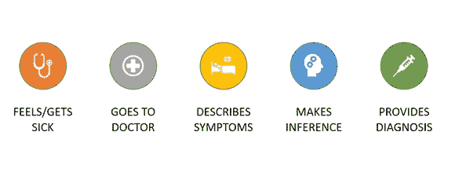
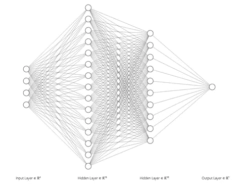
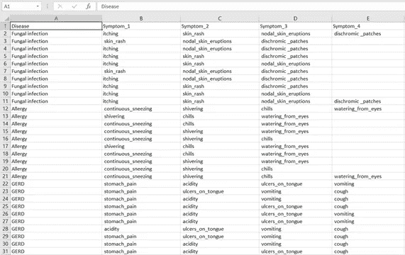
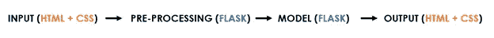

# 制造一个可以诊断你症状的人工智能！

> 原文：<https://medium.com/analytics-vidhya/making-an-ai-that-can-diagnose-your-symptoms-483468833fcd?source=collection_archive---------10----------------------->

生病真糟糕。

不，说真的——没有什么比某天早上醒来，抽了 10 秒钟的鼻子，然后才被它击中更令人沮丧的了。我的朋友，你感冒了。🥺

嗯……不管怎样，可能吧。当然，你*可能*感冒了——但是，你不能 100%确定你没有像肺炎之类的。

好吧，这是一个极端的例子——但是，它证明了这一点。有了科维德这个怪物，**医院挤满了人，医生不知所措，人们被困在房子里。**

所以，如果*真的是*疾病劫持了你的身体，**你几乎没有办法知道。**刚开始出去就有风险！

而且，这不仅仅影响发展中国家。**超过 46，000 名美国人因缺乏就医途径而死亡*——无论是不完善的医疗保险、身体障碍，还是仅仅是恐惧。***

*这太疯狂了。我们生活在这样一个时代，你可以不用离开沙发就可以点披萨，通过一堆像素和别人交谈，而且几乎任何东西都可以在 24 小时内送到你家门口。*

*因此，如果我们可以利用互联网来交付产品…为什么不可以是医疗保健呢？**为什么我们不能*自动化*临床诊断？***

*这是我问自己的问题——当我开始长达一个月的努力来解决这个问题时。结果呢？**一款可以对患者(给出 1-4 个症状)进行一定程度诊断的 webapp！***

*所以，事不宜迟，让我们开始吧。*

# *嗯……我们如何开始？*

*在开始这个探索之前，我们首先需要一张地图。否则，我们最终将被困在一个随机的沙漠中，咳嗽被诊断为艾滋病，胃痛被诊断为偏头痛。不好玩。👀*

*在传统环境中，临床诊断是这样工作的:*

**

*如果我们要模拟这一过程，我们需要一种方法:*

1.  ***输入**病人的症状、*
2.  ***推论**(预测)潜在疾病(基于先验知识)*
3.  *最后，**结合**所有这些来提供单一诊断。*

*第一部分相对简单——只是从用户那里获取信息。这里的关键挑战是第 2 部分和第 3 部分，因为…嗯，我们需要确保我们的预测方法实际上*有效。尤其是，如果我们面对的是真正的病人！🙈**

*那么…我们如何解决这些问题呢？*

*答案在于人工智能——具体来说，就是 MLPs。*

# *在电脑上用你的大脑诊断人。*

*好吧，也许这有点夸张。无论如何，这就是人工智能的核心所在——**对大脑进行松散建模，以在数据中寻找趋势。***

*虽然我不会太深入地讨论基本面([这里有](https://aditya-dewan124.medium.com/how-the-terminator-could-save-everyone-you-included-30913a544c39)篇文章了解更多信息)，但还是有一些解释的余地。*

*MLPs(多层感知器)是一种**神经网络**。顾名思义，它们基于被称为**感知机**的小积木。*

*相信我，它们听起来比实际更复杂。感知器只是一个**函数**——你给它一些输入值，基于这些值，你接收一个输出。*

*因此，神经网络是一堆这些小功能叠加在一起，形成一种巨大的**大功能**。优势？复杂性让你从 1x + 1 = 2，到诊断症状！*

*这就是我们使用 MLP 的原因。就神经网络而言，它们更简单——但是，**它的优势是提高了速度和数值能力。***

*酷！现在，它如何帮助我们？*

*对于这个问题，我们想*根据症状对*疾病进行分类。由于这是一个(创造性命名的)分类问题，我们可以使用 MLP 来**预测用户最有可能患有什么疾病**。它永远不会 100%确定(这仍然是不可能的)，但它可以非常接近！*

*总的来说，我们可以预测 41 种不同的疾病——不算多，但这是一个很好的开始！*

*那么…我们结束了？*

*不完全是这样的—**MLP 需要数字数据来工作**。而且，你现在可能已经注意到了，症状就是*字符串*(单词)。*

*我们需要一种方法将用户的症状转换成实际数字。*

*这可以非常简单地解决——我们只需获得一个常见症状列表，取其位置 *n* ，并将*it*编码为 *n-1* 。所以，第一个症状会转化为 0，第二个转化为 1，第三个转化为 2——你明白了。***

这意味着，我们列出一系列症状(所有症状):

> ['发痒'，'皮疹'，'连续打喷嚏']

并把它变成一个数字列表:

> [0, 1, 2]

一旦我们得到了输出，我们就可以使用一个名为 *all_diseases* 的列表，将预测的 *disease* 转换成一个字符串，该列表包含…所有疾病。这样，我们的 MLP 就可以完全用数字工作了！

但是，还有(另一个)问题。MLP 真的很挑剔，意思是你**不能输入不同大小的数据。到目前为止，我们以 4 种症状为限——尽管不是每个病人都会有 4 种症状。如果你只是咳嗽怎么办？轻度皮疹？发烧？我们不能强迫一个病人编造症状！**

这意味着我们需要做一点小小的改变——让用户将症状留空，但仍然不改变输入数据的大小。

事实证明，我们可以！我们只需添加一个“nan”值，并将其替换为数字 0——因此，只要患者留下一个空位，我们就用该数字替换它。随着时间的推移，我们的网络学会了**忽略**这些零作为无意义的噪音，从最终诊断中完全排除它们。

所以这个:

> ['发痒'，'皮疹'，'连续打喷嚏'，(空白)]

变成了这样:

> [1, 2, 3, 0]

问题解决了！

最终，我们的模型有**一个输入层、一个输出层和三个隐藏层**(所有神奇的处理都在这里发生)。

还有一个*退出*层，让我们打开和关闭网络的一部分，以便更好地训练。查看下面的图表:

(隐藏层实际上是 1000 和 600 个节点，但是，这将是一个*位*太大而无法在图中显示)

嘣！我们刚刚创建了一个相当稳固的网络。但是，这还不是全部。

现在，我们的网络基本上只是一个空壳。它什么都不知道——所以，如果有人真的使用它，他们只会得到一堆随机的疾病。为了让它真正学会，我们需要*训练*模型。

基本上，给它一吨的数据，并允许它做出推论！

# **把我们的模特送到学校🏫**

你不能驾驶没有轮子的汽车。而且，没有**数据**是无法训练出模型的。

在这个项目中，我们使用的是 Kaggle 的数据库，其中有我们现有的症状和疾病类别可供选择！为了制作我们的症状和疾病列表，我们需要在这个数据集中找到所有不同的(独特的)疾病。

我们该怎么做？用熊猫！

(在你问之前——不，不是真的熊猫。我指的是机器学习库)

以下是我们可以采取的步骤，让我们达到最终目标:

**#1 —缩短数据集。**

还有办法，*办法*这里的栏目太多了，一般人不会在意。另外，基本上症状#4 之后的所有列基本上都是空白的，因此，我们将只使用前四个症状列。顺便说一下——这就是为什么我们的病人有 4 个的限制。

**#2 —分解成训练/测试数据**。

在我们缩短数据集之后，我们需要将它分成模型可以训练的数据和我们可以用来测试它的数据！我们可以用 Scikit Learn(感谢您的存在)来完成这项工作，然后将所有数据集值转换为字符串(因为它们目前是对象)。

**# 3——列出所有疾病和症状的(唯一的)清单**。

现在，我们可以使用。独特的方法抓住所有不同的…嗯，症状和疾病。在添加了无症状的 *nan* 值之后(我们之前已经讨论过了)，我们就可以开始了！

**#4 —将所述列表转换成整数**。

这很简单——我们删除所有下划线和不必要的空格，然后在主列表中找到我们的疾病/症状的**位置**。因此，如果我输入咳嗽，咳嗽是列表中的第二个(不包括 nan)，它将被转换为 2。这被组合在一个被称为**数据索引**的函数中。

我们准备好了！

现在，我们只需要训练我们的模型。为此，我们将使用 **Adam** 优化器(帮助我们提高网络的准确度)，我们的 MLP 最终准确度超过 92%！

对人工智能来说还不错吧。

但是，我们可以做得更好。我们不希望我们的机器人在别人的电脑上度过余生——我们实际上需要让人工智能进入这个世界！

这就是我们在最后一步所做的——在 web 应用程序中部署模型。

# **你好，世界！**

总的来说，部署实际上是 ML 中最难的部分之一(是的，包括疯狂的多元微积分😅).让一个模型孤立地工作是一回事，让它在现实生活中工作完全是另一回事。

下面是我们的 webapp 的结构示意图:

首先，我们要添加一些 HTML 和 CSS。这将接收输入，并显示最终的预测—所以你知道，用户实际上*看到了*一些东西(有点重要)。

接下来，我们将使用 Flask 来设置一个基于 python 的应用程序。这将是我们代码三明治的核心——从实际页面中获取输入，应用预处理，然后在所有内容之上运行模型！它通过在应用程序上用 HTML 显示预测来结束。

最后，**我们实际上需要一个地方来托管我们的应用程序**——Heroku 非常适合这个！我们可以将所有代码上传到 GitHub 分支，然后部署我们的应用程序！

> 我们结束了！下一步将是 a)重新训练模型，b)让应用程序看起来更漂亮，c)在现实世界中测试它！

最终，这个项目是一个证明。

这证明了我们确实有能力解决世界上最大的问题。

不管你是谁，从哪里来——你都有影响力。

你可以削弱我们的恶魔。

那么，让我们迈出第一步。

阿迪蒂亚·万德

[www.adityadewan.com](http://www.adityadewan.com)

> 我就说这么多了。我希望你们喜欢这个，不要忘了关注更多的:D
> 
> 下次见！😉
> 
> 本文(主分支)和 webapp (WebApp 分支)代码:[https://github.com/thetechdude124/Symptom-Diagnosis-AI](https://github.com/thetechdude124/Symptom-Diagnosis-AI)
> 
> 我的每月简讯:[https://adityadewan.substack.com/p/the-warriors-mentality](https://adityadewan.substack.com/p/the-warriors-mentality)