# 用 Matplotlib 和 Geopandas 制作彩色国家地图

> 原文：<https://medium.com/analytics-vidhya/making-colored-country-maps-with-real-data-using-matplotlib-and-geopandas-2d10687ca7ac?source=collection_archive---------4----------------------->

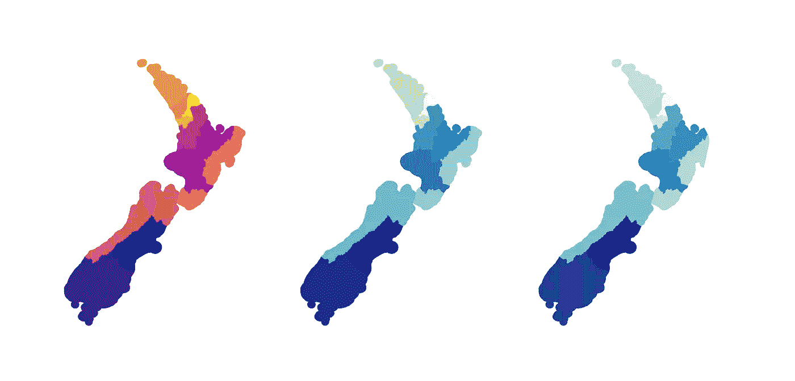

用 Matplotlib 和[新西兰警区数据制作的新西兰 Choropleth 地图](https://koordinates.com/layer/3824-nz-police-district-boundaries/)

我们将扩展小王的教程[如何使用熊猫、Geopandas 和 Matplotlib](https://towardsdatascience.com/plot-choropleth-maps-with-shapefiles-using-geopandas-a6bf6ade0a49) 绘制新西兰的警区地图——如果你是用 Python 创建地图的新手，这是一个很好的开始。**在本教程中，**您将更进一步，使用来自[新西兰警方网站](https://www.police.govt.nz/about-us/publications-statistics/data-and-statistics/policedatanz)的数据，制作一张显示新西兰枪支许可证总数的地图。

这些彩色地图被称为“ [**choropleth 地图**](https://en.wikipedia.org/wiki/Choropleth_map)**”**(希腊文意为“许多地区”)。它们就像[热图](https://en.wikipedia.org/wiki/Heat_map)，除了它们显示实际的州、国家等等。

注意:*如果你想在 Plotly 中做同样的事情，在你的浏览器中显示地图而不是一个单独的图像，* [*王的教程*](https://towardsdatascience.com/plot-choropleth-maps-with-shapefiles-using-geopandas-a6bf6ade0a49) *有一些很好的 Plotly 例子。*

# 熊猫、Matplotlib、Geopandas 是什么？

[**Pandas**](https://pandas.pydata.org/) 是一个 Python 库，可以帮助你处理数据集，比如 CSV 和 Excel 表中的数据集。如果你曾经试图把一个 CSV 放入一个巨大的 2D 数组，放入一个 Python 列表或字典，却发现不可能从中取出一列，Pandas 可以解决这个问题。例如，你把你的 CSV 读入一个熊猫的“数据帧”，然后做`column = dataframe["column"]`)。

Matplotlib

[**Geopandas**](https://geopandas.org/) 是添加了地理/GIS 功能的熊猫。没有它，处理州和国家的坐标将是不可能的。

# TL；博士，实际步骤是什么？

我们将找到一些关于新西兰的坐标数据，找到一些关于新西兰的常规数据(例如，每个地区有多少人居住)，合并这些数据集，然后用合并后的数据制作地图。

步骤分解如下:

1.  找到一些新西兰的地理信息系统数据，这些数据包含了新西兰的区域边界(我们将使用[Koordinates.com](https://koordinates.com))
2.  将 GIS 数据输入 Geopandas
3.  查找一些关于新西兰警区的数据(我们将使用 [police.govt.nz](https://www.police.govt.nz/about-us/publications-statistics/data-and-statistics/policedatanz) )
4.  将这些数据输入普通熊猫体内
5.  只要 Geopandas 和 pandas 的地区列匹配，就组合它们的数据框架
6.  将合并的数据帧交给 Matplotlib，以制作实际的地图
7.  润色地图
8.  关于新西兰，这告诉了我们什么？

# 步骤 0:让 Python 准备就绪

我们假设你[已经知道 Python 并安装了它](https://www.python.org/about/gettingstarted/)。

为了使用 Pandas、Geopandas 和 Matplotlib，我们需要从互联网上下载它们，然后将它们放到我们的代码中。它们没有附带基本的 Python。要下载它们，在您的终端中键入下面的 [Pip](https://realpython.com/what-is-pip/) 命令(Pip 是一个下载和管理 Python 库的工具，它将[使您的生活更加轻松](https://realpython.com/what-is-pip/)):

`pip install pandas geopandas matplotlib`

这将一次安装所有三个。或者你可以在自己的`pip install <library>` 行单独写下每一个。安装需要一两分钟。

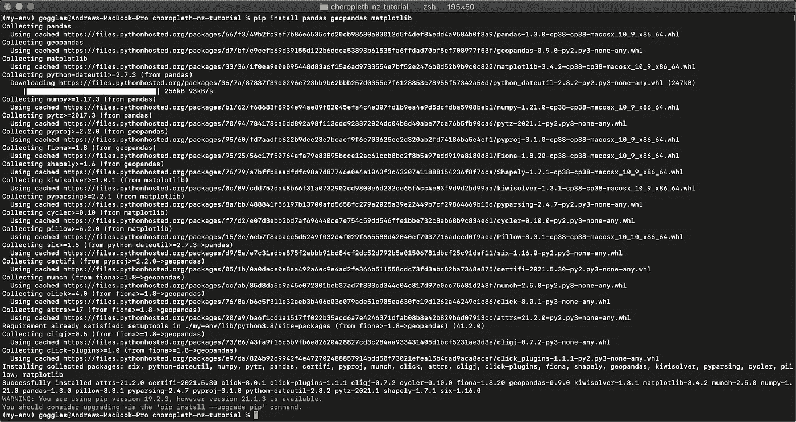

使用终端在 macOS 上安装 Pandas、Geopandas 和 Matplotlib。我们只需输入第一行%后面的内容。剩下的是安装程序的输出。

# 步骤 1:获取新西兰的 GIS 数据

我们将使用小王在[Koordinates.com](https://koordinates.com/)上找到的[原始教程](https://towardsdatascience.com/plot-choropleth-maps-with-shapefiles-using-geopandas-a6bf6ade0a49)中的相同 GIS 数据。[数据集链接在这里](https://koordinates.com/layer/3824-nz-police-district-boundaries)，或者你可以去 Koordinates 搜索“新西兰警区”

这些数据是一个 [shapefile](https://en.wikipedia.org/wiki/Shapefile) 的格式，这是一个在 GIS 程序员之间共享地图和坐标数据的标准。

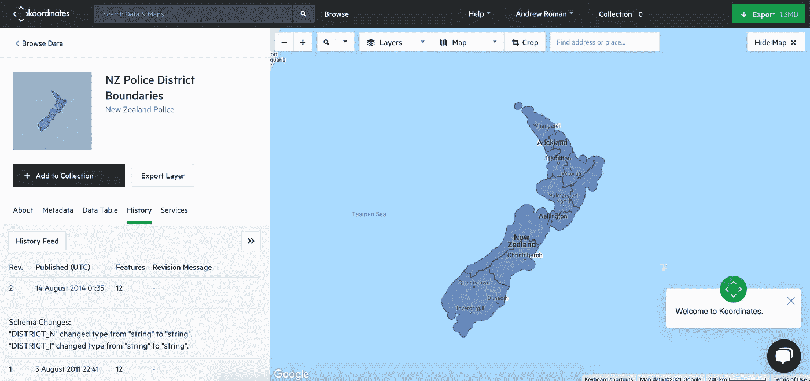

来自[Koordinates.com](https://koordinates.com)的新西兰警区边界数据集的信息页面

我们必须在 Koordinates 上创建一个免费帐户。有了帐户后，我们可以通过点击绿色的**导出**按钮来获取数据。下载内容将包含一个 ZIP 文件，我们可以解压缩该文件以获得包含坐标数据的`.shx`文件。

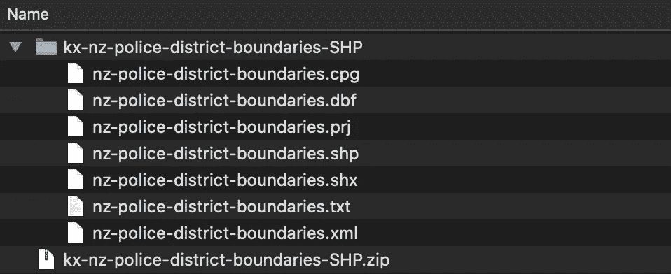

来自 Koordinates.com[的新西兰警区数据的压缩和解压缩文件](https://koordinates.com)

让我们将整个`kx-nz-police-district-boundaries-SHP`文件夹移动到与`main.py`文件相同的文件夹中。这样，我们的脚本可以更容易地找到我们的数据。我将文件夹重命名为`data`,以避免稍后在代码中输入长文件夹名。

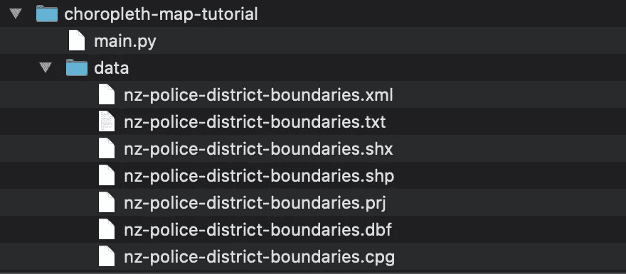

我们的“main.py”项目文件夹和最近从[Koordinates.com](https://koordinates.com)下载的新西兰警区数据

重要提示:把这 7 份`nz-police-station-boundaries`文件放在一起。我们将只告诉我们关于`.shx`文件的代码，但是 Geopandas [需要几个这样的文件](https://en.wikipedia.org/wiki/Shapefile)才能工作(保存`.txt`文档是一个很好的实践)。否则，您会得到如下错误:

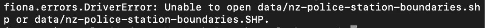

由代码找不到 shapefile 导致的错误

# 步骤 2:将坐标加载到 Geopandas 中

我们将把坐标从`nz-police-district-boundaries.shx`文件加载到代码中的 Geopandas 中。

使用以下内容创建一个新的 Python 文件`main.py`:

```
import geopandas as gpdmap_df = gpd.read_file("data/nz-police-district-boundaries.shx")
```

只用了两行。我们`import` ed Geopandas，然后使用 Geopandas `read_file()`函数加载`.shx`文件。现在，我们有了一个名为`map_df`的数据框架(具体来说是一个[地理数据框架](https://geopandas.org/docs/reference/api/geopandas.GeoDataFrame.html)),它保存了我们的坐标数据，我们可以使用 Geopandas 函数对其进行操作，并最终将其转换为地图。

如果我们想看看到目前为止我们有什么数据，我们可以在`main.py`的末尾加上`print(map_df)`。当我们运行它时，我们得到这个:

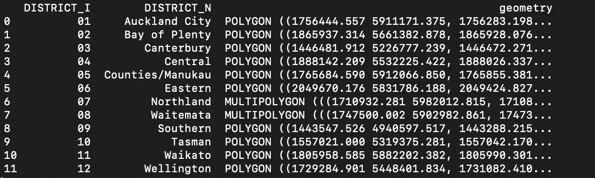

map_df 地理数据框架的内容，其中包含新西兰警区的坐标。来源:[Koordinates.com](https://koordinates.com)

这将显示以下列:

*   索引(0–11)—也称为行号
*   `DISTRICT_I` —每个区的索引
*   `DISTRICT_N` —各区的名称
*   `geometry` —该区边界的坐标。数据被一个`...`截断，但是几何列中的每一行实际上有 1000 个左右的坐标。要查看到底有多少，将`print(map_df["geometry"][1])`加到`main.py`并再次运行。

# **第三步:找一些关于新西兰的真实数据**

王的原始教程()在一个 12 行的 CSV 文件中有一些任意的数据，这些数据为 12 个区中的每一个分配了一个犯罪率——像`66`或`118`这样的基本整数可能真的意味着任何事情(例如 66 起抢劫)。那个教程给了我们一张有 12 个彩色区域的地图。

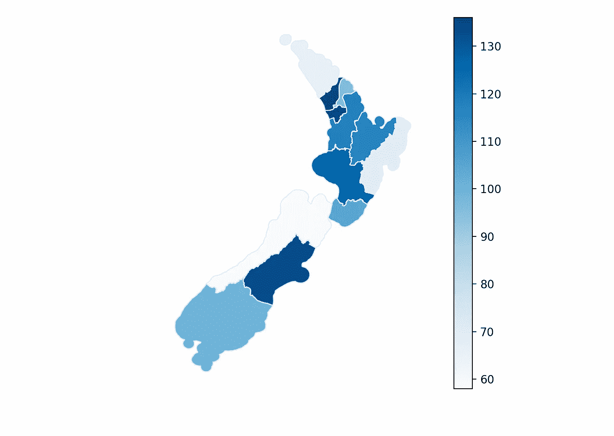

使用[小王的 choropleth 地图教程制作的新西兰地图](https://towardsdatascience.com/plot-choropleth-maps-with-shapefiles-using-geopandas-a6bf6ade0a49)

但是真实数据呢？我们如何描述新西兰的警区？互联网上有这些地区的数据吗？我们必须自己去发现。

寻找正确的数据并不总是一帆风顺的，但这是成为一名优秀数据科学家的一大任务。


[@sethrosen](https://twitter.com/sethrosen) 在[推特](https://twitter.com/)

让我们开始谷歌搜索。如果我们搜索`new zealand police district data`，会弹出一些资源。

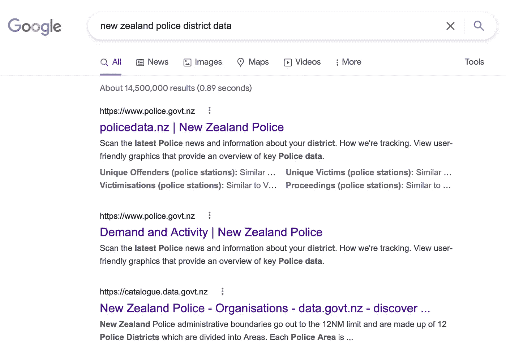

截图来自[谷歌搜索](https://www.google.com/search?client=firefox-b-1-d&q=new+zealand+police+district+data)

这些看起来都是可靠的数据来源，尤其是因为它们直接来自相关国家。**理想情况下，我们想要已经按地区分类的数据**或者我们可以通过合理的工作量合并到不同地区的数据。我们看看[第一个环节](https://www.police.govt.nz/about-us/publications-statistics/data-and-statistics/policedatanz)有没有类似这样的。

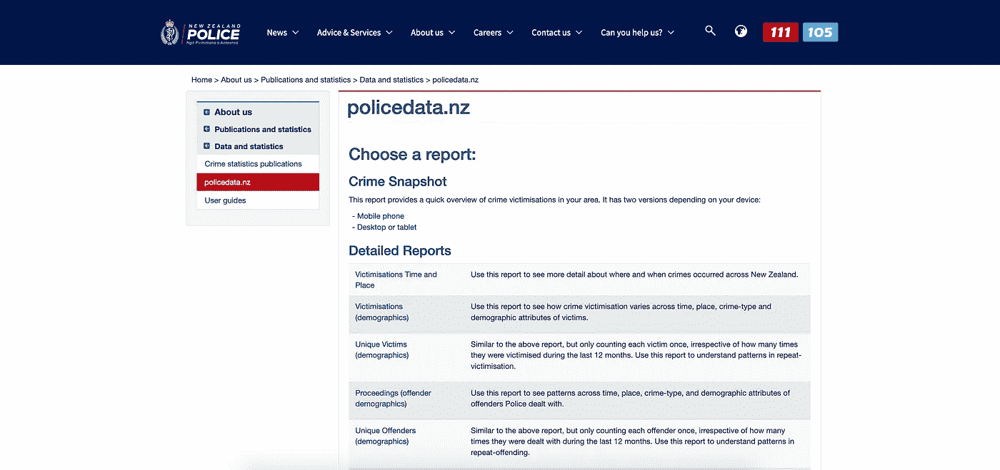

[新西兰警方的数据存储库](https://www.police.govt.nz/about-us/publications-statistics/data-and-statistics/policedatanz)具有开放数据集

经过调查，我们发现了一些关于新西兰枪支所有权的数据。

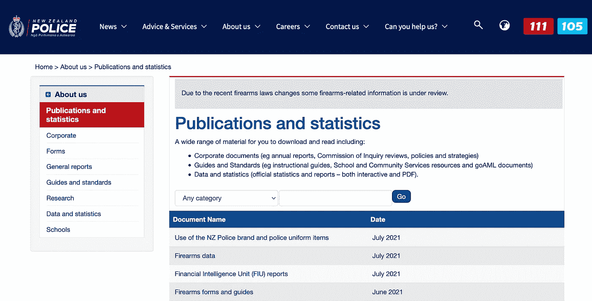

我们来看看**枪械数据** doc。在蓝色**文件名称**栏下点击其名称，然后在下一页下载 XLSX 文件。(如果没有 Excel 打开 XLSX 文件，[可以从这个项目的 Github repo](https://raw.githubusercontent.com/aero-man/choropleth-map-tutorial/master/data/nz_firearm_licenses.csv) 中复制粘贴你需要的数据。)

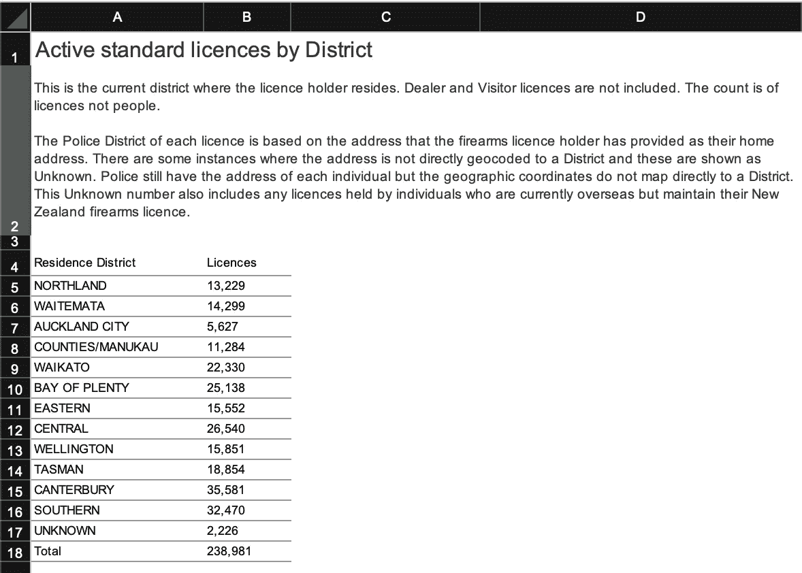

来自[纽西兰警方](https://www.police.govt.nz/about-us/publication/firearms-data)的枪械数据 Excel 表格。

当我们打开 Excel 文件时，我们看到其中一个选项卡**按地区划分的活动标准许可证**，有一个清晰的按地区划分的数据表。这是我们坐标数据使用的 12 个区。这很方便。为了简洁起见，我们将使用这些数据。

让我们将这个包含 12 个地区的小表格保存到一个 CSV 文件中(我们将把我们的命名为`nz_firearm_licenses.csv`)，以便在我们的项目中使用它。([或者从这里复制/粘贴 CSV](https://raw.githubusercontent.com/aero-man/choropleth-map-tutorial/master/data/nz_firearm_licenses.csv))。)把这个 CSV 文件放在`data`文件夹中(或者你给它取的任何名字)。

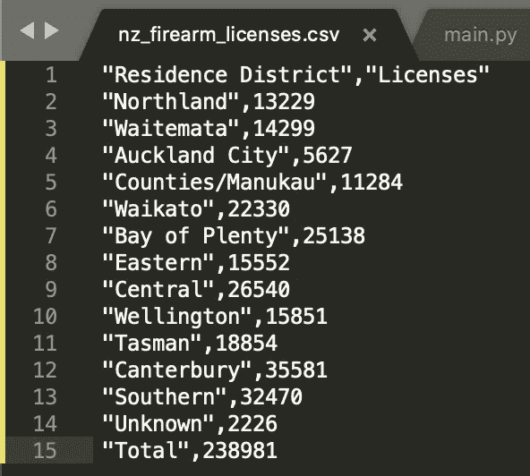

来自[新西兰警方](https://www.police.govt.nz/about-us/publication/firearms-data)的枪支许可证数据 CSV

**这个 CSV 和原来的 Excel 表格的一些区别:**

*   我们在每个地区名称周围加上“引号”,这样 CSV 就知道带有空格的地区都是一个名称的一部分。
*   我们使地区名称与地理数据框架的格式相匹配(例如:`Counties/Manukau`对`COUNTIES/MANUKAU`)。
*   我们去掉了数字中的逗号。(我们可以稍后在代码中这样做，但是现在就做。)
*   第二列从有两个 Cs 的`Licences`改为有两个 Ss 的`Licenses`。[新西兰使用“许可证”拼写](https://en.wiktionary.org/wiki/licence#Usage_notes)。您可以使用任何拼写，只要确保它在您的 CSV 文件和您的代码之间是一致的。

**我们为什么选择这个数据集？**网站上的其他数据集同样有趣，但这个 Excel 文件很简单，其他数据以 Tableau 仪表板的形式呈现，下载选项被禁用。我们可以手动复制我们看到的数据，或者想办法[收集仪表板数据](https://stackoverflow.com/questions/62095206/how-to-scrape-a-public-tableau-dashboard)。但是深入讨论 Tableau 会使文章偏离主题，而且没有人需要关于如何一起复制和添加数字的教程，所以我们现在跳过它。

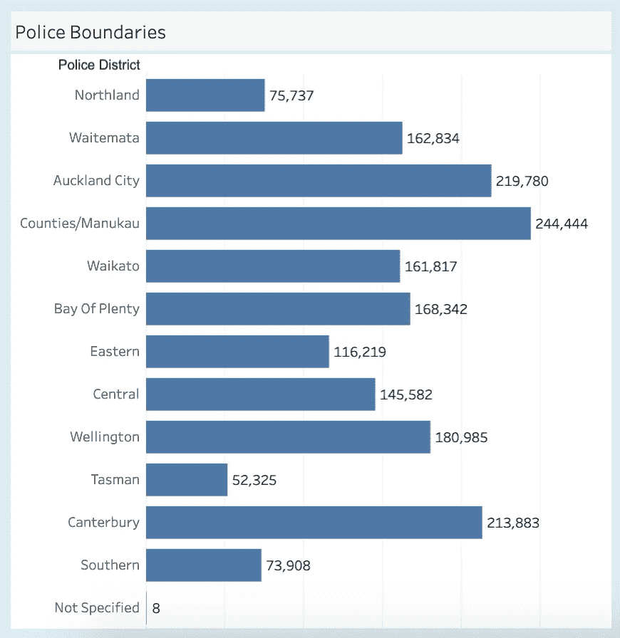

来自新西兰警方的警区数据图表[“受害者(人口统计)”Tableau dashboard](https://www.police.govt.nz/about-us/publications-statistics/data-and-statistics/policedatanz/victimisations-demographics) 。如果你想尝试的话，这是其他项目的绝佳数据！

从这一步得到的重要教训是，我们必须自己找到数据。在网站上点击下载按钮很容易，但难的是找到数据，决定它是否适合你的项目，并将其转换成适合你的格式。

# 第四步:将我们刚刚发现的数据加载到 Pandas 中

还记得我们写了两行的`main.py`文件吗？让我们再次打开它，添加我们在步骤 3 中新发现的枪支数据。

给`main.py`添加以下几行。我们所要做的就是告诉它我们新的 CSV 文件的路径(我们也把它放在了`data`文件夹中)并使用`read_csv(file)`，就像我们在上面对 Geopandas 所做的一样。

```
import pandas as pd
...
licenses_df = pd.read_csv("data/nz_firearm_licenses.csv")
```

整个`main.py`文件现在应该看起来像这样:

```
import pandas as pd
import geopandas as gpdmap_df = gpd.read_file("data/nz-police-district-boundaries.shx")
licenses_df = pd.read_csv("data/nz_firearm_licenses.csv")
```

到目前为止，我们所做的只是找到数据并将其读入 Python。虽然不多，但是业界确实说[一半的数据分析是用来准备你的数据](https://www.datanami.com/2020/07/06/data-prep-still-dominates-data-scientists-time-survey-finds/)的。线数少不代表作品少。现在，让我们用它来制作一些地图。

# **第五步:将数据合并成一个数据帧**

我们有两个数据帧，一个带有地区坐标，另一个带有这些坐标所画出的每个地区的枪支数据。让我们把它们放在一起，这样我们就可以给每个地区分配一些枪支许可证。

`merge()`函数将沿着包含地区名称的任何列组合数据帧，并输出单个数据帧(`merged_df`)。

```
merged_df = map_df.merge(licenses_df, left_on=["DISTRICT_N"], right_on=["Residence District"])
```

参数`left_on`和`right_on`告诉`merge()`哪些列应该在两个数据帧之间匹配，它们是地区列(`DISTRICT_N`和`Residence District`)。为了记住哪一列应该是`left_on`或`right_on`，请注意在语句`map_df.merge(licenses_df...)`中，`map_df`在左边，`licenses_df`在右边。因此来自`map_df`的地区列就是我们给`left_on`的，反之亦然。

一旦我们将其添加到`main.py`，我们的数据看起来就像这样。

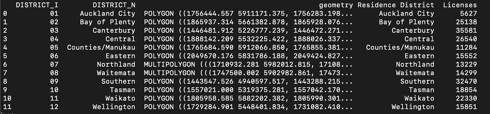

最终的组合数据帧。有两个带有地区名称的重复列，但这不会影响我们的最终地图。

这里是`main.py`迄今为止:

```
import pandas as pd
import geopandas as gpdmap_df = gpd.read_file("data/nz-police-district-boundaries.shx")
licenses_df = pd.read_csv("data/nz_firearm_licenses.csv")merged_df = map_df.merge(licenses_df, left_on=["DISTRICT_N"], right_on=["Residence District"])
```

这就是我们准备数据所需要做的一切:加载数据并将其合并。

# 第六步:制作实际的地图

我们到了！是时候绘制地图了。只需要 3 条线。

```
import matplotlib.pyplot as plt
...
merged_df.plot(column="Licenses", cmap="Blues", legend=True)
plt.show()
```

我们正在做的是:

*   导入 Matplotlib(在你的职业生涯中你会经常看到精确的线条`import matplotlib.pyplot as plt`
*   直接在数据框架`merged_df`(它仍然是地理数据框架，因此能够处理地图坐标)上运行`plot()`，并告诉它执行以下操作:使用`“Licenses”`列中的数字来决定颜色，[将颜色设为蓝色](https://matplotlib.org/stable/gallery/color/colormap_reference.html)，并显示色标，也称为`legend`。
*   告诉 Matplotlib 用`plt.show()`向我们展示结果

这是现在的`main.py`的全部内容:

```
import pandas as pd
import geopandas as gpd
import matplotlib.pyplot as pltmap_df = gpd.read_file("data/nz-police-district-boundaries.shx")
licenses_df = pd.read_csv("data/nz_firearm_licenses.csv")merged_df = map_df.merge(licenses_df, left_on=["DISTRICT_N"], right_on=["Residence District"])merged_df.plot(column="Licenses", cmap="Blues", legend=True)
plt.show()
```

回到您的终端，运行添加了这些新代码行的`python main.py`。

新西兰地图应该会出现在你的桌面上！

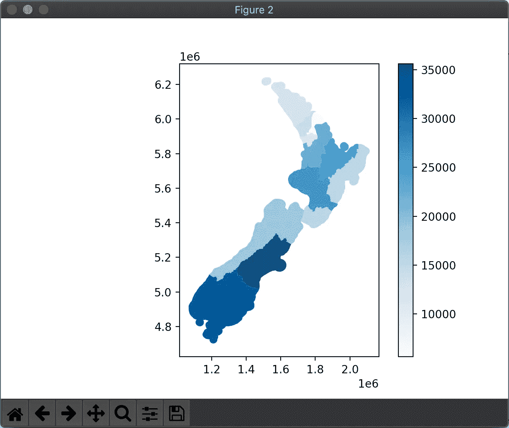

新西兰每个警区的枪支许可证地图。数据来源:[纽西兰警方](https://www.police.govt.nz/about-us/publication/firearms-data)

*如果弹出然后消失，或者根本不显示，* [*用* `*plt.ion()*` *和* `*plt.ioff()*` *试试这些故障排除技巧*](https://stackoverflow.com/questions/23405728/matplotlib-figure-window-disappears-when-in-interactive-mode) *。*

就是这样！地图已经做好了。

# 第七步:润色地图

我们有了基本的地图。标题呢？那些乱七八糟的东西怎么办？

在`merged_df.plot(…)`之后和`plt.show()`之前，我们将添加后面的所有代码。

让我们加上标题`“Firearm Licenses by Police District in New Zealand (July 2021)”`，因为根据新西兰警方的网站，该数据截至 2021 年 7 月[是真实的。](https://www.police.govt.nz/about-us/publications-statistics)

```
plt.title("Firearm Licenses by Police District in New Zealand (July 2021)")
```


X 轴和 Y 轴上的刻度线和标签都是无用的，并且妨碍了标题，所以让我们通过在`tick_params()`中将所有内容设置为 false 来消除它们。

```
plt.tick_params(
    axis="both",        # affect both the X and Y axes
    which="both",       # get rid of both major and minor ticks
    top=False,          # get rid of ticks on top/bottom/left/right
    bottom=False,
    left=False,
    right=False,
    labeltop=False,     # get rid of labels on top/bottom/left/right
    labelbottom=False,
    labelleft=False,
    labelright=False)
```


没有刻度线或标签的新西兰 Matplotlib 地图

为了进一步清理，我们将:

*   用`plt.axis("off")`去掉新西兰周边的边框
*   将国家向左推一点(矛盾的是使用`plt.subplots_adjust(right=0.85)`中的`right`选项)
*   通过将`y=1.04`添加到`plt.title(...)`来上移标题

从上到下，我们所有的绘图代码现在看起来都像这样(而`main.py` [看起来像这样](https://github.com/aero-man/choropleth-map-tutorial/blob/master/main.py)):

```
merged_df.plot(column="Licenses", cmap="Blues", legend=True)plt.title("Firearm Licenses by Police District in New Zealand (July 2021)", y=1.04)
plt.tick_params(
    axis="both",        # affect both the X and Y
    which="both",       # get rid of both major and minor ticks
    top=False,          # get rid of ticks top/bottom/left/right
    bottom=False,
    left=False,
    right=False,
    labeltop=False,     # get rid of labels top/bottom/left/right
    labelbottom=False,
    labelleft=False,
    labelright=False)
plt.axis("off")
plt.subplots_adjust(right=0.85)
plt.show()
```

而这就是最终的结果！

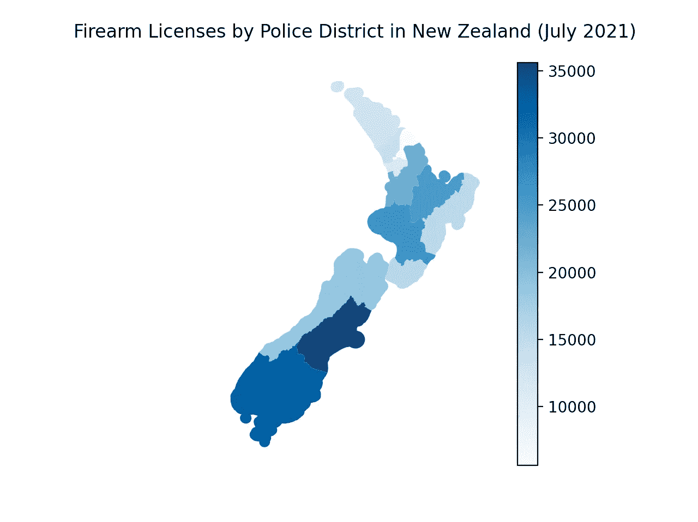

我们的结果是一个坚实的新西兰 2D 地图，最少的装饰和干扰。您的`main.py`文件[应该看起来像这样](https://github.com/aero-man/choropleth-map-tutorial/blob/master/main.py)(没有注释)。

如果你想使用本文顶部显示的地图颜色，将`merged_df.plot(...cmap="Blues"...)`改为`cmap="plasma_r"`或`cmap="YlGnBu"`。[点击此处查看 Matplotlib 颜色列表](https://matplotlib.org/stable/gallery/color/colormap_reference.html)。

我们可以使用 Matplotlib 中的`margins`、`padding`和其他参数、函数和选项对此进行进一步调整。还有更多的事情要做。如果你正在寻找制作很酷的 Matplotlib 图表的想法，[这里有 100 个 Matplotlib 图表以及如何创建它们的图库](https://matplotlib.org/devdocs/gallery/)。

要保存这个图像，你可以在`plt.show()`的正上方添加`plt.savefig("nz_map.png")`，它会保存到和其他所有东西相同的文件夹中。如果结果过于像素化，将参数`dpi=300`添加到`plt.show(...)`。[更高的 DPI](https://en.wikipedia.org/wiki/Dots_per_inch) 意味着更细致的图像。

# 第八步:关于新西兰，这告诉了我们什么？

我们新的枪械地图意味着什么？看起来南部地区发放的枪支许可证比北部地区多。在北部地区，尤其是像奥克兰和惠灵顿这样的大城市，发放的执照数量是一半，甚至是三分之一。

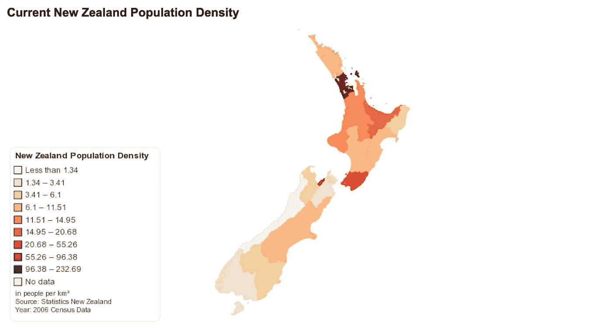

这里显示的人口密度在我们刚刚制作的地图中显示枪支许可证数量较低的许多地区看起来确实很暗。这张图表来自 Chartsbin.com T21 和新西兰统计局，并使用了 2006 年新西兰人口普查的数据。

**这可能会导致我们的后续项目，以回答如下问题:**

*   在新西兰，谁倾向于拥有更多的枪支许可证，靠近城市地区的人还是靠近农村地区的人？
*   拥有高枪支许可证的地区是否也是拥有大片公共土地的地区，如狩猎场或其他体育射击区？
*   新西兰非法/无执照枪支的拥有率是多少？许可证的存在能告诉我们每个地区枪支的真实存在吗？

如果你对调查这些问题感兴趣，新西兰警方和其他组织在这里提供了一些数据:

*   [来自新西兰警方的枪支安全、政策和登记信息](https://www.police.govt.nz/advice-services/firearms-and-safety)
*   [纽西兰的枪支法](https://en.wikipedia.org/wiki/Gun_law_in_New_Zealand)(维基百科)
*   [新西兰枪支政策和改革的最新消息](https://www.gunpolicy.org/firearms/topic/firearms_in_new_zealand)(GunPolicy.org)

如果你做这样的项目，在这里或 LinkedIn 上给我发一个链接，我会在这篇文章中添加一个你的项目的链接。

# 摘要

你现在应该能够即插即用其他[形状文件](https://en.wikipedia.org/wiki/Shapefile)和数据集来获得一些很酷的地图。请记住，对于地理图形的数据框架中的每一行/图形，您需要一列数字来表示某个事物的总数(犯罪总数、困在树上的猫总数等)。).然后，那个笨蛋，你就可以走了！

如果你有问题或者你认为这是你读过的最差的教程，在这里或者 LinkedIn 上给我发消息。代码也在 Github 上[。](https://github.com/aero-man/choropleth-map-tutorial/blob/master/main.py)

# 词汇表

**Pandas** —一个 Python 库，使处理 2D 数据集变得容易。Python 列表和字典是数据的噩梦。

**地理熊猫**——字面意思是附加了地理/GIS 功能的熊猫。我们用这个来处理从新西兰警方下载的所有坐标。

**Matplotlib** —制作图表和图形。与熊猫和地质公园合作顺利。

**choropleth 地图**——一张城市/国家/地区的地图，用一束颜色来表示数据(如人口密度)

**形状文件** — [一个或一组文件](https://en.wikipedia.org/wiki/Shapefile)，用于存储位置数据、坐标等。

**data frame**—保存所有数据的熊猫对象

**地理数据框架**——就像一个熊猫数据框架，除了它知道所有很酷的地理数据框架功能以及如何操作