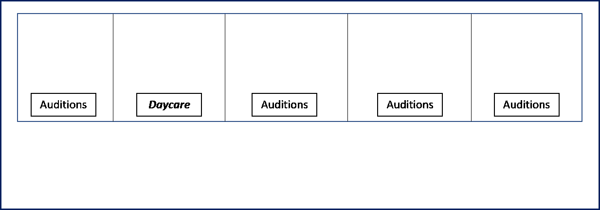
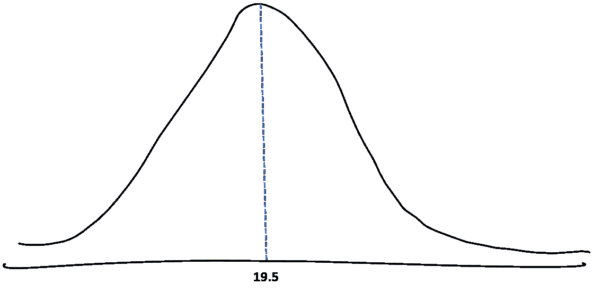
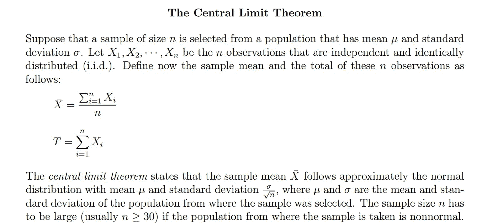

# 让统计数据回归正常——第一部分

> 原文：<https://medium.com/analytics-vidhya/making-statistics-normal-again-part-i-b5540a055e9d?source=collection_archive---------15----------------------->

## ***人类如何在日常生活中无意中使用中心极限定理***

我为那些对研究统计学充满恐惧的人开始了这个新系列。

[图片来源](http://www.quickmeme.com/Normal-Distribution)

无论是连他们的神的一半都不漂亮的希腊符号，还是数学术语，或者当你想在晚上 11 点后出门时，统计数据比你妈妈做出更多假设的事实——我在这里为你把所有这些翻译成英语，同时给它添加一点趣味。

本系列的目标是展示人类在日常生活中是如何无意中使用统计数据的。 我会努力让统计数据更有关联，更像《邻家男孩》(除非他是个忧郁、神秘、情绪化的人——在这种情况下，*快跑)。*

# 在第一部分，我将解决**中心极限定理**

假设你是一个 20 岁的年轻电视演员。《绯闻女孩》即将重新开播，他们正在寻找年龄在 18-21 岁之间的年轻人来出演查克·坏蛋这个角色。选角导演邀请了大约 240 人来试镜，并将他们随机分成 60 人一组，进行平行试镜。

你前往正确的地址，却发现自己迟到了一会儿。所有的演员最初都必须聚集在一楼。每个演员已经被随机分配到该建筑 4 楼的 4 个等候室中的一个。糟糕——你意识到你错过了那部分。

很好，你很快上楼去弄清楚你应该在哪个等候室。

在 4 楼，你会看到 5 个相同的房间。你随便选一个进去。哇……房间里到处都是蹒跚学步的孩子。你很快在邮件中核实了大楼的地址和你所在的楼层。试镜*正在这层楼*进行。但是房间里的人的平均年龄是 4 岁，而你期望的是 19 或 20 岁！这一定意味着—

***你很可能走错了候车室……***

你没注意到的是，同一层楼里还有一家托儿所。4 楼有 5 个平行房间。其中 4 间是试镜演员的“等候室”,第 5 间是满是小孩的日托所(让我们假设在那短暂的时间里，看管人不在，以保持 4 号房间的平均年龄。让我们也假设日托中心的入口没有装饰得很明亮，看起来就像其他房间一样。

第四层的布局

你向其他四个房间窥视，看到了你最初期望看到的——一群年龄在 18-21 岁之间的男人被邀请试镜查克·坏蛋的角色。

[Gif 来源](https://www.youtube.com/watch?v=ESWi0X3wgzI)

现在倒回去一点——**快速浏览一下托儿所主人的年龄就足以让你推断你进错了房间**。你是怎么做到的？

瞧啊。你基本上使用了中心极限定理(CLT)。

CLT 指出，在给定大样本量的情况下，从总体中抽取的样本的均值将收敛于总体均值的正态分布。

让我们来分解一下—

1.  我们有一群演员(预计年龄在 18-21 岁之间)来试演上述角色。这个群体的平均年龄将是 19.5 岁。
2.  从这个群体中随机抽取的 60 个演员的任何样本都有它自己的含义。
3.  如果我们不断地从这个群体中随机抽取 60 个演员，那么每个样本都有自己的平均年龄。这些是我们的样本平均值。
4.  很多这样的样本均值会接近 19.5。我们有可能随机抽取了所有 18 岁的人作为样本。也许一些 16 岁的孩子不顾年龄限制，参加了试演，降低了几个样本的平均值。同样，也许一些 25 岁以上的不畏年龄的希望者出现，是为了通过这部剧来重温他们的高中时光。他们可能会找出一些样本。
5.  如果我们将这些样本均值绘制在图上，分布将基本上是以 19.5 的总体均值为中心的正态分布。

样本平均值将以 19.5 的总体平均值为中心

***鼓声***

你(大概)已经掌握了它的要点。

现在来看看行话有没有道理！

[http://www . stat . UCLA . edu/~ nchristo/intro econometrics/intro econ _ central _ limit _ theorem . pdf](http://www.stat.ucla.edu/~nchristo/introeconometrics/introecon_central_limit_theorem.pdf)

Geddit？

伯克利大学已经提供了一个很好的互动视觉，供你玩。

[https://www . stat . Berkeley . edu/~ stark/Java/Html/sample dist . htm](https://www.stat.berkeley.edu/~stark/Java/Html/SampleDist.htm)

***免责声明:作者提供的例子纯粹源于作者的优秀(或者说差？)电视节目中的品味&作者不是靠推销《老友记》或《绯闻女孩》而获得报酬的。— XOXO***

如果您对本文有任何反馈，请随时在下面留下您的评论，并在 ishaoke94@gmail.com 联系我！