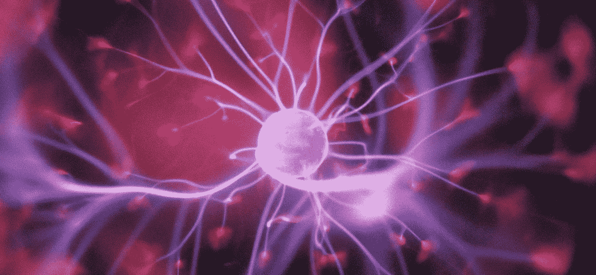
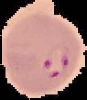
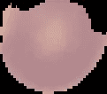
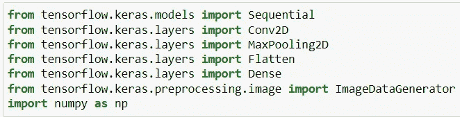
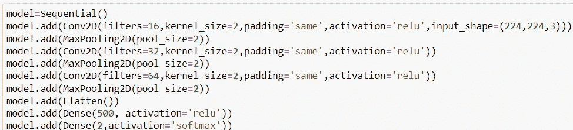
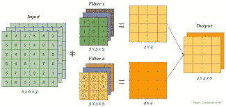
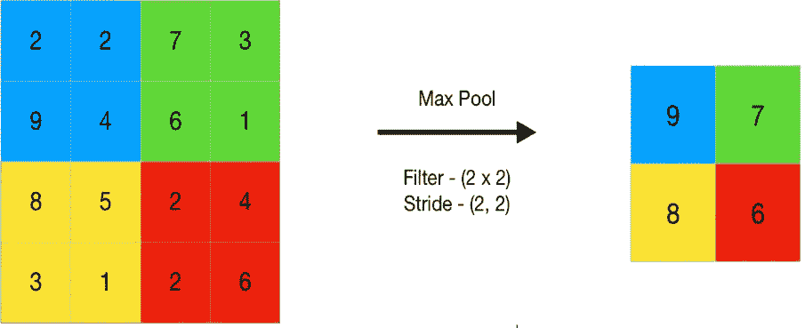
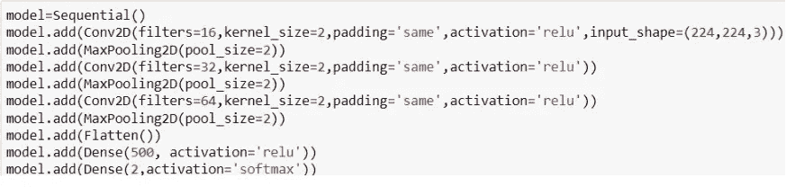
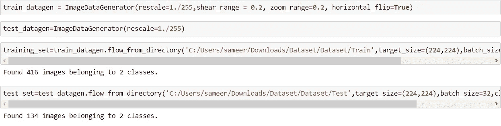
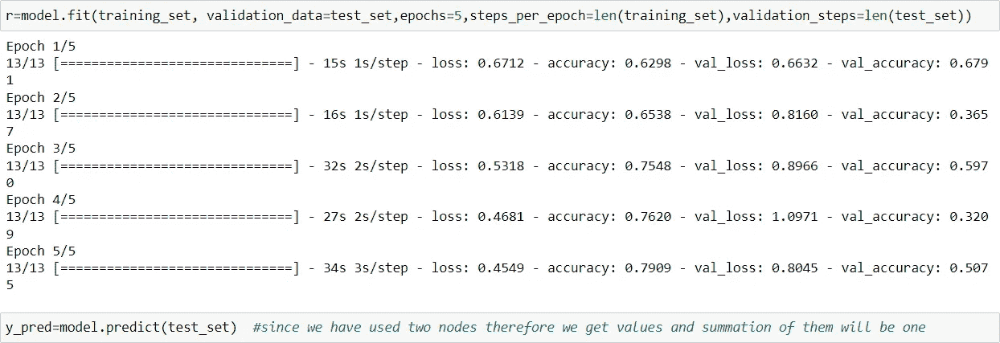

# 使用深度学习的疟疾检测

> 原文：<https://medium.com/analytics-vidhya/malaria-detection-using-deep-learning-6ced39359881?source=collection_archive---------4----------------------->

# 介绍

在本文中，我们将使用卷积神经网络(CNN)来完成疟疾检测的迷你项目，方法是将某些图像输入到模型中，它将识别人是否被感染。

我们还将浏览 CNN 模型中使用的基本概念，以便更清楚地了解这些概念。所以，让我们开始吧！！

让我们首先了解 CNN 问题陈述的基本布局/方法:

1.  盘旋
2.  RELU/双曲正切激活函数
3.  池化(最大池化或最小池化)
4.  变平
5.  全连接神经网络

我们通过以上 5 个步骤创建 CNN 架构，然后使用 ImageDataGenerator 库将 CNN 与图像相匹配。

我们将逐一理解每个概念。首先，让我们看一下数据集。

训练数据集包含 416 幅感染和未感染的图像，而测试数据集包含 134 幅感染和未感染的图像。

受感染的图像

未受感染的图像

让我们先看看构建 CNN 架构的代码。

下图显示了任务所需的所有库。

我们首先创建一个顺序模型，这有助于堆叠各层，我们可以在该堆栈中逐个添加卷积层或池层。

## 盘旋

卷积是使用内核或过滤器从图像矩阵中过滤出不同种类信息的过程。正如我们所知，图像是由像素组成的，每个像素代表图像的一个属性，如形状、大小等，因此每个过滤器代表或过滤图像的一个属性。

我们用大小为 2 的滤波器(在代码中)乘以图像矩阵，以获得比原始图像小的特征图。

输入形状为(224，224，1)，使用的过滤器数量为 16，因此它过滤 16 个属性。

## RELU/坦

然后，我们对每个像素执行逐元素激活函数，以在我们的 CNN 网络中引入非线性。

## 联营

我们现在已经使用内核或过滤器过滤了我们的图像。现在，我们应该更加关注那些代表主要属性的像素值。因此，我们对此使用最大池，以便只集中在重要的像素上，我们使用大小为 n*n 的矩阵，该窗口的最大值是输出，并且在池中步幅(像素移位)通常保持为 2，以便不会发生重叠。

使用的代码中的参数是 pool_size=2，这意味着 pool marix 的大小是 2。

## 变平

对于我们的 CNN 模型，我们可以使用任意数量的卷积层和任意数量的池层。

在得到滤波后的图像后，我们倾向于将矩阵展平成 1D 阵列，并将其作为特征馈送到神经网络(密集层),然后在网络中进行正常的反向传播和正向传播。

我们使用了平坦化后的密集层，密集层有 500 个神经元，这里使用了 relu 激活函数。最后一层由输出组成，2 个节点用于 softmax 激活功能。

我们的 CNN 架构已经准备好了，现在让我们从文件夹中读取数据。

# 图像数据生成器和数据扩充

在 CNN 问题中，我们可以通过多种方式从我们的文件夹中读取数据集(图像)。其中一种方法是将**图像数据生成器**库呈现在 Keras 中，

图像数据生成器帮助我们在图像上应用一些特征缩放，以便它可以在内部创建更多的图像来调整反转、缩放的图像等。这个过程也称为数据扩充。我们使用 batch_size 为 32，这意味着 32 个图像将在一个批次中，并将用于一次迭代。

我们为数据准备了所有这些，并从目录中获取数据。

因此，我们的训练和测试集已经准备好，现在我们在模型中使用 fit，并获得大约 80%的准确性。

# 结论

这是一个简短的概述，介绍了我们如何通过经历在训练深度学习模型时基本发生的基本过程，将 CNN 方法用于这些迷你深度学习项目。

我会继续贴越来越多的关于机器学习和深度学习的资料和文章。您可以在 LinkedIn 上与我联系，关注我与数据科学相关的工作:)

 [## Sameer Kumar - ML 研究实习生- SCAAI -应用人工智能共生中心| LinkedIn

### 嗨，我是 Sameer，目前我正在共生技术学院攻读工程学士学位。当我还是个孩子的时候，我…

www.linkedin.com](https://www.linkedin.com/in/sameer-kumar-20988b1a6/) 

一定要看看我的其他文章！！

 [## Sameer Kumar -中等

### 阅读 Sameer Kumar 在媒体上的文章。SCAAI 的 AI 研究实习生|| Kaggle 2x 专家||机器学习||深度…

medium.com](/@sameerkumar21635)