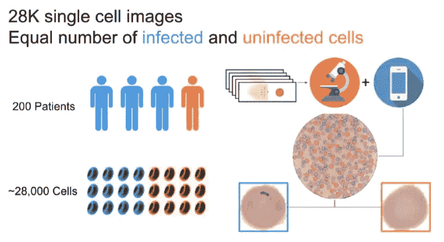
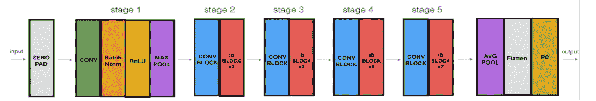

# 使用 ResNet 50 检测疟疾:Malar-AI

> 原文：<https://medium.com/analytics-vidhya/malaria-detection-using-resnet-50-malar-ai-46345578b461?source=collection_archive---------18----------------------->

## 第二部分


现在我们知道了什么是 Malar-AI，我们准备好开始自动检测疟疾并理解其背后的模型。如果你还没有看过[第一部](https://palakchaudhry.medium.com/malaria-detection-using-resnet-50-malar-ai-bc87845da65b)，去看看吧！

# 谢谢你的开源数据



图片由卡洛斯提供

我发现了这个惊人的监督数据集，它包含 27，558 个单细胞图像，其中正常细胞和感染细胞的数量相等。关于这个数据集的另一个很酷的事实是，这些图像是从手机上拍摄的，而不是一些花哨的显微镜。更多信息，你可以点击这里访问[。](https://lhncbc.nlm.nih.gov/LHC-publications/pubs/MalariaDatasets.html)

# ResNet-50 架构



ResNet-50 架构

ResNet-50 型号的详细信息如下:

*   零填充用(3，3)填充输入

## 第一阶段:

*   2D 卷积有 64 个形状为(7，7)的滤波器，并使用(2，2)的步长。它的名字叫“conv1”。
*   BatchNorm 应用于输入的通道轴。
*   最大池使用(3，3)窗口和(2，2)步距。

## 第二阶段:

*   卷积块使用三组大小为[64，64，256]的滤波器。
*   这两个单位块使用三组大小为[64，64，256]的滤波器。

## 第三阶段:

*   卷积块使用三组大小为[128，128，512]的滤波器。
*   这 3 个单位块使用三组大小为[128，128，512]的滤波器。

## 第四阶段:

*   卷积块使用三组大小为[256，256，1024]的滤波器。
*   这 5 个单位块使用三组大小为[256，256，1024]的滤波器。

## 第五阶段:

*   卷积块使用三组大小为[512，512，2048]的滤波器。
*   这两个单位块使用三组大小为[512，512，2048]的滤波器。

## 最后一块

*   2D 平均池使用形状为(2，2)的窗口，其名称为“avg_pool”。
*   展平没有任何超参数或名称。
*   全连接(密集)图层使用 softmax 函数减少其输入的类数。在我的例子中，将只有两类——感染和正常。

# Keras 上的预训练 ResNet 模型

虽然编码和修改剩余网络很有趣，但 Keras 有一个预先训练好的库！这样使用起来更快更方便。下面是如何在一行中加载模型

```
base_model = keras.applications.resnet50.ResNet50(weights= **None**, include_top=**False**, input_shape= (224,224,3))
```

这里，权重=无，因为我想用随机权重初始化模型。我的图像单元格的输入形状是 224*224*3。

```
x = base_model.output
x = GlobalAveragePooling2D()(x)
x = Dropout(0.7)(x)
predictions = Dense(2, activation= 'softmax')(x)

**from** **keras.models** **import** Model
model = Model(inputs = base_model.input, outputs = predictions
```

我在 ResNet-50 模型中添加了全局平均池和密集输出层。

```
model.compile(optimizer=Adam(lr=0.001),loss="binary_crossentropy",metrics=["F2 score"])
```

我使用学习率为 0.001 的 Adam 优化器，并使用 F2 分数作为我的指标。

# 密码

该项目的代码可在[这里](https://github.com/Palak-Chaudhry/Malaria-detection-using-ResNet-50)获得。非常感谢[维尚·巴蒂](https://vishantbatta.com/)和[罗汉·恩](https://medium.com/u/99b584ada19?source=post_page-----46345578b461--------------------------------)在整个过程中做出的贡献。我们还制作了一个应用程序的 MVP，目前正在开发移动麦克风。

我用这个作为我工作的参考文件。