# 基于机器学习的恶意网页分类

> 原文：<https://medium.com/analytics-vidhya/malicious-webpage-classification-using-machine-learning-607e2aecab2?source=collection_archive---------7----------------------->

# 介绍

基于 ML 的应用已经有很长一段时间了，我们看到它在几乎所有领域的使用，让它预测分数，推荐系统，股票市场和列表永远继续下去。我们使用机器学习来分类网页是否是恶意的。这有助于我们了解网站，我们也可以保护我们的信息不被窃取。因此，在下一节中，我将解释用于网页分类的算法和代码。

# 代码解释

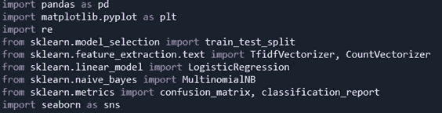

导入必要的库

这段代码导入了预处理数据集和预测网页 URL 是否恶意所需的必要库和功能。

**Pandas** - Pandas 需要从其目录中加载数据集，对测试数据、训练数据和测试标签进行必要的预处理和分离。

**Matplotlib** — Matplotlib 是数据可视化所必需的，以了解数据中潜在的有趣趋势，并相应地对其进行处理。

**re** - re 是正则表达式的简写符号，我们在数据集的预处理过程中使用它来删除停用词、点、‘www’&等。

**Train _ test _ split**——我们导入它是为了将我们的数据分割成适当比例的测试和训练数据。最鼓励的测试和训练数据比例分别是 20%和 80%。

**TFIDFVectorizer-** TF-IDF 是词频逆文档频率的缩写。这是将文本转换成有意义的数字表示的非常常见的算法，该数字表示用于拟合预测的机器算法。

**计数矢量器** —用于将一组文本文档转换为术语/标记计数的矢量。它还支持在生成矢量表示之前对文本数据进行预处理。

**LogisticRegression，MultinomialNB-** 预先训练的 ML 库，将用于预测网页是否是恶意的。

**混淆矩阵，分类报告**——我们用它来了解我们的 ML 算法在数据集上的性能，以及改进其性能的必要修正

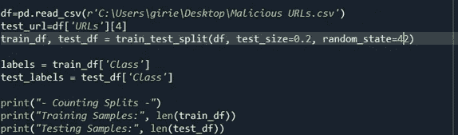

数据集的分割

这段代码从目录中加载数据集。然后，我们将数据集“url”的特定数据指定为测试 URL，以查看预处理完成得如何。在后续行中，我们导入 Sklearn 库的 train_test_split，将数据集分成 80%的训练数据集和 20%的测试数据集。我们将变量“labels”分配给训练数据的“class”列，而将“test_labels”分配给测试数据的 class 列。然后，我们在控制台中打印训练数据样本和测试数据样本的编号，如下所示:

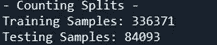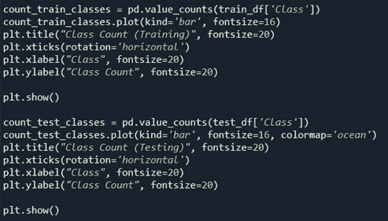

绘制数据趋势

这段代码分别用于可视化训练数据和测试数据中好的和坏的 URL 的数量。我们使用熊猫功能来计算好的和坏的网址。块的上部对训练数据中的好的和坏的 url 进行计数，而块的下部对测试数据中的好的和坏的 url 进行计数。计数过程由“pd.value_counts”继续执行。使用'。我们以条形图的形式描述好的和坏的 URL 的数量。然后，我们指定某些参数，如 fontsize、rotation，以使条形图的标题具有一定的大小，我们使用参数“kind=bar”将图形指定为条形图的形式。我们对测试数据也做同样的事情。这是我们得到的表示:

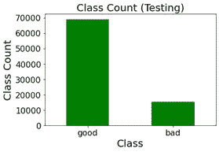

测试数据集

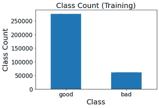

训练数据集

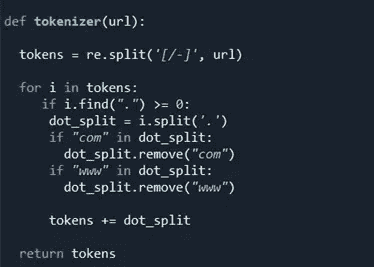

url 的预处理

我们定义了一个函数来对 URL 中的文本进行必要的预处理。

**tokens = re.split('[/-]'，url)**

只要有“/”或“-”，这行代码就会拆分 url。接下来我们有一个

for 循环，遍历数据中的每个 URL

**如履薄冰(“)> = 0: dot_split = i.split(' . ')**

这一行代码检查 url 中的点，如果发现点，它立即将 url 分成两部分，即域名和扩展名。

**如果“com”在 dot_split:**

**dot_split.remove("com")**

**如果“www”在 dot_split:**

**dot _ split . remove(" www ")**

此块删除预处理后的 URL 中的扩展名，如“www”和“com ”,只返回网页的名称，因为它们不添加任何上下文。

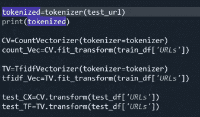

为了测试对数据集的预处理做得有多好，我们调用了在最后一个块中定义的函数来预处理我们在后面阶段已经声明的一个测试 URL。我们引入了一个叫做计数矢量器和 TFIDF 矢量器的功能。标记化是从文本数据中移除停用词并使其适合预测建模的过程。我们配备了 TFIDF 和计数矢量器功能。CountVectorizer 用于将文本文档的集合转换为术语/标记计数的向量。而 TFIDF 矢量器将文本数据转换成 ML 模型可以理解的数字。我们在训练和测试数据中执行这两种矢量化方法。我们得到的后来的结果是在代表数据中的每一个文本的大范围的值上。我们的 ML 模型无法学习如此大的值，因此我们应用 fit_transform()和 transform()来缩放特定范围内的数据参数，并学习数据集的输入特征的均值和方差。拟合方法计算平均值和方差，转换使用平均值和方差来转换数据中的所有要素。使用转换方法，我们可以使用从我们的训练数据计算的相同的均值和方差来转换我们的测试数据。

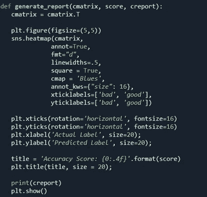

生成预测报告

为了生成 ML 算法在数据集上的性能报告，我们定义了一个函数，该函数生成一个热图以获得混淆矩阵，该矩阵说明了召回率和精确度，给出了关于多少假阴性、假阳性、真阴性和真阳性的读数。在标题中，我们打印了分数，即我们的模型的准确性分数，如下所示。

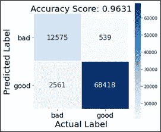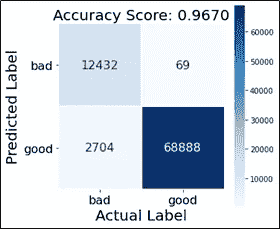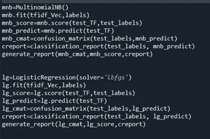

为 ML 模型定义一个对象

在对数据做了所有必要的预处理之后，我们已经准备好将数据输入到 ML 模型中。我们使用多项式朴素贝叶斯和逻辑回归作为我们的模型来预测 url 是否是恶意的。我们定义 MNB 并将其放入矢量化的 URL 中作为输入数据，将标签作为预测输出。然后我们生成一个分数来告诉我们的模型的准确性，并预测 URL 是否是恶意的，随后我们调用函数“classification_report”并生成相应的报告。我们对逻辑回归也做同样的事情。

**代码结论**

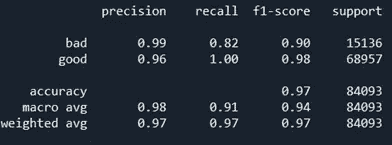

多项式朴素贝叶斯报告

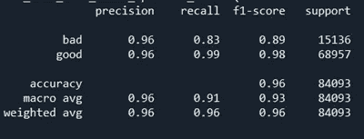

逻辑回归报告。

# **查全率和查准率的平衡**

在诸如信用卡欺诈检测/肿瘤分类的情况下，即使单个病例被错误分类，也会变成严重的问题，因为如此多的金钱或生命可能会处于危险之中。因此，在这种情况下，我们需要做的是在召回率和精确度之间取得平衡。对于像这样的情况，我们需要有一个高的召回分数，因为它告诉我们我们的模型做出预测和从数据集中的实际阳性中分类出真阳性的准确程度。通过 F1 评分，我们可以在查准率和查全率之间取得平衡。

如果感兴趣，请点击“喜欢”按钮:))