# 使用 Python 中的 MLflow 管理您的机器学习生命周期

> 原文：<https://medium.com/analytics-vidhya/manage-your-machine-learning-lifecycle-with-mlflow-in-python-d678d5f3c682?source=collection_archive---------2----------------------->

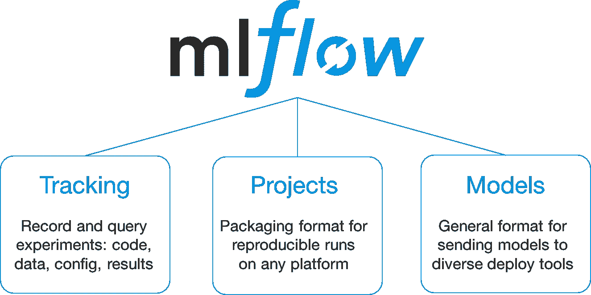

MLflow 主要组件。图片由 Databricks 提供。

在这篇文章中，我们将介绍 MLflow 的核心内容，这是一个管理机器学习模型生命周期的开源平台。

我们将涵盖:

*   mlflow 的基本设置
*   实验
*   记录度量和参数
*   定制工件
*   模型注册表
*   模型预测

MLOps 是一种支持数据科学家之间协作的方法；它有助于获得对不同模型版本、同一问题中的多个实验以及模型管理和部署的控制。有几种开源和商业解决方案可以解决这个问题；我们将看看 MLflow。

根据 MLflow 的网站:

> MLflow 是一个简化机器学习开发的平台，包括跟踪实验，将代码打包成可重复运行的代码，以及共享和部署模型。MLflow 提供了一组轻量级 API，可用于任何现有的机器学习应用程序或库(TensorFlow、PyTorch、XGBoost 等)，无论您当前在哪里运行 ML 代码(例如，在笔记本、独立应用程序或云中)。

# **设置:**

首先，我们从安装 mlflow 开始；建议使用虚拟环境。

```
pip install mlflow
```

要运行 MLflow，您需要:

*   跟踪服务器将允许我们看到模型生命周期的用户界面。
*   后端存储，我们将在这里记录我们的指标、参数和其他元数据。
*   一个工件根来存储我们选择的模型和定制对象。

出于演示目的，我们将使用本地存储和一台个人计算机作为跟踪服务器。

**警告:**在生产环境中，你应该使用后端存储，比如 Postgres 或者 MySQL 数据库。

你可以使用像亚马逊 S3、Azure Blob Storage 或 GCP 云存储这样的桶式系统来存储工件。

对于跟踪服务器，您可以使用 Kubernetes、VM 或任何您可以公开的计算引擎系统。

要在本地启动服务器，请运行:

```
mlflow server --backend-store-uri mlflow_db \
              --default-artifact-root ./mlflowruns \
              --host 0.0.0.0 \
              --port 5000
```

您应该看到创建了一个名为 mlflow_db 的文件夹，并在控制台中显示一条类似这样的消息。

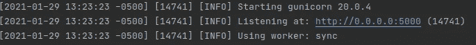

跟踪服务器日志。图片由作者提供。

现在，转到 [http://localhost:5000/](http://localhost:5000/) ，您应该会看到 mlflow 的 UI。

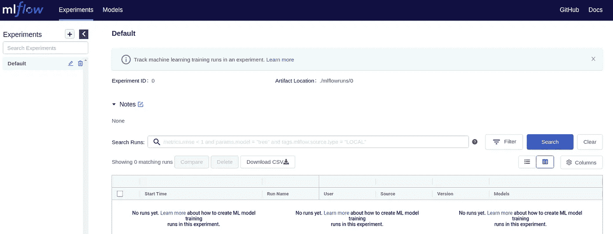

MLflow UI。图片由作者提供。

我们有几个选项要考虑:

在左边的面板，我们将看到我们的实验，这将帮助我们对相同问题的运行进行分组；有一个实验叫做“默认”，让我们编辑一下，把它重命名为“葡萄酒回归”，我们可以创建另一个实验，叫做 Iris。

# **培训和记录:**

现在，创建一个名为 train.py 的文件，并放入以下代码，这是 mlflow 教程的修改版本:

```
import warnings
import sys
import pandas as pd
import numpy as np
from sklearn.metrics import mean_squared_error, mean_absolute_error, r2_score
from sklearn.model_selection import train_test_split
from sklearn.linear_model import ElasticNet
import mlflow.sklearn

import logging

logging.basicConfig(level=logging.WARN)
logger = logging.getLogger(__name__)

mlflow.set_tracking_uri('http://localhost:5000')
mlflow.set_experiment(experiment_name='Wine Regression')

tags = {"team": "Analytics Principal",
        "dataset": "Wine",
        "release.version": "2.2.2"}

def eval_metrics(actual, pred):
    rmse = np.sqrt(mean_squared_error(actual, pred))
    mae = mean_absolute_error(actual, pred)
    r2 = r2_score(actual, pred)
    return rmse, mae, r2

if __name__ == "__main__":
    warnings.filterwarnings("ignore")

    # Read the wine-quality csv file from the URL
    csv_url = (
        "http://archive.ics.uci.edu/ml/machine-learning-databases/wine-quality/winequality-red.csv"
    )
    try:
        data = pd.read_csv(csv_url, sep=";")
    except Exception as e:
        logger.exception(
            "Unable to download training & test CSV, check your internet connection. Error: %s", e
        )

    # Split the data into training and test sets. (0.75, 0.25) split.
    train, test = train_test_split(data)

    # The predicted column is "quality" which is a scalar from [3, 9]
    train_x = train.drop(["quality"], axis=1)
    test_x = test.drop(["quality"], axis=1)
    train_y = train[["quality"]]
    test_y = test[["quality"]]

    alpha = float(sys.argv[1]) if len(sys.argv) > 1 else 0.5
    l1_ratio = float(sys.argv[2]) if len(sys.argv) > 2 else 0.5

    with mlflow.start_run(run_name='Sk_Elasticnet'):

        mlflow.set_tags(tags)

        lr = ElasticNet(alpha=alpha, l1_ratio=l1_ratio, random_state=42)
        lr.fit(train_x, train_y)

        predicted_qualities = lr.predict(test_x)

        (rmse, mae, r2) = eval_metrics(test_y, predicted_qualities)

        print("Elasticnet model (alpha=%f, l1_ratio=%f):" % (alpha, l1_ratio))
        print("  RMSE: %s" % rmse)
        print("  MAE: %s" % mae)
        print("  R2: %s" % r2)

        mlflow.log_param("alpha", alpha)
        mlflow.log_param("l1_ratio", l1_ratio)
        mlflow.log_metric("rmse", rmse)
        mlflow.log_metric("r2", r2)
        mlflow.log_metric("mae", mae)

        mlflow.sklearn.log_model(lr, "model")
        mlflow.log_artifact(local_path='./train.py', artifact_path='code')
```

我会假设你已经熟悉机器学习和 sklearn，所以我只解释 MLflow 相关代码；首先，您会看到这几行代码:

```
mlflow.set_tracking_uri('http://localhost:5000')
mlflow.set_experiment(experiment_name='Wine Regression')
tags = {"team": "Analytics Principal",
        "dataset": "Wine",
        "release.version": "2.2.2"}
```

我们告诉 mlflow，启动并运行的服务器位于我们的本地主机和端口 5000 上，我们希望使用一个名为 Wine Regression 的实验空间。我们还有一个 tags dict，它将作为额外的元数据，我们希望与实验运行相关联。

然后，我们作为一个上下文管理器开始运行，这样当运行处于活动状态时，我们可以在内部使用几个方法；我们将把它命名为 Sk_Elasticnet，这样我们就可以记住我们在运行什么:

```
with mlflow.start_run(run_name='Sk_Elasticnet'):

        mlflow.set_tags(tags)
        #..... mlflow.log_param("alpha", alpha)
        mlflow.log_param("l1_ratio", l1_ratio)
        mlflow.log_metric("rmse", rmse)
        mlflow.log_metric("r2", r2)
        mlflow.log_metric("mae", mae)

        mlflow.sklearn.log_model(lr, "model")
        mlflow.log_artifact(local_path='./train.py',    
                            artifact_path='code')
```

与。set_tags 方法，我们将当前运行链接到我们定义的标签；使用。log_params，我们可以传递当前参数元组(名称，值)，类似于。模型度量结果的 log_metric。

我们还想保存训练好的模型，以便以后使用；为此，我们使用。log_model，mlflow 会围绕它创建一些元数据，导出为 cloudpickle 文件(或者只是。泡菜)。

我最喜欢 mlflow 的一点是，我们可以使用。log _ artifact 我们可以使用它来存储与训练阶段相关的图像、外部资源、数据集，甚至是用于生成这次运行的代码副本。我们将在最后一个用例中使用它。

当我们运行代码并刷新 mlflow UI 时，您应该会看到类似这样的内容。

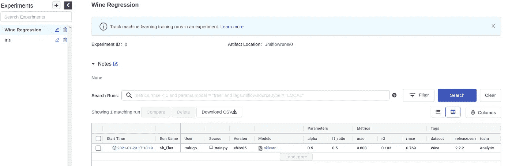

Elasticnet 运行日志。图片由作者提供。

UI 让我们看到我们设置的指标、参数和标签，它还自动包括其他特性，例如运行代码的用户、当地时间的开始时间、使用的模型类型以及代码下的 git 提交(如果您有 git repo 设置)。

如果我们点击模型，我们可以看到额外的信息，比如保存的模型和我们的定制工件，在我们的例子中，是我们使用的代码。它也有这些对象的预览，你可以在本地下载它们。

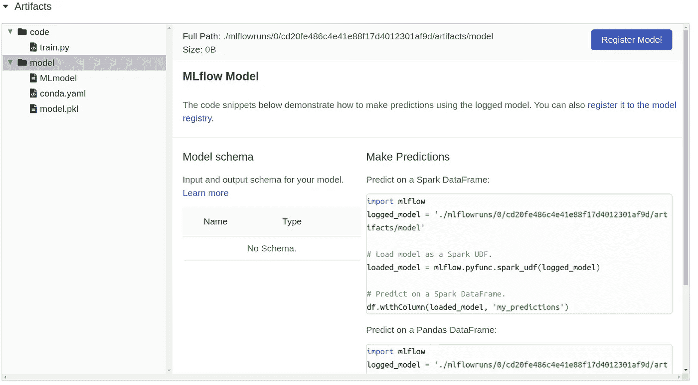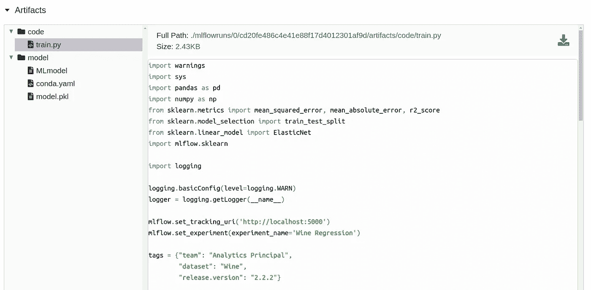

MLflow 伪影。图片由作者提供。

# **车型注册:**

正如您所看到的，有一个按钮，我们可以在这里注册模型，这样我们就可以将它作为一个 API 如果您尝试这样做，您可以为您的模型创建一个名称，但您可能会看到一个错误，说明不支持模型注册表数据存储的 URI，这是因为您必须使用一些支持的数据库来设置您的 mlflow 后端，这些数据库包括 PostgreSQL、MySQL、MS-SQL 和 SQLite，如果您有其中的一个，您只需在启动命令中更改 SQLAlchemy 数据库 URI 的选项。

```
export DB_URI = <dialect>+<driver>://<username>:<password>@<host>:<port>/<database>mlflow server --backend-store-uri $DB_URI \
              --default-artifact-root ./mlflowruns \
              --host 0.0.0.0 \
              --port 5000
```

因此，我将向您展示一旦您更改了这个设置，它会是什么样子(在最后会有更多的介绍)。

在我们重命名它之后，我们单击模型的 URL 并将其阶段设置为生产，因此当我们使用预测 API 时，我们确保我们请求的是当前的生产模型，而不是随机的模型运行；默认情况下，它将是模型的版本 1，看起来应该是这样的:

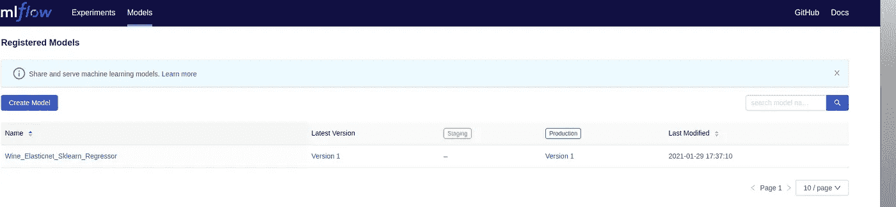

模型注册表，图片由作者提供。

现在，我将转到我们创建的 train.py 文件，并使用一些不同的超参数重新运行它，以获得同一问题的不同模型版本；运行它们之后，葡萄酒回归实验应该是这样的。

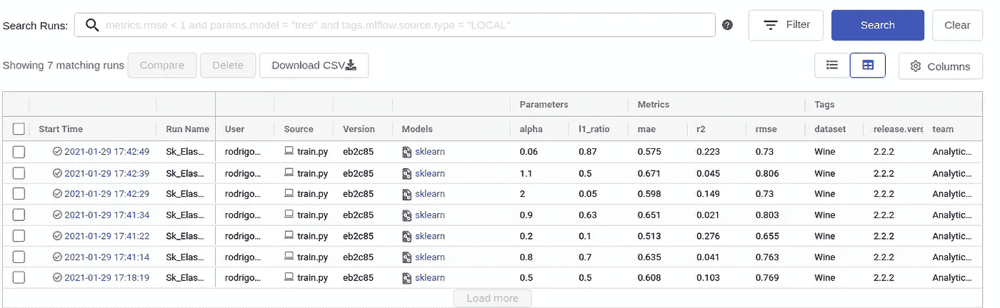

同一个实验下的几次运行。图片由作者提供。

# **车型对比:**

我们可能希望使用记录的指标和我们保存为工件的自定义图像来查看最近的运行是否有更好的模型性能。

MLflow 附带了一个比较选项，在撰写本文时，该选项仍然有点空白，但可以为我们提供一些简单的比较，让我们通过左侧的复选框选择所有模型，然后单击 compare。

我们应该看到的第一个图是一个散点图；我们可以选择想要绘制和比较的指标和参数。

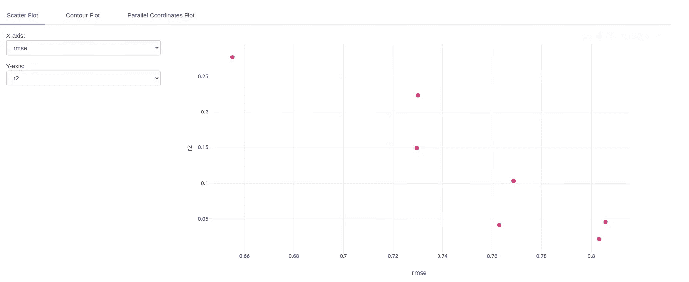

指标散点图。图片由作者提供。

如果您仔细查看每个点，我会向您展示运行名称以及与该运行相关的参数/指标。

您还可以看到一个等值线图，以了解在不同的参数对组合下指标是如何变化的。

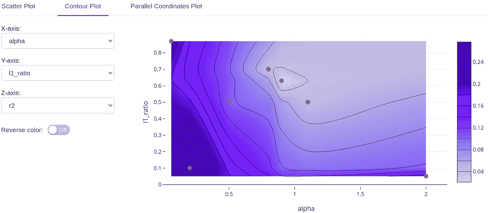

参数等值线图。作者图片

最后，我们有一个平行坐标图，可以在其中放置所有指标和参数。

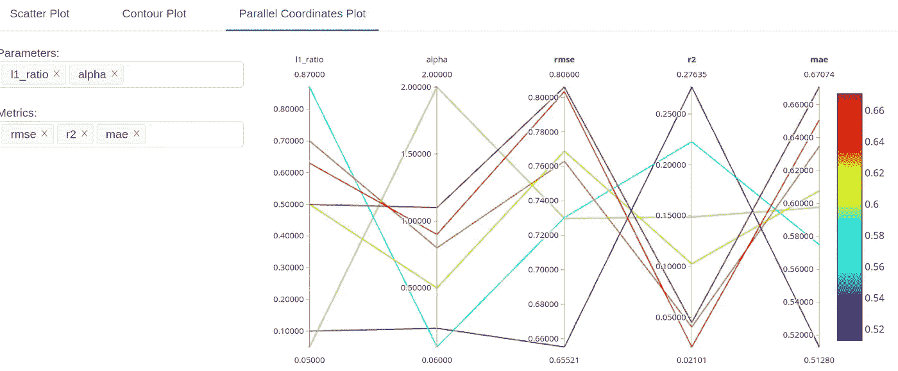

平行坐标图。图片由作者提供。

在通过 UI 比较了不同的模型之后，我们可以选择将哪个模型投入生产。然后，转到“实验”选项卡，并在确切的模型名称下注册您决定的模型，让我们将其移动到阶段步骤。

**注意**:如果你愿意，你可以用 MLflow API 自动获取所有这些元数据，或者/和进行更好的比较过程。

现在，在“模型”选项卡上，它应该是这样的:

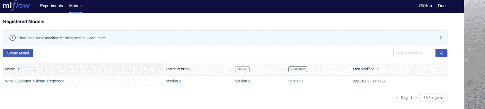

具有阶段的模型注册表。图片由作者提供。

如果您点击了版本 2，我可以将其转移到生产环境，并将版本 1 设置为存档。

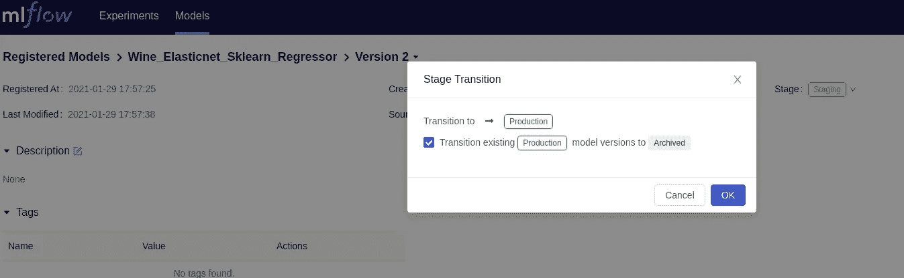

型号升级。图片由作者提供。

# **做预测:**

作为我们的最后一步，我们想做一些预测；为此，MLflow 已经为我们提供了一个 API 来进行请求；如果您转到模型注册表，您应该已经注意到有一个运行 id，您可以使用它向我们运行的特定模型发出请求。尽管如此，由于我们想要使用我们的生产模型，而不需要经常检查运行 id 是否会改变，我们可以使用带有模型名称和阶段的 mlflow 语法；代码如下所示:

```
import mlflow
import pandas as pd
logged_model = 'models:/Wine_Elasticnet_Sklearn_Regressor/Production'

data = pd.read_csv('winequality-red.csv')

# Load model as a PyFuncModel.
loaded_model = mlflow.pyfunc.load_model(logged_model)

print(loaded_model.predict(data))
```

酒质-red.csv 有两行预测；运行之后，我们得到一个包含每个预测的数组。

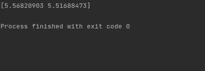

MLflow 预测响应。图片由作者提供。

您还可以创建一个新的服务器，使用 mlflow 的 CLI 将模型部署为 API，并发出 HTTP 请求，更多信息请参见:[https://www.mlflow.org/docs/latest/cli.html](https://www.mlflow.org/docs/latest/cli.html)

**结论:**如你所见，MLflow 有几个易于使用的功能来管理机器学习模型的整个生命周期；有几个主题我们在这篇文章中没有涉及，例如使用数据库系统、远程存储和外部服务器部署 mlflow，以及其他高级 API 用例和选项来自动化 UI 中的步骤。

我还必须指出，即使 MLflow 是一个伟大的开源项目，它仍然有一些你必须注意的缺点；我想提几个:

*   没有内置的身份验证机制，尽管您可以使用 basic auth 或 OAuth 2.0 设置 Nginx 代理。
*   没有集成的基于角色的用户管理，所以每个人对模型都有相同的权限。
*   一旦设置了基于云的部署，就必须在服务器端和客户端保存与存储提供者相关联的连接秘密，这同样会有一些安全问题。

Databricks 提供的 MLflow 的商业版本可以解决这些问题。

如果你想知道如何在云环境中使用 Docker 设置 MLflow，比如 Azure 或 Amazon 或更高级的用例，请在评论中告诉我。

全部代码都在我的 Github 里:【https://github.com/rodrigo-arenas/mlflow-basics 

# **参考文献:**

[1] Databricks 对 MLflow 的介绍:[https://data bricks . com/blog/2018/06/05/Introducing-ml flow-an-open-source-machine-learning-platform . html](https://databricks.com/blog/2018/06/05/introducing-mlflow-an-open-source-machine-learning-platform.html)

[2]ml flow Github:[https://github.com/mlflow/mlflow](https://github.com/mlflow/mlflow)

[3]MLflow 教程:[https://www . ml flow . org/docs/latest/tutorials-and-examples/tutorial . html](https://www.mlflow.org/docs/latest/tutorials-and-examples/tutorial.html)