# 使用 Apache Airflow 管理您的工作流程。

> 原文：<https://medium.com/analytics-vidhya/manage-your-workflows-with-apache-airflow-7d39e12b302b?source=collection_archive---------7----------------------->

## 用 Python 写你的第一个实时 DAG。


照片由 [Chait Goli](https://www.pexels.com/@chaitaastic) 在[像素](https://www.pexels.com/)上拍摄

> ***注意:*** 这篇文章是名为“**使用 Apache Airflow** 管理您的工作流”系列文章的一部分。这是两部分系列的第二部分。你应该先看[第一部分](https://shritam.medium.com/manage-your-workflows-with-apache-airflow-e7b0e45544a8)。
> 
> *part 1:*[*Python 中 Apache Airflow 的介绍、安装和设置*](https://shritam.medium.com/manage-your-workflows-with-apache-airflow-e7b0e45544a8)
> 
> 第二部分:用 Python 编写你的第一个实时 DAG。

在上一篇文章中，我们已经安装并设置了环境来运行我们在 Airflow 中的第一个 DAG。作为一种期望，本文假设您已经配置了 Airflow 环境，并且已经准备好编写和管理工作流。

在这篇后续文章中，我想用下面的议程来解释一下，

1.  真实世界问题陈述
2.  数据源解释
3.  数据概述
4.  编写 ETL 管道
5.  编写 DAG 来管理 ETL 工作流
6.  节目质量监视
7.  结论

# 真实世界问题陈述:

我们将执行一个简单的任务，寻找一个真实世界的 API，在那里我们可以获得 JSON 格式的数据，接下来我们将数据转换为必需的字段，最后将转换后的数据保存为 CSV 格式。

# 数据源解释

随着 React 和 Vue.js 等现代 web 应用框架的兴起，越来越多的网站使用 REST API 来发送和接收数据，然后在客户端呈现最终的布局。

在整个过程中，我们将从男包类别 [Zalando-UK](https://www.zalando.co.uk/) 中提取数据。


> 但是等等！我们如何捕捉包含产品数据的 API？

1.  许多网站和 Zalando 一起使用“一页显示”的概念。打开网页并检查它。转到网络 XHR，重新加载页面。您可以看到 XHR 类型的所有请求的列表(特定于数据)。分析所有网络请求并点击“下一页”按钮，将发出 API 请求。
2.  一旦获得 API，复制 Curl 并将其转换为来自 [CrulTrillwork](https://curl.trillworks.com/) 的 Python 请求。

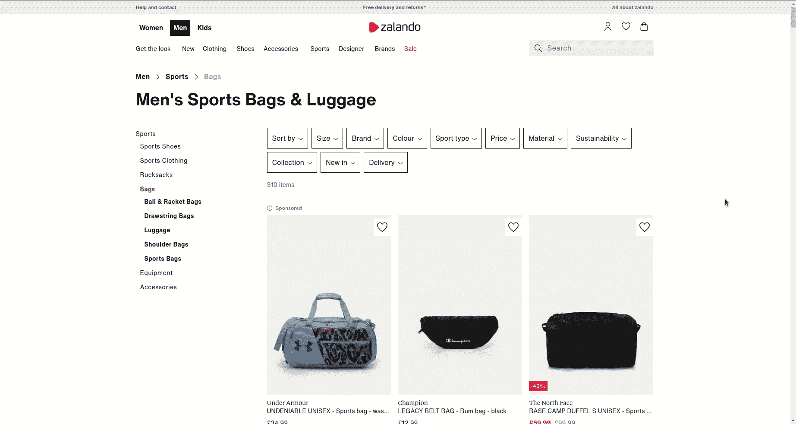

让我们来看看，当您向 API 发出 GET 请求时，数据是什么样子的:

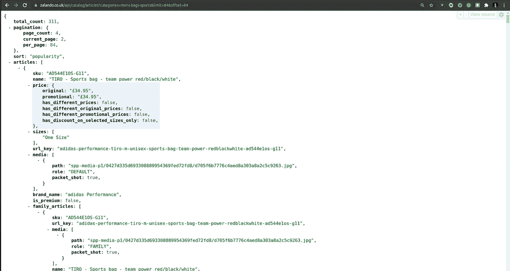

API JSON 数据

# 数据概述

我们已经成功提取了 API，现在是成为*福尔摩斯的时候了。*让我们分析数据，找到存储所有产品详细信息的字段。为了简单起见，我只考虑 API 的第一页。

如果仔细观察" *API JSON 数据*"图像，所有产品都存储在名为 ***文章*** 的字段中。看起来，这是一个字典列表。

是的，我们答对了。

让我们探索一些有用的字段来制作最终的 CSV 文件，

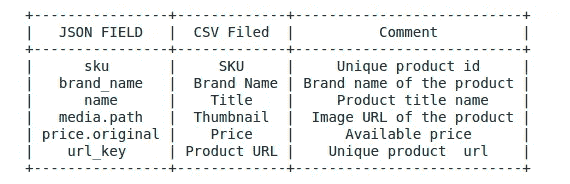

用于 ETL 过程的文件

# 编写 ETL 管道

在 ETL 之前，我们需要了解一些事情，

## **什么是 DAG？**

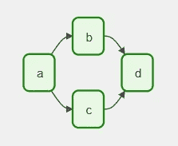

一个 *DAG* (有向无环图)是气流的核心概念，将每个任务收集在一起，用依赖和关系组织起来，以说明它们应该如何运行。例如，这里它定义了四个任务——A、B、C 和 D——并规定了它们必须运行的顺序，以及哪些任务依赖于哪些任务。

> Dag 文件应该有`*.py*`扩展名，并存储在一个名为`dags`的文件夹中，在这里您已经启动了 db。

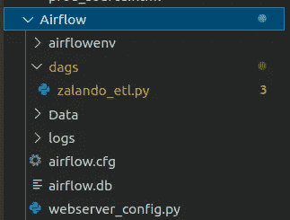

目录树

1.  让我们创建一个文件夹，创建一个 python 文件，命名为`zalando_etl.py`
2.  创建一个目录`Data/csv`来存储您的最终输出。

## **X-com 是什么？**

XComs(“cross-communication”的缩写)是一种让*任务*互相对话的机制。airflow 中有一个名为“ *xcom_push* 的方法，可以发送 Apache Airflow 后端数据库中 xcom 表中的一些值。这可以用`ti` ( *任务实例)*来定义，用来标识任务。

既然我们已经准备好编写 ETL 管道，就不多说了，让我们定义几个 Python 函数来提取、转换和加载这些数据。

## 提取:

该函数将向 API URL 以及我们从 [CrulTrillwork](https://curl.trillworks.com/) 收集的给定头发出 GET 请求。Xcom-push 会将结果作为函数值推送。

## 转换:

这一步我们需要一些预处理。如果您看到产品 URL 字段和缩略图字段，则它们的 URL 格式不正确。我们需要把它转换成一个合适的 URL。

```
**1\. url_key**: “under-armour-weekend-bag-black-un244e055-q11” ***to*** “[https://www.zalando.co.uk/under-armour-weekend-bag-black-un244e055-q11.html](https://www.zalando.co.uk/under-armour-weekend-bag-black-un244e055-q11.html)”**2\. path**: “spp-media-p1/506932a1e2c740acb95444b7d9c84994/36e1a4ed9c5c4d9d884dd5297011595f.jpg” **to** "[https://img01.ztat.net/article/spp-media-p1/506932a1e2c740acb95444b7d9c84994/36e1a4ed9c5c4d9d884dd5297011595f.jpg](https://img01.ztat.net/article/spp-media-p1/506932a1e2c740acb95444b7d9c84994/36e1a4ed9c5c4d9d884dd5297011595f.jpg)"
```

## 负载:

最后，我们需要定义一个函数，将转换后的数据加载到 CSV 文件中。

# 编写 DAG 来管理 ETL 作业

耶！现在，我们可以在 Airflow 中编写 DAG 来依次运行 3 个不同的作业。下面的脚本是我们创建 DAG 文件以执行工作流所需的全部内容。

## 以上代码的详细信息:

1.  在定义了所有 3 个 ETL 功能之后，我们已经按顺序定义了任务。
2.  `*dag_id*` 应该对您将来创建的所有 Dag 都是唯一的。
3.  要执行 Python 调用，请始终使用 PythonOperator 方法。
4.  任务用`*>>*`符号顺序定义。

让我们检查 DAG 是否已按气流列出。为 airflow 激活您的虚拟环境，并运行以下命令来检查所有 Dag。

```
**$ airflow dags list**
```

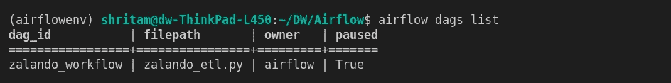

DAGs 列表

你可能会在你的列表中看到一些其他的例子。但是不用担心，这些只是为了演示的目的。它不会对您的`*zalando_workflow*` DAG 做任何更改。

酷！让我们打开两个单独的 shell 选项卡来运行 Scheduler 和 Webservice。

## 启动调度程序:

```
**$ airflow scheduler**
```

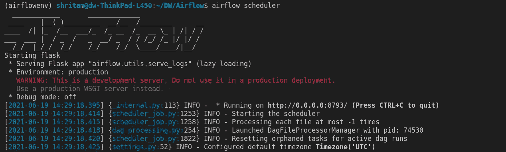

## 启动 web 服务器

```
**$ airflow webserver — port 8080** #default port is 8080
```

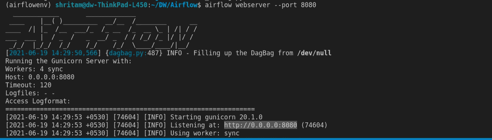

现在让我们在浏览器中访问 [*localhost:8080*](http://0.0.0.0:8080/) ，您会看到 Airflow Webserver UI:

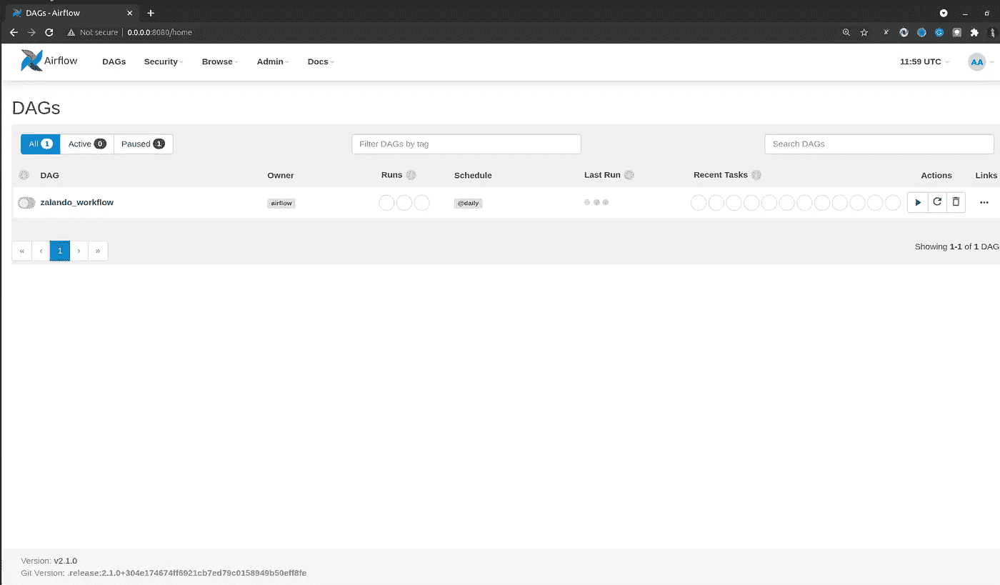

Airflow 服务器主页

我们已经完成了 DAG 配置。让我们启动工作流，取消暂停 DAG 并触发 DAG。

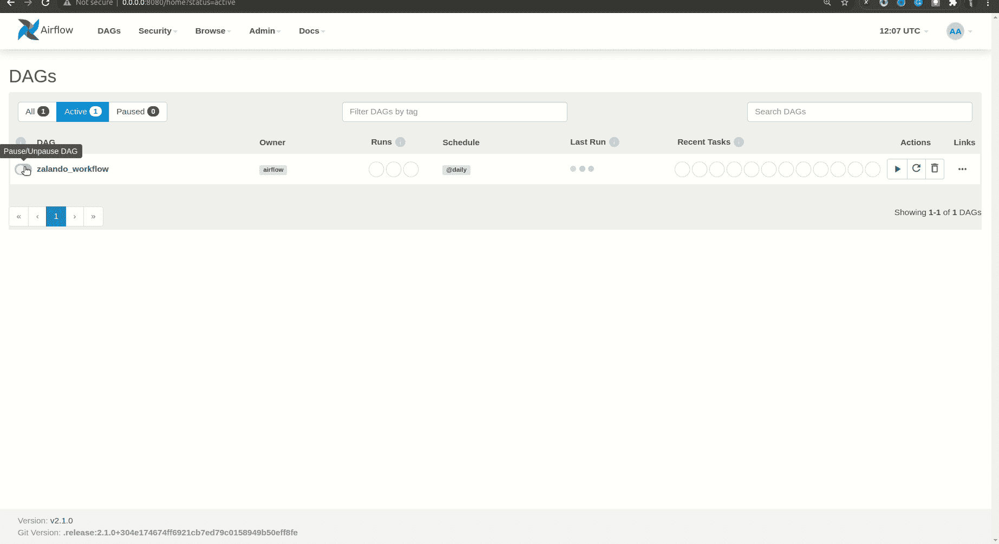

DAG 工作流

触发后，勾选 ***图形视图*** 跟踪工作流程。您可以通过将鼠标悬停在任务上来检查每个任务的状态。一旦工作流完成，所有任务的边界将以绿色*显示，状态为“*成功*”。*

# 节目质量监视

今天的 DAG 运行成功完成后，您可以看到 CSV 文件将在`Data/csv`目录下生成。

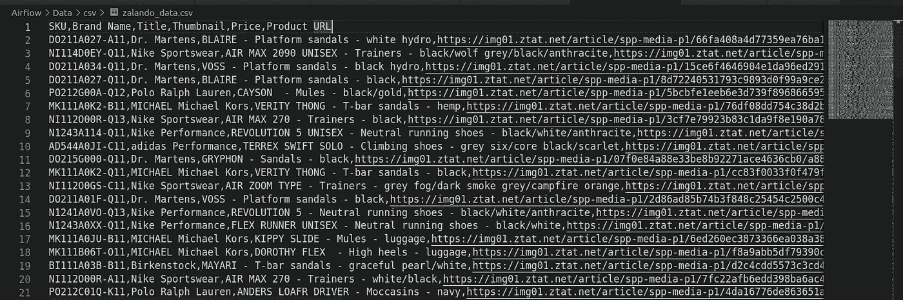

Zalando 最终 csv 文件

让我们读取熊猫数据框中的 CSV，

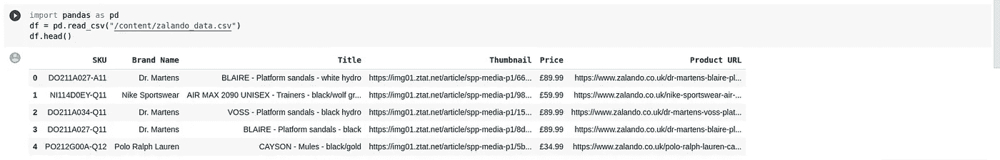

csv 到熊猫数据帧

太好了！

# 结论:

恭喜你，你的第一个真实世界的 DAG 与气流是活的。我希望它是容易的和有帮助的。请随意将这个气流系列作为参考，并尝试使用其他一些新的来源。

我希望这篇文章能够激励你使用 Apache Airflow 2.1.0 来编写和管理工作流。

报名参加[2021 年气流峰会](https://www.crowdcast.io/e/airflowsummit2021/register?utm_campaign=AstronomerMarketing&utm_source=Website&utm_medium=Bar)。

# 感谢您的阅读！

请在媒体上关注我的最新消息。😃

# 参考

[](https://airflow.apache.org/docs/) [## 证明文件

### Apache Airflow Core，它包括 web 服务器、调度程序、CLI 和最小气流所需的其他组件…

airflow.apache.org](https://airflow.apache.org/docs/) [](https://www.astronomer.io/) [## 天文学家|阿帕奇气流的企业框架

### 在我们或您的云中轻松运行、管理和扩展 Apache 气流。

www .天文学家. io](https://www.astronomer.io/)