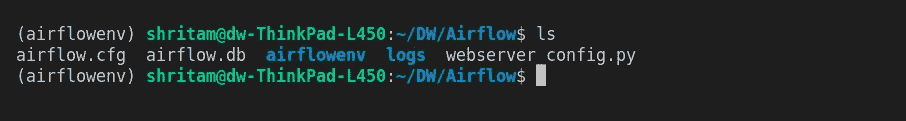
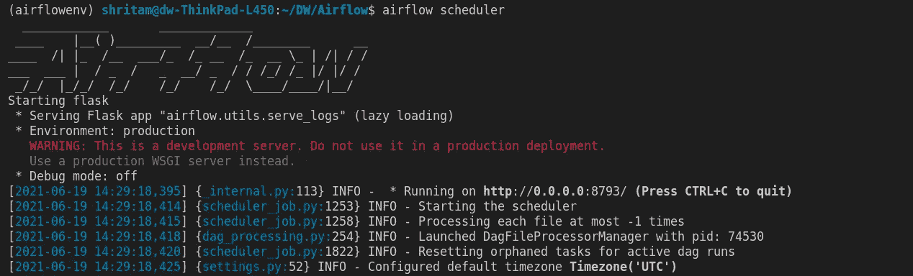
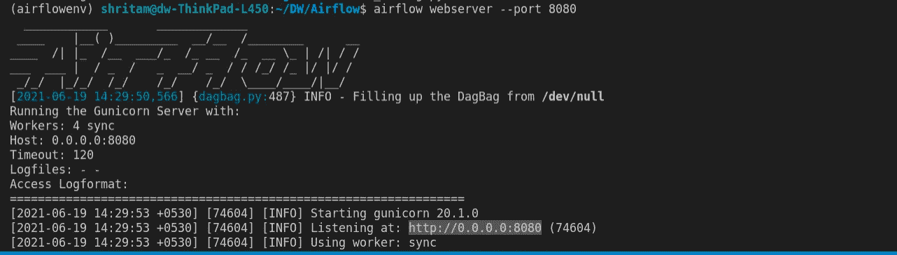
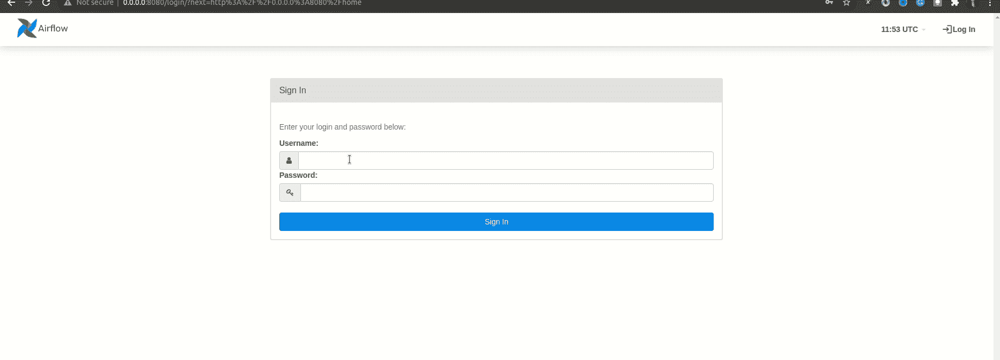

# 使用 Apache Airflow 管理您的工作流程。

> 原文：<https://medium.com/analytics-vidhya/manage-your-workflows-with-apache-airflow-e7b0e45544a8?source=collection_archive---------7----------------------->

## 介绍、安装和设置**阿帕奇气流**在 **Python** 中。


照片由 [Pixabay](https://www.pexels.com/@pixabay) 在[像素](https://www.pexels.com/)上拍摄

> 管理就是把事情做对；
> 
> 领导力就是做正确的事情。
> 
> —彼得·德鲁克

> 第 1 部分:Python 中 Apache Airflow 的介绍、安装和设置
> 
> 用 Python 编写你的第一个实时 DAG。

数据是当今所有业务的核心。随着公司越来越依赖数据，数据工程的重要性也在不断增长。数据工程有助于使数据对数据消费者更有用和更容易获得。数据工程师作为“数据管道”在端到端流程中扮演着重要角色每个管道都有一个或多个源和一个或多个目的地。在管道中，数据可能经历几个步骤的转换、验证、丰富、汇总或其他步骤。数据工程师创建这些管道，并使用一些高效的工程工具管理工作流。当数据技术频繁出现时，当我们考虑工作流管理时， **Apache Airflow** 站在首位。


[https://airflow.apache.org/](https://airflow.apache.org/)

# 什么是气流？

作为一名数据工程师，总有一天你会想到如何编排你的工作流程，而 Apache Airflows 的出现填补了这个空白。Apache Airflow 最初创建于 2014 年的 Airbnb，是一款用于编排复杂工作流程和数据处理管道的开源工具。它是一个以编程方式创作、调度和监控工作流的平台。

**创作:**air flow 中的工作流用 Python 编程语言写成有向无环图(Dag)。它允许用户用 python 编写他们的自定义工作流。

**调度:**用户可以指定一个工作流应该什么时候开始，什么时候结束，以及它应该在什么时间间隔后再次运行。

**监控:**air flow 用户界面可以轻松监控数据管道并对其进行故障排除。它有很多工具可以实时跟踪你的工作流程。

# 安装和设置

## 第一步

现在我们已经了解了 Airflow 的不同组件，让我们从在我们的工作站上设置 Airflow 开始，这样我们就可以在本地测试和运行我们构建的管道。我们要做的第一件事是创建一个新文件夹，用 Python 3 创建一个虚拟环境并激活它，我们将在其中安装并运行 Airflow。让我们速战速决，

```
**$ mkdir Airflow**                   # make a folder
**$ cd Airflow** # directed to the directory
**$ python3 -m venv airflowenv**      # create a vertual environment
**$ source airflowenv/bin/activate** # activate the environment
```

## 第二步

安装 Airflow 最新稳定版本的最简单方法是使用 pip，但在升级之前，pip 版本和安装 airflow:

```
**$ pip install --upgrade pip** # pip upgrade **$ pip install apache-airflow** # installing airflow
```

## 第三步

安装后，检查您在系统上安装的气流版本，

```
**$ airflow version** >> 2.1.0
```

## 第四步

Airflow 需要在本地系统上运行一个位置，称为 *AIRFLOW_HOME* 。如果我们不指定它，它将默认为您的路由目录。我建议你将 *AIRFLOW_HOME* 设置在你当前所在的目录下，也就是你创建虚拟环境的目录下。

```
**$ export AIRFLOW_HOME=.**
```

## 第五步

配置完成后，您需要初始化数据库，然后才能运行任务:

```
**$ airflow db init**
```

这将启动运行气流任务的先决条件。如果你仔细观察，会发现在你的气流目录下创建了一些文件夹。改天我会仔细调查的。



初始化元数据数据库后创建的文件

## 第六步

当您第一次开始使用 airflow 时，它可能会要求您登录。要设置您的用户 id 和密码，请运行以下命令。这将设置你的用户名为“*管理员*”，密码也为“*管理员*”。

```
**$ airflow users  create --role Admin --username admin --email admin --firstname admin --lastname admin --password admin**
```

## 第七步

现在，我们已经准备好在本地运行 Airflow Web 服务器和调度程序。使用两个单独的 shell 选项卡来运行这两个进程，并且不要忘记在新选项卡中激活虚拟环境。

为了更好的实践，我建议你先运行 Scheduler，然后再运行 Web 服务器。

## 启动调度程序:

```
**$ airflow scheduler**
```



## 启动 web 服务器

```
**$ airflow webserver — port 8080** #default port is 8080
```



要访问 Web 服务器 UI，请在浏览器中访问 *localhost:8080* ，并使用您刚刚创建的管理员帐户登录。



# 结论:

祝贺您，您已经成功设置了您的气流环境。在下一篇博文中，我将向您展示如何使用 Airflow 运行实时工作流。在那之前，做好准备，保持动力。

# +1 **公告:**

预计将有超过 10K 软件工程师、数据科学家、商业智能分析师和 DevOps 工程师将参加 2021 年气流峰会(7 月 8 日至 16 日)。Airflow Summit 是一个面向 Apache Airflow 全球开发者和用户社区的免费在线会议。该活动将包括主题演讲、社区讲座和深入研讨会。

报名参加[2021 年气流峰会](https://www.crowdcast.io/e/airflowsummit2021/register?utm_campaign=AstronomerMarketing&utm_source=Website&utm_medium=Bar)。

# 感谢您的阅读！

[通过 Medium](/@shritam) 关注我的最新更新。😃

# 参考:

[](https://airflow.apache.org/docs/) [## 证明文件

### Apache Airflow Core，它包括 web 服务器、调度程序、CLI 和最小气流所需的其他组件…

airflow.apache.org](https://airflow.apache.org/docs/) [](https://www.astronomer.io/) [## 天文学家|阿帕奇气流的企业框架

### 在我们或您的云中轻松运行、管理和扩展 Apache 气流。

www .天文学家. io](https://www.astronomer.io/)