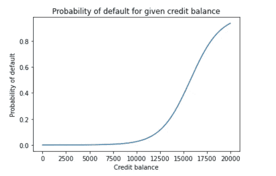
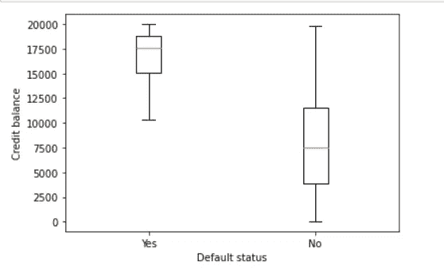
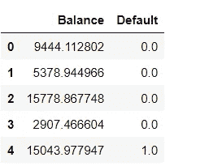
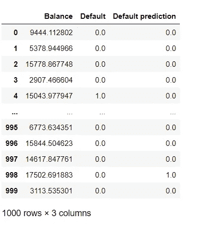
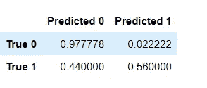
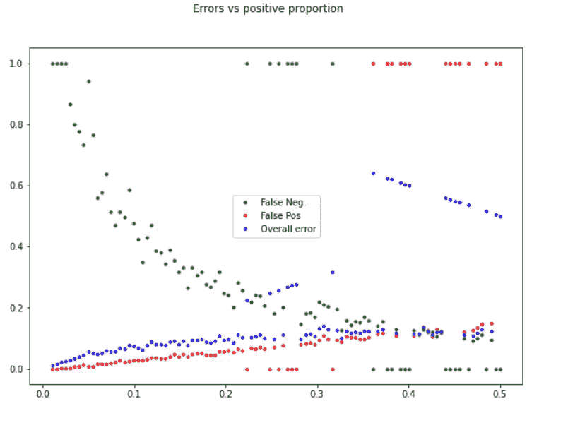
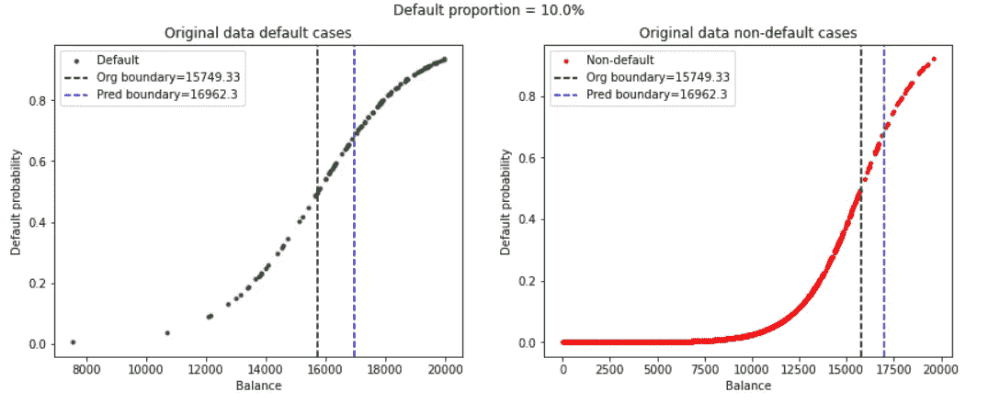
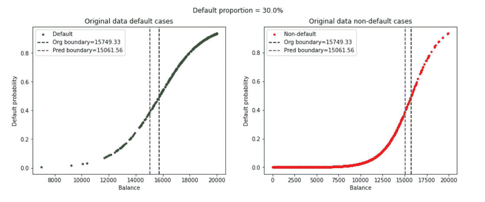
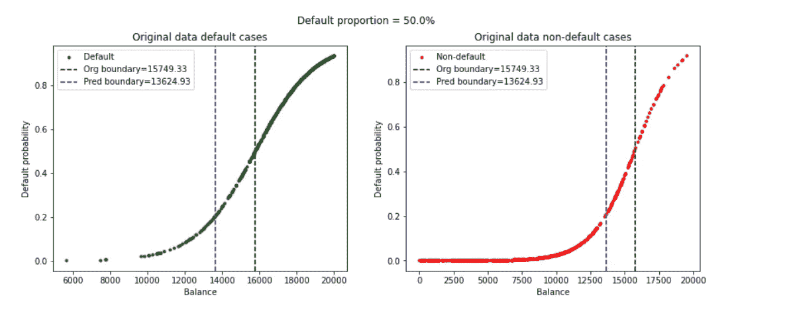
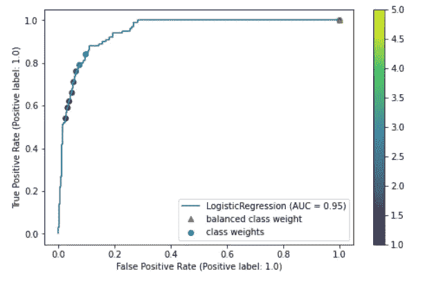

# 操纵类别权重和决策阈值

> 原文：<https://medium.com/analytics-vidhya/manipulating-class-weights-and-decision-threshold-cb7d8d9433a4?source=collection_archive---------5----------------------->

比较两种保持分类平衡的方法

来源:谷歌图片

# 背景:

处理分类问题中的数据集不平衡是机器学习(ML)社区中的一个非常热门的话题。这里我们指的是每个响应类的样本比例的不平衡。在阅读詹姆斯·威滕、哈斯蒂、提布拉尼的 *ISLR 时，我发现了这一点，处理这种失衡的不利影响的方法是通过操纵决定预测决策边界的阈值概率极限。然而，sklearn 中的逻辑回归文档向我介绍了类权重的概念，这似乎也是为了同样的目的。所以我的疑问由此而来-*

> **操纵类权重和阈值限制会导致相同的结果吗？**

我们将尝试通过进行一些模拟的实证研究来解决这个问题。

# 一.摘要:

***首先要注意的是——我们将把我们的研究局限于逻辑回归，以便专注于问题本身的本质。***

分类问题中有两种错误——假阴性和假阳性。操纵阈值极限决定了假阴性和假阳性的比率。

> **我们猜测，与使用 0.5 作为阈值的假阳性率相比，过高的假阴性率是由于数据集的不平衡——与 y=0 条目相比，y=1 条目太低。**

这似乎是合乎逻辑的，因为与 y=1 个条目相比，y=0 个条目对分类器具有更大的影响。因此，与 y=1 类相比，y=0 类中的错误率较低。首先，我们将检验这个假设。

如果假设是有效的，我们将检查操纵类权重是否达到与操纵阈值限制相同的目的。因此有两个问题需要回答—

*   假阴性率真的取决于数据集的不平衡吗？
*   如果以上答案是肯定的，那么操纵阈值限制和类权重是否达到了相同的目的？

# 二。准备模拟训练数据

我们首先决定训练数据集的特征。

**训练数据的特征:**

1.  将有一个功能，信用余额-0-20，000 之间的数字和一个响应-默认状态。1 表示默认值=是，0 表示默认值=否。训练集大小将为 1000。
2.  我们将采用概率分布 P(y=1|x ),这样信用余额较高的人违约的几率较高。这个概率分布将用于生成训练数据集— (X，Y)。
3.  在训练集***(y = 1 的条目)/(样本数)=正类条目比例*** 。

我们使用逻辑函数，e^(b_0+B1 . x)/(1+e^(b_0+b_01.x)，选择 B0 和 B1 来满足我们的上述要求，以生成任何给定 x 的 y。下面是获得的概率分布曲线—

图 1

我们还确保训练集中 y=1 个条目的给定比例。

以下是训练集中默认=是和默认=否条目的贷方余额分布，使用 10%默认=是条目生成。

图 2:每种违约状态的信用余额分布

这样生成的训练集是(前 5 个条目)—

表 1:训练集(前 5 个条目)

这是逻辑回归的经典案例。

# 三。寻找假阴性率

使用上述训练集，应用逻辑回归，以下是获得的预测—

表 2:在训练集上获得的预测

相关的混淆矩阵如下—

表 3:每行都标准化的混淆矩阵

从混淆矩阵来看，假阴性和真阳性率分别为 44%和 56%。假阳性率为 2.22%，总错误率(此处未显示)为 6.4%。

我们现在将研究针对训练数据集不平衡(默认=是训练集中的比例)的假阴性、假阳性和总体错误率。这项研究将证实假阴性率是否确实取决于数据集的不平衡？

# 四。错误率与训练数据集中的不平衡

我们在 100 个步骤中从 1%到 50%不断改变默认=是比例，并针对每个比例值分别绘制假阴性、假阳性和总体错误率。

获得了下图——

图 3:错误率与违约率=是比例

随着训练数据集从不平衡(较低的𝑦=1 比例)到平衡，假阴性率将降低(绿点)。这是合乎逻辑的，因为模型将在 y=1 域中更多地学习'***'***，因此将在该区域中产生更低的误差。假阳性率也会增加(红点),因为模型学习 y=0 域的范围相对较小。

> 然而，为什么总的错误率，它表示模型总的'**学习不足'**，增加了呢？它同样可以保持不变或减少。

为了回答这个问题，我们将仔细研究原始的和预测的决策边界，即 P(y=1|x)=0.5 的 x 值。

## IV a .为什么总错误率会随着余额的增加而增加？

原始决策边界由用于模拟训练数据集的分布控制。预测边界是从学习模型获得的。

我们采用分别具有 10%、30%和 50%默认=是比例的三个训练集，从不平衡移动到平衡，并研究原始和预测的边界。

下面是我们得到的图—

图 4:默认值=是 10%

图 5:默认值=是 30%

图 6:默认值=是 50%

三行数字分别代表数据中 10%、30%和 50%默认=是的比例。左边的图显示了 default=yes(绿色)的原始数据。右边的图显示了原始数据，其中 default=no(红色)。在每个图中，后面的垂直线表示由模拟函数控制的决策边界；它始终保持不变。蓝色垂直线显示预测的决策边界。

> 首先，我们看一下左侧的 3 幅图，其中只显示了默认=是的情况。

**顶部的*默认=是比例为 10%。***

*   原始决策边界左侧的情况是根据控制函数违约概率小于 50%的情况；然而违约还是发生了。这是大自然引入不可避免的随机误差的方式。
*   如果预测边界与原始边界完全相同，这将是模型对自然的精确学习；最好的情况。即使这样，预测边界左侧的所有数据点都将被预测为 default=no，但最初的 default = yes 这就是假阴性误差。当预测边界与原始边界相同时，唯一的假阴性误差是由自然界不可避免的随机性引起的。
*   但是，预测边界位于原始边界的右侧，因为训练集的 default=yes 样本数很少。**为了说明这一点，如果没有 default=yes 样本，预测边界将位于最右侧，将所有样本标识为 default = no。**
*   这是比通常更高的假阴性率的来源；由于默认=是或正情况的比例较低，预测边界位于原始边界的右侧。

***在它下面第二行，默认=是比例为 30%。***

*   随着 default=yes 样本比例的增加，预测边界会向左移动。**激励这一运动—如果所有训练样本都是默认的=是。预测边界将位于最左侧，预测所有情况下的 default=yes。**
*   随着预测边界向左移动，假阴性误差减小。这将试图降低整体误差。

***在底部，其中默认=是比例为 50%-*-**

*   预测边界更加左移，进一步减少了假阴性误差。

> **接下来，我们浏览右侧的 3 个图，其中仅显示了默认情况=无案例。**

***顶部默认=是比例为 10%。***

*   原始决策边界右侧的案例是违约概率超过 50%的案例；然而，违约并没有发生。这是不可避免的随机误差。
*   预测边界位于原始边界的右侧。预测边界右侧的情况是预测 default=yes 或 y=1，但最初 default=no 或 y=0 的情况。这些是假阳性错误。

***在它下面第二行，默认=是比例为 30%。***

*   随着预测边界向左移动，假阳性误差增加。这将试图提高整体误差。

***在底部，这里默认=是比例为 50% -***

*   预测边界更加左移，进一步增加了假阳性误差。

> **随着预测边界向左移动，假阴性误差下降。然而，假阳性误差上升。但是为什么整体误差会上升呢？。这里有一个非常棘手的问题。**

*   请看图 4-6 中左边的图。随着蓝线向左移动，其左侧构成假阴性错误的病例数减少。然而，当默认值=是比例较低时，这些绿点的密度较低(低 y=1 个样本)。因此，即使蓝线明显左移，其左侧点数的减少也很少。
*   现在看右边的数字。随着蓝线向左移动，其右侧的病例数增加，即假阳性误差增加。然而，红点的密度更大(高 y=0 样本)。因此，蓝线的相同左移可能会导致其右边的案例数量相对更大的增加。
*   因此，当 default=yes 样本从 10%增加到 30%时，假阳性的增加通常会超过假阴性的减少。
*   然而，站在一个更平衡的场景，假设 default=yes 为 30%，蓝线向左移动可能不会在假阴性的减少和假阳性的增加之间产生明显的差异。因此，从 30%到 50%，总误差率可能相对更稳定。
*   现在查看图 3。总体错误率先上升，然后逐渐稳定在 30%以上的正比例。

## **因此，我们研究的第一部分到此结束——假阴性率是否取决于数据集的不平衡？答案是肯定的，确实如此。**

# 动词 （verb 的缩写）阈值限制操作和类别权重达到相同的目的吗？

为此，给定一个不平衡的训练集，我们首先绘制一个 ROC 曲线，该曲线给出了在不同阈值水平下的假阳性与真阳性的比率。现在，用于不同级别的类别权重的不同分类器适合于相同的数据，并且假阳性率对真阳性率绘制在相同的图上。

下面是获得的数字—

图 7: ROC(阈值)和类权重

> ***蓝色曲线为 ROC 曲线。彩条表示正的等级权重或默认=是等级。类别权重从 5.0 到 1.0 不等(根本不使用类别权重)。全部位于 ROC 曲线上的散点图表示操纵类别权重与操纵阈值相同。红点是当类权重=“平衡”时分类器的性能，即类权重为 5.0 到正类。我们看到，如果没有任何类别权重，即类别权重=1.0，真实的阳性率是最差的。***

# 不及物动词结论:

所以看起来我们有两个选择来处理不平衡的集合。

1.  通过类别权重实现平衡
2.  选择合适的阈值

不过，我对第一点有一些疑问。通过类别权重的平衡为少数正面响应样本提供了额外的权重。如果这些样本确实代表了真实世界的积极响应类别，那就太好了。然而，如果这些样本被破坏，比如说由于不正确的测量，那么给它们增加额外的权重会对学习结果产生负面影响。然而，对于阈值操纵来说，这种挑战可能不存在；在这里，这取决于人的决定，即为了获得低的假阴性率，人们愿意接受多大的总误差。诚然，这种推理需要进一步的实证研究，基于测试集的性能，以建立。

# PS:

用于生成上述图的代码可以在[我的 github 库](https://github.com/AnirbanChakraborty06/StatisticalLearning-ConfusionToClarity/blob/main/AnswersAndDemos/Class%20weights%20and%20threshold%20in%20Logistic%20Regression.ipynb)中找到。