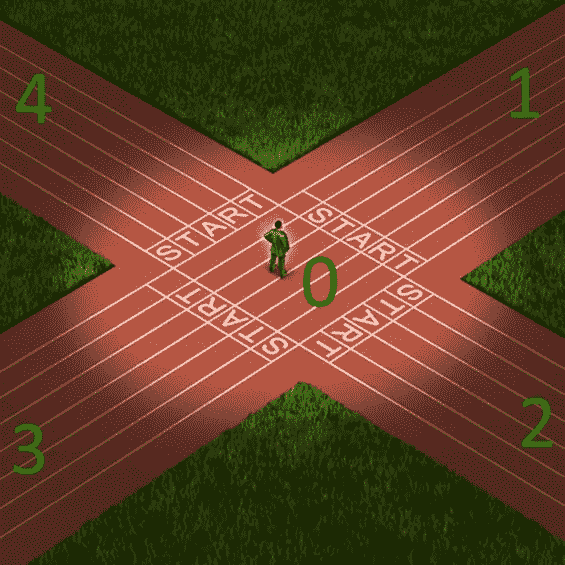
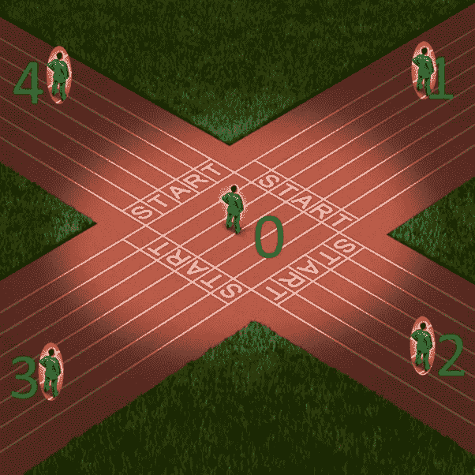
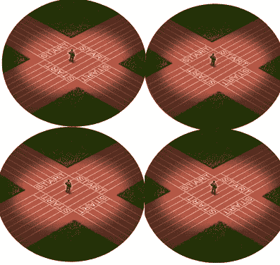
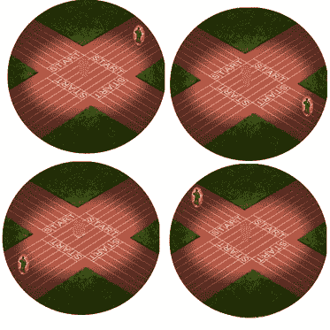
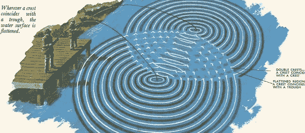

# 许多世界对建造一台功能强大的计算机的解释

> 原文：<https://medium.com/analytics-vidhya/many-world-interpretation-towards-building-a-powerful-computer-35c517042360?source=collection_archive---------9----------------------->

今天的博客是关于下一代计算机的，它被定义为非常强大，能够在几秒钟内解决复杂的问题(如破解密码)，这是目前的超级计算机无法做到的。我不确定这有多真实，但是让我们通过理解和认识来看看。

在这篇文章中，我们将更多地关注计算机的物理本质，并理解量子物理学与它有什么关系，它将是无限计算能力的源泉。量子物理学本身非常神秘，我们只知道像电子和光子这样的亚原子水平上的怪异行为。

# 一个例子

让我们举一个问题的例子，一个人站在一个路口，必须决定一条路径到达他的目的地，只有一条路径是正确的，其余 3 条都是死胡同。

在经典计算机中，我们将通过遍历每条路径来求解，如果发现一个死胡同，则返回开始，然后选择另一条路径，在这种情况下，最多需要 4 次尝试才能找到正确的路径。但是有了量子计算机，只需一次尝试就能找到正确的路径。即使我们通过制作数千条穿过该交叉点的路径使问题变得复杂，我们仍然可以在一次拍摄中找到正确的路径，当然，它不限于这个数量。

为了更好地解释它是如何工作的，我将不得不介绍一下量子物理学的三个基本原理，这是建造量子计算机的最低理论要求:

# 状态连续体

状态可以被定义为空间和时间中任何物理对象/实体的特定属性。开关可以处于两种状态之一:开或关。抛硬币给你两种状态之一:正面或反面。

在上面的例子中，一个人在四路交汇处，当他穿越时空时，他的状态会从 0 -> 1 或 1 -> 0 -> 2 或 2 -> 0 -> 3 等等。这通常是经典物理学的普遍现象，而在量子世界中，开关可以处于开和关两种状态，抛硬币将导致头和尾，试图找到正确路径的人将无处不在。

这个术语更经常被称为“**叠加**”。

在经典计算机中，这样的状态是用一个比特(0 或 1)来定义的。因此，1 位可以保存 2 种状态中的一种，2 位可以保存 4 种状态(00，01，10，11)中的一种。在量子计算机的情况下，使用量子位(量子位),其中 1 个量子位可以同时保存 2 个状态(0 和 1 ), 2 个量子位可以同时保存所有 4 个状态。

很奇怪的现象，对吧，这意味着我可以同时在工作、家庭和开车，但实际上为什么我不能同时体验所有这些，而只能在工作、家庭或开车的时候？如果我掷硬币，为什么我没有同时看到头和尾？我想这是我们作为物理存在的局限性，我们可以在任何时候看到一件事情或事件。

# 随机性

带着上面的问题，我们来试着看看随机的真正含义是什么。

在抛硬币的事件中，你把它扔出去，看到它的价值，它的头在你的箱子里。这是你看到的看似随机的值，但它不是真正的随机。如果你想预测抛硬币是正面还是反面，你可以试着足够精确地测量所有的初始参数，比如硬币本身的位置、你的身体、房间里的空气等等。但实际上，我们真的不知道是什么导致结果是头还是尾，看起来是真正随机的。

这是否意味着随机性是某种信息的缺乏？有些事情对我们来说似乎是随机的，但我们相信如果我们有更多的信息，那么我们肯定可以预测结果。当无法利用所有可用信息预测结果时，很难想象真正的随机性。

现在想象这个例子中的人是你，并且在寻找正确的道路，我们有四个相同的宇宙发生这个事件。在第一个例子中，你从 0 点移动到 1 点，走上一条路，到达了死胡同。而在第二个宇宙中，你采取了较低的方式来点 3)，并击中了死胡同，以此类推，为其余的两条路径。现在，最重要的部分，因为这些宇宙在实验开始时是完全相同的，有四个相同的你在那里观察结果。这是否意味着你真的选择了一条随机的道路，而实际上你选择了所有四条道路，但发生在不同的宇宙？

根本没有随机性，但是对你来说，主观上，结果看起来是随机的。因为你不可能同时出现在所有地方。你观察到随机的结果，但对不同的你是不同的。我并不是试图说服你接受这幅不同宇宙的图片。但是从数学上来说，电子在自己领域的行为就是这样的。在量子力学中，没有电子、光子或任何其他小粒子的轨迹。我们可以探测并确定电子离开和到达的点，但是我们几乎不能说其间发生了什么。

随机性的真正含义为并行计算能力提供了巨大的潜力。这只是把一个问题抛向空中，我们知道现在有多种可能的结果，我们只需要知道如何解释，给我们所有可能的结果。

# 干扰

如果我们承认一个事件的这些不同的可能性可以在计算机的某个地方实现，那么下一个自然的问题是，我们如何能看到所有的结果？

“德国哲学家伊曼纽尔·康德指出，空间的概念对我们的大脑来说是迫在眉睫的，而不是对现实世界本身来说，现实世界本身可能是非常不同的东西。”

“阿尔伯特·爱因斯坦曾经写道:像我们这样相信物理学的人知道，过去、现在和未来之间的区别只是一种顽固不化的幻觉。换句话说，他说，时间是一种幻觉。自那以后，许多物理学家都认同这一观点，即真正的现实是永恒的

美国物理学家休·艾弗雷特三世在 1957 年提出了多元宇宙的新概念，多元宇宙可能是无穷多个宇宙的叠加，在某种意义上它们是平行的

t0 时刻所有 4 个宇宙的状态

时间 t1 后所有 4 个宇宙的状态

我们可以想象在时间之初，所有这些宇宙都是一样的。但是随着时间的推移，随机事件发生，根据这些随机事件的结果将这些宇宙分成不同的类型。当我们观察到一些随机事件时，我们在不同宇宙中的先前相同的副本开始不同，这些不同的副本从现在起可以不同地行动。我们不能相互交流，因为我们在不同的宇宙中。因此，在这个多元宇宙中有如此多的可用计算能力，我们无法使用它，因为我们没有办法收集这种分布式计算的结果，对吗？好吧，幸运的是，有时我们可以移动它，这可以通过干涉的过程来实现。

干涉不是测量的行为，因为测量把可能性压缩成一个现实。简单来说，当你抛硬币并把它握在手中时，这种状态被称为超级位置，在这种状态下，你有能力想象两个宇宙的不同结果。打开手掌看到结果的行为把可能的结果折叠成一种状态。有一个科学术语叫“波函数坍缩”。

这意味着量子计算机不会试图看到结果，而是使用干涉来收集来自不同宇宙的所有结果。什么是干扰，我们如何想象？下图是一个很好的干涉例子，当两个波相互碰撞时，会产生一组不同振幅的波。如果两个波具有相同的频率，则碰撞导致相长干涉，如果它们不同，则导致相消干涉。在任何一点上，干涉都给了我们一个想法来计算两个波在碰撞前的状态。

现在，海浪和我们有什么关系？好吧，如果我们看到物质宇宙的结构，它们是由原子组成的。进一步分裂原子会产生亚原子粒子，如电子、光子等，在某个点上进一步分裂粒子，人们相信我们是由某种电磁波组成的。这些波携带的信息基本上构成了物质世界。这可以想象为类似于我们周围的无线电波，它携带电视、调频、新闻、移动通信等信息，但该设备是用该射频调谐并将信息解码为有意义的东西，如视觉或歌曲。

如果你想象所有这些无限平行的宇宙都在我们周围的同一个地方，并且以不同的频率振动，那么这些电磁波之间的干涉我们可以提取一些东西用于我们的分布式计算。在不同的宇宙中运行不同的计算路径，并使它们相互干扰，那么我们将能够从所有这些分支中收集一些关于结果的信息。这就是量子计算的意义所在。听起来很简单，我们能实现吗？

理论上是的，但实际上我们有一个问题，我想你也已经想到了。假设我们抛硬币，有宇宙 A 和 B，我们会看到不同的结果。事件发生的两个宇宙应该相等意味着 A-B = 0。当掷硬币事件发生并执行干扰来收集结果时，我们应该能够只得到那个掷硬币事件的结果。但在现实中，宇宙真的非常非常大，每秒钟都在发生数十亿次随机事件，这些随机事件的波动会干扰掷硬币事件，给收集的结果增加误差。为了获得期望的结果，有几件事情可以用来减少误差:

*   使计算非常快，以消除环境中另一个随机事件的概率。
*   降低周围环境的温度，这减缓了随机事件，并在读取干扰时给予时间。这就是为什么你会看到量子计算机保持在零下 200 摄氏度。
*   尽可能地隔离计算系统，这可能是最难做到的事情。

我猜研究正在进行中，以找到从多元宇宙中收集结果的最佳和有效的方法。我知道还有很长的路要走，但至少通过这篇文章，我想给出一些基本的理解，这可能会试图打开我们的思维，以一种非常不同的方式思考。用马克·赫尔普林的一句话来结束我的思想，冬天的故事“如果没有什么是随机的，一切都是预先决定的，怎么会有自由意志？答案很简单。没有什么是预先确定的；已经决定了，或者已经决定了，或者将要决定。”

*原载于 2021 年 9 月 5 日*[*【https://www.tech-quantum.com】*](https://www.tech-quantum.com/many-world-interpretation-towards-building-a-powerful-computer)*。*