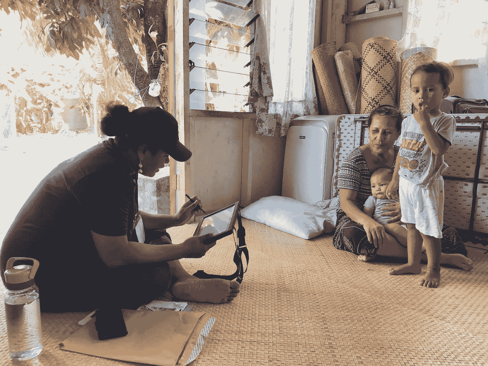
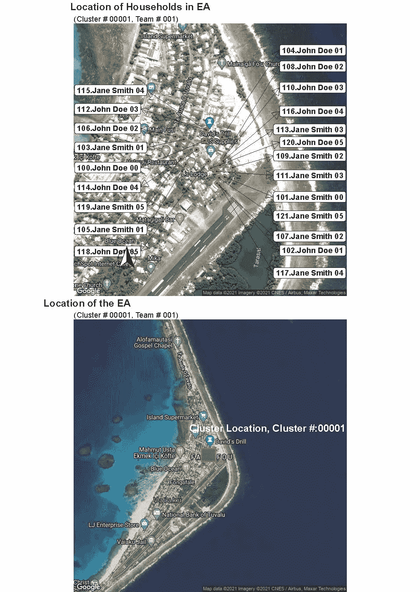

# 用 R 绘制和列出住户调查

> 原文：<https://medium.com/analytics-vidhya/mapping-and-listing-in-household-surveys-with-r-a978b9bf2df7?source=collection_archive---------17----------------------->

家庭调查可能是一项艰巨的任务，因为许多移动数据必须同步才能收集到可靠的数据。这需要大型团队一起完成许多不同的任务。此外，还需要复杂的工具来准备调查。

然而，有时团队会很小，缺少重要的工具，同样的目标是收集高质量的数据。在这种情况下，使用提供的或类似的 R script 可以方便地处理列表和制图等问题，即使没有先进的 GIS 工具，如 ArchGIS 或所选样本区域的高清图片。

在住户调查(或一般调查)的 A、B、c 中，应使访问者能够容易地在实地调查工作中识别出要访问的选定住户样本中的住户。



CAPI 实地数据收集，插图

通常会编制被选中进行调查的住户名单，并交给负责用编制好的调查问卷访问住户成员的统计员。此外，为了便于识别住户，清单应包括户主的姓名、所选住户的实际地址(包括邮政编码、城市名称、街道地址和号码等)，以及住户所在地区的地图，最好是关于如何到达住户居住的每个实际住所的简短说明。

列表信息通常是通过列表工作准备的，包括若干列表员(普查员)和绘图员小组访问调查所选地区的所有家庭

如前所述，统计局通常有非常复杂和精确的地理数据用于实地调查。以及以用户友好的方式绘制数据的工具，使现场团队的列表工作更加容易。

被选作调查样本的住户的地理标记数据(坐标信息)对正在进行调查的统计员来说是非常有用的信息。

但是，如果数据无法在高清屏幕上绘制。地图或使用许可软件，R 和以下脚本可能有助于提供所需质量的所需地图，以推进实地工作数据收集的地图绘制和列表工作。在与 small stats office 的合作中，我们遇到了这个挑战。

为了让团队做好野外工作数据收集的准备，我们准备了 r。

首先，这是用于创建映射文件的库的列表。请注意，其中一些我是在没有严格审查每个包的附加值的情况下离开的。但总的来说，它们将有助于为拟议的测绘工作创造一个更好的外观。

```
 library(ggplot2)
  library(ggmap)
  library(rgdal)
  library(ggrepel)
  library(cowplot)
  library(rgdal)
  library(ggspatial)
  library(ggpubr)
  library(ggsn)
```

出于隐私和伦理方面的考虑，本例中使用的数据已被匿名化(户主姓名已被替换为通用名)，而 lon 和 lat 值已被修改为一个通用值。

Dropbox 上提供了本练习使用根据所述原则生成虚拟值文件，可以使用以下函数访问该文件。代码片段中的以下行以允许使用列表数据集中的常用术语的方式命名列。

```
tr <- read.csv("[https://www.dropbox.com/s/i72ntsiba8h7jnr/hh_sample.csv](https://www.dropbox.com/s/i72ntsiba8h7jnr/hh_sample.csv)", comment.char="#")colnames(tr)<-c("Team", "Day", "HH", "Cluster Number", "Household Number", "EA code", "hh_id", "hhsize", "island", "island code", "village", "village code", "EA code4", "occupancy", "dwelling type", "name", "family name", "domain", "domain5", "LAT", "LON", "HH_Head")
```

在使用 ggmap 包中的 google maps 之前，确保你有与 R Studio 连接的 google 服务的 API 密匙(关于如何做，请阅读这里的)。

对于这个例子，实际上只使用了几列——户主姓名、纬度和经度数据。为了格式化数据帧中选定的列，我使用了这部分代码

```
df <- NULL
  df$HH<-tr$HH
  df$HH_Head <- tr$HH_Head
  df$lat<- tr$LAT
  df$lon<- tr$LON
  df<-as.data.frame(df)
  df$HH_Head1<-paste(df$HH,df$HH_Head, sep=".")
 df <- na.omit(object = df)
```

现在有趣的部分——在地图上标出纬度和经度。为此，你应该在 Google 上设置一个 API 键，并在 r。

对于映射本身，我使用 ggmap 包中的一个标准 get_map 函数，并将创建两个具有类似功能的映射。

```
sample.mapea <- get_map(location = c(lon = mean(df$lon), lat = mean(df$lat)), zoom = 17, source = "google" , maptype = "hybrid", scale = 1)
```

在这张基本地图上，现在添加了将要绘制出来的每户人家的标签。这些标签代表根据清单数据集中的现有数据占据实际住所的户主姓名。由于可以从一个查点区域中选择 20 个以上的家庭，所以显示标签是分开的，因此使用平均值，标签的光环将绘制在地图的左侧，而另一半将在右侧。

此外，无论标注将绘制在哪一边，标注都需要放置为不重叠，因此 geom _ label _ repel 用于分布标注，以便平均分布标注。

```
geom_point(data = df, aes(x = lon, y = lat, color= "white"), color="red", fill= "black", stroke = 1.5, shape = 21, alpha=0.9)+

  geom_label_repel(data = subset(df, df$lon>=mean(df$lon)),
                  aes(x = lon, y = lat, label = HH_Head1), 
                  fontface = "bold",

                  nudge_x = 0.02,

                  direction = "y",
                  box.padding = unit(0.081, 'lines'),
                  hjust = 1,

                  segment.size = 0.1,

                  arrow = arrow(length = unit(0.03, "npc"), type = "closed", ends = "first"),force=5) +

    geom_label_repel(data = subset(df, df$lon<mean(df$lon)),
                     aes(x = lon, y = lat, label = HH_Head1), 
                     fontface = "bold",

                     nudge_x = -0.7,

                     direction = "y",
                     box.padding = unit(0.081, 'lines'),
                     hjust = 0,

                     segment.size = 0.1,

                     arrow = arrow(length = unit(0.03, "npc"), type = "closed", ends = "first"),force=5) +
```

最后，我还在这张地图上添加了一个指南针箭头，这样采访者或团队主管就可以很容易地在现场确定方向。这只是对地图的额外美化。

这里还为第一张地图添加了一个通用的标题。

```
scale_fill_viridis_c(trans = "sqrt", alpha = .9)+annotation_north_arrow(location = "bl", which_north = "true", 
                           pad_x = unit(0.75, "in"), pad_y = unit(0.5, "in"),
                           style = north_arrow_fancy_orienteering) +ggtitle("", subtitle = "(Cluster # 00001, Team # 001)")+

    theme_void() + 

    theme(legend.position="none")
```

第二张地图也需要一个标题:

```
ggarrange(sample.mapea, sample.mapea_small + rremove("x.text"), 
             labels = c("Location of Households in EA", "Location of the EA"),

             ncol = 1, nrow = 2,align = "v")
```

最后，我创建了一个 A4 大小的 PDF 文件，其中绘制了两张地图，便于现场采访者使用:

```
ggsave(filename = "Cluster_map_sample.pdf", plot = last_plot(), device = NULL, path = NULL,
          width = 8.3, height = 11.7,
          dpi = "retina", limitsize = TRUE)
```

最终产品看起来会像这样:



希望这将有助于你的测绘工作。

策划吧！