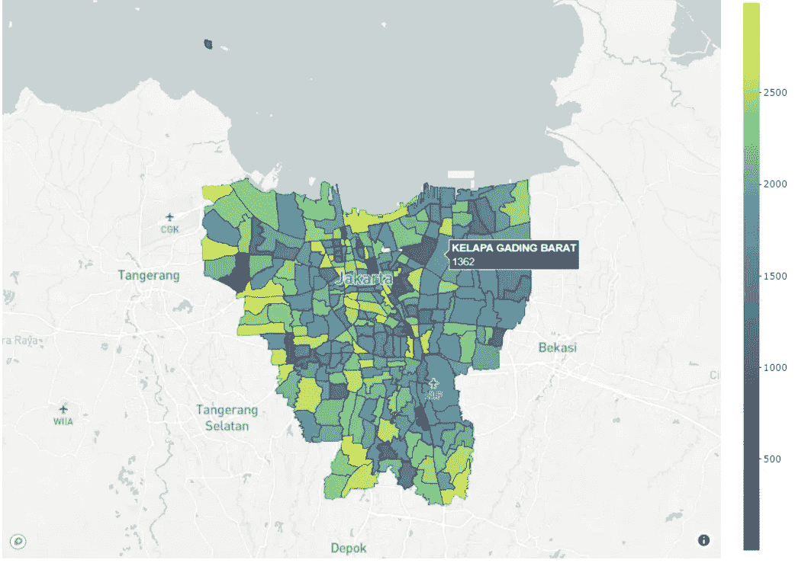
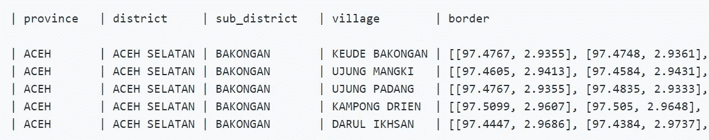
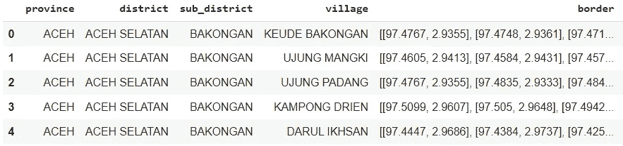
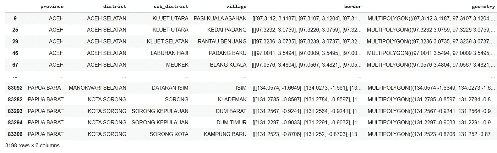
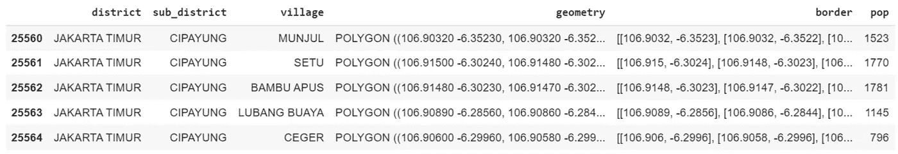
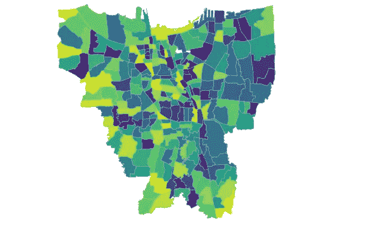
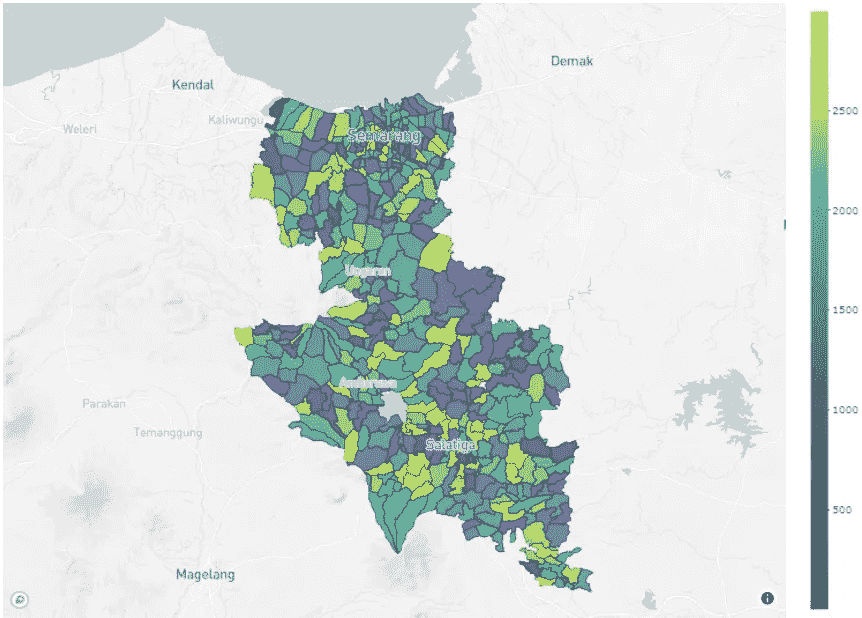

# 用 Plotly 绘制印度尼西亚的村庄边界:将经度坐标转换为 Shapefile 格式

> 原文：<https://medium.com/analytics-vidhya/mapping-indonesias-village-border-with-plotly-from-long-lat-coordinates-to-wkt-strings-975fd002326e?source=collection_archive---------4----------------------->

## 探索和想象(几乎)印度尼西亚的任何地方

DKI 雅加达地图(图片由作者提供)

绘制非美国位置的地理空间信息带来了许多挑战，从数据可用性到数据预处理的繁重工作。例如，并不总是能保证矢量的格式美观，即使如此，粒度也可能不够。

对于像印度尼西亚这样幅员辽阔的国家来说，能够进行大规模的空间分析对学术和专业工作都有巨大的好处。所以，当我碰到这个 [GitHub](https://github.com/pararawendy/border-desa-indonesia-geojson) 村级 GeoJSON 粒度的回购(取自 [Duscapil](https://gis.dukcapil.kemendagri.go.id/arcgis/home/) )时，我的第一反应是[叉一下。](https://github.com/taufiqbashori/border-desa-indonesia-geojson)

我的目标很简单:努力使**为绘图和空间分析做好准备，供任何人使用**。寻找可靠的印度尼西亚空间数据参考用于分析对我来说是一个挑战，我相信你们中的一些人可能也有类似的困扰。

话虽如此，本文主要关注 Geopandas 和 [Plotly](https://github.com/plotly/plotly.py) 库，并且方法论受到 Kerry Halupka 的这篇 [TDS 文章的极大启发。](https://towardsdatascience.com/how-to-create-maps-in-plotly-with-non-us-locations-ca974c3bc997)

# 步骤 Google Colab 中的数据提取、加载和转换

**首先:从 Github Repo 中检索数据帧**

这一步应该相当简单。对于原始数据集，在 Github repo 中，所有者已经给出了相当简单的解析方法(参见这里的)。考虑到文件大小，如果你想重新创建这个过程，我建议你在本地笔记本上创建。以这种方式提取数据也很方便，因为这允许我们在本地将其转换为 csv，然后可以上传到数据库，如 BigQuery。

原始数据框的预览如下:

作者图片(来自 Github Repo)

一旦我们有了数据框架，就该把它转换成 [WKT 弦](https://developer.here.com/blog/what-is-a-wkt-file-and-how-to-create-one)几何图形了。尽管我们可以在本地完成这个过程，但 Google Colab 在可移植性方面做得更好(并且更便于分发)，所以为了设置它，我将当时转换成 csv 格式的数据帧文件上传到 google drive，并将其加载到 Colab 环境中。下面是需要的一些过程。

**在 Google Colab 中导入必要的库**

下面列出了我们将使用的库。首先导入它们以正确设置 colab 环境。

**从 Google Drive 加载数据帧**

由于我已经将数据框放在 Google Drive 中，下一步是将源文件挂载到 Drive 并指定路径。在这种情况下，我的数据框的 csv 文件位于*border-DESA-Indonesia-geo JSON*文件夹内的 *extract-geojson* 文件夹中(在 *Github May 21* 文件夹内 *MyDrive* 内)。在我们指定路径之后，我们可以使用 Panda 的 *read_csv* 来读取文件并将其命名为 df。

然后，我将 df 数据帧复制到 dfx 中，指定我需要的列。用 *dfx.head()* ，如果你得到以下结果，恭喜你！您已成功将数据框加载到 google colab 中。

作者图片

注意:另一种方法是将你的文件存储在 github 中，并将你的驱动器连接到 github 文件夹，但这不在本文讨论范围之内。

**将长 Lat 的边框变换成匀称的 WKT**

我们将向数据框添加一个名为“geometry”的列，并使用 border 列上的信息创建一个多边形或多多边形，该多边形可作为几何转换为 wkt 字符串。

第一步是创建一个字典，然后存储来自变换后的边界列的更新后的面/多面值。您可以从数据集中选择任何列，但是在本例中，我使用 border column 作为初始字典。枚举的使用确保了我们拥有与数据帧索引相似的值。

第二步是迭代边界坐标列表值，并以类似于 WKT 字符串多边形或多重多边形格式的方式对其进行变换。请注意，多重多边形通常是一组多边形，可以通过边界坐标开头的三重括号“[[”来标识。您可能希望研究这些数据，找出更多细微的差异。

经过几次迭代后，以下语法可以识别多边形和多重多边形，同时替换每个“border”列中的不规则字符(如多余的逗号或括号)。

第三步是通过根据最新更新的 border_dict 字典映射数据框索引来创建列“geometry”。不要忘记检查 Multipolygon，以确认 for 循环 if 逻辑是否按预期工作。

如果结果如下，那么恭喜你！您已经加载了 WKT 字符串，离拥有覆盖(几乎)整个印度尼西亚的 shapely 空间数据参考又近了一步。

作者图片

**错误处理:如何知道你的几何图形是有效的**

因此，您已经生成了几何值，并希望将数据存储在某个地方，可能在您的 BigQuery 数据集中。但是你怎么知道所有的几何都是有效的呢？

为了避免需要返回数据预处理的麻烦，我们可以遍历几何图形并检查是否出现了任何错误。

如果上面的代码没有产生任何错误信息，那么你可以肯定几何图形的工作！

注意:您还可以将 None 更改为任何值或字符串，以便更方便地搜索错误值(如果有)。

**可选:下载您更新的数据框**

此可选步骤适用于希望下载数据框的用户。由于我们使用的是 colab，这可以通过*文件下载*来完成。

# 第二步:可视化地图！

**选择想要的区域**

首先，让我们选择在印度尼西亚的哪个地区，我们想突出更多。例如，假设我们想要突出显示印度尼西亚首都 DKI 雅加达。您可以看到下面的代码示例。

在这里，我还生成了一个随机整数，只是为了说明用例(它们可以用于颜色代码)。在实际情况中，随机整数可以用你感兴趣的值/指标来代替，例如人口、家庭、收入等。此外，不要忘记预先将*几何列*转换为 *WKT 几何序列*，以便列数据类型被识别为*几何列*。

下面是将 pop 添加为列后它是如何转换的:

作者图片

注意:如果你想可视化印度尼西亚的所有村庄，应该没问题，但由于其规模，你可能无法在 google colab 上做到这一点。

**可选:在 GeoPandas 中将其可视化**

在 GeoPandas 中将其可视化比在 Plotly 中简单得多。这个可选步骤是快速检查您尝试可视化的地图。使用 pop 随机数作为颜色代码，您可以运行以下代码:

如果您正在运行代码，并且结果如下所示，那么您已经成功地创建了 GeoPandas 地图！

DKI 雅加达地图(图片由作者提供)

注意:注意在 DKI 雅加达的中北部有一个轻微的白色矢量缺失。这可能表明原始数据集实际上不包含该区域的地理信息。修复白色区域超出了本文的范围，但是考虑到它的小尺寸，这应该不是什么大问题。

将它形象化

最后，这是在 Plotly 中可视化它的步骤。请注意，在继续之前，您将需要访问令牌。只需注册(免费)Mapbox 帐户，并在那里生成您的密钥。这里还有一个简短的教程。

一旦你有了钥匙，复制粘贴到 MAPBOX_ACCESSTOKEN，不要忘记指定你的中心开始坐标。同样，由于 Plotly 将输入作为 geoJSON，您应该从您的数据框中创建一个，在本例中，我将其命名为 *x_json* 。

最后，一旦你运行代码，你应该得到一个漂亮的地图，就像这样。

DKI 雅加达地图(图片由作者提供)

现在，您只需更改您的位置过滤器，就可以使用您的地图探索印度尼西亚了！例如，这里有一个给三宝垄的。

三宝垄 via Plotly(图片由作者提供)

探索愉快！但是，请注意，并非所有区域都已正确绘制，例如，对于玛琅和泗水，我仍然可以找到一些缺失区域和不正确定义的经度坐标，因此请谨慎操作:)

那么你觉得数据集怎么样？你能想到地图的真实使用案例吗？请随意分享你的想法。

注:笔记本完整版可以在[这里](https://github.com/taufiqbashori/plotly_indonesia_village)下载。此外，添加的数据框(带几何图形)的 csv 文件也可从[这里](https://drive.google.com/drive/u/1/folders/1NDcU0_yY-ZH-IGcJqqwsvI3z6Ia7bhMN)下载。