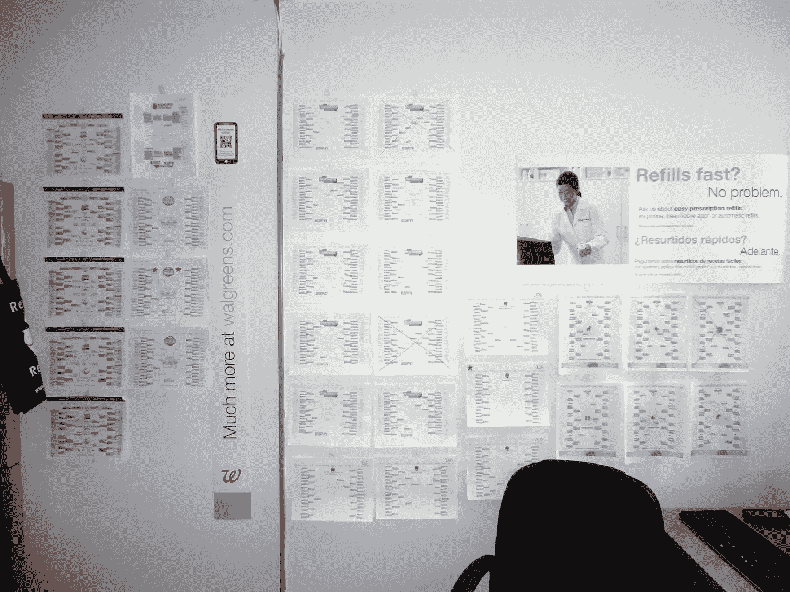

# 2021 年疯狂三月:模拟支架，第 1 部分

> 原文：<https://medium.com/analytics-vidhya/march-madness-2021-simulating-a-bracket-part-1-7aa1cad69a65?source=collection_archive---------12----------------------->

这是三月疯狂赛季…COVID 扰乱了去年的比赛，但今年我们全速前进！

在这篇第一部分的文章中，我将给出一些背景知识，并概述一些我在构建它时必须克服的挑战。稍后，在第 2 部分中，我们将了解更多技术内容，我将提供一些数学/代码演练，在第 3 部分中，我们将讨论存储挑战…甚至可能是一些前端内容！？

# 背景

我真的一点都不关心大学篮球，直到我和母校的球队康涅狄格哈士奇队结缘。在我读大学的 3.5 年里，我们两次赢得了男子全国冠军(2011 年和 2014 年)…甚至不要让我开始谈论女队有多占优势。

我第一次全力以赴试图构建完美的支架是在 2013 年…这是我那年的一张照片(这给了宿舍里的其他人一些话题！):

我也是沃尔格林的兼职员工……我从来没有浪费过旧的标牌。

我还有过去几年的旧 Excel 模型！最初是一个简单的“直觉检验”模型(根据比赛选择一个 80-20 的获胜概率，并用一个均匀的随机数击中它)，最终演变成一个基于优秀的 kenpom.com[的统计数据的人造公式。](https://kenpom.com)

今年，**我想采取下一步措施，真正尝试将每场比赛建模为一个独立的模拟实体，并为两支球队提供完整的分数。**体育和电子竞技的部分魅力在于，无论进入比赛的两支队伍的相对实力如何，疯狂和不可思议的事情可能会发生！(我身后的电视上有大东方锦标赛，到目前为止，6 场比赛中有 5 场是冷门...典型的例子。)我想以某种方式在我的模型中捕捉一些魔力，我认为最好的方法是使用某种形式的蒙特卡洛模拟。有了足够多的模拟，一个好的模型应该收敛于中间值的有利结果，但也可能有一些疯狂的世界，其中失败者在井喷中获胜！

# 目标

让我们概述一下这个项目的一些目标:

*   **我想用 Python 写代码，这样我就可以在我目前位于**[**tarpey.dev/autobracket**](https://tarpey.dev/autobracket)**的网站上轻松实现这个新模型。这是两年前该模型的最后一个网络版本。(我正在更新网站的前端和后端，所以几天后回来看看最终的应用程序——它看起来会有很大不同！)**
*   我想创建一个足够真实的模型，足以模拟真实的篮球比赛。例如，我已经将模拟的目标定在接近平均值的某个地方。根据 kenpom.com 的[的节奏，你预计比赛中两支球队的控球次数。我同意许多篮球迷的观点，这是篮球比赛中非常重要的衡量标准。](https://kenpom.com)
*   **我想在额外的复杂性可能不会真正对结果产生影响的地方做出简化的假设。**罚球就是一个很好的例子。我还没有对每个罚球进行精确建模。(它们目前被单独建模为成功或失败，但在真正的篮球比赛中，如果是最后一次罚球，你可能会把自己错过的罚球拿回来**。这个模型中的简化假设是，在罚球发生后，球总是转到另一队。)**
*   **我想让真实的盒子分数“脱离”模型。**我在这里采用的方法是将模型构建为逐个所有权的模拟。这里的关键假设是决定哪 10 名球员(每队 5 名)目前在任何给定的控球时间内比赛。该模型在随机抽取 10 名球员时，使用了每个球员在本赛季的球队上场时间分布(例如，如果你本赛季的上场时间是你队友的两倍，那么我的模型在任何给定的控球时间内都有两倍的可能让你上场)。每一次新的占有，10 名球员被重新取样！
*   我需要能够运行一系列模拟。蒙特卡罗的强大之处在于，它的样本规模足够大，以至于你拥有可操作的模拟数据(在精算界，这对于衡量风险尤其有价值，例如，“在最糟糕的 5%的可能结果中，我们损失了多少钱”)。

如果你想了解更多关于模拟篮球比赛的内容，下面这篇文章给了我一些早期的灵感！(感谢奥卢瓦托波波奥拉。)

 [## NBA2K(大概)如何模拟一场篮球赛

### 篮球比赛是如何被秘密编写的。

medium.com](/swlh/how-nba2k-probably-simulates-a-basketball-game-553979d51049) 

# 初始原型

最初在构建概念时，我为每个模拟使用了一个熊猫数据帧(代表游戏的最终得分)。这对我来说是一次很好的学习经历，因为我最终遇到了无法运行我想要的那么多模拟的限制。

每个单独的熊猫数据帧模拟最初在大约 10 秒内运行。在你考虑最终目标需要什么之前，这看起来并不坏:

*   我们希望在 NCAA 锦标赛的每场比赛中进行 1000 次模拟
*   68 支球队将参加锦标赛，根据每场比赛的进展情况，他们中的任何一支都可以在锦标赛的特定阶段与任何其他球队比赛，这意味着在我们开始制作括号之前，我们需要模拟(67 + 66 + 65 + … + 2 + 1) = **2，278 场不同的比赛**
*   1,000 x 2,278 就是 2278000 次模拟… x 10 秒= **大约 263 天的模拟！**

我们没那么多时间！我想在周日晚上括号出来后开始我的模拟选择，并在周一与世界分享一个工作网页来制作括号。

重写是有序的…幸运的是，我刚刚听了一集 Python Bites 播客，名为[NumPy 的可视化介绍](https://pythonbytes.fm/episodes/show/215/a-visual-introduction-to-numpy)。它链接到 Jay Alammar 的这篇令人惊叹的文章，这篇文章激励我尝试转换模拟程序。**也许我们不需要并行操作多个 10 行的数据帧，而只需要一个大约 10，000 行的大规模数据帧(10 个玩家 x 1，000 个并发游戏)。诀窍是将每个必要的变量(想一想游戏时钟，谁控球，所有不同的随机数发生器决定一个成功的篮板/投篮/抢断/助攻等等……你明白了)从一个标量值转换成一个 NumPy 数组。**

我们真的能处理好这一切吗？它会给我们带来我们需要的性能提升吗？**(剧透:两个答案都是肯定的！)**

在第 2 部分中，我将讲述我是如何开始用数组而不仅仅是数据帧来思考的，这使得性能提升了大约 30 倍！我还将详细介绍每件物品的工作原理(背后的代码和数学)。

 [## 2021 年疯狂三月:模拟支架，第 2 部分

### 欢迎来到第 2 部分！如果您错过了第 1 部分，请查看下面的故事，了解我们在这里所做的一些背景知识:

miketarpey.medium.com](https://miketarpey.medium.com/march-madness-2021-simulating-a-bracket-part-2-fe8841b1be0b) 

感谢您的阅读——一如既往，欢迎分享您的任何想法或观点，无论是技术方面的还是其他方面的！