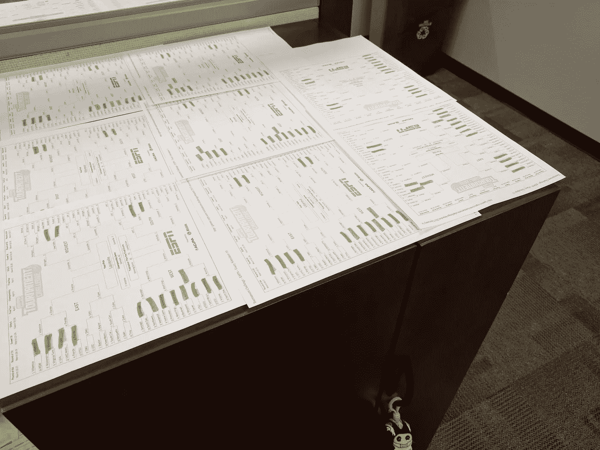

# 2021 年疯狂三月:模拟支架，第 2 部分

> 原文：<https://medium.com/analytics-vidhya/march-madness-2021-simulating-a-bracket-part-2-fe8841b1be0b?source=collection_archive---------23----------------------->

2017 年 3 月疯狂期间办公室里到处都是支架。

欢迎来到第 2 部分！如果您错过了第 1 部分，请查看下面的故事，了解我们在这里所做的一些背景知识:

 [## 2021 年疯狂三月:模拟支架，第 1 部分

### 在实际工作和这个项目工作之间的最后几周，我一直很安静…我很兴奋终于…

medium.com](/analytics-vidhya/march-madness-2021-simulating-a-bracket-part-1-7aa1cad69a65) 

在这篇文章中，我们将得到更多的技术。我将解释我是如何使用数组、指数分布和大量随机数实现今年的模型的…

# 模型流程

一场篮球赛由一串“所有物”组成。作为一个团队，你要么处于两个世界之一:

*   你没有球。这意味着你要试着通过**偷**球，迫使**失误**，或者**阻挡**射门来得到球。你也要尽量不要犯下会给对方罚球的**犯规**。
*   你有球。这意味着你要努力避免上述所有结果，然后**投篮**(希望**投篮成功！**)。如果你成功了，有可能你的队友**会协助**投篮。如果你投篮不中，比赛将有可能进入**反弹局面。**

这两个项目符号很好地描述了模型的核心！我们简单地循环这些可能性，一次一个球，模拟结果并更新数据，直到比赛结束。当然，任何熟悉篮球的人都会意识到我在这里遗漏了一些细微差别，这是故意的。像由进攻造成的犯规或界外比赛这样的事情并没有被精确地建模，因为它们属于我们在第 1 部分中谈到的“复杂且不一定有价值”的范畴。(我们也没有那么精细的数据，所以无论如何都很难建模！)

我们还没有真正谈到的一个问题是，在一场篮球比赛中，每次控球时间有多长。你可以想象这个数字会有很大的变化，但是我们知道一次控球的最长时间是 30 秒(计时表上的时间长度)。由于在 kenpom.com 的统计，我们也知道了本赛季每支球队比赛的快慢。举个例子:

*   康涅狄格州今年迄今的 AdjT 统计数据为 66.1，佐治亚州为 73.6。因此，如果这两支球队今年打一场比赛，我们预计在 40 分钟的比赛中会有 139.7(约 140)次控球。
*   一个 40 分钟的游戏是 2400 秒…2400/140 告诉我们，我们在模型中的平均拥有时间应该是大约 **17 秒。**
*   为了给这个数字引入一些波动性，我选择使用标准差= 4 的正态分布。正态分布的特性告诉我们，使用这些参数随机生成的触发时钟几乎 100%的时间都在 5 到 29 秒之间。这对我来说似乎足够好了(尽管将来肯定有机会围绕所有权长度的分布做更多的科学研究)。
*   如果你访问 GitHub 上的[代码，你会注意到我实际上最终将**设置为 15 秒**的平均值。在早期的模拟运行中，我注意到 17 秒结束时我得到的控球次数比我期望的要少…我最终意识到**这是因为控球只有在球传到另一队时才算！**举个例子，一个队可能会用掉 30 秒，错过一个镜头，找回他们自己错过的镜头，然后用掉更多的时间。我们的 17 秒计算假设球总是在 17 秒结束时易手。为了不使分布过于复杂，我只是将平均值向左移动了一点，以补偿这些额外的长度。](https://github.com/AnnuityDew/api-tarpeydev/blob/master/src/api/autobracket.py)

# 选择玩家

我们模型的“大本营”是一个数据帧，我们称之为“matchup_df”。在这里，我们将能够使用我最喜欢的熊猫功能之一 pd 来跟踪每场比赛中每个球员的模拟数据。DataFrame.update()。

对于每次控球，我们需要选择 10 名球员(每队 5 名)来完成我上面描述的所有可能的场景。一旦我们做到了这一点，我们就可以使用我们可靠的 update 语句来记录每个玩家在游戏中花费的时间:

“更新”语句允许我们随时更新我们“主场”matchup_df 中的相关模拟统计数据！熊猫文献对此做了最好的描述:

> 数据帧的长度不会因为更新而增加，只会更新匹配索引/列标签处的值。

# 指数分布

我想使用每个球员的赛季总统计数据来得出一个“比率参数”,以显示他们得分、抢篮板、抢断等的频率。这个想法非常符合[指数分布](https://online.stat.psu.edu/stat414/lesson/15/15.1)的特性……我们可以简单地查看(玩的秒数/选择你的统计数据)来得出玩家做那件特定事情所花费的平均时间。然后，我们可以将其与他们刚刚在我们的模拟中在地板上花费的时间进行比较，以计算给定事件将在该占有中发生的概率！

上面的代码快照最终成为我需要建模的几乎所有统计数据的一个很好的模板。其他一些属性的逻辑在某些重要的情况下有一些额外的细微差别(例如，射击逻辑有额外的代码来决定一个 2pt。或者 3pt。已拍摄)。

这个模型最近增加的内容(比如，今天早上)是上面第 40 行中的“相对实力”的概念。我得到了非常扭曲的比赛结果，在这种情况下，一个整年都在打弱赛程(低级别球队)并产生非常漂亮的统计数据的球队一直在击败一个整年都在打强赛程(高级别球队)的球队，但他们的统计数据并不那么耀眼(可能是因为他们的比赛相对更难！).幸运的是，Kenpom 对所有事情都有一个统计…我们可以简单地比较两个队之间的赛程强度，并对每个赛事的随机数生成器进行适当的调整。我仍然在这个页面上工作，但是你可以在下面的链接中看到这个“相对强度”调整的例子。

 [## 细流

### 汽车球拍

lit-auto Bragg . tarpey . dev](https://lit-autobracket.tarpey.dev/) 

# 那么，现在一切都是数组了吗？

差不多吧！在上面的代码示例中，“possession_length”是一个镜头时钟数组，每个游戏一个。(“sample_size”是确定同时模拟多少游戏的变量，即每个数组需要多长)。还有一个大型的“跟踪”数组，用于保存每个游戏的状态数据(基本上是一堆 1 和 0，根据需要可以切换开/关):

对于我在第 1 部分中描述的原型，所有这些变量都是简单的标量值！通过将它们扩展为数组，数组中的每个值代表一个不同的游戏，我们能够以更具可伸缩性的方式并行操作更多的游戏。

# 下次…

在第 3 部分中，我们将讨论最终输出。我将讨论我在 MongoDB 的免费层中遇到的存储限制，以及我实现的小技巧，以便最终用户仍然可以看到他们模拟范围内每个游戏的完整模拟分数。(我们甚至可能会说 React……虽然还是很丑，但我正在学习。)我会将您链接到最终的网页，您可以在那里生成自己今年的分类！

 [## 2021 年疯狂三月:模拟支架，第 3 部分

### 欢迎学习第 3 部分！如果你错过了第 1 部分和第 2 部分，你可以从这里开始:

miketarpey.medium.com](https://miketarpey.medium.com/march-madness-2021-simulating-a-bracket-part-3-354e2285419c) 

感谢您的阅读——一如既往，欢迎分享您的任何问题、想法或观点，无论是技术方面的还是其他方面的！