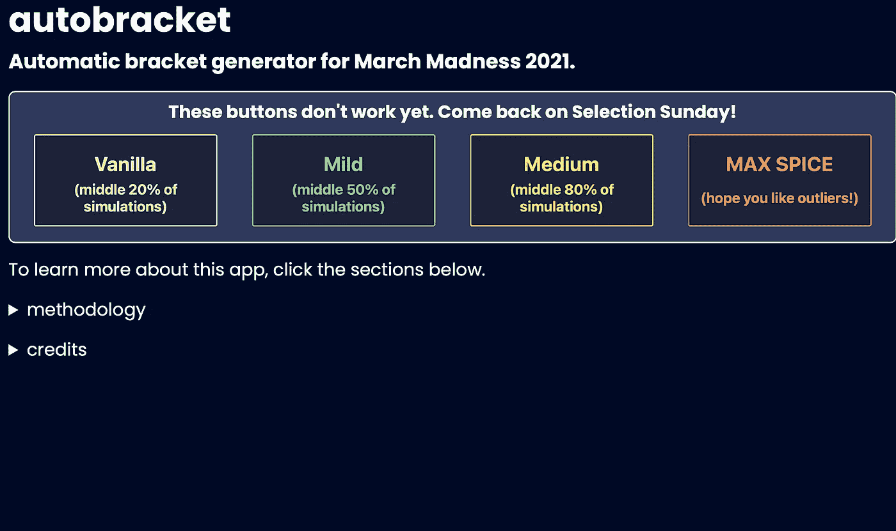

# 2021 年疯狂三月:模拟支架，第 3 部分

> 原文：<https://medium.com/analytics-vidhya/march-madness-2021-simulating-a-bracket-part-3-354e2285419c?source=collection_archive---------22----------------------->

办公室里的括号来自最近的三月疯狂(2019)。

欢迎学习第 3 部分！如果你错过了第 1 部分和第 2 部分，你可以从这里开始:

 [## 2021 年疯狂三月:模拟支架，第 1 部分

### 在实际工作和这个项目工作之间的最后几周，我一直很安静…我很兴奋终于…

medium.com](/analytics-vidhya/march-madness-2021-simulating-a-bracket-part-1-7aa1cad69a65) 

在本系列的最后一集，我将介绍我在 MongoDB 免费层中遇到的存储限制，以及我实现的小技巧，以便最终用户仍然可以看到他们模拟范围内每场游戏的完整模拟分数。

# 如何存储超过 2，000，000 个篮球比赛模拟

在第 1 部分中，我提到我们需要做一点 2M 模拟，为 68 支球队参加的 NCAA 篮球锦标赛中的每一场比赛进行 1000 次测试。可以想象这会占用很多空间！这个项目的原始条件之一是使用我已经在工作的网站 API，位于 api.tarpey.dev，它使用了一个 512MB 存储空间的免费层 MongoDB。

我有一个雄心勃勃的想法，为每个模拟保存每个玩家的个人数据，这样最终用户可以按需查看。但毫无疑问，这最终将我置于需要 10GB 以上存储的世界中 MongoDB Atlas 自由层仅允许 512MB！看起来我不得不放弃个人球员统计的梦想…直到我想出了另一种方法。

今年三月疯狂模式首页截图。

最终用户可以从四种“口味”的支架中进行选择，从**香草**(将在每 1000 个模拟的中间值附近建立一个游戏支架)到 **MAX SPICE** (可以在支架的任何节点选择 1000 个模拟中的任何一个)。我们可以这样做，而不是为每场比赛保存 1000 个模拟的整个池:

*   将足够的模拟保存到数据库中(大约 20 个)，这样我们在每个分位数中至少有一些不同的盒子分数可供选择。
*   在扔掉其他 980 模拟之前，用它们来建立一个发行信息的补充文档。这个文档可以查看 1000 个模拟，并说“如果用户选择轻度，X 队有 35%的机会获胜，Y 队有 65%。”对每种口味和比赛重复以上步骤。
*   这些补充文档还可以保存有资格为每种口味选择的分数范围(例如，如果用户希望看到两个势均力敌的球队 X 对 Y 的温和方框分数，也许我们应该返回一个模拟，其中最终的胜利差额在-3 到+3 分之间……但是如果用户希望看到 X 对 Y 的辛辣方框分数，我们可以使用一个模拟，其中胜利差额在-40 到+40 分之间的任何地方！)

以下是其中一个“补充文档”的示例:

保存所有这些信息后，我们可以:

*   使用“home_win_chance”字段(基于所有 1，000 次模拟)来决定当用户请求一个支架时哪个队在运行时赢得每场比赛
*   使用“margin_top”和“margin_bottom”字段来查询数据库，并为括号中的 67 场比赛中的每场比赛确定有效的盒子分数
*   扔掉其他 980 模拟，省一堆空间！(虽然我很想对全部 1，000 个…或更多…进行更多分析，但我们会把这些留到明年！)

构建一个只接触数据库一次的查询来检索 67 场不同比赛的比分是非常复杂的，但是我不能推荐足够的 [ODMantic](https://art049.github.io/odmantic/) 包来在异步、ODM 的基础上使用 MongoDB 它使事情变得容易得多！[我在之前的文章](https://miketarpey.medium.com/multiple-filter-search-functionality-using-odmantic-fastapi-and-list-unpacking-2f56245233fe)中提到过这样做，我使用了类似的方法来查询用户分类中的所有框分数。完整的代码可以在[我的 GitHub repo](https://github.com/AnnuityDew/api-tarpeydev/blob/master/src/api/autobracket.py) 中找到。

# 最终模型

最后，相对于我们在第 1 部分中的目标，下面是今年的模型是如何结束的:

*   **我想用 Python 写代码，这样我就可以在我目前位于**[**tarpey.dev/autobracket**](https://tarpey.dev/autobracket)**的网站上轻松实现这个新模型。**最终，我将网站的前端和后端分离开来，创造了一个更好的界面。驱动模型的所有 Python 现在都在 [api.tarpey.dev](https://api.tarpey.dev) 中，而 [tarpey.dev](https://tarpey.dev) 中的前端现在正在用 React 和 [Next.js](https://nextjs.org) 进行重建(到目前为止我真的很喜欢它！).
*   我想创建一个足够真实的模型，足以模拟真实的篮球比赛。你可以对此作出判断，但我真的很喜欢目前为止我从括号中得到的结果！它们是预期结果和可能发生的意外的完美结合，所以我认为我们已经很好地把握了三月的魔力。
*   我想在额外的复杂性可能不会对结果产生真正影响的地方做出简化的假设。任务完成(我们留下了明年改进的空间)。
*   我想让现实的盒子分数从模型中“掉出来”。这里唯一让我犹豫的是，一些异常值比我希望的要少一些……明年模型的后续工作将是稍微“缩小”结果的分布。一般来说，我认为“中等”风格(使用分布中中间 80%的模拟)是您使用模型的最佳时机！
*   **我需要能够运行一系列模拟。**任务完成，注意！尽管实现并行运行模拟的 NumPy 数组带来了惊人的性能提升，但我认为我传递数据的方式本可以更高效。(我还没有提到这一点，但我使用 Google Cloud Tasks 对今年所有的模拟进行了排队，并将其发送到 Google Cloud Run 的 API 进行处理……这可能是未来帖子的一个好主题！)

# 那么，我现在可以做一个支架吗？

从 3 月 15 日开始(选择日之后的星期一早上)，您将能够根据我的模型生成有效的支架！只需访问下面的链接，并尽可能多的括号。如果你遇到任何错误或问题，请随时联系我。

 [## 汽车球拍

### 2021 年疯狂三月自动支架发电机。要了解有关此应用程序的更多信息，请单击下面的部分。方法…

tarpey.dev](https://tarpey.dev/autobracket) 

我将收集每个支架的数据，一旦今年的三月疯狂尘埃落定，我希望做一些分析，看看模型的表现如何。敬请关注…

感谢阅读(并检查了我的模型)！一如既往，请随意分享您的想法、问题和建议。