# 市场篮子分析

> 原文：<https://medium.com/analytics-vidhya/market-basket-analysis-127c73f353d7?source=collection_archive---------2----------------------->

## **利用关联数据挖掘和 Apriori 算法**

照片由 [Nathália Rosa](https://unsplash.com/@nathaliarosa?utm_source=medium&utm_medium=referral) 在 [Unsplash](https://unsplash.com?utm_source=medium&utm_medium=referral) 上拍摄

在这个 21 世纪，网上购物在人们中间变得非常普遍，很难找到一个没有接触过或听说过的人。由于电子商务平台的快速发展，从汽车到牛粪，几乎所有东西都可以在网上找到并购买。我们消费者是这些电子商务平台的过度用户，承认这样一个事实并不奇怪，我们通常最终会购买比我们计划的更多的东西，或者我们至少会浏览一下那些似乎是我们购物车中已经有的东西的完美附加物。没错，我们说的是名为*‘经常一起买’*的 up-sell 功能，几乎所有的电商平台都在用。客户可以选择将该功能下显示的所有商品添加到购物车中，或者选择所需的商品。

例如，亚马逊通过他们所谓的*“单品对单品”*协同过滤来实现这一点，其中推荐算法是基于客户的商品搜索历史来使用的，以改善整体购物体验，显然，可以提高销售额。为了更清楚地了解我们正在谈论的内容，让我们以你附近的杂货店为例。如果零售商发现面包的销量增加，他或她可以通过在黄油和果酱的价格上打折来进一步向上销售，这样更多的顾客必然会一起购买它们。这是因为零售商从以前的经验中知道，大多数购买面包的人最终也会购买黄油或果酱。

这个分析顾客购物行为的过程被称为*‘购物篮分析’*。这是一个美丽的技巧，基于一个简单的想法:如果我们买了一件商品，那么我们必然会购买或避免另一件(或一组)商品。例如，如果一位顾客正在购买面包，那么他或她很有可能也会买一瓶果酱。这由以下等式表示:

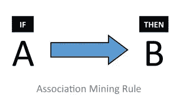

这种关系称为关联挖掘规则。如果一个客户购买了 A 商品，那么 B 商品在同一笔交易中被同一客户购买的几率就被找出来了。在这个关系中，A 称为前因，B 称为后果。前因是在购物篮中找到的商品，这些商品最初是由客户根据他或她的需求计划和挑选的，而结果是在大多数情况下与一个或一组前因一起在同一个购物篮中找到的商品。用于确定关联性的度量标准有:

**Support:** 它指的是包含 A 和 b 两个项目的交易比例。基本上，Support 告诉我们购买一个项目或项目组合的频率。

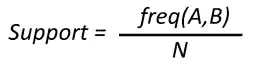

这使我们能够识别项目集的频率，从而有助于过滤掉频率较低的项目集。

**置信度:**它告诉我们商品 A 和 B 一起被购买的频率，即商品 A 被购买的次数。

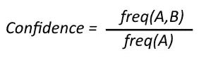

实际上，给定商品集的置信度值越高，它们在同一交易中被同一顾客一起购买的机会就越高。

**Lift:** 它表示关联规则对 A 和 b 的随机出现的强度。在这里，规则表示项目集之间的可接受的关系，这取决于所选择的置信度的最小阈值(我们将在下面讨论关联规则)。

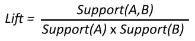

这里，很明显，分母是 A 和 B 的单个支持值的概率的乘积，而不是总和。升力解释了规则的强度，即升力越大，强度越大。如果我们说对于一个关系 A -> B，lift 的值为 3，那么就意味着如果 A 被买入，那么 B 在同一笔交易中被同一客户买入的几率是买入 A 的 3 倍。

最后，任务是为每个项目集生成规则，并找出其关联的度量，以便人们可以决定是否将它包括在分析中。不幸的是，在现实世界的应用中，数据集是巨大的，即用户和交易的数量是数百万和数十亿。为所有这些手动生成规则会非常耗时。这就是 Apriori 算法发挥作用的地方。

**Apriori 算法**使用频繁购买的项目集生成关联规则。它建立在一个经常购买的项目集的子集也必须是一个经常购买的项目集的概念上。如果支持值高于最小阈值，则频繁购买的项目集由其支持值确定。

为了更好地理解这个算法，考虑下面的事务:-

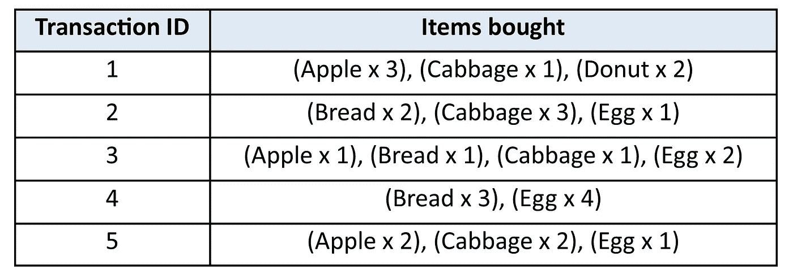

为了让事情看起来更整洁一点，让我们用每个项目的第一个字母来代表它，例如,“A”代表苹果。

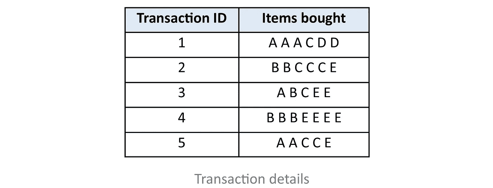

到目前为止一切顺利。总共有 5 种不同的商品 A、B、C、D 和 E，由顾客在每笔交易中以不同的组合和数量一起购买。让我们将项目集的最小阈值支持值固定为 3。

在我们开始这个过程之前，我们需要过滤掉数据，只保留我们的任务所需的数据，即删除同一个事务中的冗余条目。因为我们只寻找两类项目之间的关系，所以数量并不重要。重要的是交易中是否存在特定类型的项目，而不是数量。

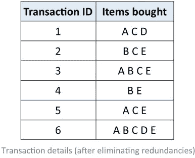

根据我们的要求筛选出数据后，我们现在可以开始流程了。

**迭代-1:** 形成只有一个项目的项目集，并计算它们的支持度。

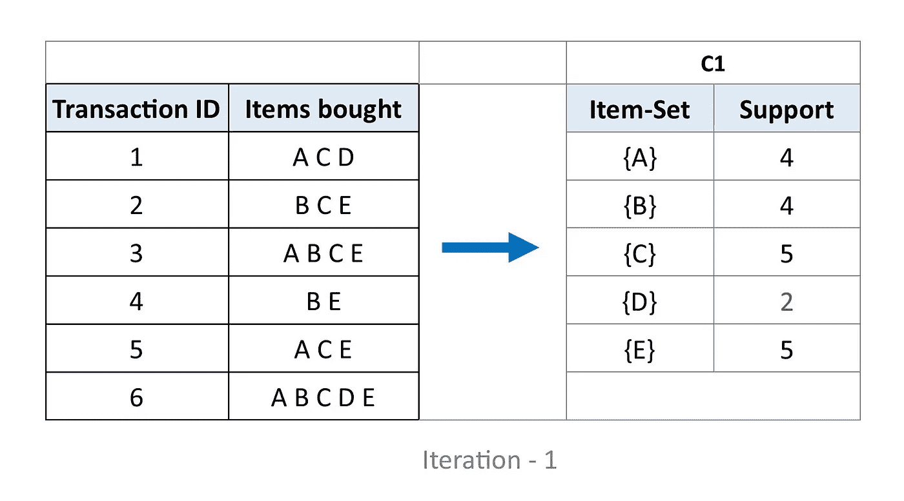

如从每个项目集的支持度值观察到的，D 具有小于阈值的支持度 2。因此，我们消除了项目集。

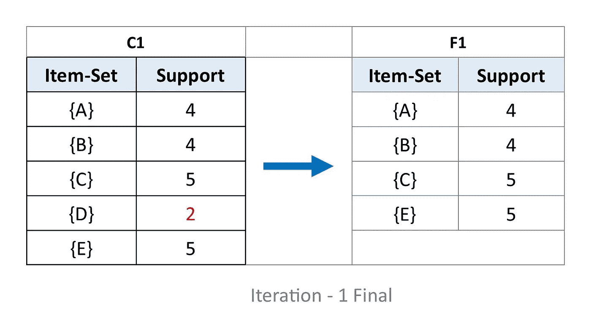

**迭代 2:** 接下来，我们将所有包含两个条目的可能条目集合进行分组。将只使用表 F1 中的项目。

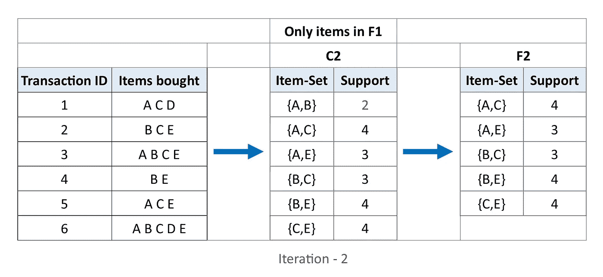

支持度小于 3 的项目集再次被忽略，即在该迭代中的{A，B}。

**迭代-3:** 在这次迭代中，分组的方式是每个项目集包含三个项目。此外，这些将被分成它们的子集，并且支持值小于阈值(即 3)的那些将被省略。这个过程被称为**修剪。**

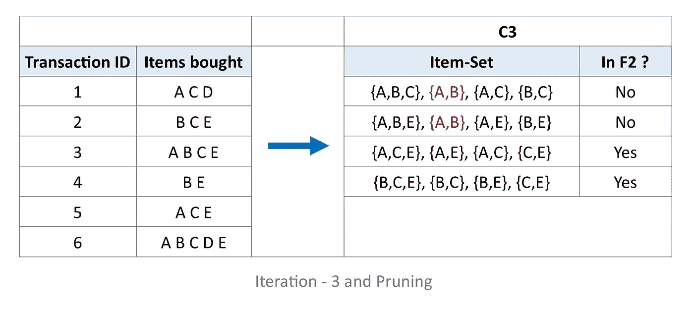

项目集{A，B，C}和{A，B，E}将被省略，因为它们都包含先前在迭代 2 本身中被省略的子集{A，B}。这个剪枝过程是 Apriori 算法的关键部分。

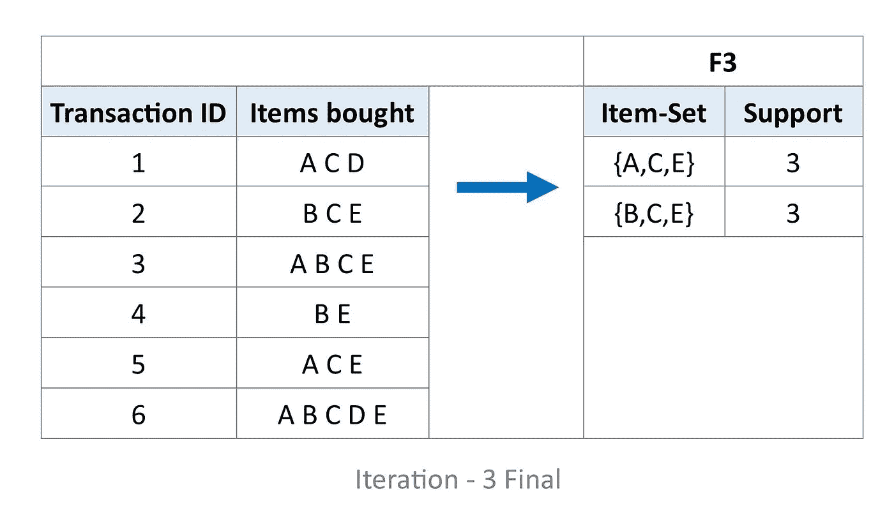

**迭代 4:** 使用 F3，我们现在继续对包含四个项目的项目集进行分组。

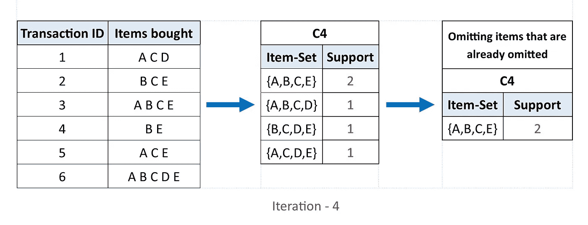

正如我们在第四次迭代中可以观察到的，具有 4 个项目的唯一项目集的支持值小于阈值，即 3。因此，我们在这里停止迭代，我们将最后一项设置为 F3。

从 F3，我们看到，

如果 I = {A，C，E}，那么子集是{A，C}，{A，E}，{C，E}，{A}，{C}和{E}。

如果 I = {B，C，E}，那么子集是{B，C}，{B，E}，{C，E}，{B}，{C}和{E}。

**关联规则:**为了过滤掉相关的项目集，我们将创建关联规则并将它们应用到子集。让我们假设最低置信值为 60%。

对于 I 的每个子集 S，我们制定规则:-

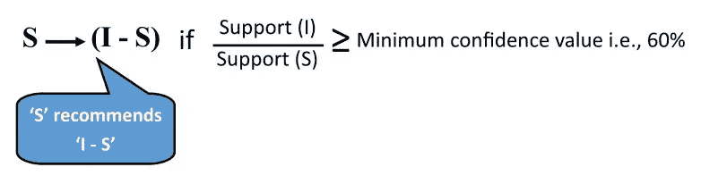

考虑{A，C，E}

**规则 1:** {A，C} →({A，C，E} — {A，C})哪个是{A，C} — {E}

信心=支持{A，C，E} /支持{A，C} = 3/4 = 75% > 60%

所以规则 1 即{A，C} →{E}是有效的。

**规则二:** {A，E} →({A，C，E} — {A，E})哪个是{A，E} — {C}

信心=支持{A，C，E} /支持{A，E} = 3/3 = 100% > 60%

所以规则 2 即{A，E} →{C}是有效的。

**规则三:** {C，E} →({A，C，E} — {C，E})也就是{C，E} — {A}

信心=支持{A，C，E} /支持{C，E} = 3/4 = 75% > 60%

所以规则 3 即{C，E} →{A}是有效的。

**规则四:** {A} →({A，C，E} — {A})哪个是{A} — {C，E}

信心=支持{A，C，E} /支持{A} = 3/4 = 75% > 60%

所以规则 4 即{A} →{C，E}是有效的。

**规则五:** {C} →({A，C，E} — {C})哪个是{C} — {A，E}

信心=支持{A，C，E} /支持{C} = 3/5 = 60%！> 60%(即不大于 60%)

所以规则 5 即{C} →{A，E}被拒绝。

**规则六:** {E} →({A，C，E} — {E})哪个是{E} — {A，C}

信心=支持{A，C，E} /支持{E} = 3/5 = 60%！> 60%(即不大于 60%)

所以规则 6 即{E} →{A，C}被拒绝。

现在，对于上面做的关联规则，我们来计算一下每一个的强度。

**规则 1:** Lift = Support{A，C，E} / (Support{A，C } x Support { E })= 3/(4x 5)= 3/20 =**0.15**

**规则二:** Lift = Support{A，C，E} / (Support{A，E } x Support { C })= 3/(3x 5)= 3/15 =**0.20**

**规则三:** Lift = Support{A，C，E} / (Support{C，E } x Support { A })= 3/(4x 4)= 3/16 =**0.1875**

**规则四:** Lift = Support{A，C，E} / (Support{A} x Support{C，E })= 3/(4x 4)= 3/16 =**0.1875**

**法则五:** Lift = Support{A，C，E} / (Support{C} x Support{A，E}) = 3/(5x3) = 3/15 = **0.20**

**规则六:** Lift = Support{A，C，E} / (Support{E} x Support{A，C}) = 3/(5x4) = 3/20 = **0.15**

同样的步骤也适用于物料集{B，C，E}。显而易见，升力的值变化不大，在我们的样本数据集相当小的情况下，它没有多大帮助。但是在较大数据集的情况下，通过对规则施加最小提升值来进行进一步过滤。到目前为止讨论的所有三个关联度量的值都可以根据需求进行调整。

现在让我们考虑一个实际的数据集，看看如何进行分析。使用下面提到的链接访问本例中使用的数据集。

 [## 在线 _ 零售. csv

### 在线零售交易数据示例

drive.google.com](https://drive.google.com/file/d/1c0YCEzh0AW24-WIWPY2HqiXUMIENbr2f/view?usp=sharing) 

我们将使用 Python 编程语言进行分析。此外，我们将使用 python 中的两个库，即“pandas”和“mlxtend ”,它们包含专门用于处理此类大数据分析的函数，最终使我们的任务变得更加简单。

不要一口气把所有的东西都编码好，让我们对我们经历的每一步都有一个清晰的画面，这样我们就不会在中间迷失。

**步骤 1:** 加载并探索数据——将包含交易细节的文件加载到程序中，并让我们自己熟悉它的全部内容。

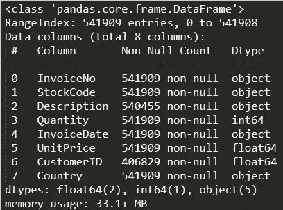

关于交易数据的信息

**步骤 2:** 清理数据——我们刚刚加载到程序中的文件中的数据称为原始数据。原始数据可能包含错误格式、无效条目、无关条目等。基本上，我们正在去除所有我们分析中实际上不需要的东西。

**第三步:**根据交易地区分割数据——这是我们的样本数据集所特有的。这是因为，在我们的样本数据集中，每一行交易都包含了交易所在国家的信息。因此，根据国家分割整个数据集不仅可以让我们更好地了解该特定国家的客户行为和趋势，还可以使计算更简单，因为计算机不必一次性处理大量数据，这相对来说更耗时。

**第四步:**对数据进行热编码——这不过是将所购物品的数量值减少到“0”(如果该值为零或负值)或“1”(如果该值大于零)。这是因为，我们只寻找两类物品之间的关系，数量并不重要。重要的是交易中是否存在特定类型的项目，而不是数量。

**步骤 5:** 建立模型并分析结果——在这里，我们最终使用库中的函数来建立模型并获得结果，即支持度、置信度和提升度。为了使本文简洁，我将只选取与法国相关的数据集，而不是为上述代码中提到的所有国家的数据集构建模型。

对于其他国家，您可以摆弄代码并亲自尝试，因为这会给您一些实践经验和更好的理解。

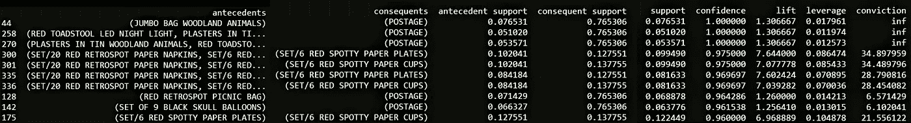

为法国生成的前 10 行规则

通过这种方式，可以找到所有需要的项目集。此外，可以通过增加支持度和提升度的阈值来进一步微调项目集以找到更可能的项目集。我们可以将找到的项目集存储在一个 csv 文件中以备将来使用。

## **总结**:

我们学习了基本的关联挖掘规则及其应用。在此基础上，利用 Apriori 算法解决了频繁购买项目集的生成问题。研究了将关联规则应用于这些生成的项目集的过程。最后，我们还学习了如何在相对大规模的数据集上使用 Pandas 和 Mlxtend 等库在 Python 中实际实现整个过程。

## **参考文献:**

 [## 在 Python - GeeksforGeeks 中实现 Apriori 算法

### 先决条件:Apriori 算法 Apriori 算法是一种机器学习算法，用于洞察…

www.geeksforgeeks.org](https://www.geeksforgeeks.org/implementing-apriori-algorithm-in-python/)  [## Apriori 算法:知道如何找到频繁项集| Edureka

### 有没有发生过这样的情况，你出去买东西，结果却买了很多超出你计划的东西？这是一个…

www.edureka.co](https://www.edureka.co/blog/apriori-algorithm/)