# 使用关联规则的购物篮分析

> 原文：<https://medium.com/analytics-vidhya/market-basket-analysis-using-association-rules-2b0f3e2a897d?source=collection_archive---------2----------------------->

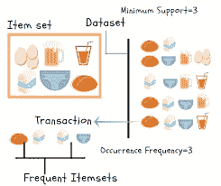

购物篮分析是大型零售商用来发现商品之间关联的关键技术之一。它通过寻找在交易中频繁出现的项目组合来工作。换句话说，它允许零售商识别人们购买的商品之间的关系。

关联规则被广泛用于分析零售购物篮或交易数据，并且旨在基于强规则的概念，使用感兴趣的度量来识别在交易数据中发现的强规则。简单来说，这种技术的结果是一组**规则**，可以理解为**“如果这样，那么那样”**。

**关联规则的一个例子**

*   假设有 100 个客户
*   其中 10 人买了牛奶，8 人买了黄油，6 人两样都买了。
*   买了牛奶= >买了黄油
*   支持= P(牛奶和黄油)= 6/100 = 0.06
*   信心=支持度/P(黄油)= 0.06/0.08 = 0.75
*   lift =置信度/P(牛奶)= 0.75/0.10 = 7.5
*   注意:这个例子非常小。在实践中，一个规则需要数百个事务的支持，才能被认为具有统计意义，数据集通常包含数千或数百万个事务。

# 关联规则

Apriori 算法为给定的数据集生成关联规则。关联规则意味着，如果项目 A 出现，那么项目 B 也以一定的概率出现。让我们看一个例子，

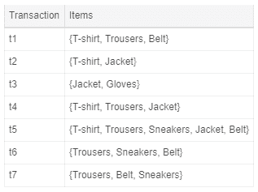

在上表中，我们可以看到一家服装店的七笔交易。每笔交易都显示在那笔交易中购买的物品。我们可以将我们的项目表示为一个**项目集**，如下所示:

在我们的例子中，它对应于:

一个**事务**由下面的表达式表示:

举个例子，

然后，**关联规则**被定义为以下形式的蕴涵:

举个例子，

在接下来的部分中，我们将定义四个度量标准来衡量规则的精确度。

# 支持

支持度表示项目集在数据集中出现的频率。

换句话说，就是同时包含 X 和 Y 的事务数除以事务总数。这些规则对于低支持值没有用。让我们使用上一个表中的服装店事务来看看不同的例子。

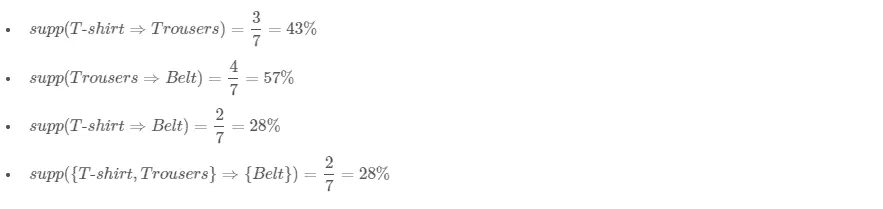

# 信心

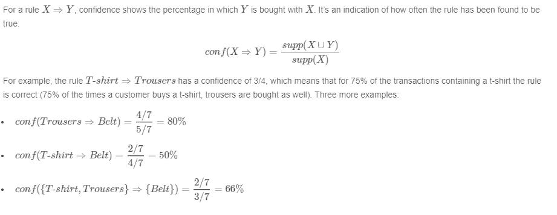

# 电梯

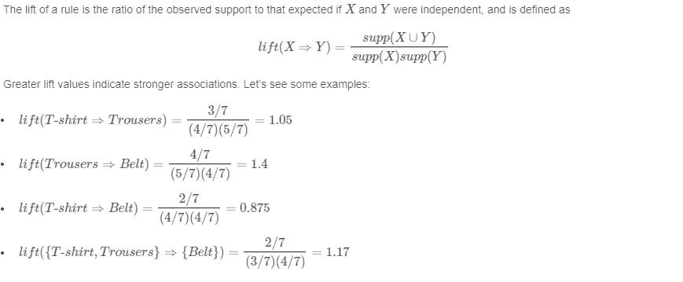

# 定罪

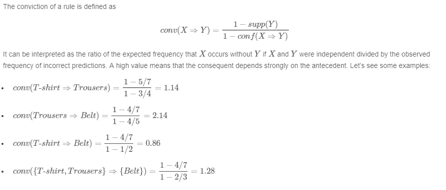

# 让我们编码

# **导入依赖关系**

import numpy as NP
import matplotlib . py plot as PLT
% matplotlib inline
import pandas as PD
from mlx tend .预处理 import transaction encoder
from mlx tend . frequency _ patterns import apriori
from mlx tend . frequency _ patterns import association _ rules

# **加载 CSV 文件**

df=pd.read_csv(r '杂货. csv '，header =无)

df.head()

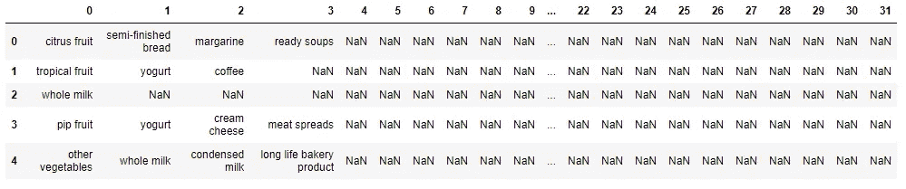

# **数据准备**

如果交易发生则为真，否则为假

records =[]
for I in range(0，9835):
records . append([str(df . values[I，j]) for j in range(0，20)])

TE = transaction encoder()
array = TE . fit(记录)。transform(records)
# building 数据框行是逻辑，列是已购买的物品
df1 = pd。DataFrame(array，columns = TE.columns_)
df1

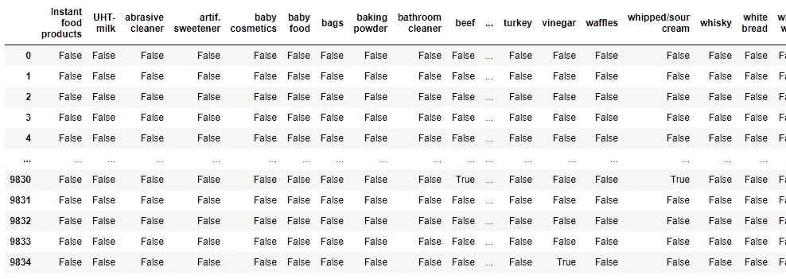

# 现在想象一下前 20 个销售项目

count = df_clean.loc[:，:]。sum()
df2 = count . sort _ values(0，升序= False)。head(20)
df2 = df2 . to _ frame()
df2 = df2 . reset _ index()
df2 = df2 . rename(columns = { " index ":" items "，0: "count"})

PLT . style . use(' dark _ background ')
ax = df2 . plot . bar(x = ' items '，y = 'count')
plt.title('最畅销项目')

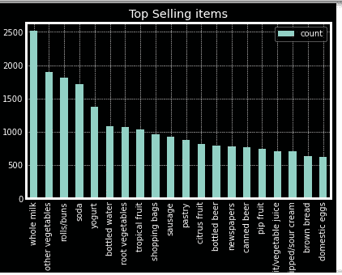

# **现在找出项目百分比和累计百分比**

tot_item = sum(df_clean.sum())

df2[' Item _ percent ']= df2[' count ']/Tot _ Item
df2[' Tot _ percent ']= df2。item _ percent . cumsum()
df2 . head(20)

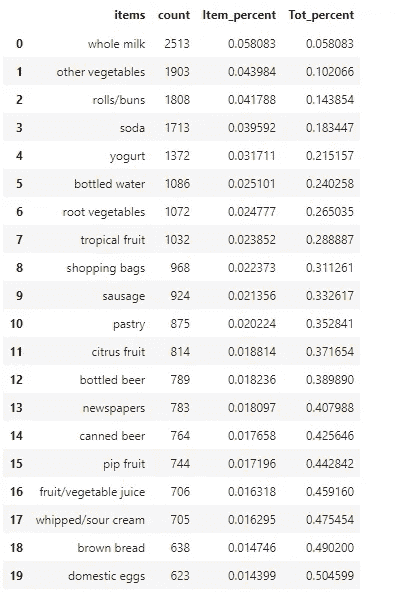

正如我们所见，50%的售出商品都是前 20 名商品。因此，现在我们将删除不经常出售的项目

def prune_dataset(olddf，len_transaction，tot_sales_percent):
#删除最后一列 tot _ items if if ' tot _ items in olddf . columns:
del(olddf[' tot _ items '])
#查找每个项目的 item_count 和项目总数。这与第三步
中的代码相同。sort_values(升序= False)。reset _ index()
tot _ items = sum(olddf . sum()。sort _ values(ascending = False))
Item _ count . rename(columns = { Item _ count . columns[0]:' Item _ name '，Item _ count . columns[1]:' Item _ count ' }，inplace=True)

#代码从步骤 3 中查找项目百分比和合计百分比。
Item _ count[' Item _ percent ']= Item _ count[' Item _ count ']/Tot _ items
Item _ count[' Tot _ percent ']= Item _ count。item _ percent . cumsum()

#取符合总销售额百分比条件/最低阈值的项目。
选定项目=列表(项目计数[项目计数。Tot_percent <。项目名称)
olddf['总项目']= olddf[选定项目]。sum(axis = 1)

#取符合条件的项目/一行交易时长或项目数的最小阈值。
olddf = olddf[olddf . tot _ items>= len _ transaction】
del(olddf[' tot _ items '])

#返回修剪后的数据帧。
返回 olddf[selected_items]，Item_count[Item_count。tot _ percent<tot _ sales _ percent]

output_df，item _ counts = prune _ dataset(df _ clean，
2，0.4)
print(output _ df . shape)
print(list(output _ df . columns))
output _ df

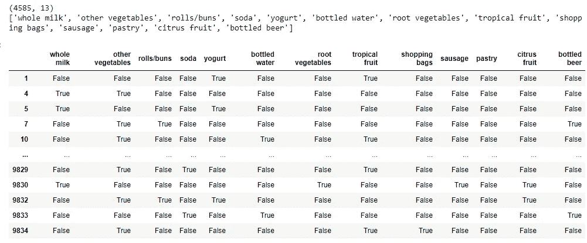

现在我们使用 apriori 算法

frequent _ items ets = apriori(output _ df，min_support=0.01，use _ colnames = True)
frequent _ items ets[' length ']= frequent _ items ets[' items ets ']。应用(λx:len(x))

频繁项集=频繁项集[(频繁项集['length'] >= 2)]
频繁项集

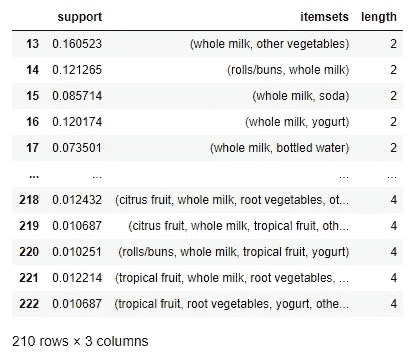

# **关联规则**

我们希望前件长度大于 2，置信度大于或等于 0.3，提升大于或等于 1，支持度大于或等于 0.04。

rules _ mlx tend[" antecedent _ len "]= rules _ mlx tend[" antecedents "]。应用(λx:len(x))

rules _ mlx tend[(rules _ mlx tend[' antecedent _ len ']> = 2)&
(rules _ mlx tend[' confidence ']>= 0.3)&
(rules _ mlx tend[' lift ']>= 1)&
(rules _ mlx tend[' support ']>= 0.04)]

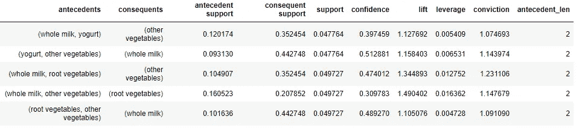

# 结论

*   这个数据集中最受欢迎的项目是全脂牛奶，其次是蔬菜和面包卷。
*   通过应用 Apriori 算法和关联规则，我们可以更好地了解哪些商品更有可能一起购买。

有关代码和数据集，请参见

 [## Meg ha 067/市场购物篮分析-使用关联规则

### 购物篮分析是大型零售商用来发现商品之间关联的关键技术之一。它…

github.com](https://github.com/Megha067/Market-Basket-Analysis-using-Association-Rules)