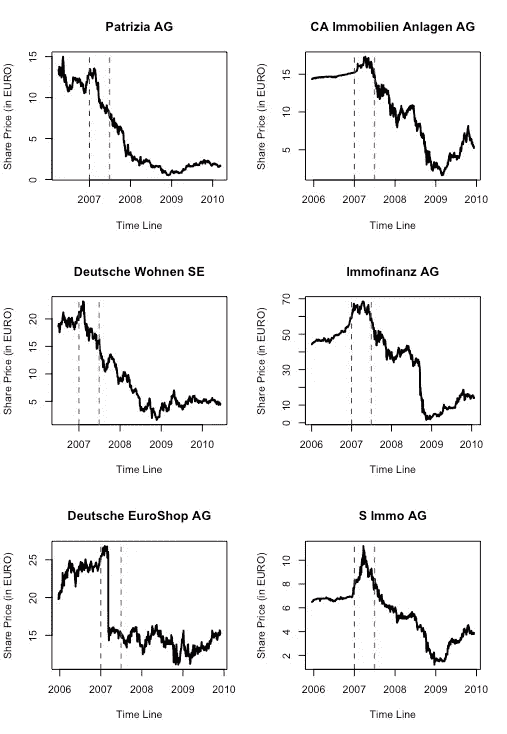

# 替代产品/房地产的市场修正

> 原文：<https://medium.com/analytics-vidhya/market-correction-in-alternatives-real-estate-a50200dae32?source=collection_archive---------3----------------------->

# 最近的讨论

大象又在房间里了。最近对欧元区通货膨胀加剧的担忧引发了一场关于欧洲中央银行退出其扩张性货币政策的讨论，这一政策最初是在金融危机和大流行期间作为救助计划实施的。

然而，鉴于目前的阶段，人们担心仅仅逆转纾困计划是不够的。相反，**放弃零利率政策**并伴随着参考利率的明显上升，可能是扑灭快速上升的通货膨胀率的火焰所必需的。

如果是这样的话，像房地产投资业务这样的资本密集型行业可能会受到伤害，因为在许多资产类别和地区，作为当前市场价格创历史新高的驱动因素之一的廉价资金可能不再那么便宜了。

简而言之(稍微简化一点)，作为更高参考利率触发器的更高通胀导致投资资金枯竭，并促使房地产价格暴跌。

资产价格下跌将进一步推动投资者寻求市场退出，引发另一波市场价格下跌——接着:另一个房地产市场泡沫最终破裂。

总之，欧洲房地产市场的后果可能是严重的。或者——这只是另一个永远不会成真的崩盘“预言”。

# 通货膨胀、参考利率和房地产市场

德国商业银行首席经济学家 rg Krä mer 博士在最近的 LinkedIn 帖子中透露了他对这个话题的想法:

欧元区房地产泡沫？长期没有可观收益的前景推动投资者进入房地产等有形资产。在第一季度(2021 年)，与前一时期相比，欧元区的房地产价格上涨了近 6%。自 1999 年欧元启动以来，房价比房租上涨了约 40%。鉴于此，房地产比 2008 年房地产泡沫破裂前更贵了。对于法国或比利时等欧元区核心国家来说尤其如此。

高估值本身并不会引发房地产市场的危机。这不会没有任何触发因素——例如利率大幅上升。但这可能是几年后的问题，以防通胀率上升迫使欧洲央行设定更高的参考利率。为了降低已经处于早期阶段的房地产市场泡沫的危险，欧洲中央银行应该开始抵消和退出扩张性货币政策。—报价结束。

嗯，当融资变得更加昂贵时，毫无疑问，这将对融资结构、投资量以及最终房地产市场的资产价格产生一定的影响。

问题是，我们是不是在谈论一场或许姗姗来迟的市场调整？毕竟，自上次大规模金融危机结束以来，这些市场一直在蓬勃发展。

**还是**，我们是在谈论以极具破坏性的方式从市场泡沫中走出的**(定价)空气吗**？

欧元区许多房地产市场的房地产投资收益率处于历史低位，这本身就带来了投资挑战。

一方面，较低的收益率意味着较高的市场价格。但在如此低的水平上，市场价格确实会飙升，并对股权和债务融资额提出更高的要求。

虽然较高的债务融资比率应有助于产生令人满意的股权收益，但这些资产的租金收入水平在提供必要的偿债能力方面受到限制。

这就是**确切的情况，“廉价资金”涌入**并提供缓冲，即允许更高的债务杠杆，而不会危及一个项目或一家公司的流动性状况——至少目前如此。

这里的一个例子是一个办公室投资的前景，投资收益率为 3 %,投资期限为 5 年，债务融资占年金偿还计划的 85 %,基于各自市场的当前动态进行模拟。

作者图片

13 %的年均股本收益率仍有望实现。尽管如此，模拟显示投资的总体损失风险几乎为 50 %(参见图表“股权收益风险”中的红色区域)。

另一方面，就目前的流动性而言(见图表“运营总资金”)，尽管债务杠杆很高，但投资期内现金短缺的可能性仅为 10%(见红色区域)。

债务偿还能力(见图表 DSCR 高级贷款的违约风险)的预期比率约为 1.08——对于这一债务比率来说，虽然不算糟糕，但也不算惊人。

当参考利率仅增加 100 个基点时，情况立即发生变化。

作者图片

无需言语。我会说。

在这种杠杆率下，整体亏损的风险从略低于 50 %升至近 65 %。该项目缺乏流动资金，贷款的还本付息远远不够。

简而言之，调整迫在眉睫。

高利率对项目风险状况的负面影响****是显而易见的，不会带来大的意外**。**

**这是否足以将市场推入深渊，或者这是否会引发一些小范围到中等范围的市场调整，这一点并不清楚，而且在 5 月份看来，还取决于其他因素，如替代投资机会、总体市场情绪、再融资可能性，特别是关于公司债券等。**

# **投资收益水平——这些“其他”因素之一**

**我之前已经提到过，投资收益率非常低。**

**问题— **在当前的收益率水平下，名义市场估值表现出更加不稳定的行为**,在收益率小幅变动的情况下，这种行为要比在稍高一点的收益率水平下的行为更加不稳定。**

**下图很好地展示了这一点。产量水平越低，产量同样变化的影响就越大。**

****

**作者图片**

**提出这个概念，**市场价值**对**房地产公司的净资产价值(NAV)**有相当大的影响(NAV 同时被根据更新的 EPRA 定义的净有形资产或净复原价值所取代，这与本文的目的大体相同)。**

****因此，小的变化会对房地产公司的资产负债表产生大得多的影响，尤其是净资产价值**。**

**我们举一个简短的例子来说明这一点。某房地产公司面临以下资产负债表情况:**

****

**按作者分类的表格**

**房地产资产被估价为每年 7 %的收益率**

**当投资收益率从每年 7 %变为每年 7.25 %时，即仅仅增加 25 个基点，总体框架没有太大变化:**

****

**按作者分类的表格**

**考虑到当前收入和潜在税收影响，净资产值仅下降了 2 %。**

**现在，我们对租金收入和债务比率采用相同的框架，但是资产的价值为公司资产负债表的 3 %年率，如下所示:**

****

**按作者分类的表格**

**同样，投资收益率从每年 3 %略微上升到每年 3.25 %**

****

**按作者分类的表格**

**此场景中的**净资产值**(包括运营收入和潜在税收影响)**减少****12%**！**

**例如，在相应投资收益率增加 50 个基点的情况下，净资产值将减少 7.5 %，而在较低收益率水平的情况下，净资产值将减少 23 %。**

**同样，这是一个巨大的差异，但如前所述，微小的变化对那些较低投资收益率水平的影响要大得多。这正是我们目前在许多房地产市场面临的情况。**

**当分解成像**每股资产净值**这样的指标时，这些情景似乎更有关联。**

**除了其他因素，NAV/share 通常用于比较当前股价和公司的内在价值。在收购要约中，NAV/share 经常被用来支持或反对收购要约。**

**想象一个收购报价，例如每股 42 欧元，而当前每股资产净值为 44 欧元。在这种情况下，市场的小幅上涨导致资产净值下降 12 %已经是一个更具戏剧性的事件，可能会很快改变情况。**

**然而，作为一个孤立事件，净资产值的不稳定变化可能会引发股票交易反应，但可能不足以引发房地产市场的任何急剧恶化。**

**不过，在考虑可能的不利市场反应时，这绝对是拼图中的一块。**

**除此之外，与房地产市场的中长期价格发展相比，股票市场价格设置的短期性质表明，当即将到来的危机在房地产市场本身可能还不太明显时，股票市场的**反应会更快地稳定下来**。**

**以下是上一次金融危机开始蔓延时股价走势的概述。股价首先做出反应，然后整个市场随之波动。**

****

**作者图片**

# **结论**

**在我看来，通胀率上升的风险和欧洲央行的反应将被纳入房地产公司的风险考虑之中。**

**融资成本上升的风险肯定是存在的——及其所有后果。**

**如果事情发展到以破坏性市场结束，调整将不会取决于一个单一的主题，而是取决于几个不同问题的并行发展(部分相互依赖)，这些问题将对房地产市场产生不利影响，并且势头越来越大。**

**我在本文中讨论的一些主题。**

**虽然战略风险管理的**工作不是思考和推测未来的市场发展，而是**识别那些风险触发**，**根据它们孤立的外观以及它们与其他风险触发**和**的相互作用来衡量和量化它们，评估自己企业的风险承受能力**。****

**因此，**调整自己的风险头寸**和**如果必要的话**，消除市场风险**，以便为可能更艰难的时期**做准备。**

**顺便说一下，这个**“可能”是根据概率量化的，因此有一个明确的“价格标签”**。**