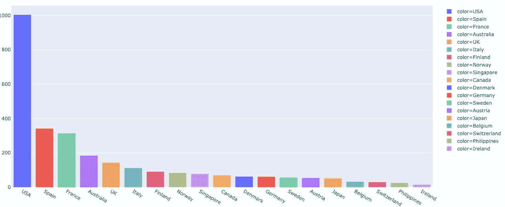

# 营销分析

> 原文：<https://medium.com/analytics-vidhya/marketing-analysis-df9a019d2ec2?source=collection_archive---------4----------------------->

**案例分析:**

一家零售分析公司希望使用他们 2.5 年的精选数据对其客户进行市场细分。

**任务:**

创建一个有针对性的广告营销活动，将客户分为至少三个不同的群体。

**数据:**

数据来源于**[**Kaggle**](https://www.kaggle.com/kyanyoga/sample-sales-data)**。****

****数据集汇总****

****

**我检查了数据集的空值，发现一些列/变量有空值。**

****

**我用了。drop 函数删除这些列/变量。**

****

****数据可视化:****

**我使用了 barplot.visualization 函数来可视化国家和状态变量。**

********

**由于数据不平衡，我不得不删除状态变量。**

****

**我使用虚拟变量替换数据集中的分类变量，包括国家、产品线和交易规模，然后按订单日期对数据集进行分组。**

****

**然后我想象了销售高峰期。**

****

**看上面的图，高峰期在 11 月和 12 月之间。**

**下一步是绘制相关图**

****

**看着这张地图，季度 id 和月份 id 高度相关，我不得不删除季度 id 并重新绘制地图。**

****

****K 均值聚类:****

**我使用了肘方法来获得最佳的集群数量。关于这种方法的更多信息，可以在这里找到。**

**把它形象化，我得到了这个图表**

****

**我使用 K-Means 对数据进行聚类，并可视化聚类中心**

****

**我也进行了逆变换来得到这个**

****

**聚类 0(最高):这一组代表购买大约 47 英镑的大量物品的客户，他们购买所有价格范围的物品，倾向于大约 99 英镑的高价物品。它们还对应于大约 8296 英镑的最高总销售额，并且全年都很活跃。他们是 MSRP ~158 高的产品的最高购买者。**

**聚类 1:这一组代表购买不同数量商品的顾客，他们倾向于购买高价商品。他们的销售稍好，平均约为 4435 英镑，他们购买的产品的建议零售价第二高，约为 133 英镑。**

**分类 2(最低):这一组代表购买少量商品的客户，数量约为 30 件。他们倾向于购买低价商品。他们 2044 年的销售额低于其他集群，而且在节假日期间非常活跃。他们购买低 MSRP ~75 的产品。**

**集群 3:这一组代表只在假期活跃的客户。他们购买的数量较少，约为 35 英镑，但他们倾向于购买平均价格约为 86 英镑的商品。它们也对应于大约 3673 的较低总销售额，他们倾向于购买建议零售价在 102 左右的商品。**

**分类 4:这一组代表购买不同数量物品的顾客，他们倾向于购买平均价格为 94 英镑的物品。他们的销售额约为 4280 英镑。**

**可视化这些集群**

************

**我用主成分分析(PCA)进行了降维。我将数据集缩减为 3 个以可视化变量，将聚类标签连接到数据框。**

**这是 3D 变量的散点图**

****

**我还尝试使用自动编码器来降低维数，用 verbose 等于 3、batch_size 等于 128 和 500 个历元来拟合自动编码器。**

**这是分数的图表**

****

****结论:****

**这个项目是我在 Udemy 上的认证课程的项目之一。这个项目的回购就是这里的。任何问题、建议或荣誉，都可以通过我的 [LinkedIn 个人资料](https://www.linkedin.com/in/rosemary-nwosu-ihueze/)联系到我。**