# 体育运动中的马尔可夫链算法

> 原文：<https://medium.com/analytics-vidhya/markov-chain-algorithm-in-sports-a54d086c155e?source=collection_archive---------4----------------------->

作为一个体育爱好者，你总是在思考选择一个更好的运动员，事实上哪个队会赢。例如，如果你能预测投球手会投什么类型的球，击球手会投什么类型的球，或者如果足球传给一个球员，他会如何在地上处理足球。这将为球员、经理或教练在战术和技术方面积累更好的见解。就本次讨论的范围而言，我将涵盖两项运动，即板球和足球。使用马尔可夫链模型的目的是在板球和足球比赛中提供触觉或技术建议。

马尔可夫回报过程(MRP)是一个马尔可夫模型，其中转换可能具有相关的回报或成本。具体来说，MRP 是一个元组(S，P，R，γ),其中 S 是状态集，P: S × S → [0，1]是转移函数，R: S × S → R 是与每个转移相关联的奖励函数，γ ∈ [0，1]是折扣因子。

**为什么我们要在体育的背景下讨论马尔可夫链模型？**

在体育运动中，大多数时候，我们不得不根据体育运动的现状而不是历史数据来决定体育运动战术的变化。正如我们所知，在马尔可夫链中，我们必须通过现在的事件而不是过去的事件来预测概率。

**马尔可夫模型的要素:板球**

假设一个保龄球手正在投球，如果当前他投球超过了 3 个摇摆碗、2 个弹跳者和 1 个纽约人，那么当前概率将如下所述:

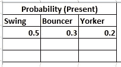

如果你建立了一个快速投球手投球的马尔可夫链模型，你可能会包括“挥杆”、“弹跳”、“纽约客”和“过度投球”作为状态，这些状态和另一次投球一起可以形成一个“状态空间”:所有可能状态的列表。此外，在状态空间的顶部，马尔可夫链告诉你从一个状态跳跃或“过渡”到任何其他状态的概率——例如，一个投球手当前正在击球将在接下来的两次投球中投球给 yorker 而不会先过度投球的概率。

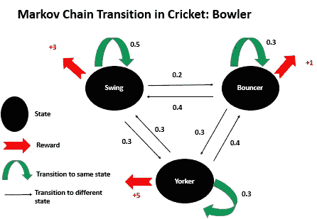

作者图片

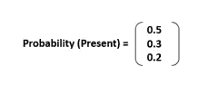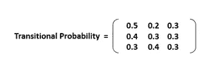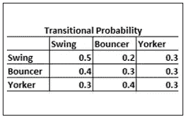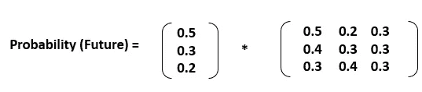

**矩阵乘法**

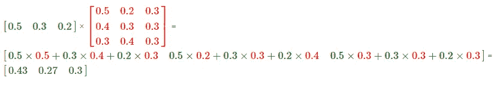

**结果**

> **保龄球下一次击球的概率= 43%**
> 
> **保龄下次投送为蹦跳者的概率= 27%**
> 
> **保龄球下一次投递的概率为纽约客= 30%**

这些概率是一个行动周期的，在这个讨论的背景下，可能是逐球分析。类似地，最有价值的保龄球手也可以通过奖励来选择，例如如果一个保龄球手是保龄球员，可以奖励+5 分，等等。

**马尔可夫模型的要素:足球**

在足球比赛中，我们可以使用马尔可夫模型来分析运动员在比赛中的控球动作。对于每个有球动作，多个 at-
属性，例如动作的类型(例如，传球、运球、射门)、动作的开始和结束位置、时间戳、执行动作的运动员等。此外，它还记录操作是成功还是失败。例如，如果传球到达并被队友控制，那么传球就是成功的。

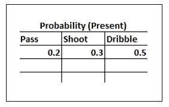

马尔可夫模型的第一个要素是所谓的战术状态，比如传球、投篮、运球。运动员从一种战术状态过渡到另一种状态。由于这个原因，马尔可夫模型有时被称为转移模型。每个转换都有一个概率(转换概率)转换发生在一段时间内(称为一个周期)。每个战术状态可以有与之相关联的成本和/或收益(在马尔可夫模型中称为奖励)，例如，如果运动员将球传给队员，则奖励+2，如果对方拦截，则奖励-2，类似地，如果射门得分+5，则奖励-5。

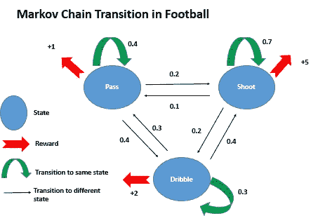

作者图片

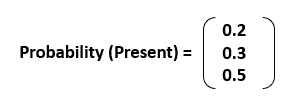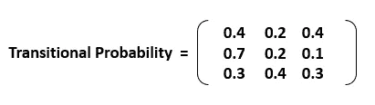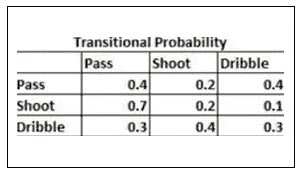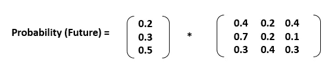

**矩阵乘法**

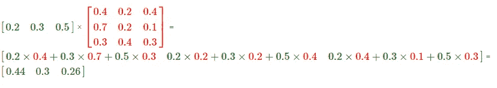

**结果**

> **通过的概率= 44%**
> 
> **出手的概率= 30%**
> 
> **运球概率= 26%**

# **马尔可夫链在体育运动中的优势**

*   ***在速度和精度上有优势。***
*   从连续的数据中，马尔可夫模型是相对简单的。
*   ***动态变化的所有重要参数(在体育动态的背景下，因为它会生成海量数据)都在转换矩阵中进行了总结。***
*   ***它提供了一个体育系统随时间演变的综合视图。***

# 马尔可夫链在体育运动中的缺点

*   运动员可以随时进出场地，因此这项运动永远不会稳定。
*   ***马尔可夫分析无法在早期结果信息缺失的情况下预测未来结果。***

快乐学习…！！