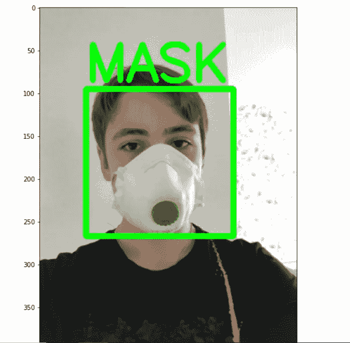

# 使用迁移学习的屏蔽和距离检测器:第 2 部分

> 原文：<https://medium.com/analytics-vidhya/mask-and-distancing-detector-part-2-66401065bae5?source=collection_archive---------17----------------------->


在上一篇文章中我们完成了我们的人脸和距离检测器，如果你还没有看过这篇文章，你可以从这里[](https://anmolcrazy2.medium.com/mask-detection-and-social-distancing-detector-part-1-b6ed4a3a4274)****。**我会在本文结尾写完整的代码**

**在完成我们的掩膜检测器之前，我们需要了解一些重要的主题，以及我们将在掩膜检测器中使用哪些主题。**

****我们在图像检测时面临的一些问题是****

1.  **缺少可用于模型训练的数据**
2.  **从零开始训练模型或不训练模型，以便我们用标记的数据进行分类。**

> **对于问题 1，我们有数据扩充，对于第二个问题，我们使用迁移学习。**

# **数据扩充**

**我们认识到图像分类需要大量的数据，获取蒙面人的照片是一项繁琐的任务，所以首先我们必须重新生成大量的数据。在蒙版数据上实现它之前，让我在一些随机的照片上尝试一下，并尝试大量地重新生成照片。**

```
from keras.layers import Flatten, Dense
from keras.preprocessing.image import ImageDataGenerator, load_img, img_to_array
```

**我们将使用 Keras API 进行数据重建或扩充，并使用我的一张简单图片。ImageDataGenerator 函数用于从一张照片生成多张照片。**

```
datagen=ImageDataGenerator(rotation_range=40, 
                           width_shift_range=0.2,
                           height_shift_range=0.2,
                           zca_whitening=False, zca_epsilon=1e-06,
                           shear_range=0.4,
                           zoom_range=0.6,
                           horizontal_flip=True,
                           fill_mode="nearest")
```

**现在，我们需要指定需要重新生成的照片的位置。我们将运行一个 for 循环，该循环将在生成 20 张照片后中断。**

```
img=load_img('image/IMG_20190710_085629.jpg')
x=img_to_array(img)
x=x.reshape((1,)+ x.shape)i=0
for batch in datagen.flow(x, batch_size=1, save_to_dir='vac_hes/Gaza/generate/augment', save_prefix='anmol',save_format="jpg"):
    i+=1
    if i>20:
        break
```

**我想重新生成的照片是我的个人照片。我用这个来说明。**

****

**这里是扩增目录中重新生成的照片。您可以生成任意数量的照片。我已经从这张照片中生成了 20 张照片。**

****

**现在数据问题解决了，我们可以继续前进了。然而，下一个问题是从零开始，训练我们的模型，或者在类似的数据上挑选一个已经训练好的模型，在其上添加我们的分类模型，并将其用于我们的分类。对于图像分类，我们已经有超过百万张图像的标注数据，名为 **ImageNet** ，型号为 **VGG19** 。**

# **迁移学习**

**这个使用已经训练好的模型来解决另一个类似问题的过程叫做迁移学习。例如，被训练用于对不同对象(如狗、猫、马、鞋等)的图像进行分类的模型可以用于检测人脸面具。**

**迁移学习的过程可以比作人脑。一个已经知道如何骑自行车和自行车的人会发现驾驶汽车比一个一生中从未驾驶过汽车的人更容易。**

****工作流程如下****

1.  **从先前训练的模型中提取图层。**
2.  **冻结它们，以避免在未来的训练中破坏它们所包含的任何信息。**
3.  **在冻结层上添加一些新的可训练层。他们将学习将旧要素转化为新数据集的预测。**
4.  **在数据集上训练新图层。**

```
vgg19 = VGG19(weights='imagenet',include_top=False,input_shape=(128,128,3))

for layer **in** vgg19.layers:
    layer.trainable = False

model = Sequential()
model.add(vgg19)
model.add(Flatten())
model.add(Dense(2,activation='sigmoid'))
model.summary()
```

****

```
include_top=false:
```

**您使用了预训练的 VGG19 模型，但没有使用最后一个输出层，而是使用了您自己的输出层。我们将指定输入大小。**

```
layer.trainable = False
```

**我们冻结了所有层的重量。因此，现在不会为预训练模型的所有层更新权重。**

```
model.add(Dense(2,activation='sigmoid'))
```

**接下来，我们将在预训练模型的基础上添加我们自己的分类器。才能有我们具体分类的结果。在这里，我们指定我们想要对您的数据进行分类的类的数量。我们只想要 2 个类，面具或没有面具。我们将使用 sigmoid 函数作为我们的激活函数。**

# **完整的面罩检测器代码**

**你可以从这里 下载训练、测试、验证数据 [**，从这里**](https://www.kaggle.com/ashishjangra27/face-mask-12k-images-dataset) 下载屏蔽图像数据 [**。为哈尔卡斯克下载数据**](https://www.kaggle.com/andrewmvd/face-mask-detection) **[**从这里**](https://www.kaggle.com/gpreda/haar-cascades-for-face-detection)****

****

**绿色矩形是由于距离。而红色矩形表示没有最小距离。更多的照片使用相同的代码分类。**

********

# **结论**

**我们已经把我们的图像分为屏蔽和非屏蔽。为此，我们使用人脸检测、图像增强、迁移学习和欧几里德距离来寻找人与人之间的距离。我们可以在我们的街道上使用这个模型来识别没有戴口罩或保持最小距离的人，并相应地对他们进行罚款。警察不必手动识别人们并敦促他们戴上面具。**