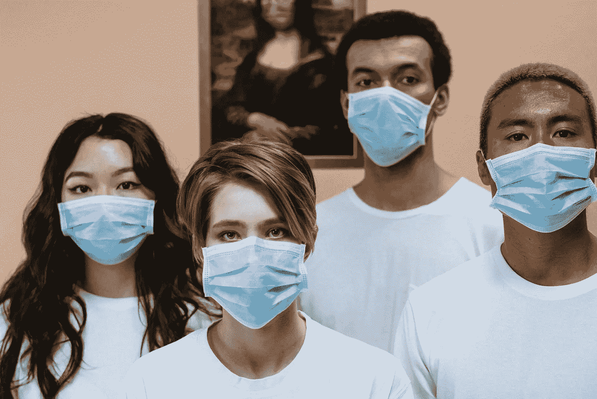
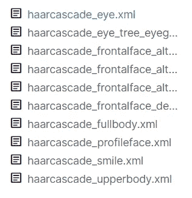
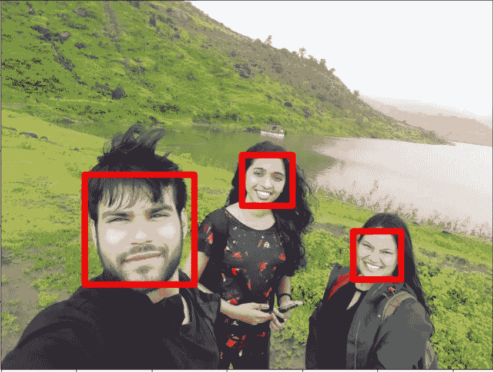
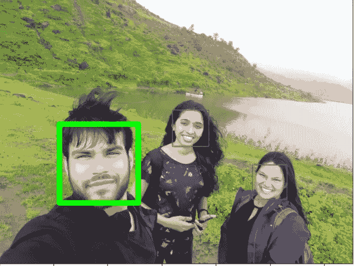

# 面具和社会距离探测器:第一部分

> 原文：<https://medium.com/analytics-vidhya/mask-detection-and-social-distancing-detector-part-1-b6ed4a3a4274?source=collection_archive---------31----------------------->



对大多数印度人来说，纪律是一个巨大的问题。人们不愿意在外出时保持社交距离或戴口罩。我们大多数人都不注意自己的口罩卫生，导致印度爆发致命的冠状病毒，导致 10 万人死亡。

另一个问题是印度的警察暴行和权势人物的麻木不仁。每天我们都读到一个可怜的人因为没有戴口罩而被警察殴打甚至杀害。在印度，几乎没有中间立场。所以我在想，我们是否可以让机器来识别和惩罚违反电晕规则的人。

**我们将设计一个算法来识别**

1.  如果小组保持安全距离。
2.  照片中的人是否戴着面具。

# 人脸检测

我们可以从设计人脸检测器开始。让我们导入所有需要的库。稍后会用到其中的一些库，所以不要担心。

```
 import seaborn as sns
import os
from sklearn.utils import shuffle
import matplotlib.pyplot as plt
from keras.preprocessing.image import ImageDataGenerator, img_to_array, load_img
import cv2
from scipy.spatial import distance
```

我们不必编写和训练一个 Haar 分类器，因为它已经被训练过了。从这里下载 Haar cascade XML 文件[](https://www.kaggle.com/gpreda/haar-cascades-for-face-detection)****。**我们将使用一个已经训练好的分类器正面人脸分类器。我们已经为所有特征预先训练了分类器，但是我们现在只需要一个人脸检测器。**

****

```
face_model = cv2.CascadeClassifier('mask/haarcascade_frontalface_default.xml') img = cv2.imread('images/GOPR1592.JPG')
img = cv2.cvtColor(img, cv2.IMREAD_GRAYSCALE)
faces = face_model.detectMultiScale(img,scaleFactor=1.2, minNeighbors=2, minSize=(100, 50))

img_2 = cv2.cvtColor(img, cv2.COLOR_RGB2BGR)for (x,y,w,h) in faces:
    cv2.rectangle(img_2,(x,y),(x+w,y+h),(250,0,0),40)

plt.figure(figsize=(12,12))
plt.imshow(img_2)
```

****

**我们可以看到标记在人脸周围的矩形，用于人脸检测。让我们通读代码并理解提到的术语**

## **1.哈尔分类器**

**这是一种对象检测算法，可用于通过定位特征之间的边缘和像素颜色差异来检测人脸。例如，你的眼睛会比邻近的五官更黑，你的鼻子、嘴唇和眉毛也是如此。**

**要全面了解，可以从这里 看 [**。**](https://docs.opencv.org/3.4/db/d28/tutorial_cascade_classifier.html)**

## **2.检测多尺度**

**该功能用于检测人脸。该函数将返回一个矩形，坐标为(x，y，w，h ),围绕检测到的人脸。 **faces** 变量具有矩形坐标，将围绕检测到的面绘制。这个函数采用的不同参数是**

**这需要三个共同的论点**

1.  ****图像****
2.  ****比例因子**:指定每种比例下图像缩小多少**
3.  ****最小邻居**:指定每个候选矩形应该有多少邻居来保留它**

# **社交距离探测器**

**既然我们的面部被检测到，我们现在将检测社交距离是否被保持。**

```
MIN_DISTANCE = 1000if len(faces)>=2:
    label = [0 for i in range (len(faces))]
    for i in range(len(faces)-1):
        for j in range(i+1, len(faces)):
            dist = distance.euclidean(faces[i][:2], faces[j][:2]) 
            if dist<MIN_DISTANCE:
                label[i] = 1
                label[j] = 1

    new_img = cv2.cvtColor(img, cv2.COLOR_RGB2BGR)
    for i in range(len(faces)):
        (x,y,w,h)=faces[i]
        if label[i]==1:
            cv2.rectangle(new_img,(x,y), (x+w, y+h),(255,0,0),10)#if distance<MIN_DISTANCE then red box showing social distancing not maintained
        else:
            cv2.rectangle(new_img,(x,y),(x+w,y+h),(0,255,0),15)#else green box showing Social distancing maintained
    plt.figure(figsize=(10,10))
    plt.imshow(new_img)
else:
    print("No. of faces detected is less than 2")
```

****

> **分类器正确地检测到我在社交上是疏远的，而其他两个人不是。我的脸是绿色的**
> 
> **矩形，而其他两个有红色的矩形围绕着他们的脸。**

**让我们通读代码并理解它。**

## **1.Scipy**

**我们使用 Scipy 库中的距离函数来计算两个一维数组之间的欧氏距离**

## **2.环**

**因为我们必须计算照片中所有人脸(3)之间的距离，所以需要比较所有人脸并计算距离。“I”将具有范围(0，2)，而“j”将具有范围(1，3)。因此，当迭代时，每个面的距离将被逐一比较。**

**对于距离小于可接受社交距离的人脸，标签将从零更新为 1。**

**对于所有标签，值为 1 的标签表面周围将显示一个红色矩形。**

# **结论**

**到目前为止，我们已经完成了一个面部和距离检测器。我们可以从第 2 部分继续，设计一个屏蔽检测器。**