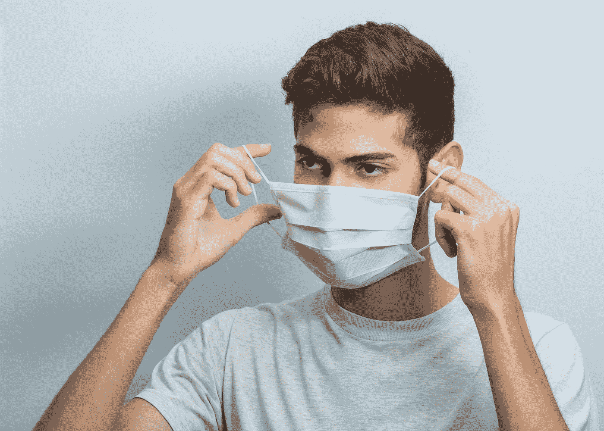
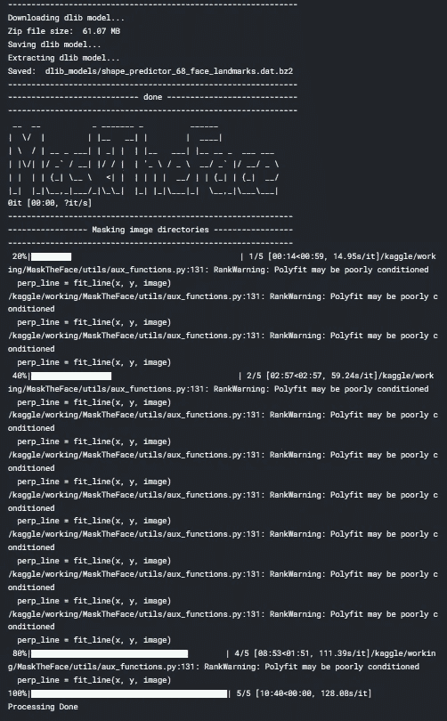
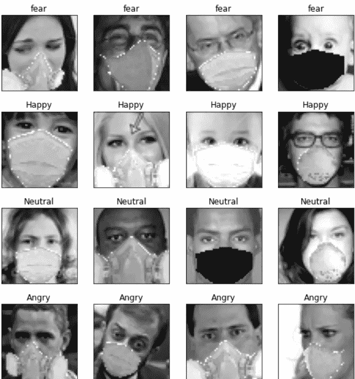
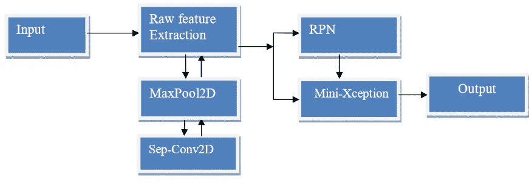
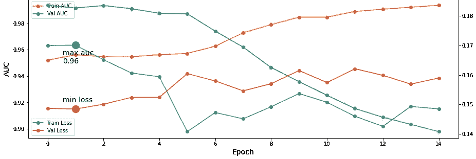
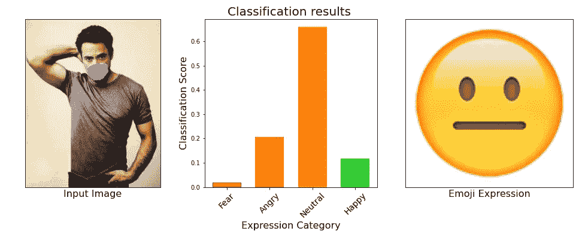

# 掩蔽人脸情感识别

> 原文：<https://medium.com/analytics-vidhya/masked-face-emotion-recognition-87e8ba08444b?source=collection_archive---------17----------------------->

科比·门德斯在 [Unsplash](https://unsplash.com?utm_source=medium&utm_medium=referral) 上的照片

在最近的 Covid 时代，我们被迫戴上面具。因此，我们很难识别他人的情绪。但是根据心理学，一个人可以从别人的眼睛里看到他们的情绪。作为在这些 covid 时代识别情绪的必要条件，利用只用眼睛检测情绪的知识，我们建立了一个深度学习模型，可以对面具背后的感受进行分类。这似乎是一个相当棘手的任务，但我扔给它，因为这是一个小时的需要。

# 数据集:

作为基础数据集，我使用了 [FER 数据集](https://www.kaggle.com/msambare/fer2013)。此数据集包含没有遮罩的面部。然后，我使用[mastheface . py](https://github.com/aqeelanwar/MaskTheFace)by[Aqeel an war](https://github.com/aqeelanwar)对数据集中的人脸应用遮罩。

MaskTheFace.py 正在处理中

图。一

在应用遮罩后，为了增加数据集的大小，我使用了一些增强技术，如随机翻转、对比、旋转、剪切混合等。…这产生了总共 100 万张图像，分为 4 个不同的类别——恐惧、愤怒、中立、快乐。在使用 masktheface.py 的时候，我有几个没有蒙版的图片——像在画图中，还有一个空蒙版。因此，我排除了这一点，这导致其他情绪的图像计数较少。所以我忽略了其他情绪，我已经创建了一个几乎平衡的数据集。

# 模型培训和评估:

对于这个数据集，我使用了一个受这篇论文启发的迷你例外模型。我微调了模型的参数，并训练了 1500 个纪元。我根据数据集微调了参数。该模型的主要目的是高精度地对人脸进行分类。

纸上的模型图

我使用 [auc](https://en.wikipedia.org/wiki/Receiver_operating_characteristic) 作为模型评估的主要指标。该模型被训练成 5 个折叠，auc 和损失图附在下面。

x 轴上的数字表示以 100 为单位的历元数。我们可以看到，最大 auc 在大约 100 个时期达到(确切地说是在第 95 个时期)。

x 轴上的数字表示以 100 为单位的历元数。我们可以看到，最大 auc 是在 100 个历元左右达到的(确切地说，是在第 95 个历元)。
经过五重训练后，我选择了在验证集上给出最佳 auc 分数的一个。我对其他数据集进行了生成和验证，结果相当不错。我在 JAFFE 和 karoli nska Directed Emotional Faces(KDEF)等其他数据集上取得了超过 90%的 auc 分数。我们的分类示例如下:

该模型在四个不同的班级中进行训练。它可以扩展到更多的类。

代码将很快在我的 [Github](https://github.com/vineeth-raj) 上发布。