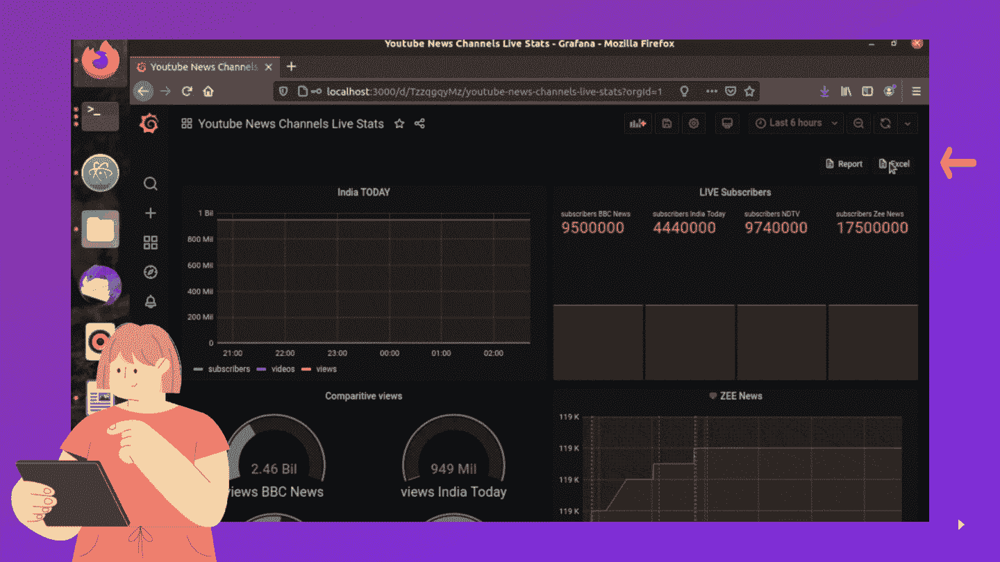

# Master InfluxDB:以 Excel 形式查询流入数据

> 原文：<https://medium.com/analytics-vidhya/master-influxdb-querying-influx-data-as-excel-80a0ccb427b8?source=collection_archive---------7----------------------->

[](https://levelup.gitconnected.com/master-influxdb-setting-up-a-plugin-dfb58adcbd15) [## 主 InfluxDB:设置插件

### 如果你还没有看过我介绍时间序列和 InfluxDB 的博客，这里是为了让你更好地了解…

levelup.gitconnected.com](https://levelup.gitconnected.com/master-influxdb-setting-up-a-plugin-dfb58adcbd15) 

> 难度:中等
> 
> 工具:Node.js，JavaScript，InfluxDB，Grafana，Telegraf

这是我掌握 InfluxDB 和时序数据库系列的第三篇文章。如果你还没有，你可以通过上面链接到我以前的文章来查看它们。

在处理流入数据时，如果只需点击一下就可以将数据下载为 excel 格式，那就太方便了。如果你很想创建一个 web 服务器，在那里你可以输入你的流量查询，并通过输入一个流量查询创建一个 excel 表格，那就留下来吧！我们将只使用 InfluxDB 和 Telegram 来收集和发送数据。如果您想从仪表板重定向用户，Grafana 是可选的。Node.js 将帮助我们创建 web 服务器，这非常重要。让我们开始吧。


资料来源:Fathima Maha

我介绍了 TICK Stack，即 tele graf-influx db-chrono graf-kapa citor。但是在这个实用程序中，我们将考虑用 Grafana 替换 Chronograf。Grafana 像 Chronograf 一样是一个可视化应用程序，可以从 InfluxDB 接收数据，并在查看数据时给我们更多的自由。在仪表板上嵌入链接就是其中之一，而且由于这是一个 web 服务器，它对我们来说是一个非常有用的工具。

要安装 Grafana，前往[https://grafana.com/docs/grafana/latest/](https://grafana.com/docs/grafana/latest/)。将它安装在您的系统上，并转到 [http://localhost:3000/](https://localhost:3000/) 或 https://<IP address>:3000/，选择源作为 InfluxDB，并使用具有所有访问权限的 API 令牌连接到您的 InfluxDB 服务器。通过输入您想要查看的仪表盘的 flux 查询(您也可以从 Chronograf 复制),您将能够在 Grafana 上看到您的仪表盘。

现在我们已经完成了 Grafana，让我们设置节点环境。

1.  在计算机上安装 Node.js。

2.为你的工作建立一个新的目录。

3.通过目录中的命令初始化项目:`npm init`

这将创建一个 package.json 文件，在该文件中我们可以看到项目的依赖项。

4.为我们的项目安装依赖项:

> influxdb-client:用于从 influxdb 中检索数据
> 
> exceljs:创建 excel 工作簿并添加数据
> 
> express:node . js 后端 web 应用程序框架
> 
> ejs:node . js 和 express 的模板引擎，呈现 HTML，并使之有可能处理从服务器返回的条件和访问变量
> 
> body-parser:从 web 服务器检索 post 请求数据

**行话:**

1.  post 请求是 web 服务器从用户那里得到的东西，在我们的例子中，我们将在我们的网站上输入一个查询，服务器将检索它。
2.  一个 web 框架只是一个开发网站的平台，在我们的例子中，我们将使用服务器作为你自己的笔记本电脑来托管网站。要注意的一点是，这个网站只能在你的电脑上访问，任何人都可以访问，它必须托管在云平台上。

要安装这些依赖项，请在工作目录中逐一运行这些命令:

```
npm install --save @influxdata/influxdb-client
npm install exceljs
npm install express --save
npm install ejs
npm install body-parser
```

5.为了您的方便，您刚刚创建的目录中应该包含的文件和代码在我的 Github 上。

将 *main_dir* 中的文件下载到您位于 https://github.com/fathimamaha/InfluxtoExcel[的目录下](https://github.com/fathimamaha/InfluxtoExcel)

由于这是一个快速教程，我将跳过文件的逻辑和代码。

我为熟悉 Node.js 和 JavaScript 的人附上 index.js 文件:

index.js 文件

您的目录现在应该如下所示:

```
↓ main_dir|_package.json|_package-lock.json|_env.js|_index.js|_↓ views |_index.ejs|_>node_modules
```

6.将 env.js 中的变量更改为 InfluxDB 变量。

7.最后，在您的终端上，打开工作目录并键入，

```
node index.js
```

web 服务器将运行在[http://localhost:4000/download](http://localhost:4000/download)或 https:<IP address>:4000/download。在我们工作时保持它运行，如果有任何错误，控制台将记录它。

唷！我们快到了。


8.前往您的 Grafana 仪表板。

转到仪表板设置>链接>新建。

放入类型: '链接'，标题:<name of="" your="" choice="" for="" the="" link="">(如:' Excel ')，图标:<icon of="" your="" choice="" for="" the="" link="">(如:' doc ')，Url:'[http://localhost:4000/download](http://localhost:4000/download)或 https:<IP address>:4000/download '。将“在选项卡中打开”选项切换到“开”。</icon></name>

保存仪表板后，您将能够看到一个带有您的标题的小图标，点击它会将您重定向到我们的 web 服务器。

最后，我们有了它，gif 展示了你如何快速得到一个 excel 工作簿来处理你所有的 flux 查询！



资料来源:Fathima Maha

如果你遇到任何错误，请发表评论。再见👾