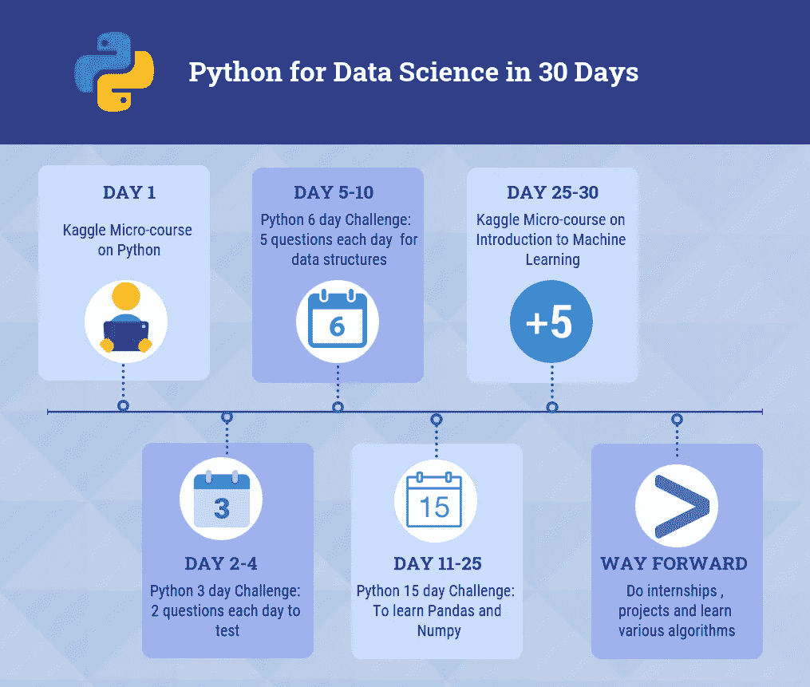

# 30 天掌握 Python 数据科学

> 原文：<https://medium.com/analytics-vidhya/master-python-for-data-science-in-30-days-66e7ec6132a6?source=collection_archive---------5----------------------->

> “信息是 21 世纪的石油，分析是内燃机。”——高德纳公司的彼得·桑德加德。

有没有想过为什么你会在 Youtube 或脸书或谷歌网站上看到与你当前搜索相关的广告？

你不认为这些广告让你更多地购买奢侈品而不是必需品吗？

就像碳足迹一样，每个人都有数字足迹。这些数字足迹被用来识别个人及其习惯。例如，谷歌收集每个人的位置、健康、浏览历史等数据。基于这些数据，他们能够决定人们对什么类型的广告感兴趣，并提供定制的广告和推荐。同样，许多公司收集顾客的数据，看他们如何增加销售或减少损失。所有这些都是利用数据科学完成的。数据科学是一个广义的术语，它使用科学的方法、算法和系统来提取有用的信息，并将其转化为有价值的见解。

随着数据收集的增加，分析数据变得非常重要。但是要做到这一点，你应该充分了解可用的工具以及如何使用它们。谈到数据分析、数据可视化、机器学习和数据科学，最受欢迎的编程语言之一是 **PYTHON** 。

## 为什么要用 Python？

主要原因是简单易懂，通用性强。此外，它是在 OSI 批准的开源许可下开发的，这意味着它可以自由使用和分发。除此之外，该软件还有一个支持社区和数百个包和库来帮助编码人员。

由于网上有大量的可用资料，大多数时候学习者倾向于做大量的在线课程和研讨会，但仍然不能培养用 Python 编码的信心。这背后的原因是缺乏实践和想象力。人们应该永远记住，想象力是编码的关键。如果你能想象你想要什么，你总是能编码它。所以，永远不要专注于记忆语法。它可以在谷歌上找到。专注于拓展你的想象力。尝试新事物。第一步应该是构思，然后想象，最后实施。不要只是复制粘贴解决方案。思考并理解编码。

我自己学 Python 也是费尽了心思。有这么多的课程和混合的评论，人们无法决定哪一个最适合。

## 那么，如何学习 Python 呢？

我参加了 Coursera、Udemy、Datacamp 等网站上的一些 Python 课程。从那次经历中，我可以说 Udemy 上 Andrei Neagoie 的《完全 Python 开发者:零到精通》是其中最好的。这位讲师知识渊博，并提供了一个很好的平台来联系志同道合的人(通过 Discord)，甚至合作为 Github 上的开源项目做出贡献。这是一门 31 小时的综合课程，涵盖了初级和高级 Python，以及 Python 开发人员的各种职业选择。它还有几个有趣的、小型的、有指导的 python 项目来测试你的知识。

要明白的最重要的一点是，仅仅参加课程不会让你成为专家。你必须付出额外的努力来掌握你所学的技能。

如果你从未做过任何编程，我会推荐你参加上述课程，然后遵循下面描述的 30 天计划。对于那些以前做过任何编程的人来说，遵循我在下面提到的路径。

# 30 天内超越 Python 的明智之路

永远记住熟能生巧。在编程中，实践让你理解语法并习惯它。为此，我在 Github 上做了一些库，供大家 fork(从 Github 复制库)和练习。这些练习将帮助你想象和编码。下面提到的每个存储库都有一个“README”文档，它将帮助您了解每天要做的事情。我甚至为每个人制定了一个学习和理解 Python 的 30 天计划。这个计划不仅会帮助你掌握 Python，还会帮助你提高你的简历，这反过来会帮助你在不久的将来获得实习机会。

因此，让我们深入了解路线图:

*(请先创建 Github 和 Kaggle 账户，然后再继续)*

**第一天:**上 Python 的 Kaggle 微课([https://www.kaggle.com/learn/python](https://www.kaggle.com/learn/python))。这将帮助您入门，并简要介绍 Python、其数据类型和基本命令。

**第 2 天到第 4 天:**跟随 Python 3 天挑战([https://github.com/Anjali001/Python3DayChallenge](https://github.com/Anjali001/Python3DayChallenge))。这将帮助您进一步理解 python 的基础知识，并让您开始 python 编程。

**第 5 天到第 10 天:**跟随 Python 6 天挑战([https://github.com/Anjali001/Python6DayChallenge](https://github.com/Anjali001/Python6DayChallenge))。在这 6 天中，您将深入了解如何使用各种数据类型以及它们为什么重要。

现在我们已经学习了 Python 的基础知识。这些基础知识将帮助您理解 python，并学习 Python 中可用的各种包。接下来，我们继续学习两个重要的数据分析和操作包:Pandas 和 Numpy。在数据科学中，这些包是每个人都应该知道的基本库。

**第 11 天到第 25 天:**跟随 Python 15 天挑战(【https://github.com/Anjali001/Python15DayChallenge】T2)。这个挑战为你将来看到的数据集做好了准备。导入包、常用功能、加载数据、处理数据框、处理缺失值、数据清理等。都包含在这个挑战中。一旦你做了这个挑战，你将超越这些库，并准备好做数据科学问题。

恭喜你！！

这些数据集的小练习可以增强你的理解，并在区分你的知识和其他知识方面发挥重要作用。

现在我们有了强大的 Python 基础，可以转移到机器学习部分。

**第 26 天到第 30 天:**在 Python 上做机器学习的微课([https://www.kaggle.com/learn/intro-to-machine-learning](https://www.kaggle.com/learn/intro-to-machine-learning))。这将有助于你了解它是什么以及如何去做。我个人也推荐你去做 Analytics Vidhya 的贷款预测免费课程([https://courses . analyticsvidhya . com/courses/loan-prediction-practice-problem-using-python](https://courses.analyticsvidhya.com/courses/loan-prediction-practice-problem-using-python))。我自己也做过，所以我可以向你保证，你会从这本书中得到很多关于如何处理机器学习问题的帮助。本课程将指导你完成假设、数据清理、数据工程、数据可视化、单变量和双变量分析，并最终制作一个 ML 算法。

提示:在解决一个 ML 问题时做笔记，这将帮助你习惯解决它的过程，并且记住各种算法的正确用法。

**前进之路**:为了进一步拓展你的知识面，我建议你做 Analytics Vidhya 平台上的练习题。我相信这些会帮助你练习机器学习的部分。

太棒了。！我们什么都学会了。

现在，准备好申请 Internshala 上的实习吧，别忘了把你的 Github 网站、Kaggle 证书和 Analytics Vidhya 练习题放在你的简历上。这肯定会帮助你在选择过程中占上风。

希望你喜欢。更多关于数据科学的文章，请关注我的媒体。如果你有任何问题，请在评论中留下。