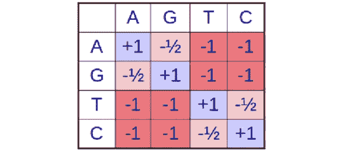

# 通过 BLAST 和 Karp-Rabin 算法匹配遗传序列

> 原文：<https://medium.com/analytics-vidhya/matching-genetic-sequences-through-the-blast-and-karp-rabin-algorithm-ffebc810a9d0?source=collection_archive---------14----------------------->

鸣谢:[新科学家](https://www.google.com/url?sa=i&url=https%3A%2F%2Fwww.newscientist.com%2Fterm%2Fdna%2F&psig=AOvVaw0S9mfrvxY30CvdMwS-05kX&ust=1613958825683000&source=images&cd=vfe&ved=0CA0QjhxqFwoTCKjIjKfv-e4CFQAAAAAdAAAAABAJ)

*注意:我将在这篇文章中大量引用大 O 符号；它本质上是讨论代码时间复杂度的形式化符号。如果你不确定什么是大 O 符号，我强烈建议在这里查看* [*链接*](https://www.freecodecamp.org/news/big-o-notation-why-it-matters-and-why-it-doesnt-1674cfa8a23c/) *。*

670 亿英里。这是人体内所有未折叠的 DNA 片段的长度。太不可思议了，如此简单的东西，**仅仅四个含氮碱基**，就能创造出如此复杂而精密的有机体。

在这 670 亿英里中，人类基因组中大约有 30 亿个这样的 DNA 碱基对，组成了最终控制我们的思想、行为和情绪等的遗传密码。

现在理解了人体的复杂性，也就理解了为什么科学家和数学家在努力理解这种遗传密码；有太多的信息需要筛选。

在一个典型的海滩上，碱基对比细沙还多！信用: [NPR](https://www.google.com/url?sa=i&url=https%3A%2F%2Fwww.npr.org%2Fsections%2Fkrulwich%2F2012%2F09%2F17%2F161096233%2Fwhich-is-greater-the-number-of-sand-grains-on-earth-or-stars-in-the-sky&psig=AOvVaw104Tgdoj1J3vZ0q_Yi2UxL&ust=1614034870452000&source=images&cd=vfe&ved=0CA0QjhxqFwoTCPiIqc6K_O4CFQAAAAAdAAAAABAD)

这些人面临的一个特殊问题是将特定的核苷酸串映射到整个人类基因组，这仅仅是因为潜在的时间复杂性。使用传统方法，计算机可能需要数年时间来筛选基因组，以找到一个特定的部分，因为它以二次时间或 O(n)运行。新的解决方案旨在通过在线性时间或 O(n)中筛选基因组来解决这个问题。

目前，有两种不同的解决方案大大降低了筛选基因组的时间复杂度:使用 Karp-Rabin 算法和散列的**线性时间精确字符串匹配**(将字符串精确匹配到基因组的一部分)和使用 BLAST 算法的**线性时间不精确字符串匹配**(允许一些核苷酸差异)。

在本文中，我们将回顾这些不同的算法，并具体讨论这些算法如何降低传统数据库搜索的时间复杂度。

# 线性时间精确字符串匹配

这一部分将致力于解决**在数十亿个核苷酸组中将精确的核苷酸序列与人类基因组匹配的问题。**这不同于不精确的字符串匹配，在不精确的字符串匹配中，我们可以允许一些不精确的改变，因为我们的目标是从进化的角度来解决它(稍后将详细介绍这个特定的主题)。

## 基本解

我们的目标是在长度为 *n* 的文本 *T* 中找到长度为 *m* 的模式 *P* 。最简单的解决方案就是**将模式滑动到文本中，并找到我们正在寻找的序列**。如下图所示，我们只需在文本 *T* 中缓慢滚动模式通过每个可能的长度 *m* 的连续组合，直到我们找到想要的组合。

从第一个数字开始，我们将找到一个长度为 *m* 的模式，并继续这个过程，直到我们到达第( *n-m* +1)个数字。然而，这种方法提供了一种非线性的解决方案，这种解决方案会成倍地恶化。

Karp-Rabin 基本解的算法解释示例。马诺里斯·凯利斯

## 模运算

随着模式长度 *n* 随时间增加，y 的计算可能导致不期望的时间复杂度。这可以通过**数学技巧在线性时间而非二次时间内计算 *y* 来解决。**

如果你仔细观察，你会发现下一个数字只不过是前一个数字移动了 1 加上另一个数字

我们可以使用三个运算使用先前的*y*计算当前的 *y* (在这个实例中将使用 23590 到 35902 的例子):

*   使用模数运算符删除最左边的数字(例如，23590 mod 10000 = 3590 →可以表示为 *y* mod 10^ *m* )
*   将所有数字向左移动(例如 3590 将变成 35900 →可以表示为 *y* x 10)
*   将新数字加到右边(例如 35900 + 2 = 35902 →可以表示为 *y* + *n* ，其中 *n* 是序列中的下一个数字)。

## 哈希算法——卡普-拉宾算法

当注意到我们要比较的序列通常比五个长得多时，第二个问题就出现了。当比较长度以百万计的字符串时，这种形式的比较将被证明是低效的。

为了确保最有效的比较，我们可以使用**散列**，这是一种将长度为 *m* 的字符串转换为更理想长度的方法(例如，将长度为一百万的字符串转换为长度小于十的字符串)。为了使用 Karp-Rabin 算法执行这种散列，我们对 *p* 取模进行所有的计算，其中 *p* 是一个选定的常数，该常数足够小，使得能够在恒定时间内进行比较。

*注意:为了使散列有效，需要将文本转换成数字格式。这可以很容易地用核苷酸来完成，通过分配腺嘌呤 0，胞嘧啶 1，鸟嘌呤 2 和胸腺嘧啶 3。*

哈希的例子。对于这些问题，我们将使用模运算符。鸣谢:[维基百科](https://www.google.com/url?sa=i&url=https%3A%2F%2Fen.wikipedia.org%2Fwiki%2FHash_function&psig=AOvVaw3xpOPtAPrETr2-C20JC7j8&ust=1614035316173000&source=images&cd=vfe&ved=0CA0QjhxqFwoTCPiX_qqM_O4CFQAAAAAdAAAAABAD)

例如，假设我们使我们的 *p* =13，我们想要散列数字 14152。由于 14152 mod 13 等于 8(由于模数运算符只计算两个数相除的余数)，因此我们有效地将长度为 5 的字符串转换为长度为 1 的字符串。

这种形式的散列是非常强大的，因为我们将要比较的序列通常会有**数千甚至数百万个核苷酸长**。通过使用散列法，我们能够将这些序列减少到仅仅一到两位数的长度，而不是 100。

模数 *p* 有效地**将任何序列限制在范围【0…p】，**内，而不管特定的比对是什么。与以前的方法相比，这些比较可以在更线性的时间内进行。

寻找有效匹配的模运算符示例。26 模 11 是 4。信用:[Java point](https://www.javatpoint.com/daa-rabin-karp-algorithm)

如上图所示，如果模式的哈希等于算法正在检查的特定字符串的哈希，则它们被认为彼此相等。这大大减少了比较时间，因为我们仍然在进行比较，只是数字的长度要小得多。

有两个主要特征有助于散列不同的序列以使它们的长度更小:

*   **再现性:**如果两个数字相同，那么它们的映射散列将另外保持相同。
*   **均匀输出分布:**不管特定的输入分布如何，输出分布必须保持均匀，这意味着散列中的每个数字被选中的概率相等。

数学运算的不变性允许再现性方面被覆盖；此外，模操作符有效地循环通过数的集合的方式，确保了相等的概率分布，满足了均匀的输出分布。

虚假命中的示例(不等于查询字符串)。信用:[Java point](https://www.javatpoint.com/daa-rabin-karp-algorithm)

**乱真命中**，与模式形成匹配的命中，即使它们是不同的，在散列函数时必然会发生。例如，14 mod 13 和 27 mod 13 产生相同的 1 的散列，即使它们是不同的值；这会导致未来的许多问题。

在上图中，您可以认出这是我们的 26 位模式，而我们检查的 15 位字符串产生了相同的散列值 4，尽管它们是不同的值。这造成了许多不必要的假阳性，会破坏我们算法的有效性。

为了避免这个问题，只需**用未散列查询**检查原始未散列数。尽管我们正在以较慢的时间复杂度进行比较，但我们是在比以前更小的一组数字上进行的。

这种改变的 Karp-Rabin 算法提供了预期的线性运行时间，因为考虑到值 *p* 被仔细选择，假命中的概率在整个序列中保持很小。

时间复杂度最小化的最终 Karp-Rabin 算法。

## 受过训练的字符串匹配

与这个最终确定的 Karp-Rabin 算法一起，**训练的字符串匹配**可以用于将时间复杂度降低到 O( *n* )时间。

如前所述，最初的解决方案只是简单地将长度为 *m* 的字符串与数据集内的字符串进行逐个字符的比较，以找出数据中存在哪些模式，然后以低效的方式不断循环这些字符串。这产生了一种算法，其运行的时间复杂度为 ***O(m * n)* 时间**，其中 *n* 是模式的长度。

数据库搜索中的朴素字符串匹配算法。

如果已经发现不匹配，可以通过简单地停止比较来对该算法进行轻微的改变；然而，在最坏的情况下，如果我们比较的字符串匹配整个序列，这仍然导致缓慢的 O( *m * n)* 时间复杂度。

使用与上述模运算类似的思想，我们可以**从上一次字符串比较中获取冗余，并在当前字符串比较中使用它**。利用这一点，我们可以对目标序列进行比以前大得多的移动。这导致了所需比较次数的减少，从而导致线性运行时间为 O( *n* )。

受过训练的字符串匹配算法。

如上图所示，使用目标数据库中的字符串对模式进行正确分类时，可以跳过三个空格，因为我们知道接下来的三个字符串是不匹配的。我们可以把第二、第三和第四个字母分别归类为‘b’、‘c’、‘d’，证明这些字母都不能等于‘a’，导致不匹配。

**受过训练的字符串匹配可以与 Karp-Rabin 算法**一起使用，以产生有效的数据库查询搜索，并导致快速计算，从而导致线性时间复杂度。

# 线性时间不精确字符串匹配

在不精确的字符串匹配中，我们将主要关注寻找仅相差几个核苷酸的相似基因序列的问题。这对于在基因组中寻找**进化序列**特别有用。

进化过程的三种突变。学分:[莱斯特大学](https://www.google.com/url?sa=i&url=https%3A%2F%2Fwww2.le.ac.uk%2Fprojects%2Fvgec%2Fschoolsandcolleges%2Ftopics%2Fgenetics-mutation-and-cancer&psig=AOvVaw11MsgLB-Amb83an_mjnXiq&ust=1614038188749000&source=images&cd=vfe&ved=0CA0QjhxqFwoTCPie9v2W_O4CFQAAAAAdAAAAABAD)

当经历进化过程时，无论是通过**插入**(添加一个核苷酸)**删除**(删除一个核苷酸)，还是**替换**(将一个核苷酸字母改为其他三个中的一个)，人类基因组中的一些核苷酸都会发生变化，这是有道理的。

BLAST 算法解释了这些过程，因为它在整个人类基因组中找到了相对不精确的字符串。

## 一些考虑

BLAST 算法利用了其将检查的大多数目标序列将与目标序列**不相关的特殊性质。**

因此，如果您正在寻找长度为 1，000 的序列，并且您拒绝某些不到 95%相同的匹配，那么您可以简单地跳过不包含连续 50 个核苷酸的序列，因为您知道这些将是整个字符串的错配。

鸽子洞原理的可视化表示。信用:[中等](https://www.google.com/url?sa=i&url=https%3A%2F%2Fmedium.com%2Fcantors-paradise%2Fthe-pigeonhole-principle-e4c637940619&psig=AOvVaw2_fBSS5j2qh8xEQugWIVz0&ust=1614038311538000&source=images&cd=vfe&ved=0CA0QjhxqFwoTCJCPhr-X_O4CFQAAAAAdAAAAABAD)

这是一个极其重要的属性，因为它允许我们跳过某些与目标模式完全无关的序列。这与众所周知的**鸽子洞原理**类似，该原理指出，如果有 *n-1* 只鸽子适合进入 *n* 个洞，则至少有一个洞没有鸽子。鸽子洞原理是数学中一个令人惊叹的应用，所以如果你有兴趣阅读更多，请查看这个[链接](https://www.geeksforgeeks.org/discrete-mathematics-the-pigeonhole-principle/)。

描述不同物种在进化过程中哪些区域是保守的。鸣谢:[维基百科](https://www.google.com/url?sa=i&url=https%3A%2F%2Fen.wikipedia.org%2Fwiki%2FConserved_sequence&psig=AOvVaw2k7SsgIY84dsRtKya29GEr&ust=1614038401673000&source=images&cd=vfe&ved=0CA0QjhxqFwoTCJi-raGh_O4CFQAAAAAdAAAAABAD)

BLAST 算法考虑到主要在功能 DNA 的区域中会有相似性(或**保守区域**)的延伸，因此它不需要检查整个字符串进行比较，而只需要检查功能 DNA 的簇。保守区域是在进化过程中保持不变(没有突变)的区域。

与此同时，BLAST 算法对数据进行预处理(使用哈希和本文稍后讨论的其他技术),以便在 O( *n* )时间内轻松找到长度为 *n* 的模式。

## BLAST 算法过程

BLAST 算法将长度为 *n* 的查询/模式分割成长度为 W 的重叠单词，称为 **W-mers** 。例如，如果查询词(例如 ATCGCGATA)的长度为 *n=9* 并且 W=3，那么我们将有三个三聚体用于查询(ATC、GCG 和 ATA)。

将查询拆分成这些词之后，算法会为每个词找到一个相似词的邻域。因此，举例来说，如果有一个 ACG 的三聚体，那么这些单词中的一些将包括 ATG、ACA 和 TCG，因为它们与原始的 W-mer 几乎没有什么不同。我们不断修改这些序列，直到它们低于预定义的阈值 *T.*

将原始序列放入哈希表的示例。学分:[莱斯大学](https://www.google.com/url?sa=i&url=http%3A%2F%2Fwww.cs.rice.edu%2F~ogilvie%2Fcomp571%2F2018%2F09%2F04%2Fblast-fasta.html&psig=AOvVaw1CjuAyAKx-5VXr2tnH_CoY&ust=1614041207893000&source=images&cd=vfe&ved=0CA0QjhxqFwoTCKCBipmi_O4CFQAAAAAdAAAAABAj)

这些子串随后被存储在一个**散列** **表**或一个 **W-mer 数据库**中，其中存储了所有的邻近单词和原始单词。这允许邻居与原始模式大致相似。这些不同的字符串中的每一个都有不同的散列(使用上面显示的散列方法)，通常称为**种子**。这些散列使用与 Karp-Rabin 算法相似的过程。

为了找到比对，我们只需使用我们的集合扩展种子，直到我们的**比对分数**(一个衡量结果种子与数据库字符串相似程度的分数)低于某个阈值 x。我们将进一步讨论它最初是如何精确计算比对分数的。注意，X 和 T 是不同的，因为 X 表示整个原始模式和新发现的种子集合之间的相似性，而 T 只是检查原始 W-mer 和相邻 W-mer 之间的相似性。

w、T 和 X 是**超参数**，这意味着它们可以被相应地调整以更好地适应模型。例如，增加 W 可以导致更少的虚假命中，但是由于比以前更大的哈希表和更少的实际命中，它也可以导致更大的空间复杂度。**在增加或减少它们之前，确保认识到其中每一个的权衡。**

BLAST 算法的工作流程。

## BLAST 算法的扩展

虽然 BLAST 算法是计算生物学领域中最著名和引用最多的算法之一，但是可以进行一些修改来增加模型的复杂性并减少虚假命中的数量。

想要减少查询规模的科学家经常使用过滤。如果查询具有**低复杂性区域**，或相同核苷酸的区域(例如 GC、A 等的重复序列)。)，并且数据库具有长段的相同核苷酸组，那么将会有许多不必要的命中，这会搞乱算法。因此，通过简单地过滤掉这些低复杂度区域，我们可以减少这些命中，并且只生成有意义的命中。

另一方面，为了产生更多的**命中**(不是虚假命中)，我们可以使用**两次命中爆炸**，其中我们**散列两个小 W-mer，而不是简单地散列一个长 W-mer。**通过将 W-mer 一分为二，我们可以找到更小的相似区域，并获得更高的灵敏度。此外，由于 W 随后减小，因此寄生命中减少。

最后，**梳**在找出原始数据库字符串中有用的核苷酸部分时特别有用。梳子的工作原理是**去除我们不关心的核苷酸，只关注我们关心的核苷酸**。例如，我们可以考虑忽略三联体中的第三个核苷酸(因为它们通常对氨基酸的表达没有影响)。我们可以将它表示为 110110…的按位序列，其中 1 表示核苷酸，而 0 隐藏它。

这些梳也可以随机决定，其中每个第 *n-* 个核苷酸将具有由概率矩阵确定的被隐藏的概率。这种方法通常被称为**随机投影**，它大大增加了在数据库中找到匹配的概率。

# 序列比对概率

BLAST 算法使用**评分矩阵**来确定种子集合是否与目标图案或数据库中呈现的图案大致相似。这允许我们基于事实矩阵来评估比对中的某些错配。

评分矩阵以两个假设为中心，这两个假设试图将两个序列显示为**同源**，这意味着它们因其相似的核苷酸而拥有共同的祖先:

*   排列是偶然的，序列是不相关的。
*   这种结盟是由于一个共同的祖先，他们是有血缘关系的。

为了构建特定的评分矩阵，我们将查看这两种假设的概率之间的比率。使用两种主要的评分矩阵:核苷酸评分矩阵和氨基酸评分矩阵。虽然氨基酸评分矩阵通常更多地用于 BLAST 算法，但是理解核苷酸评分矩阵将给予我们计算分数背后必要的一般直觉。

## 了解核苷酸评分矩阵

核苷酸评分矩阵示例。

如上所示，该核苷酸评分矩阵主要基于不同核苷酸之间的相互作用和错配发生的可能性来定义。例如,+1 表示在整个进化过程中保持不变的核苷酸，这意味着它们不会改变。

还表明，As 和 ts 之间的转换比 As 和 Gs 之间的转换具有更大的权重；Ts、Cs 和 Gs 也有类似的情况。为什么会这样呢？这主要是由于某种核苷酸碱基突变成另一种碱基的进化可能性。

A 突变成 G 是有道理的，因为它们属于同一个嘌呤家族，而不是属于 T2 嘧啶家族的 T 或 C。在家族间变异比在家族间杂交更容易。因此，它的负数比其他的要小。

请注意，负数越大，表示人体内发生当前突变的**可能性越小。**由于从 A 到 G 的突变比从 A 到 T 的突变更常见，所以它的负数会比后者低。

## 氨基酸评分矩阵

将三核苷酸对转换成氨基酸的通用表格。信用:[性质](https://www.google.com/url?sa=i&url=https%3A%2F%2Fwww.nature.com%2Fscitable%2Ftopicpage%2Fnucleic-acids-to-amino-acids-dna-specifies-935&psig=AOvVaw2TQu7Axj4G8SBLYxGCJzIv&ust=1614041446519000&source=images&cd=vfe&ved=0CA0QjhxqFwoTCJDgj4-j_O4CFQAAAAAdAAAAABAD)

氨基酸相互作用/突变概率比核苷酸相互作用更难量化；因此，我们需要实现一种不同的方法，而不是使用简单的直觉，如核苷酸替换表。请记住，我们将主要使用**氨基酸评分矩阵进行 BLAST 算法，**因此，我们拥有一个准确的索引非常重要。

通过使用数学运算和使用上面定义的两个假设理解概率方面，我们可以通过使用已知概率计算分数来确定这个替换矩阵。

如果您对这背后的数学推理感兴趣，我强烈建议您查看这个[链接](https://bio.libretexts.org/Bookshelves/Computational_Biology/Book%3A_Computational_Biology_-_Genomes_Networks_and_Evolution_(Kellis_et_al.)/03%3A_Rapid_Sequence_Alignment_and_Database_Search/3.07%3A_Probabilistic_Foundations_of_Sequence_Alignment)，但是出于本文的目的，我将把这些计算留在这里。不同氨基酸对 *a* 和 *b* 的最终置换矩阵得分可由下式给出:

分子讨论了**某些进化过程将 a 变成 b** 的可能性，而分母讨论了氨基酸 *a* 和氨基酸 *b* 在基因组内部的**可能性。**

使用上面给出的置换得分公式，我们可以制作氨基酸的置换矩阵，允许更精确的氨基酸得分矩阵，类似于所示的核苷酸。

一个氨基酸替代矩阵的例子(BLOSUM62 矩阵)。

# 应用程序

计算机在理解 DNA 方面的应用是巨大的！信用:[爱车](https://www.google.com/url?sa=i&url=https%3A%2F%2Fwww.aiche.org%2Fchenected%2F2014%2F10%2Fimportant-breakthrough-dna-computing&psig=AOvVaw0yleqF9Xtpd5txzLcKDIok&ust=1614026871417000&source=images&cd=vfe&ved=0CA0QjhxqFwoTCKD9quvs--4CFQAAAAAdAAAAABAJ)

比对基因序列在医疗保健领域有相当大的应用。这不仅可以用来理解人类和其他物种的进化过程，还可以用来**将特定的已知 DNA 片段与人类基因组内部发现的片段进行匹配。**

了解这种比对可以为更多地了解人类基因组铺平道路，并允许更个性化的策略以及对某些突变的潜在治疗。

序列比对及其计算生物学的支配性领域是一个快速发展的领域，我很高兴看到 BLAST 算法和 Karp-Rabin 算法如何被定制以进一步降低时间复杂性。请在下面的评论中告诉我你的想法！

# TL；速度三角形定位法(dead reckoning)

*   序列比对可以通过分别使用 Karp-Rabin 算法和 BLAST 算法的精确或不精确的字符串匹配来进行。
*   Karp-Rabin 算法旨在使用熟练的模和算术运算以及散列函数来降低将精确的核苷酸序列与人类基因组匹配的时间复杂度。
*   BLAST 算法将查询拆分为称为 W-mer 的重叠单词，根据该 W-mer 构建相似的单词，并使用相似的哈希函数来降低匹配更不精确的序列和模式的时间复杂度，以理解进化过程。
*   BLAST 算法有多种扩展，如过滤、两次 BLAST 和组合，这些扩展修复了 BLAST 算法实现中的小生境问题。
*   BLAST 算法使用评分矩阵来匹配两个氨基酸/核苷酸的比对，以反映两个序列是否同源(它们是否有共同的祖先)。

# 额外资源

*   [计算生物学:基因组、网络、进化麻省理工学院课程 6.047/6.878 教材](https://ocw.mit.edu/ans7870/6/6.047/f15/MIT6_047F15_Compiled.pdf)(为了更好地全面理解计算生物学这个新兴领域)
*   [鸽笼原理](https://www.geeksforgeeks.org/discrete-mathematics-the-pigeonhole-principle/)(理解 BLAST 算法优化背后的直觉)
*   [序列比对的概率基础](https://bio.libretexts.org/Bookshelves/Computational_Biology/Book%3A_Computational_Biology_-_Genomes_Networks_and_Evolution_(Kellis_et_al.)/03%3A_Rapid_Sequence_Alignment_and_Database_Search/3.07%3A_Probabilistic_Foundations_of_Sequence_Alignment)(了解 BLAST 算法背后的置换矩阵)
*   [BLAST 的高效平方根算法](https://ieeexplore.ieee.org/abstract/document/859065/)(BLAST 算法背后的原创研究论文)

*嗨！我今年 16 岁，目前对机器学习和生物技术领域感兴趣。如果你有兴趣看到更多我的内容和我发布的内容，可以考虑订阅我的* [*简讯*](https://forms.gle/gdCammxd628UTQ9j9) *！查看我的一月简讯* [*这里*](https://preview.mailerlite.com/t9c2v5) *！还有，看看我的*[*LinkedIn*](https://www.linkedin.com/in/karthikmittal/)*和*[*Github*](https://github.com/karthikm15)*页面。如果你对个人心态感兴趣，或者只是一般的东西，使用我的* [*日历*](https://calendly.com/karthikmittal306) *注册聊天。*