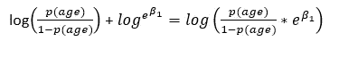

# 逻辑回归背后的数学

> 原文：<https://medium.com/analytics-vidhya/math-behind-logistic-regression-4c8ecb106fb2?source=collection_archive---------8----------------------->

在我们理解逻辑回归中使用的奇怪符号之前，让我们回忆一下这种技术的基本思想。

> 逻辑回归是一种广泛用于分类问题的机器学习技术。

上面的定义表明该算法对于除分类之外的问题也是有用的，例如回归。但是本文将只围绕分类展开。

> 一个分类问题是什么样子的？

假设我们做了一项调查，询问印度男性的年龄和婚姻状况。令我们惊讶的是，我们随机选择的男性要么已婚，要么未婚——没有离婚者或鳏夫。

然后，我们将数据编译成表格形式，如表 1 所示。

表 1:印度男性的婚姻状况

显然，这项调查包括了 16 岁至 36 岁的男性。年龄条目的零(' 0 ')表示该男子“未婚”。同样，1 表示相关的男人已经“结婚”了。

> 你会如何看待一个 29 岁的男人？已婚还是未婚？

上面问的问题是一个典型的分类问题，逻辑回归有望解决。

> 逻辑回归对分类问题没有直接的答案。

是的，不要指望逻辑回归会以一种直截了当的方式回答问题。相反，逻辑回归说:

> 假设一个男人 29 岁“结婚”的概率是 ***p*** ，其中 ***p*** 是介于 0 和 1 之间的数，包括 0 和 1。

在数学语言中，上面引用的语句可以表示为:

Pr(status= '已婚' |age=29)或者简而言之就是 **p** (age=29)，其中 **p** 是一个概率值，基本上位于 0 和 1 之间(包括 0 和 1)。

如果我们将表 1 中的数据绘制成 X 轴上的年龄和 Y 轴上的状态，然后在这些数据上拟合一条线，我们将得到如图 1 所示的结果。

图 1:地位与年龄(线性回归和逻辑回归)

图 1 中显示的红色虚线标记了概率值 0.5。棕色线与 X 轴成 45 度角(大约),是通过普通最小二乘法(OLS)将状态回归到年龄后得到的拟合线。棕色线提供了一个吸引人的方法，根据年龄对印度男性的地位进行分类。例如，要找到一个 25 岁男子的类别，我们在 X 轴上画一条穿过标记 25 的垂线。垂线可能会在状态值为 0.3 的点处接触棕色线。因此，对于一个 25 岁的男人来说，他结婚的概率是 0.3。现在这取决于我们，我们认为 0.3 的概率值足以将一个男人归类为已婚或未婚。最合理的阈值是 0.5，即如果 **p** (年龄=25)值大于 0.5，我们就把一个男人归为已婚；否则，未婚。

> 这种基于线性回归的分类方法存在问题。

1.  对于年龄值 16 和 18，相应的状态值为负，这是不可接受的，因为概率值永远不会为负(或大于 1)。
2.  你可能会说，如果我们用 0 代替负值，用 1 代替大于 1 的值，那么问题就解决了。不，问题不会得到解决。在这种情况下，误差值不会呈正态分布，因为只有两个响应值。为了执行线性回归，假设误差项必须是正态分布的。这种假设是违反的。

这种数学上的尴尬局面是可以避免的，如果我们对任何实数域使用一个保证其范围限制在 0 和 1(包括 0 和 1)之间的函数。

其中一个功能是“逻辑功能”。逻辑函数有其签名的“S”曲线，如图 1 中绿色所示。可以看出，对于较小的年龄值，棕色线给出负值，但绿色曲线从未侵入负区。逻辑函数的形式如图 2 所示。

图 2:逻辑功能

类似于图 1 所示棕色线的候选线将具有以下形式的方程:

图 3:地位和年龄之间的线性方程

由于图 2 中的 RHS 总是给出一个在[0，1]范围内的数字，因此，我们可以认为 f(X)是概率值。从图 1 中，我们可以看到逻辑曲线提供了每个年龄值的概率(或状态值)。根据这些信息以及图 2 和图 3 中的等式，我们写出

图 4:主方程

现在剩下的唯一任务是估计图 4 所示等式中的参数β0 和β1。在逻辑回归中，估计参数最常用的方法是“最大似然”法。

> 最大似然法的工作原理是找到两个参数β0 和β1，使主方程(图 4)中的概率值尽可能接近实际状态值。

应用最大似然法后，我们得到的两个值是β0=-9.8 和β1=0.33。将这些参数值放入表 1 中不同年龄值的主方程中，我们得到表 2。我们使用 0.5 的阈值，即任何大于 0.5 的概率值将意味着预测的状态是 1(已婚)；否则男方未婚。

表 2:使用阈值 0.5 预测的概率和状态

我们观察到预测的状态值非常类似于实际的状态值，并且对于给定的数据，训练的模型具有(10/12)*100=83.3 %的准确度。我们绘制了表 2 中的概率值，以获得图 1 中的绿色曲线。

> 计算决策边界

超过 0.5 的概率值，我们将男性归类为已婚(或 1)，在 0.5 或以下，我们将其归类为未婚；所以我们把 p(年龄)=0.5 放在主方程里。我们得到，年龄=-β0/β1。对于，β0=-9.8，β1=0.33，我们得到年龄=29.7，即对于给定的问题，决策边界在年龄=29.7，这从图 1(黑线)中可以明显看出。请注意，这里的决策边界只是一个点，因为只有一个预测值，如果预测值是二维的，则同样是一条线，等等。

> 模型解释

从图 4 中的主方程，我们可以得到

图 5:奇怪的形式

在图 5 给出的等式两边取自然对数，我们得到:

图 6:对数奇数形式

图 5 中的 LHS 称为赔率。这些赔率提供了一种赌博式的方法来表示成功的可能性。举个例子，如果我说我的马有 2/1 的赔率赞成赢得当前的比赛，你的解读应该是在三场比赛中，这匹马会赢两场，输一场。图 6 的 LHS 给出了比值的对数或对数-比值(或 logit)。我们看到，逻辑回归模型(图 4)的 logit 在年龄上是线性的。

*推导图 6 中方程的目的是，该方程为我们提供了一条符合 logit 的直线；这比针对概率拟合非线性“S”形曲线更方便。*

> 如果年龄改变一个单位，logit 将改变β1 个单位。

由于，β1 可以表示为 log(e^β1)，我们说年龄的一个单位变化将几率乘以 e^β1(图 7)。

图 7:年龄的一个单位变化乘以 e^β1 的几率

> 如果有两个或两个以上的预测者呢？

如果您的数据集中有多个预测值，您将调整线性方程并相应地添加参数和预测值。例如，如果你的数据集中有三个预测因素(年龄、工资和性别)，线性方程将采用以下形式:

图 8:三个预测因子的线性方程

图 4 中的主方程也将相应地改变。

> 如果有两个以上的响应类怎么办？

虽然逻辑回归中的两类分类机制可以扩展到多类分类，但在这种情况下模型的参数估计往往是不稳定的。因此，我们求助于其他分类技术，如线性判别分析。

> 在逻辑回归的情况下，成本函数是什么？

我们进行逻辑回归的目的是从图 4 的等式中找出参数β0 和β1。

虽然β0 和β1 可以取无穷多个值，但我们应该估计参数的最佳可能值。为此，我们需要将一些寻找最佳可能值的标准映射到数学函数中。我们进一步优化该函数，以获得β0 和β1 的最佳可能值。

这里的标准是“β0 和β1 应该是这样的:对于响应为 1 的所有观测数据，主方程中的 LHS 应该尽可能接近 1，对于响应为 0 的所有观测数据，主方程中的应该尽可能接近 0”。

让我们理解并细化我们刚刚讨论过的部分标准:

第 1 部分:对于我们数据中所有响应为 1 的实例，如果我们将概率值(图 4 中的 LHS)相乘，乘积应该尽可能接近 1。

第 2 部分:对于我们数据中的所有响应为 0 的实例，如果我们将概率值(图 4 中的 LHS)相乘，乘积应该尽可能接近 0。或者，如果我们将 1 个概率值相乘，乘积应该尽可能接近 1。

第 3 部分:第 1 部分和第 2 部分的乘积应尽可能接近 1。

第 3 部分在数学上可以表示为:

图 9:可能性函数

这里，“L”代表似然函数。

图 9 中的等式可以更方便地写成:

图 10:似然函数(方便的形式)

让我们也取图 10 中等式两边的对数，我们得到:

图 11:图 10 中等式的对数似然版本

这里，'ℓ'是对数似然函数，统计学家更喜欢用它来优化。

{ **注意**ℓ是β0 和β1 的函数，从图 4 的等式中放入 p(age)就可以出现在图 11 的等式中。}

因此，'ℓ'代表收益函数(与成本函数相反)，为了获得参数β0 和β1 的值，收益函数必须最大化。