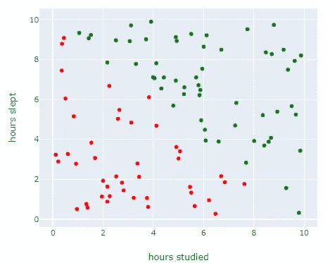
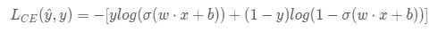
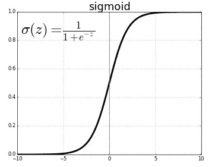
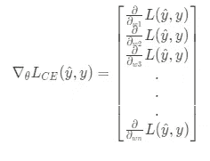

# 逻辑回归背后的数学将使你成为一名数据科学家(希望如此)

> 原文：<https://medium.com/analytics-vidhya/math-behind-logistic-regression-that-will-make-you-a-data-scientist-2bce20ea53fd?source=collection_archive---------12----------------------->

由 [Maksym Kaharlytskyi](https://unsplash.com/@qwitka?utm_source=unsplash&utm_medium=referral&utm_content=creditCopyText) 在 [Unsplash](https://unsplash.com/s/photos/logistic?utm_source=unsplash&utm_medium=referral&utm_content=creditCopyText) 拍摄的照片

在多次数据科学家访谈中，有几个问题是我经常被问到的，其中一个是“解释逻辑回归是如何工作的”。我在很高的层次上理解这个概念，并且知道如何实现它，但是当我被要求解释“什么是 sigmoid 函数”，“逻辑回归使用什么成本函数，为什么？”时，我被卡住了等等……我无法回答他们。此外，即使你不同意面试中经常被问到的事实，深入了解逻辑回归的工作原理也是有帮助的，因为它是复杂算法如多神经网络的基础。

我们将按照以下步骤进行逻辑回归:

1.  什么是逻辑回归
2.  如何训练模型
3.  如何用训练好的模型进行预测

# 什么是逻辑回归？

*   二元分类算法→标签有“是或否”、“真或假”、“1 或 0”等…
*   类似于线性回归，它们首先计算输入的加权和(z ),但是不同之处在于，`z`不是直接输出，而是传递到 sigmoid 函数，该函数输出给定 x 属于正类的概率(你想要的类，例如:如果你想要对癌症进行分类，则标记为“癌症”的类是正类)。
*   当数据集很大时，它对相关特征是鲁棒的，因此用在朴素贝叶斯分类器上。

# 模特培训

基本上，它的工作方式与线性回归相似，最重要的部分是为每个特征(x 变量)找到正确的**权重**，即在给定成本函数时输出最小成本的权重(x0w0 + x1w1 + … + xnwn)，注意 x0w0 是**偏差项(又名截距)**。

训练逻辑回归可以分为两个部分:

1.  成本函数:计算预测产量和真实产量之间的距离。在我们的例子中，我们将使用**交叉熵损失**作为我们的成本函数。
2.  梯度下降:迭代更新权重以最小化成本函数的优化算法。

让我们导入依赖项并创建示例数据集，该数据集简单地用对角线分隔，右上角的学生“通过(1)”，左下角的学生“未通过(0)”。我们将使用定制的逻辑回归模型来预测学生的学习时间和睡眠时间是否合格。

上面创建的数据如下所示:

现在，我们需要计算每个数据的交叉熵损失，但是什么是**交叉熵损失**？

交叉熵损失

注意，`(w⋅x +b)` 其中`b=w0x0`是输入到 **sigmoid 函数**的特征的加权和，该函数然后输出属于类 1 的给定 X(数据/学生)的预测概率，为了找到属于类 0 的 X 的概率，我们做`1-prob(class 1 | X)`。为了计算成本，我们将类别 1 和 0 的对数似然性相加，然后乘以-1，类别 1 的对数似然性= `log(**σ**(z))` 和类别 0= `log(1-**σ**(z))`。

在用 python 实现之前，下面是 **sigmoid 函数**的样子:

它允许我们将`z`的[-inf，+inf]值映射到范围[0，1]。

上述等式应用于每行数据，在应用于所有行之后，它们的平均值就是一次迭代的**成本，我们反复迭代，直到找到全局最小值(收敛)。**

概述:**梯度下降**是一种通过计算出函数的斜率在哪个方向(在 n_feature 空间中)上升最陡，然后向相反方向移动直到斜率= 0，从而找到函数最小值的方法。

**坡度**是一个矢量，它指向坡度增加最大的方向，而**下降**意味着在坡度的相反方向下降。

通过对成本函数相对于其特征进行偏导数来计算每个特征的斜率。梯度被定义为这些偏导数的向量。

我们用(learning_rate * gradient_vector)减去前一个权重向量，然后得到新的权重向量，输入到下一次迭代过程中，重复这个过程。

在代码中实现梯度下降，以下代码参考自[https://ml-cheat sheet . readthedocs . io/en/latest/logistic _ regression . html # training](https://ml-cheatsheet.readthedocs.io/en/latest/logistic_regression.html#training)

现在让我们用目前所学来训练逻辑回归模型。因为我们的数据很小，所以我们用 90%的数据进行 100 次迭代的训练。

运行以上代码输出权重= [-0.33614273，0.00188673，0.10463643]也就是我们的`z = -0.336(bias) + 0.0019(studied) + 0.105(slept)`。现在，当给定新生的睡眠和学习时间时，我们可以使用以下三个步骤进行预测:

1.  用我们学习的重量计算`z`
2.  将`z`传递到 **sigmoid 函数**中，以获得学生通过的概率
3.  通过的概率被输入到**决策函数(阈值)**，该函数输出标签(“通过或失败”)。例如:给定 0.5 阈值，低于 0.5 的概率将输出“失败”标签，大于 0.5 的概率将输出“通过”标签。

# 预言；预测；预告

现在有了 10%的数据，我们将计算模型的表现，在给定学生睡眠和学习时间的情况下，我们的模型预测“通过或失败”有多好。

运行上面的代码使用 0.9 的精度值，这意味着我们的模型在 90%的时间是正确的。

请注意，accuracy_score 不是衡量分类模型性能的合适指标，尤其是在不平衡数据中。例如，在尝试识别癌症是恶性还是良性时，由于癌症的罕见性，仅仅通过猜测所有患者都是良性的就可以很好地进行预测。在这种情况下，我们必须考虑精确度、召回率、f1 分数和混淆矩阵(另一个博客的主题)。

就是这样，我们已经编码了从训练逻辑回归到使用学习到的特征权重和偏差进行预测的所有内容。

总之，我认为逻辑回归在幕后有非常简洁的数学运算。我希望每个人都花时间真正理解正在发生的事情，不仅仅是为了采访，而是因为理解经常使用的工具中发生的事情很有趣。

参考资料:

*   [关于逻辑回归的 ml-cheatsheet 文档](https://ml-cheatsheet.readthedocs.io/en/latest/logistic_regression.html)(推荐)
*   斯坦福的教科书(推荐)
*   安德鲁·吴的斯坦福演讲
*   [KrishNaik 的 Youtube 视频](https://www.youtube.com/watch?v=uFfsSgQgerw&ab_channel=KrishNaik)
*   [https://developers . Google . com/machine-learning/速成班/逻辑回归/模型培训](https://developers.google.com/machine-learning/crash-course/logistic-regression/model-training)
*   [如何选择梯度下降的初始权重](https://gist.github.com/avidale/a640f7a8e353d9efdd79385e277caef1)