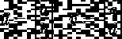

# 机器学习的数学——第 1 部分

> 原文：<https://medium.com/analytics-vidhya/math-for-machine-learning-part-1-582419c00932?source=collection_archive---------1----------------------->

你们中的许多人可能一直想学 ML，或者转行。但是对涉足数学基础的恐惧总是会让你远离探索这个主题。来自编程背景的我，因为数学不敢踏入 ML。但是一旦我真正开始理解这些概念，我就能够毫无畏惧地探索更多的内容。

这个系列是我的#30DaysOfData 学习之旅的一部分，在这里我致力于学习数据分析和机器学习。一定要看看[我的 GitHub 库](https://github.com/swaathi317/30DaysOfData)一起学习。

祝你在学习旅途中一切顺利！我们开始吧！


# 标量

如果你是物理学出身，你会说标量是一些有大小的值。它们没有方向属性。简单地说，标量就是可以执行基本算术功能的数字。

*举例:2，0，-5，1.7 等等*

# 向量

在物理学中，向量被称为有方向的标量。它是一个位于特定方向的值。作为程序员，我们称向量为一些数值的列表。


在数学中，我们认为向量是图形中的坐标。即给定的矢量 a，被认为位于 XY 平面上，其中 2 是 x 坐标，1 是 y 坐标。我们也可以把一个向量看作是一个列矩阵(即一个只有一列[n×1]的矩阵)

所以，当你遇到一个向量时，总是假设它是 XY 平面(或者任何维度平面，根据向量中元素的数量)中的一条线，它的根在原点。


一个物体必须满足两个性质才能被认为是矢量，

*   一个矢量可以和另一个矢量相加，产生一个合成矢量


*   一个向量可以与一个标量相乘，产生一个向量作为一个乘积


当一个向量乘以一个标量(一个数字)时，向量要么长度增加(扩展)，要么长度减少(收缩)。当乘以标量时，向量的方向不受影响。

现在，在深入研究向量之前，让我们学习更多关于矩阵的知识。

# [数]矩阵

矩阵是按行和列排列的值的集合。

许多现实世界的问题都可以用矩阵来表示，并且可以通过对矩阵进行基本运算来解决。例如，假设我们有一个图像，我们需要处理它，使它看起来不同(也许改变图像的色调)。我们可以用矩阵(包含像素值的行和列的集合)来表示图像，然后执行一些操作来改变图像的色调。

换句话说，矩阵是向量的集合。你可以把矩阵的每一列想象成一个向量。


一个**矩阵维度**被表示为 m * n，其中 m 表示行数，n 表示列数。矩阵中元素的总数可以通过 m 和 n 的乘积得到。

让我们看一下数据集，看看它是如何表示为矩阵的，以便进行进一步的分析和计算。

这是一个小数据集(一个表)，包含三个人的一些属性。


首先，我们忽略了所有的列名和非数字列。一些非数值列(这里戴眼镜的)可以转换成数值(这个我们以后再学)。并且剩余的值可以被转换成矩阵。


然后对该矩阵进行处理和分析，以了解关于数据集的更多信息，并回答几个问题陈述。

**矩阵乘法**


当两个矩阵相乘时，我们简单地将第一个矩阵的行和第二个矩阵的列相乘的元素的乘积求和。


对于要彼此相乘的两个矩阵，

> **第一个矩阵的列大小=第二个矩阵的行大小**


这里检查这两个矩阵 A 和 B 是否可以相乘，

我们取 A 中的列数，为 2。现在我们取 B 中的行数，是 2。由于两者相等，矩阵 A 和 B 可以相乘。

新的结果矩阵的维数为

`**(number of rows in A * number of columns in B)**`

有关手动矩阵乘法步骤的更多详细信息，请查看此[链接](https://www.mathsisfun.com/algebra/matrix-multiplying.html)。

作为程序员，我们可以编写一行代码来执行程序中的这个操作，但是仍然知道手动解决问题是有益的。

在 Python 中，我们可以使用一个名为 NumPy 的库来轻松执行矩阵乘法。

`matrix_c = numpy.matmul(matrix_a, matrix_b)`

一定要查看[这个链接](https://numpy.org/doc/stable/reference/generated/numpy.matmul.html)以了解更多关于所用语法的信息。

**矩阵的逆矩阵**

只有方阵(具有相同行数和列数的矩阵)可以有逆矩阵。

非方阵不能有逆矩阵，它们被称为奇异矩阵或退化矩阵。

手动计算结果时，检查此[链接](https://www.mathsisfun.com/algebra/matrix-inverse.html)。

在 Python 中，我们可以使用 NumPy 库来计算矩阵的逆矩阵

```
import numpy as npmatrix_a = np.array([[1,2][3,4])
inverse_a = np.linalg.inv(matrix_a)
print(inverse_a)# Answer is
# [[ -2 1 ]
#  [1.5 -0.5]]
```

**矩阵的转置**

交换矩阵的行和列就是矩阵的转置。


## 内部产品

我们刚刚看到了如何乘两个矩阵，现在让我们看看如何乘两个向量。


所以相同坐标的元素相乘，每个乘积求和。


两个向量的内积用两个括号表示<>

我们知道矩阵是向量的集合。因此，在矩阵形式中，我们可以通过下式获得两个向量的点积或内积，



两个向量的内积总是产生一个标量值(一个数字)

在几何形式中，两个向量的内积可以表示为:


θ表示两个给定矢量之间的角度。这个角度可以用来找出向量之间的相关性。这里的相关性是指向量是相互依赖的还是独立的。


如上所述，矢量之间的角度具有一定的含义，

**如果角度= 90 度**，


`The resultant inner product = 0 and the correlation between the vectors is 0`

因此，向量是相互独立的。

**如果角度= 0** ，


`The resultant inner product = |u||v| and the correlation between the vectors is 1`

因此，向量完全相互依赖。

**如果角度在 0°和 90°之间**，

`The resultant inner product is between minimum and maximum value of the multiplication of length of two vector`

因此，向量部分地相互依赖。

你可能想知道一个向量独立于或依赖于另一个向量是什么意思。要理解这一点，首先，我们必须了解向量的基础和跨度。

**基本向量**

从原点出发，在任何方向上数值(或大小)为 1 的任何向量称为基向量。


这里有一些基本向量的例子，


最常见的向量是在 XY 平面中正好位于 x 轴和 y 轴上的单位向量。


因此，我们可以将任何向量表示为基向量的线性组合。


**线性组合是一个线性方程，包含许多不同的标量乘法和向量的向量加法。**

这是一个线性组合的例子，


这个等式有两个加在一起的标量积。

**向量跨度**

向量的跨度是给定向量求和并乘以标量时可以形成的所有可能向量的集合。基本上就是它们所有线性组合的集合。

如果给定的向量不在同一方向，大多数向量的跨度最终是整个平面(即，平面的每个点)。反之，如果给定的向量在同一方向，那么它们的跨度是一条直线(在二维平面的情况下)。

对于向量的基础和跨度的可视化表示，请查看这个[视频](https://www.youtube.com/watch?v=k7RM-ot2NWY&t=6s)。

**线性相关性**

如果一个向量位于另一个向量的跨度内，那么这个向量被称为是**线性相关的**。换句话说，如果一个向量可以表示为其他向量的线性组合，那么它就是依赖的。


如果一个向量不在另一个向量的跨度内，那么称其为**线性无关**。换句话说，一个向量不能用另一个向量的线性组合来表示。当两个向量相互独立时，它们之间没有相关性。

