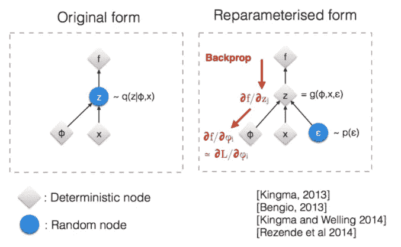

# 变分自动编码器的数学直觉综述

> 原文：<https://medium.com/analytics-vidhya/math-intuition-summary-on-variational-autoencoder-c3c57e79a94f?source=collection_archive---------17----------------------->

变分自动编码器模型算法详解

苏美尔人，已知最早的文明

我对变分自动编码器(VAEs)的数学直觉总结将基于下面的经典变分自动编码器(VAEs)架构。

**VAEs 架构**@[https://github . com/Andrews pano/distangled _ variable _ auto encoder](https://github.com/AndrewSpano/Disentangled_Variational_Autoencoder)

1.  我们期望 **x ≈ x '，**这与自动编码器神经网络相同
2.  概率**编码器 q** ϕ(z|x)将每个输入 **x** 映射到潜在空间中对应的正态分布 **N** (μ，σ)。因此，潜在空间实际上是从整个输入数据集映射的所有正态分布的总和，就像高斯混合模型一样。
3.  概率**解码器 p** θ(x|z)将潜在空间样本 **z** 映射回输入数据空间。
4.  **z** 是来自潜空间的样本。潜在空间预期遵循标准的多元正态分布，并且通常具有比输入 **x** 小得多的维度

**x** 、 **q** ϕ(z|x、 **p** θ(x|z)、以及 **z** 之间的空间映射关系如下图所示:

**VAEs 空间映射** @ [变分自动编码器简介](https://arxiv.org/abs/1906.02691)

# 目标功能构建

变分自动编码器(VAEs)的目标函数是建立在最大对数似然。

# **最大对数似然**

给定 VAEs 模型输入数据集 D ={ **x1** ， **x** 2、、、 **x** n }， **p** θ(x)表示模型输出概率分布函数(输出 x 上的 PDF)，则对数概率 VAEs 模型旨在最大化如下:

最大对数似然

为了最大化 log(pθ(x))的和，我们可以尝试最大化每个 log(pθ(x))

# **最大化 log(pθ(x))**

下面是来自原始论文的数学归纳。ELBO 表示证据下限，KL 表示 [KL 散度](https://en.wikipedia.org/wiki/Kullback%E2%80%93Leibler_divergence)，它是两个分布之间距离的度量。

来源于@ [变型自动编码器介绍](https://arxiv.org/abs/1906.02691)

因为任何 KL 距离总是⩾ 0，因此

log(pθ(x)) =埃尔博+kl(qϕ(z|x)||pθ(z|x))⩾·埃尔博

# **爱尔博感应**

埃尔博= 𝔼qϕ(z|x) [ log ( pθ(x，z)/qϕ(z|x)]

= 𝔼qϕ(z|x)[log(pθ(x | z)* pθ(z)/qϕ(z|x]]

= 𝔼qϕ(z|x)[log(pθ(z)/qϕ(z|x))]+𝔼qϕ(z|x][log(pθ(x | z))]

= -kl(qϕ(z|x)||pθ(z))+𝔼qϕ(z|x)[log(pθ(x | z))]

这里 pθ(z)是已知分布 **N** (0，I)，所以 ELBO 只由 qϕ(z|x)和 pθ(x|z)决定

# **最大化 log(pθ(x))复议**

从 log(pθ(x))归纳，我们知道

log(pθ(x)) =埃尔博+kl(qϕ(z|x)||pθ(z|x))⩾·埃尔博

> 原始论文提到，为了最大化 log(pθ(x))我们需要最大化 ELBO。这里的直觉是因为 ELBO 会用 qϕ(z|x)来使其值最大化，而 qϕ(z|x)不能直接决定 log(pθ(x))值，但 qϕ(z|x)可以通过 ELBO 决定 log(pθ(x))最小值。
> 
> 所以最大化 ELBO 会使 log(pθ(x))的最小值最大化，使 log(pθ(x))普遍变大，这是我的理解。

# **最大化 ELBO 以最大化 log(pθ(x))**

**埃尔博**= -kl(qϕ(z|x)||pθ(z))+𝔼qϕ(z|x)[log(pθ(x | z))]

为了最大化 ELBO，我们需要

**1。最小化 KL(qϕ(z|x)||pθ(z))**

这意味着我们需要使 kl(qϕ(z|x)||pθ(z)= 0，因此**编码器 q** ϕ(z|x)需要被训练以逼近标准正态分布 pθ(z)

所以 qϕ(z|x)～**n**(0，I)

**2。最大化𝔼qϕ(z|x) [ log ( pθ(x|z) )]**

最大化方程意味着，对于给定的输入 **x** ，模型需要最大化概率来产生与输出相同的 **x** 。这是试图使 **x' = x**

下面是 ELBO 的一个很好的演示，从不同的自动编码器架构来看

来源于[https://www.youtube.com/watch?v=Tc-XfiDPLf4](https://www.youtube.com/watch?v=Tc-XfiDPLf4)

# 最终目标函数

总结上述分析，变分自动编码器(vae)的最终损失函数为:

**LOSS = |X - X'| + KL( qϕ(z|x)，N(0，I))**

损失函数将指导模型实现:

1.  输出尽可能多地再现相同的输入
2.  潜在空间映射区域(正态分布)的输入将试图以 0 为中心，并在潜在空间中的方差 1 上扩展
3.  潜在空间将被压缩到 0，而不是分离的区域

# 重新参数化技巧

变分自动编码器网络训练仍然使用[误差反向传播](https://en.wikipedia.org/wiki/Backpropagation)和[导数链规则](https://en.wikipedia.org/wiki/Chain_rule)。但是在 VAEs 网络前向传播过程中，潜在向量 **z** 是随机采样的，这导致反向传播不能直接应用。

因此，VAEs 通过以下变换解决了采样不可导(或不可微)的问题:

**z' = μ(x) + σ(x)*ϵ**

ϵ~N(0，I)、μ(x)和σ(x)是编码器 **qϕ(z|x)** 的输出

该转换具有以下特征

1.  **z'** 由于随机 **ϵ** 仍然是一个随机值
2.  **z'** 遵循与 **z** 相同的 N(μ，σ)分布
3.  **z'** 在参数 **ϕ、**上变得可导，因为σ(x)是 **qϕ(z|x)** 的一部分

转换后，反向传播衍生链路径重新打开，如下图所示。(注意我们不需要ϵ 上的导数路径)

# 变分自动编码器中的变分推理

在统计学中，变分推断(VI)是一种使用一组易处理的简单分布来近似复杂难处理的分布的技术。

在变分自动编码器模型中，难以处理的分布是 P(Z|X)，编码器 **qϕ(z|x)** 将每个输入 **x** 映射成高斯分布 N(μ，σ)，这些高斯通过模型梯度下降训练共同逼近 P(Z|X)。

# 参考

1.  [自动编码变分贝叶斯](https://arxiv.org/pdf/1312.6114v10.pdf)
2.  [变型自动编码器简介](https://arxiv.org/abs/1906.02691)
3.  [了解变分自动编码器(VAEs)](https://towardsdatascience.com/understanding-variational-autoencoders-vaes-f70510919f73)
4.  [https://github . com/Andrews pano/distangled _ variable _ auto encoder](https://github.com/AndrewSpano/Disentangled_Variational_Autoencoder)
5.  [自动编码变分贝叶斯| AISC 基础](https://www.youtube.com/watch?v=Tc-XfiDPLf4)