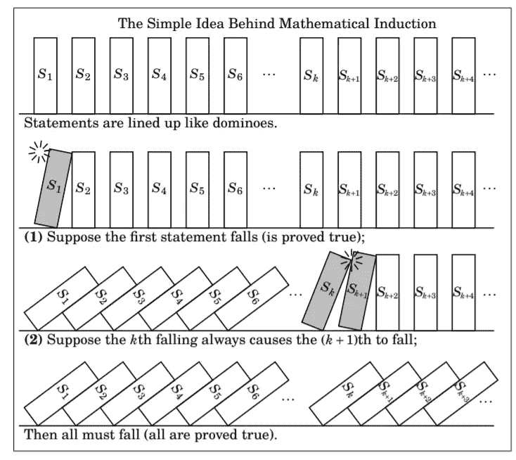

# 数学归纳法:它是什么，有什么用，以及如何应用。

> 原文：<https://medium.com/analytics-vidhya/mathematical-induction-what-is-it-whats-used-for-and-how-to-apply-it-d3ad5fd59512?source=collection_archive---------0----------------------->

欢迎来到高中数学。我们不再仅仅被要求提供正确的答案，而是被要求证明为什么我们的答案是正确的。如果你发现自己在这个新的数学宇宙中有点迷失，今天就和我一起解密这个精确的数学工具背后的秘密。

汤姆·威尔森在 [Unsplash](https://unsplash.com?utm_source=medium&utm_medium=referral) 上的照片

证明各种说法的技巧有很多。最简单的是直接证明，其中你表明如果第一个陈述(P)为真，那么第二个陈述(Q)也为真，以及逆正证明，其中你假设第二个陈述(~Q)的否定为真，并表明这迫使第一个陈述(~P)的否定也为真。很好，但今天我不是在这里谈论证明的基础知识(虽然我会尝试在文章中引用重要的基本概念)，我今天是在这里谈论 ***数学归纳法*** 这是一种用于证明无限语句列表中的所有语句(而不是像前两种技术中提到的只有两个)都为真的技术。

你可能想知道为什么我选择了一张倒下的多米诺骨牌图片作为文章的封面。我选择它是因为它阐明了归纳法背后的主要思想。假设我们有一列陈述 S1，S2，…，S_k，我们想证明所有这些陈述都为真。为此，把这些陈述想象成多米诺骨牌，你能想出一个多米诺骨牌的普遍属性来帮助我们证明一个陈述是正确的，然后所有下面的陈述也是正确的吗？我会帮你的。以第一个语句 S1 为例，这可能是一个常见的条件(if…else)语句，因此我们可以利用第一段中提到的任何技术。假设我们已经证明了。现在，我们需要证明 S1 为真迫使 S2 为真，那么 S2 为真迫使 S3 为真，等等。你明白了吗？一般来说，我们必须证明，如果任何给定的陈述 S_k 为真，那么下面的陈述 S_k+1 也为真。就像多米诺骨牌一样！如果一个倒下了，接下来所有的多米诺骨牌都会倒下。我经常发现图片非常有助于形象化像这样的概念，所以在这里你去:

来源:证据之书，理查德·哈马克

希望这个想法能帮助你开始发展*归纳*背后的直觉。但是，就像数学中的一切一样，我们需要严谨和精确。于是，下面是 ***数学归纳法*** 的正式大纲:

**命题:**陈述 S1，S2，S3，S4，…均为真。

1.  建立一个**基础步骤**，它由你的清单中的第一条语句组成，然后证明它。换句话说，证明 S1 为真。
2.  建立一个**归纳步骤**，它包括选择一个任意的陈述 S_k，并表明如果它为真，那么 S_k+1 也为真。直接证明是这一步中最常用的技术。

> S_k 为真的假设称为**归纳假设。**

很简单，对吧？现在让我们将这一技术应用于一个实际问题。我发现在如此光秃秃的介质上写数学符号很有挑战性，我会尽我所能保持它尽可能的干净。我们开始吧:

**命题**:若 *n ∈ ℕ，*则 1+3+5+7+……+(2*n*-1)=*n .*

*证明。*

> 注意:我们想证明给定的陈述对于每个 n ∈ ℕ.都是正确的

首先，我们设置我们的**基础步骤**。注意第一个语句是当 *n* = 1 时。因此，如果 *n* =1 那么 1 = 1，这显然是正确的。

接下来我们设置我们的**归纳步骤**。为此，证明对于某些 k ≥ 1，S_k → S_k+1。那么，这意味着什么呢？好吧，我们必须证明，如果陈述 1+3+5+7+……+(2k-1)= k(这是我们的 S_k)成立，那么下面的陈述 1+3+5+7+……+(2(k+1)-1)=(k+1)也成立。我们用*直接证明*来说明这一点。假设 1+3+5+7+…+(2k-1) = k .那么

1+3+5+7+………..…….+(2(k+1)-1)= 1

1+3+5+7+…….+(2k-1)+(2(k+1)-1)= 1

(1+3+5+7+…+(2k-1))+(2(k+1)-1)= 1

k+(2(k+1)-1)=**k+2k+1 =(k+1)**→*这就是我们想要的。*

于是，1+3+5+7+…+(2(k+1)-1) = (k+1)，证明了 S_k → S_k+1。因此，对于每个 *n ∈ ℕ.，1+3+5+7+…+(2*n*-1)=*n**

如果你想多加练习，还有一个问题。我会让你自己解决的。

**命题:**若 *n ∈ ℕ，*则(1 + *x)^n ≥ 1 + nx* 对于所有 *x ∈ ℝ* 与*x*-1。

我们刚刚学到的技巧可以被看作是一种标准的归纳。此外，还有一种称为 ***强归纳*** 的变体，用于证明与“正常”归纳完全相同类型的问题，但当证明 S_k → S_k+1(或根本不可能)特别具有挑战性时。强归纳使我们有可能用一个“更低”的陈述作为参照来表明 S_k+1 为真。换句话说，不使用语句 S_k，我可以使用语句 S_m 来证明条件语句，其中 m < k。 ***强归纳*** 背后的基本思想与“正常”归纳相同，唯一的区别是在**归纳步骤**中，我们假设所有的陈述 S_1、S_2、…、S_k 都为真(而不是假设只有 S_k 为真)，并显示这迫使 S_k+1 为真。为了使这个想法形式化，下面是 ***强感应*** 的概要:

**命题:**陈述 S1，S2，S3，S4，…均为真。

1.  **基础步骤:**证明第一个语句 S_1(或前几个 S_n)。
2.  **归纳步骤:**给定任意整数 *k ≥* 1，证明如下语句:(S1∧S2∧S _ k)→S _ k+1。

酷，让我们尝试一个问题来测试我们的理解:

命题:使用 3 张和 5 张邮票，任何 8 英镑或以上的邮资都是可能的。

基本步骤:这适用于 8 分、9 分和 10 分的邮资:对于 8 分，使用一张 3 分邮票和一张 5 分邮票。九块钱，三张三的邮票。10 英镑，两张 5 英镑的邮票。

**归纳步骤:**设 k ≥ 10，对于每张 8 ≤ m ≤ k，假设正好可以用 3 张和 5 张邮票得到 m 美分的邮资。(即假设语句 S_8，S_9，…，S_k 都为真。)我们必须证明 S_k+1 是真的，即用 3 张和 5 张邮票可以实现(k+1)-美分的邮资。根据假设，S _ k2 为真。因此，我们可以用 3 张和 5 张邮票得到(k2)美分的邮资。现在，只需再添加一张 3 美元的邮票，我们就有了(k2)+3 = k+1 美分的 3 美元和 5 美元邮票邮资。

最后，还有第三种技术叫做 ***用最小反例*** 证明，就像归纳和矛盾的结合。对于那些不知道或者可能需要复习的人，矛盾证明包括假设陈述的否定为真，并表明这样的假设导致明显的矛盾(像 1 ≠ 1 这样没有意义的东西)。很好，用最小反例 证明 ***的提纲如下:***

**命题:**陈述 S1，S2，S3，S4，…均为真。

1.  检查第一个语句 S1 是否为真。
2.  为了矛盾起见，假设不是每个 S_n 都是真的。
3.  设 k > 1 是 S_k 为假的最小整数。
4.  那么 S_k1 为真，S _ k 为假。用这个来弄个矛盾。

让我们把手弄脏吧。

**命题:**若 n ∈ N，则 4 |(5^*n*—1)。

> 注意:我们被要求证明给定的陈述对于每个自然数都是正确的。同样，回想一下，整除的定义是，一个整数 a 除以另一个整数 b，如果 b = a*c 对于某个 c ∈ ℤ.

第一个自然数是 1。因此，我们的第一个语句是 *n =* 1。然后，我们的语句变成 4 |(51)所以 4 | 4，这显然是正确的。接下来，为了矛盾起见，假设 4 |(5^*n*—1)对所有*n*都不成立，此外，设 k > 1 为 4∤(5^*k*—1)的最小整数。那么，陈述 4 |(5^(*k*-1)—1)为真。因此，根据定义，必须有一个整数 *c* 使得(5^(*k*-1)= 4*c。*注意

(5^(*k*-1)= 4*c*

5⋅(5^(*k*-1)-1)= 5⋅4*c→递增指数*

5^ *k - 5 =* 20 *c*

5^*k-*1 = 20*c-*4→*记住我们的目标是证明 4∤(5^k 1)是假的。*

5^*k-*1 = 4(5*c*-1)

因此，根据定义，4 | (5^ *k -* 1)这与我们假设的 4∤(5^*k*-1)相矛盾。因此，每个 *n ∈ ℕ.对应 4 |(5^*n*1)*

我关于数学归纳法的短文到此结束。

我希望你发现它有用和信息丰富。我主要用写作来补充我的学习，因为它帮助我通过尽可能清晰地写下我的想法，以便任何人都能理解，从而获得对主题的更深刻的理解。

如果你有任何建议或反馈，一定要留下评论。

我写的其他一些文章你可能会感兴趣:

 [## quant GRE 的主题:数据、概率和统计

### 你好。在 quant GRE 系列的第三篇文章中，我想解决通常被认为是…

agbonorino.medium.com](https://agbonorino.medium.com/topics-in-quant-gre-data-probability-and-statistics-233c27474629)  [## quant GRE 主题:数字属性

### 我厌倦了四处寻找免费资源或付费获取 GRE 考试的相关信息，所以我…

agbonorino.medium.com](https://agbonorino.medium.com/topics-in-quant-gre-number-properties-35c0a73b0888)  [## 我在深度学习方面的冒险——第 3.5 部分

### 在这一系列关于深度学习的帖子中，我们正到达一个关键时刻。我们正在从基本面和…

agbonorino.medium.com](https://agbonorino.medium.com/my-adventure-in-deep-learning-part-3-5-c9485efe808e)