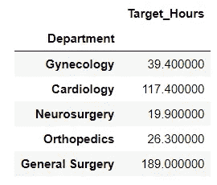
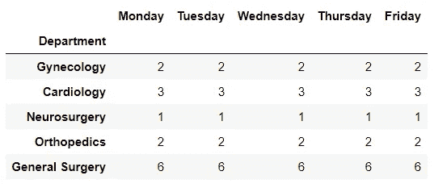
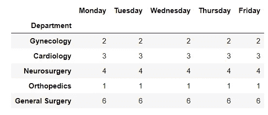
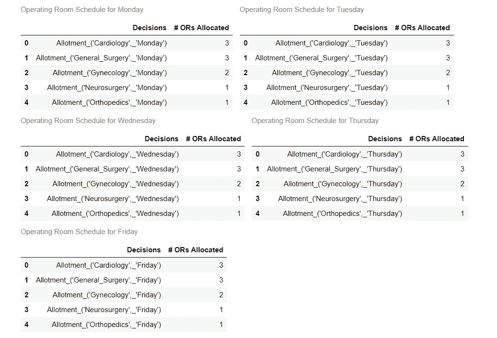

# 手术室的数学调度——分析如何实现更顺畅的医院轮班和住院

> 原文：<https://medium.com/analytics-vidhya/mathematical-scheduling-of-operating-rooms-how-analytics-enable-smoother-hospital-shifts-and-501c7edf1120?source=collection_archive---------11----------------------->


图片提供:[https://www.timesofisrael.com/](https://www.timesofisrael.com/)

# 概观

作为医疗保健领域的数据科学家和真正的数学家，我一直着迷于复杂系统(如医院系统)如何有效地利用优化算法来最大限度地利用他们的熟练人力，确保最高标准的患者护理。本文基于一个来自加州洛杉矶 Cedars-Sinai 医院的案例研究，介绍了他们如何帮助组织在资源有限的医院中确定高效的周计划，将手术室分配给不同的科室。

# 挑战

在全国大多数医院，外科医生的报酬是根据他们所做的手术数量来计算的，也就是说，是根据*服务费*来计算的。手术室计划外的变动会直接影响他们的收入。因此，创建一个有效的时间表最终成为医院内部的一个高度政治化的过程。此外，每个部门根据每周手术小时数设定自己的目标，如果管理层未能制定有效的时间表，这可能会造成内部冲突。这就需要运用数学敏锐度来提出一个优化的计划，在不损害治疗质量的情况下，在医院的所有部门之间取得健康的平衡。现在让我们仔细看看样本问题。

# 问题定义

Cedars-Sinai 医院有 10 个手术室，从周一到周五每天工作 8 小时。也就是说，

10 个手术室* 5 天* 8 小时= 400 个手术小时，在医院的 5 个主要部门之间有效分配，即:

1.  妇科
2.  心脏科
3.  神经外科
4.  骨科，以及
5.  普通外科

我们将通过用 Python 编写 LPP 来解决上述案例研究。本文中使用的所有代码和数据都可以通过我的 Git repo([https://github . com/mohiteprathamesh 1996/Hospital-OR-Scheduling](https://github.com/mohiteprathamesh1996/Hospital-OR-Scheduling))访问。

导入必要的依赖项，

```
import pandas as pd
import numpy as np
import itertools
from pulp import * from IPython.core.display import display, HTMLdef display_side_by_side(dfs:list, captions:list):
    """Display tables side by side to save vertical space
    Input:
        dfs: list of pandas.DataFrame
        captions: list of table captions
    """
    output = ""
    combined = dict(zip(captions, dfs))
    for caption, df in combined.items():
        output += df.style.set_table_attributes("style='display:inline'").set_caption(caption)._repr_html_()
        output += "\xa0\xa0\xa0"
    display(HTML(output)) import warnings
warnings.filterwarnings("ignore")
```

如前所述，每个部门都设定了一周手术小时数的目标，如下所示:

```
target_hours_per_week = pd.read_excel("OR Scheduling.xlsx",         sheet_name="Target Hours per Week")target_hours_per_week.set_index(["Department"], inplace=True)
```



现在，每个部门每天都有数量有限的手术团队，具体如下:

```
teams_available_per_week = pd.read_excel("OR Scheduling.xlsx", sheet_name="Available teams per week")teams_available_per_week.set_index(["Department"], inplace=True)
```



此外，每个部门可以对一周的 ORs 数量有一个最大的每日需求，如下所示:

```
max_daily_OR_requirement = pd.read_excel("OR Scheduling.xlsx", sheet_name="Max Daily OR requirements")max_daily_OR_requirement.set_index(["Department"], inplace=True)
```



# 决定性因素

基于上述可用的信息，医院管理层必须决定在整个星期的每一天应该给每个部门分配多少 ORs？

假设这种情况下的决策变量为:

> **X (j，k) =在第‘k’天分配给部门‘j’的 ORs 数量(将是一个整数！)**

其中 j*∈(*‘基因学’，‘心脏病学’，‘神经外科’，‘骨科’，
，‘普通外科’， *)*

*和 k ∈ (* '星期一'，'星期二'，'星期三'，'星期四'，'星期五' *)*

```
teams = teams_available_per_week.index.to_list()
day_of_week = teams_available_per_week.columns.to_list()var_dict = LpVariable.dicts(
            "Allotment",
            [(dept, day) for dept in teams for day in day_of_week], 
            lowBound = 0, 
            cat = "Integer")
```

# 目标函数

医院管理层的目标是分配 ORs，以最大化每个部门每周手术小时数的目标比例。也就是说，如果部门“j”的目标是该周的“t(j)”小时手术，那么我们必须**最大化:****∑(8 * X(j，k))/t(j)** 该周所有部门的总和。这确保了最大的利用率！

```
model = LpProblem(
"Optimized Allocation of Hospital Operating Rooms", 
LpMaximize) model += lpSum(
[8*var_dict[(team,days)]/target_hours_per_week.loc[team, "Target_Hours"] for team in teams for days in day_of_week])
```

# 限制

在任何给定的一天，医院最多有 10 个手术室可用，这些手术室应该安排在这 5 个科室进行手术。

因此，

**0≤σX(j，k) ≤ 10**

其中“j”*∈(*‘基因学’，‘心脏病学’，‘神经外科’，‘整形外科’，
‘普通外科’， *)* ，‘k’对于一周中的那一天保持不变。

```
for day in day_of_week:
    model += lpSum([var_dict[(team, day)] for team in teams]) <= 10
```

接下来，为一个部门分配的 ORs 数量不能超过该部门当天可用团队的数量。

也就是说，

**0 ≤ X (j，k) ≤部门‘j’在‘k’日可用的团队数量**

```
for team in teams:
    for day in day_of_week:
        model += var_dict[(team, day)] <= teams_available_per_week.loc[team, day]
```

最后，我们必须满足每个部门每天的最大需求。

因此，

**0 ≤ X (j，k) ≤部门‘j’在‘k’日要求的最大 ORs**

```
for team in teams:
    for day in day_of_week:
        model += var_dict[(team, day)] <= max_daily_OR_requirement.loc[team, day]
```

# 最优解

既然我们已经定义了决策变量，制定了目标函数和约束条件，我们可以获得如下的最优解。下面的代码输出了数学上最有效的时间表！

```
model.solve() if LpStatus[model.status]=="Optimal":
    optimal_soln = pd.DataFrame(
[(v.name, 
int(v.varValue)) for v in model.variables() if v.varValue!=0],
columns=["Decisions", "# ORs Allocated"]) display_side_by_side(dfs = [optimal_soln[optimal_soln["Decisions"].str.contains(d)].reset_index(drop=True) for d in day_of_week],
captions = ["Operating Room Schedule for "+i for i in day_of_week])
```



如果你喜欢读这篇文章，请随时留下你的评论或建议！谢谢你的时间。

我们在 LinkedIn 上连线吧！[https://www.linkedin.com/in/prathameshmohite96/](https://www.linkedin.com/in/prathameshmohite96/)