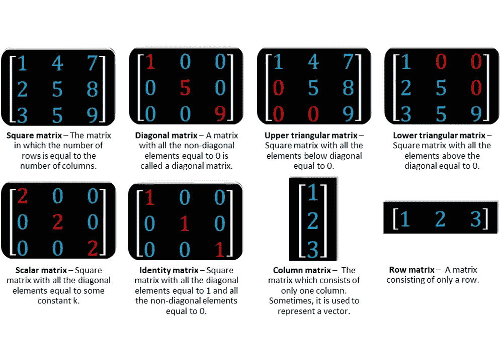
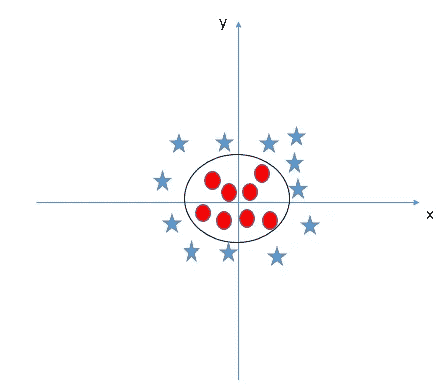

# 机器学习背后的数学和统计学——第一部分

> 原文：<https://medium.com/analytics-vidhya/mathematics-and-statistics-behind-machine-learning-part-1-eede0e152d57?source=collection_archive---------4----------------------->

所以这个话题很有趣，但也很长。由于这个话题很长，我将分部分写这篇博客。

很多 ML 爱好者问这个问题“ML 后面有必要学数学吗？”如果答案是“是”，那就问“为什么”。

因此，在这篇博客中，我将回答这些问题，并写一些机器学习背后的数学和统计学概念。因此，没有进一步的到期让我们开始。

# 你为什么需要数学？

机器学习的数学之所以重要，有很多原因，下面我将重点介绍其中的一些原因:

1.  选择正确的算法，包括考虑准确性、训练时间、模型复杂性、参数数量和特征数量。
2.  选择参数设置和验证策略。
3.  通过理解偏差-方差权衡来识别欠拟合和过拟合。
4.  估计正确的置信区间和不确定性。

**正如你在上面的饼图中看到的，最大比例的数学是线性代数，所以让我们把线性代数作为数学的第一主题。**

# **线性代数**

## 为什么需要学习线性代数？

线性代数是机器学习的基础。在你开始学习机器学习之前，你需要对这个领域有更好的了解和认识。如果你是机器学习的爱好者和实践者，这篇文章将帮助你认识到线性代数的应用领域，你可以从这些见解中受益。

## 向量、矩阵和张量

在机器学习中，大多数数据通常表示为向量、矩阵或张量。因此，机器学习非常依赖线性代数。

*   **一个向量**是一个 1D 数组。例如，空间中的一个点可以定义为三个坐标的向量( *x* 、 *y* 、 *z* )。通常，它被定义为既有大小又有方向。
*   **矩阵**是一个二维数字数组，有固定数量的行和列。它在每行和每列的交叉处包含一个数字。矩阵通常用方括号[]表示。
*   **张量**是向量和矩阵的推广。例如，一维张量是一个矢量。另外，我们也可以有一个二维的张量，它是一个矩阵。然后，我们可以有一个三维张量，如 RGB 颜色的图像。这样继续扩展到四维张量等等。

几乎每个算法都用向量和矩阵符号来描述。因此，我们将从描述矩阵的一些基本术语开始:

此外，一个经常使用的术语是**跟踪**。迹是一个方阵的所有对角元素的和。

# 线性代数示例

接下来我们要讲的是如何将矩阵相加，如何将它们乘以标量，以及如何将矩阵相乘。下面是一个简单的复习:

现在，让我们看看当我们把一个向量乘以一个矩阵时会发生什么。例如，从原点开始到(1，1)结束的向量可以写成矩阵形式。x 分量在顶部，y 分量在底部。

有一些特殊的矩阵以一种有趣的方式转换我们的输入向量。让我们看看这个矩阵是如何将一个矢量逆时针旋转 90 度的。

此外，一些矩阵能够缩放输入向量:

与我们的输入向量在同一行上的任何向量，将被映射到与对应的输出向量在同一行上的向量。这些矢量处理的例子我们也称之为线性变换。

线性变换是我们称第一堂深入的矩阵课为线性代数的原因。我们稍后将重新讨论这些变换，但是现在是关注下面的输入向量(2，1)的时候了。

你会注意到，它只在乘以一个 2×2 的矩阵时才会缩放，根本不会旋转。这种情况会发生在同一直线上的任何向量上。**任何仅由一个矩阵缩放的向量称为该矩阵的*特征向量*。向量缩放了多少我们称之为*特征值*。在我们的例子中，特征值是 2，因为原始向量的长度增加了一倍。**

最后但同样重要的是，这是我们通常在学校学到的矩阵的第一个应用。这是如何解决线性方程组使用矩阵。

系数可以进入一个矩阵，变量( *x* ， *y* )进入另一个矩阵。然后，我们也有一个矩阵来存储输出(1，3)。使用矩阵乘法的规则，我们可以看到第一个和第二个方程是完全相同的。

用图表说明这个方程的解是很有趣的。

为了解决这个问题，我们可以引入逆矩阵的概念。因此，如果我们知道一个逆矩阵，并将其乘以我们已知的输出向量(1，3)，我们将得到我们的结果。

当我们应用逆矩阵时，这个过程被称为*向后*。当所需输出乘以一个逆矩阵时，我们得到我们的解:x=1，y=1。

了解更多关于线性代数在机器学习中的应用，如线性代数和统计，矩阵和图像等。请参考以下链接:

[http://datahacker.rs/linear-algebra-for-machine-learning/](http://datahacker.rs/linear-algebra-for-machine-learning/)

也一定要检查我的 jupyter 笔记本(下面的链接)。在这里你会发现一些使用 NumPy 库对线性代数的基本操作。

 [## shag 10/机器学习

### 这个库包含机器学习算法的基础。基于监督学习的算法…

github.com](https://github.com/Shag10/Machine-Learning/blob/master/Introduction%20To%20ML%20libraries/Linear_Algebra.ipynb) 

# 机器学习中的线性代数

最大的问题是——线性代数适合机器学习吗？让我们来看四个大家都很熟悉的应用程序。

# 1.损失函数

您必须非常熟悉模型(比如线性回归模型)如何拟合给定的数据:

*   你从一些任意的预测函数(线性回归模型的线性函数)开始
*   对数据的独立特征使用它来预测输出
*   计算预测输出与实际输出的差距
*   使用这些计算值，通过梯度下降等策略来优化您的预测函数

损失函数是线性代数中**向量范数**的应用。向量的范数可以简单地是它的大小。向量范数有很多种。我将很快解释其中的两个:

*   **L1 标准**:也被称为曼哈顿距离或出租车标准。如果唯一允许的方向是平行于空间的轴，L1 范数就是你从原点到向量的距离。

在这个 2D 空间中，通过沿 x 轴移动 3 个单位，然后平行于 y 轴移动 4 个单位，可以得到向量(3，4)(如图所示)。或者，您可以先沿 y 轴移动 4 个单位，然后平行于 x 轴移动 3 个单位。无论哪种情况，您都将总共旅行 7 个单位。

*   **L2 范数**:又称欧氏距离。L2 范数是矢量到原点的最短距离，如下图中红色路径所示:

这个距离是用毕达哥拉斯定理计算出来的(我可以看到旧的数学概念在你的脑海中闪现！).它是(3 + 4)的平方根，等于 5。

*但是范数是怎么用来求预测值和期望值的差的呢？*假设预测值存储在向量 ***P*** 中，期望值存储在向量 ***E*** 中。那么 ***P-E*** 就是差向量。而 ***P-E*** 的范数就是预测的总损失。

# 2.正规化

正则化是数据科学中一个非常重要的概念。这是我们用来防止模型过度拟合的技术。*规则化其实是规范的另一种应用。*

当一个模型与训练数据拟合得太好时，就称之为过度拟合。这种模型对新数据表现不佳，因为它甚至已经学习了训练数据中的噪声。它将无法对以前没有见过的数据进行归纳。下图很好地总结了这个想法:

正则化**通过将权重向量的范数添加到成本函数来惩罚过于复杂的模型。由于我们想要最小化成本函数，我们需要最小化这个范数。这使得权重向量的不需要的分量减少到零，并防止预测函数过于复杂。**

# 3.协方差矩阵

双变量分析是**数据探索**的重要步骤。我们想研究变量对之间的关系。协方差或相关性是用于研究两个连续变量之间**关系的度量。**

**协方差表示变量之间线性关系的方向。正协方差表示一个变量的增加或减少伴随着另一个变量的增加或减少。负协方差表示一个协方差的增加或减少伴随着另一个协方差的增加或减少。**

另一方面，**相关性是协方差**的标准化值。相关值告诉我们线性关系的强度和方向，范围从-1 到 1。

现在，你可能认为这是统计学的概念，而不是线性代数。还记得我告诉过你线性代数是无孔不入的吗？使用线性代数中的**转置和矩阵乘法**的概念，我们有一个非常简洁的协方差矩阵表达式:

这里，X 是包含所有数字特征的标准化数据矩阵。

# 4.支持向量机分类

是的，支持向量机。最常见的分类算法之一，经常产生令人印象深刻的结果。它是线性代数中**向量空间**概念的一个应用。

支持向量机，或 SVM，是一种通过寻找决策面来工作的判别分类器。这是一种受监督的机器学习算法。

在该算法中，我们将每个数据项绘制为一个 n 维空间**中的一个点**(其中 n 是您拥有的特征的数量)，每个特征的值是特定坐标的值。然后，我们通过找到能够很好地区分两类的**超平面**来执行分类，即具有**最大间隔**，在这种情况下是 C。

超平面是一个**子空间**，它的维数比它对应的向量空间小一，所以对于 2D 向量空间来说它是一条直线，对于 3D 向量空间来说它是一个 2D 平面，等等。再次使用向量范数来计算差值。

但是如果数据不是像下面这种线性可分的呢？

我们的直觉告诉我们，决策面必须是圆形或椭圆形，对吗？但是怎么找呢？这里，**内核转换**的概念开始发挥作用。从一个空间转换到另一个空间的思想在线性代数中很常见。

下面介绍一个变量**z = x+yT7。如果我们沿着 z 轴和 x 轴绘图，数据看起来是这样的:**

现在，这显然可以通过线 ***z = a*** 进行线性分离，其中 *a* 是某个正常数。在转换回原始空间时，我们得到 ***x + y = a*** 作为决策面，这是一个圆！

如需了解更多信息，请访问以下网站。

 [## 线性代数在数据科学中的 10 个强大应用(有多种资源)

### 概述线性代数为各种不同的数据科学算法和应用提供动力，在这里，我们提出 10 个这样的…

www.analyticsvidhya.com](https://www.analyticsvidhya.com/blog/2019/07/10-applications-linear-algebra-data-science/) 

在第一部分中，我试图提供主要关于线性代数的重要信息。 **希望你能在这里找到有用的东西。谢谢你一直读到最后。如果你喜欢我的博客，请点击下面的按钮。让我知道我的博客是否真的有用。也不要检查我的同一主题的其他部分，下面是他们的链接。**

**第二部分—**

 [## 机器学习背后的数学和统计学——第二部分

### 机器学习的概率与统计

shubhangagrawal1999.medium.com](https://shubhangagrawal1999.medium.com/mathematics-and-statistics-behind-machine-learning-part-2-9aa2f068ecf9) 

**第三部分—**

 [## 机器学习背后的数学和统计学——第三部分

### 多元微积分|算法和复杂性

shubhangagrawal1999.medium.com](https://shubhangagrawal1999.medium.com/mathematics-and-statistics-behind-machine-learning-part-3-e5dffb9129f2)