# 机器学习背后的数学和统计学——第二部分

> 原文：<https://medium.com/analytics-vidhya/mathematics-and-statistics-behind-machine-learning-part-2-9aa2f068ecf9?source=collection_archive---------5----------------------->

正如我在以前的博客中提到的，这个话题很长，但同时也很有趣。这是关于机器学习背后的数学和统计学的第二部分。

如果你没有看到我之前的博客，请一定要看看。这是它的链接。

[](https://shubhangagrawal1999.medium.com/mathematics-and-statistics-behind-machine-learning-part-1-eede0e152d57) [## 机器学习背后的数学和统计学——第一部分

### 线性代数

shubhangagrawal1999.medium.com](https://shubhangagrawal1999.medium.com/mathematics-and-statistics-behind-machine-learning-part-1-eede0e152d57) 

因此，没有任何进一步的拖延，让我们开始吧。

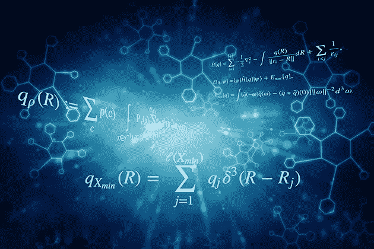

**所以在线性代数之后，机器学习背后的数学和统计学的最大百分比是概率和统计。所以在这篇博客中，我们将讨论这些话题。**

# 可能性

在给出概率的实际定义之前，让我们先看看一些术语。

*   实验:实验可能类似于——德里每天是否下雨。
*   **结果**:结果是单次试验的结果。如果今天下雨，今天的审判结果就是“下雨了”。
*   **事件**:事件是一个实验的一个或多个结果。对于德里每天是否下雨的实验，事件可能是“下雨了”或“没下雨”。
*   **概率**:简单来说就是事件发生的可能性。所以如果今天有 50%的可能性下雨，那么下雨的概率是 0.5。

在概率论中，一个**事件**是一个实验的一组结果，一个概率被分配给这些结果。如果`**E**`代表一个事件，那么`**P(E)**`代表`**E**` 发生的概率。`**E**`可能发生(*成功*)或可能不发生(*失败*)的情况称为 ***试验*** 。

这个事件可以是任何事情，比如*扔硬币、滚动骰子*或*从袋子里拿出一个彩球。在这些例子中，事件的结果是随机的，所以代表这些事件结果的变量称为随机变量。*

让我们考虑一个抛硬币的基本例子。如果硬币是公平的，那么它出现正面的可能性和出现反面的可能性一样大。换句话说，如果我们要反复投掷硬币很多次，我们预计大约一半的投掷是正面，一半是反面。在这种情况下，我们说得到人头的概率是 1/2 或者 0.5。

事件的**经验概率**由事件发生的次数除以观察到的事件总数得出。如果对于`**n**` 试验，我们观察到`**s**` 成功，成功的概率是 s/n。任何投掷硬币的顺序都可能有多于或少于 50%的正面。

另一方面，理论概率由特定事件发生的方式数除以可能结果的总数得出。所以头可能出现一次，可能的结果是两次(头，尾)。人头的真实(理论)概率是 1/2。


# 联合概率

用`**P(A and B) or P(A ∩ B)**`表示的事件 A 和事件 B 的概率是事件 A 和事件 B 都发生的概率。`**P(A ∩ B) = P(A). P(B)**` **。**这只适用于`**A**`和`**B**`相互独立的情况，也就是说如果`**A**`发生，并不会改变`**B**`发生的概率，反之亦然。

# 条件概率

让我们考虑 A 和 B 都不是独立的，因为如果 A 发生了，B 的概率就更高。当 A 和 B 不独立时，计算条件概率 P (A|B)往往很有用，P 是给定 B 发生的概率:`**P(A|B) = P(A ∩ B)/ P(B)**` **。**

> *以事件 B 为条件的事件 A 的概率被表示和定义* `*P(A|B) = P(A∩B)/P(B)*`

同理，`**P(B|A) = P(A ∩ B)/ P(A)**` **。**我们可以把 A 和 B 的联合概率写成`**P(A ∩ B)= p(A).P(B|A)**`，意思是:*“两个事情发生的几率就是第一个发生的几率，然后给第一个发生的几率第二个。”*

# 贝叶斯定理

贝叶斯定理是两个事件的条件概率之间的关系。例如，如果我们想找出在炎热晴朗的日子里卖冰淇淋的概率，贝叶斯定理为我们提供了工具，让我们利用先验知识来判断在任何其他类型的日子里(下雨、刮风、下雪等)卖冰淇淋的概率。).

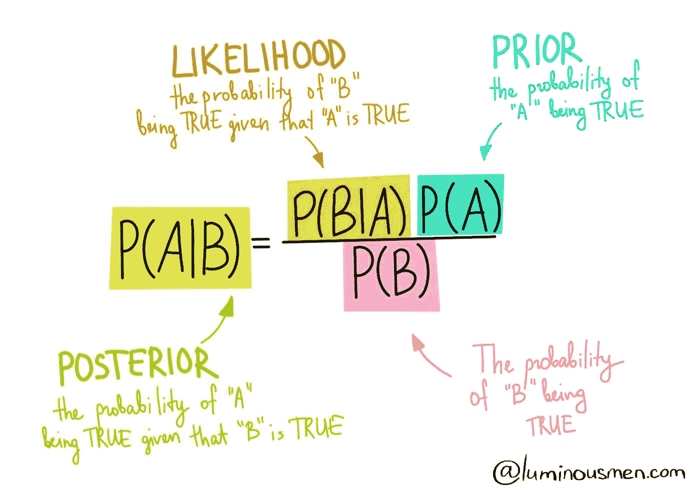

注意事件 A 和 B 是[独立事件](https://corporatefinanceinstitute.com/resources/knowledge/other/independent-events/)(即事件 A 的结果概率不依赖于事件 B 的结果概率)。

贝叶斯定理的一个特例是当事件 A 是一个[二元变量](https://www.fico.com/fico-xpress-optimization/docs/latest/mipform/dhtml/chap2s1.html)时。在这种情况下，该定理用以下方式表示:

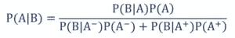

其中:

*   p(B | A–)—假设事件 A 已经发生，事件 B 发生的概率
*   P(B|A+) —假设事件 A+已经发生，事件 B 发生的概率

在上面的特例中，事件 A–和 A+是事件 A 的互斥结果。

## 贝叶斯定理的例子

假设你是一家投资银行的财务分析师。根据你对上市公司的研究，在过去三年中股价涨幅超过 5%的公司中，有 60%在此期间更换了首席执行官。

与此同时，同期股价涨幅不超过 5%的公司中，只有 35%更换了 CEO。已知股票价格增长超过 5%的概率是 4%，求解雇首席执行官的公司股票增长超过 5%的概率。

在寻找概率之前，你必须首先定义概率的符号。

*   P(A) —股票价格上涨 5%的概率
*   P(B) —首席执行官被替换的概率
*   P(A|B) —假设首席执行官已经更换，股票价格上涨 5%的概率
*   P(B|A) —给定股票价格，更换 CEO 的概率增加了 5%。

使用贝叶斯定理，我们可以找到所需的概率:

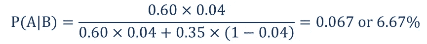

因此，更换 CEO 的公司股票增长超过 5%的概率为 6.67%。

**这是我的概率分布笔记本，我在这里没有提到。在笔记本中，你会发现不同发行版的理论和实践方面。**

[](https://github.com/Shag10/Machine-Learning/blob/master/Internity_Internship/Day-6/Probability_distribution.ipynb) [## shag 10/机器学习

### 这个库包含机器学习算法的基础。基于监督学习的算法…

github.com](https://github.com/Shag10/Machine-Learning/blob/master/Internity_Internship/Day-6/Probability_distribution.ipynb) 

# **统计数据**

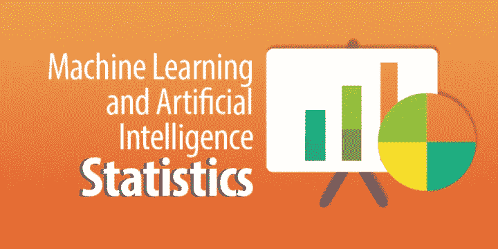

# **描述性统计**

在描述统计学中，你通过数字计算、图表或表格来描述、展示、总结和组织你的数据。在描述性统计中，一些常用的度量是集中趋势，另一些是数据集的可变性。

描述性统计分析帮助我们理解我们的数据，并且是机器学习的非常重要的部分。对我们的数据集进行描述性统计分析绝对至关重要。许多人跳过了这一部分，因此失去了许多关于他们数据的有价值的洞察力，这常常导致错误的结论。


# 集中趋势的测量:

它用代表其分布中心的单个值来描述一整套数据。有三种主要的集中趋势测量方法:

1.  **均值**:观察值之和除以样本量。这不是一个稳健的统计数据，因为它受到极值的影响。因此，非常大或非常低的值(即异常值)会扭曲答案。
2.  **中位数**:数据的中间值。它将数据分成两半，也称为第 50 百分位。与平均值相比，它受异常值和偏差数据的影响要小得多。如果数据集中的元素数量是奇数，则最中间的元素是中值。如果数据集中的元素数量是偶数，则中位数将是两个中心元素的平均值。
3.  **模式**:数据集中出现频率较高的值。因此，一个数据集没有模式，如果没有类别是相同的，也可能一个数据集有一个以上的模式。这是唯一可以用于分类变量的集中趋势的量度。

# 差异量数

可变性的度量也称为数据的分布，描述了一组观察值的相似性或差异性。最流行的可变性测量是范围、方差和标准差。

## 1.范围—

变量的范围等于最大值和最小值之差。收入范围是:

```
range(income) = max (income) − min (income) = 50,000 − 20,000 =$30,000
```

范围只反映了最大和最小观察值之间的差异，但它未能反映数据是如何集中的。

## 2.方差—

总体方差被定义为平均值的方差的平均值，表示为`𝜎*²*`(“sigma-squared”):

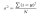

方差越大，意味着数据越分散。

样本方差`s*²*`大约是方差平方的平均值，用`n-1`代替`N`。出现这种差异是因为样本均值被用作真实总体均值的近似值。


## 3.标准偏差-

标准差用的比较多，因为是原始单位。它只是方差的平方根，正因为如此，它被返回到原始的度量单位。

当标准偏差较低时，您的数据点往往接近平均值。高标准偏差意味着您的数据点分布在很大的范围内。

当数据为单峰时，最好使用标准差。在正态分布中，大约 34%的数据点位于平均值和高于或低于平均值的一个标准差之间。由于正态分布是对称的，68%的数据点落在平均值以上一个标准差和平均值以下一个标准差之间。大约 95%落在低于平均值的两个标准偏差和高于平均值的两个标准偏差之间。并且大约 99.7%落在平均值以上三个标准偏差和平均值以下三个标准偏差之间。

下图完美地说明了这一点。

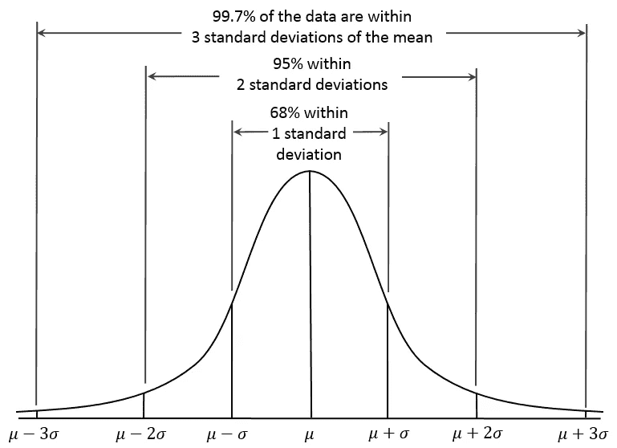

# 位置测量:

## 1.百分位

百分位数表示低于特定值的分数的百分比。它们告诉你一个分数相对于其他分数的位置。例如，一个智商为 120 的人处于第 91 百分位，这表明他们的智商高于其他分数的 91%。

## 2.四分位距(IQR)

1.  四分位数间距(IQR)是对上四分位数(第 75 个)即第三季度和下四分位数(第 25 个)即 Q1 之间的统计离差的一种度量。你可以通过下面的例子理解这一点。

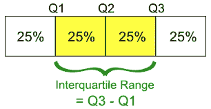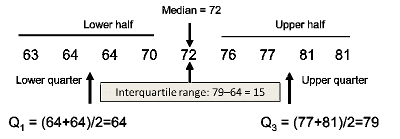

虽然范围衡量的是数据点的开始和结束位置，但四分位数范围衡量的是大多数值所在的位置。

## 3.z 分数

特定数据值的Z 值表示该数据值高于或低于平均值多少个标准差。

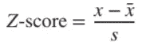

**例题:**一般来说，女性的平均身高为 65″，标准差为 3.5″。假设身高呈正态分布，找到平均身高为 70 英寸的 50 名女性随机样本的概率是多少？

*   z = (x — μ) / (σ / √n)
*   = (70–65) / (3.5/√50) = 5 / 0.495 = 10.1

这里的关键是我们正在处理均值的抽样分布，所以我们知道我们必须在公式中包括标准误差。我们还知道，在正态概率分布中，99%的值在平均值的 3 个标准偏差范围内(参见 68 95 99.7 规则)。因此，女性样本中平均身高为 70 英寸的概率不到 1%。

# 单变量描述统计

描述单变量数据模式的不同方式包括集中趋势:均值、众数和中位数，分散:范围、方差、最大值、最小值、四分位数和标准差。

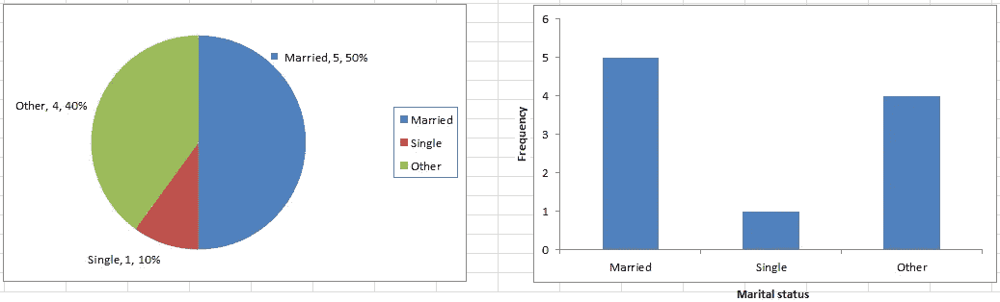

贷款申请人表中婚姻状况的饼状图[左] &条形图[右]。

用于显示单变量数据的各种图表通常是条形图、直方图、饼图。等等。

# 双变量描述统计

双变量分析涉及两个变量的分析，目的是确定它们之间的经验关系。用于显示双变量数据的各种图表通常是散点图、箱线图*。*

# 散点图

可视化两个定量变量 x 和 y 之间关系的最简单方法。对于两个连续变量来说，*散点图*是一个常见的图形。每个(x，y)点被绘制在笛卡尔平面上，x 轴在水平方向，y 轴在垂直方向。散点图有时被称为相关图，因为它们显示两个变量是如何相关的。

# 相互关系

相关性是一种旨在量化两个变量之间关系强度的统计数据。**相关系数** `r`量化两个量化变量之间线性关系的强度和方向。相关系数定义为:

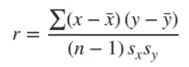

其中`sx`和`sy`分别代表 x 变量和 y 变量的标准偏差。`−1 ≤ r ≤ 1`。

> *若 r 为正且显著，我们说 x 与 y 为* ***正相关*** *。x 的增加与 y 的增加相关联。*
> 
> *若 r 为负且显著，我们说 x 与 y 为* ***负相关*** *。x 的增加与 y 的减少相关联。*

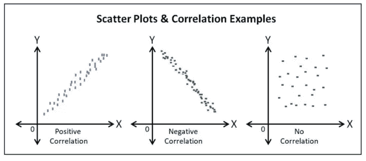

正相关(r > 0)，负相关(r < 0), No correlation (r = 0)

**这是我的 Jupyter 笔记本用来统计的。可以参考实现。**

[](https://github.com/Shag10/Machine-Learning/blob/master/Internity_Internship/Day-6/Statistics.ipynb) [## shag 10/机器学习

### 这个库包含机器学习算法的基础。基于监督学习的算法…

github.com](https://github.com/Shag10/Machine-Learning/blob/master/Internity_Internship/Day-6/Statistics.ipynb) 

在这一部分，我试图提供有关概率和统计的重要信息。希望你能在这里找到有用的东西。谢谢你一直读到最后。如果你喜欢我的博客，请点击下面的按钮。让我知道我的博客是否真的有用。也不要检查我的同一主题的其他部分，下面是他们的链接。

**第 1 部分—**

[](https://shubhangagrawal1999.medium.com/mathematics-and-statistics-behind-machine-learning-part-1-eede0e152d57) [## 机器学习背后的数学和统计学——第一部分

### 线性代数

shubhangagrawal1999.medium.com](https://shubhangagrawal1999.medium.com/mathematics-and-statistics-behind-machine-learning-part-1-eede0e152d57) 

**第 3 部分—**

[](https://shubhangagrawal1999.medium.com/mathematics-and-statistics-behind-machine-learning-part-3-e5dffb9129f2) [## 机器学习背后的数学和统计学——第三部分

### 多元微积分|算法和复杂性

shubhangagrawal1999.medium.com](https://shubhangagrawal1999.medium.com/mathematics-and-statistics-behind-machine-learning-part-3-e5dffb9129f2) 

# 参考

[](https://towardsdatascience.com/machine-learning-probability-statistics-f830f8c09326) [## 机器学习—概率和统计

### 机器学习的基本概率与统计

towardsdatascience.com](https://towardsdatascience.com/machine-learning-probability-statistics-f830f8c09326) [](https://corporatefinanceinstitute.com/resources/knowledge/other/bayes-theorem/) [## 贝叶斯定理-定义、公式和例子

### 在统计和概率论中，贝叶斯定理(也称为贝叶斯规则)是一个数学公式，用于…

corporatefinanceinstitute.com](https://corporatefinanceinstitute.com/resources/knowledge/other/bayes-theorem/)