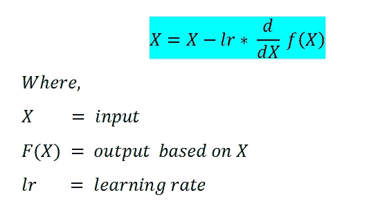
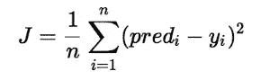
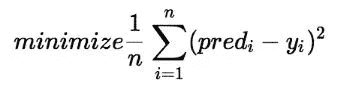

# 机器学习背后的数学和统计学——第三部分

> 原文：<https://medium.com/analytics-vidhya/mathematics-and-statistics-behind-machine-learning-part-3-e5dffb9129f2?source=collection_archive---------7----------------------->

这是博客的第三部分，也是最后一部分，因为我将涵盖机器学习背后的数学和统计学的最后主题。

如果你没有看到我之前的博客，请一定要看看。这是它的链接。

**第一部分—**

[](https://shubhangagrawal1999.medium.com/mathematics-and-statistics-behind-machine-learning-part-1-eede0e152d57) [## 机器学习背后的数学和统计学——第一部分

### 线性代数

shubhangagrawal1999.medium.com](https://shubhangagrawal1999.medium.com/mathematics-and-statistics-behind-machine-learning-part-1-eede0e152d57) 

**第二部分—**

[](https://shubhangagrawal1999.medium.com/mathematics-and-statistics-behind-machine-learning-part-2-9aa2f068ecf9) [## 机器学习背后的数学和统计学——第二部分

### 机器学习的概率与统计

shubhangagrawal1999.medium.com](https://shubhangagrawal1999.medium.com/mathematics-and-statistics-behind-machine-learning-part-2-9aa2f068ecf9) 

因此，不再拖延，让我们开始这个系列的最后一部分。


**在最后一部分，我们剩下两个主题多元微积分|算法和复杂性。所以在这篇博客中，我们将讨论这些话题。**

# **多元微积分**

在我们讨论微积分的定义、应用和所有东西之前，我想提一下，我写这篇博客是希望你有微积分的一般知识，比如微分和积分，因为这可能是理解这个主题所需要的。

多元意味着多个变量。因此，多元微积分是一个涉及多个变量的微积分领域。多元微积分也称为偏导数，用于给定函数的数学优化(大多数是凸的，因为凸函数往往有最小值)。使用多元微积分，我们可以很容易地优化我们的凸函数算法到最小值或最低点，有一些方法会陷入局部最小值，但也有一些方法来避免它们。


# 梯度下降

梯度下降是一种机器学习算法，它迭代地寻找其参数的最佳值。它考虑了用户定义的学习率和初始参数值。

## 公式:



## 我们为什么需要它？

一般来说，我们要做的是，找到给出参数最优值的公式。但是在这个算法里，它是自己找值的！

## 推导的一些基本规则:

(一)标量倍数规则:


(B)总和规则:


权力规则:


(D)连锁规则:


**让我们举个例子来了解更多关于梯度下降和多元微积分的知识。**

# **线性回归中的梯度下降:**

在线性回归中，模型的目标是根据给定的输入值(x)获得预测 y 值的最佳回归直线。为模型定型时，模型会计算成本函数，该函数测量预测值(pred)和真实值(y)之间的均方根误差。该模型以最小化成本函数为目标。
为了使成本函数最小化，模型需要具有的最佳值？1 和？2.最初型号选择？1 和？然后迭代地更新这些值，以便最小化成本函数，直到它达到最小值。当模型达到最小成本函数时，它将具有最好的？1 和？2 价值观。使用这些最终更新的值。1 和？2 在线性方程的假设方程中，模型尽可能地预测 y 的值。

**线性回归成本函数:**



**线性回归的梯度下降算法:**


```
-> **?j     :** Weights of the hypothesis.
-> **h?(xi) :** predicted y value for ith input.
-> **j     :** Feature index number (can be 0, 1, 2, ......, n).
-> **?     :** Learning Rate of Gradient Descent.**Note: Here '?' represents Theta**
```

# **算法和复杂度**

## 机器学习算法综述

当处理数据以模拟业务决策时，您通常会使用监督和非监督学习方法。

目前的一个热门话题是图像分类等领域的半监督学习方法，在这些领域中，有大量的数据集，但只有很少的标记样本。

这里我要提一下按相似度分组的各种机器学习算法。


## 回归算法

最流行的回归算法有:

*   普通最小二乘回归(OLSR)
*   线性回归
*   逻辑回归
*   逐步回归
*   多元自适应回归样条(MARS)
*   局部估计的散点图平滑(黄土)

## 基于实例的算法

最流行的基于实例的算法有:

*   k-最近邻
*   学习矢量量化(LVQ)
*   自组织映射(SOM)
*   局部加权学习(LWL)
*   支持向量机(SVM)

## 正则化算法

最流行的正则化算法有:

*   里脊回归
*   最小绝对收缩和选择算子(LASSO)
*   弹性网
*   最小角度回归

## 决策树算法

最流行的决策树算法有:

*   分类和回归树
*   迭代二分法 3 (ID3)
*   C4.5 和 C5.0(强大方法的不同版本)
*   卡方自动交互检测(CHAID)
*   决策树桩
*   M5
*   条件决策树

## 聚类算法

最流行的聚类算法有:

*   k 均值
*   k-中间值
*   期望最大化
*   分层聚类

## 人工神经网络算法

最流行的人工神经网络算法有:

*   感知器
*   多层感知器(MLP)
*   反向传播
*   随机梯度下降
*   Hopfield 网络
*   径向基函数网络(RBFN)

## 深度学习算法

最流行的深度学习算法有:

*   卷积神经网络(CNN)
*   递归神经网络
*   长短期记忆网络
*   堆叠式自动编码器
*   深层玻尔兹曼机器(DBM)
*   深度信仰网络(DBN)

## 降维算法

最流行的降维算法有:

*   主成分分析
*   主成分回归
*   偏最小二乘回归(PLSR)
*   Sammon 映射
*   多维标度(MDS)
*   投影寻踪
*   线性判别分析(LDA)
*   混合判别分析
*   二次判别分析(QDA)
*   灵活判别分析(FDA)

要了解更多此类算法，请访问下面的链接-

[](https://machinelearningmastery.com/a-tour-of-machine-learning-algorithms/) [## 机器学习算法之旅-机器学习掌握

### 在这篇文章中，我们将浏览最流行的机器学习算法。游览主要景点是很有用的。

machinelearningmastery.com](https://machinelearningmastery.com/a-tour-of-machine-learning-algorithms/) 

# ML 模型的计算复杂性


**时间复杂度**可以被视为对输入大小的算法执行快慢的度量。时间复杂度总是相对于某个输入大小(比如 n)给出的。
**空间复杂度**可以看做是你执行算法所需要的额外内存量。像时间复杂度一样，它也是相对于某个输入大小(n)给出的。

算法/模型的复杂性通常用**大 O 符号表示，**定义了一个算法的上限，它只从上面限制一个函数。
下图可视化了算法复杂性的不同情况。


[http://bigocheatsheet.com/](http://bigocheatsheet.com/)

为了写出计算复杂度，我们假设，
n=训练样本的数量，d=数据的维数，
k=邻居的数量

> **K 最近邻的复杂度寻找 K 最近邻**

***训练时间复杂度*** *= O(knd)*
循环通过每个训练观测，并计算训练集观测和新观测之间的距离 *d* 。

时间与实例数量(n)和维度(d)成线性关系。

***空间复杂度****= O(nd)*
K 近邻存储数据。测试需要更长的时间，因为你必须将每个测试实例与整个训练数据进行比较。

> ***逻辑回归的复杂性***

训练时间复杂度意味着在逻辑回归中，它意味着求解最优化问题。
***列车时间复杂度=*** *O(nd)*

***空间复杂度****= O(d)*
**注:**逻辑回归对于低延迟应用非常好。

> ***SVM 的复杂性***

***训练时间复杂度*** =O(n )
注意:如果 n 较大，避免使用 SVM。

*= O(K * d)
K =支持向量的数量，d =数据的维数*

> ****决策树的复杂性****

****训练时间复杂度*** = O(n*log(n)*d)
n=训练集中的点数
d =数据的维数*

****运行时复杂度*** = O(树的最大深度)
**注:**当我们有大量低维数据时，我们使用决策树。*

> ****随机森林的复杂性****

****训练时间复杂度***= O(n * log(n)* d * k)
k =决策树数量
注:当我们有大量特征合理的数据时。然后我们可以使用多核来并行化我们的模型，以训练不同的决策树。*

****运行时复杂度*** = O(树的深度* k)
***空间复杂度*** = O(树的深度*k)
注意:随机森林相对其他算法要快一些。*

> ****朴素贝叶斯的复杂性****

****训练时间复杂度*** = O(n*d)
***运行时间复杂度****=*O(c * d) *我们必须为每个类检索特征‘c’**

*在这最后一部分，我试图提供关于多元微积分|算法和复杂性的重要信息。希望你能在这里找到有用的东西。谢谢你一直读到最后。如果你喜欢我的博客，请点击下面的按钮。让我知道我的博客是否真的有用。此外，如果你没有检查我的同一主题的其他部分，下面是他们的链接。*

***第一部分—***

*[](https://shubhangagrawal1999.medium.com/mathematics-and-statistics-behind-machine-learning-part-1-eede0e152d57) [## 机器学习背后的数学和统计学——第一部分

### 线性代数

shubhangagrawal1999.medium.com](https://shubhangagrawal1999.medium.com/mathematics-and-statistics-behind-machine-learning-part-1-eede0e152d57) 

**第二部分—**

[](https://shubhangagrawal1999.medium.com/mathematics-and-statistics-behind-machine-learning-part-2-9aa2f068ecf9) [## 机器学习背后的数学和统计学——第二部分

### 机器学习的概率与统计

shubhangagrawal1999.medium.com](https://shubhangagrawal1999.medium.com/mathematics-and-statistics-behind-machine-learning-part-2-9aa2f068ecf9) 

# **参考文献—**

[](https://www.geeksforgeeks.org/gradient-descent-in-linear-regression/) [## 线性回归中的梯度下降

### 在线性回归中，该模型的目标是获得最佳拟合的回归线，以根据预测值来预测 y 值

www.geeksforgeeks.org](https://www.geeksforgeeks.org/gradient-descent-in-linear-regression/) [](/towards-artificial-intelligence/gradient-descent-algorithm-explained-2fe9da0de9a2) [## 梯度下降算法讲解

### 一步一步的数学推导

medium.com](/towards-artificial-intelligence/gradient-descent-algorithm-explained-2fe9da0de9a2)*