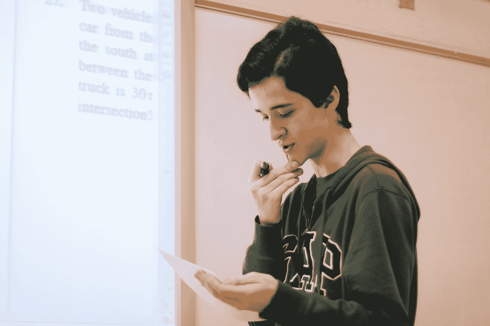

# 数学对 ML 来说很难

> 原文：<https://medium.com/analytics-vidhya/mathematics-for-ml-is-difficult-7bbe1287105b?source=collection_archive---------6----------------------->

## 直到你有了这 8 个免费资源…

杰斯温·托马斯在 [Unsplash](https://unsplash.com?utm_source=medium&utm_medium=referral) 上的照片

👉🏽机器学习(以及整个人工智能)是一个数学密集型领域。它高度依赖于线性代数、概率、微积分和统计的概念，有时对一些开发人员来说可能很难。学习这些概念并为它们开发直觉将帮助我们理解许多 ML 算法和技术的工作原理。

来源: [YouTube](https://www.youtube.com/watch?v=40yqDWiEr_g)

👉🏽你对这些概念学习到什么程度，很大程度上取决于你的兴趣。对于研究人员来说，这些概念必须完全了解，而对于开发人员来说，可能有一些基本的要求。

👉🏽我们策划了这 8 个免费学习机器学习数学的资源列表。给自己一个立场，这些免费资源是有帮助的。如果你认为你可以继续下去，也有一些付费课程。

这将是一个小故事，所以让你读到最后！

# ✏️ 3Blue1Brown 的 YouTube 频道——作者格兰特·桑德森

 [## 3 蓝色 1 棕色

### 格兰特·桑德森的《3Blue1Brown》是数学和娱乐的结合，这取决于你的喜好。目标是…

www.youtube.com](https://www.youtube.com/channel/UCYO_jab_esuFRV4b17AJtAw) 

这可能是学习线性代数和概率基础的最佳 YT 渠道之一。直观的可视化例子是格兰特·桑德森的精彩视频的关键方面。

# 🎹Stat Quest 的 YouTube 频道——作者乔希·斯塔默

Josh Starmer 的 StatQuest 是我最喜欢的学习数学的 YT 频道之一。还有，如果你热爱音乐，这些视频就是为你准备的！Josh Starmer 用一个具体的例子和美丽的可视化来解释每个概念。你不应该离开这个！

# 🧔🏽可汗学院

 [## 线性代数|可汗学院

### 如果您看到此消息，这意味着我们在网站上加载外部资源时遇到了问题。如果你是…

www.khanacademy.org](https://www.khanacademy.org/math/linear-algebra)  [## 统计和概率|可汗学院

### 如果您看到此消息，这意味着我们在网站上加载外部资源时遇到了问题。如果你是…

www.khanacademy.org](https://www.khanacademy.org/math/statistics-probability)  [## 多变量微积分|可汗学院

### 如果您看到此消息，这意味着我们在网站上加载外部资源时遇到了问题。如果你是…

www.khanacademy.org](https://www.khanacademy.org/math/multivariable-calculus) 

> KhanAcademy 由萨尔曼·可汗于 2006 年创立

从幼儿园到线性代数、概率和微积分，KhanAcademy 一直是一个免费提供高质量教育的平台。他们的视频结构良好，还包括测试你技能的练习。他们的课程不是专门针对 ML 的，但是如果你熟悉高中数学的话，这是一个很好的开始。

# ‍🎓麻省理工学院开放式课程——吉尔伯**t·斯特兰** g 的演讲

 [## 视频讲座

### 不要再让我看到这个这是开放式课程 2400 多门课程中的一门。在页面中浏览本课程的材料…

ocw.mit.edu](https://ocw.mit.edu/courses/mathematics/18-06-linear-algebra-spring-2010/video-lectures/) 

吉尔伯特·斯特朗。来源:[维基百科](https://en.wikipedia.org/wiki/Gilbert_Strang)

麻省理工学院开放式课程实际上是麻省理工学院(美国)教授讲座的仓库。吉尔伯特斯特朗的《线性代数讲座》是直观学习线性代数的极好资源。吉尔伯特·斯特朗在麻省理工学院任教超过 60 年，出版了大量线性代数教科书。

# 📚“用于机器学习的数学”——马克·彼得·戴森罗斯、a·阿尔多·费萨尔和郑顺荣的书

 [## 机器学习的数学

### 请使用 https://mml-book.com 链接到这个网站。推特:@mpd37，@AnalogAldo，@ChengSoonOng。我们写了一本关于…的书

mml-book.github.io](https://mml-book.github.io/) 

> 这本书有免费的 PDF 版本。

[*《机器学习的数学》*](https://mml-book.github.io/) 是专门针对机器学习的数学入门妙招。它带你一步一步地通过所有的主题和例子来说明。第一部分涵盖了基本的数学主题*理论上的*，第二部分涵盖了更多*特定于 ML 的*数学。

# 👨🏽‍🎓杰弗里·查斯诺夫的演讲——YouTube 频道

 [## 杰弗里·查斯诺夫

### 香港科技大学数学教授杰弗里·查斯诺夫的数学视频。五个…

www.youtube.com](https://www.youtube.com/c/ProfJeffreyChasnov) 

杰弗里·查斯诺夫是香港科技大学的数学教授。他的 YT 频道还包括关于数值方法、微分方程和矩阵代数的视频。他从一个例子开始解释概念，这样他们在学习者的头脑中是清楚和简明的。

# 👨🏽‍🏫MathTheBeautiful — YouTube 频道

 [## MathTheBeautiful

### Lemma 致力于从高中代数到高等学科如线性代数的数学主题…

www.youtube.com](https://www.youtube.com/c/MathTheBeautiful) 

MathTheBeautiful 涵盖了很多主题，几乎涵盖了所有的数学，就像可汗学院一样。概念用直觉解释得很漂亮，对那些概念有具体的想法。

# ‍🎓本·兰伯特的 YouTube 频道

 [## 本·兰伯特

### 这个频道旨在提供大多数本科和研究生课程的详细解释…

www.youtube.com](https://www.youtube.com/user/SpartacanUsuals) 

本·兰伯特的 YT 频道涵盖了概率和统计方面的高级话题。他还提供了一些关于计量经济学的讲座。

# 更多来自作者

# 结束了！

你知道其他一些可以在这里展示的资源(也是免费的)吗？在*告诉我，或者在评论区告诉我。*

*希望你喜欢这个小故事！谢谢你，祝你有美好的一天！*