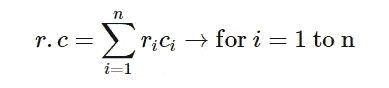
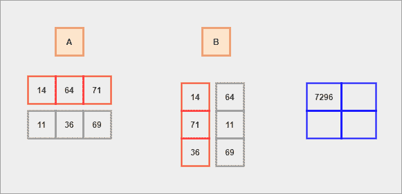
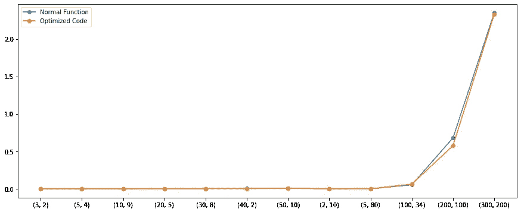
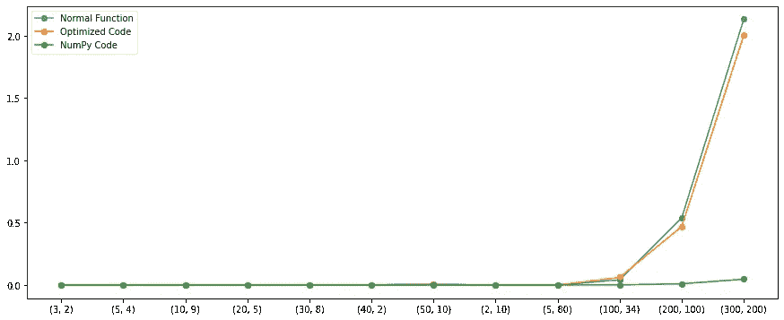

# 矩阵乘法——优化代码的正常功能

> 原文：<https://medium.com/analytics-vidhya/matrix-multiplication-normal-function-to-an-optimised-code-3d0fb9ddf6e9?source=collection_archive---------7----------------------->

在本文中，我们将学习不同的矩阵乘法方法，从一个易读的函数到一个优化的代码。


由 [Carl Nenzen Loven](https://unsplash.com/@archduk3?utm_source=medium&utm_medium=referral) 在 [Unsplash](https://unsplash.com?utm_source=medium&utm_medium=referral) 上拍摄的照片

# 介绍

如果你读过我以前关于矩阵运算的文章，现在你应该已经知道什么是矩阵了。是的，矩阵是一个有`M`行和`N`列的数组的`2D`表示。矩阵的形状通常被称为维度。因此，任何典型矩阵的形状被表示或假设为具有(`M` x `N`)维。

*   行矩阵——存储在`1`行和`N`列中的相同元素或对象的集合。
*   列矩阵——存储在`N`行和`1`列中的相同元素或对象的集合。

**注** —形状(`1` x `N`)和(`N` x `1`)的矩阵一般分别称为行向量和列向量。

# 算法解释

例如，假设我们有两个矩阵`A`和`B`。乘法运算前的一般规则是`A`的**列**的数量应该正好等于`B`的**行**的数量。如果满足此规则，则-

我们将计算`A`的每行相对于`B`的每列的点积。这个过程一直持续到没有元素需要计算为止。

*   `A`的每一行都被认为是一个行向量。
*   `B`的每一列都被认为是一个列向量。
*   点积—这是一种代数运算，对两个大小相等的向量进行计算，得到一个数字。它也被称为标量积。数学上，我们用以下形式表示它-



作者图片

结果矩阵的(运算后)大小将等于`A`的**行**的数量和`B`的**列**的数量。

**注意** —当我们处理大型矩阵时，计算可能会有风险或很慢。这个可以用`NumPy`轻松搞定。

# GIF 解释



作者 GIF

# 易于阅读的功能

如果我们试图分解整个算法，我们必须做的第一件事就是转置一个矩阵，并计算矩阵的每一行与另一个矩阵的每一列的点积或标量积。

**矩阵转置**

```
def transpose(m):
    trans_mat = [[row[i] for row in m] for i in range(len(m[0]))]
    return trans_mat
```

**点积**

```
def scalar_product(r, c):
    ps = [i * j for (i, j) in zip(r, c)]
    return sum(ps)
```

**矩阵乘法**

```
def mats_product(m1, m2):
    m2_t = transpose(m=m2)
    mats_p = [[scalar_product(r=r, c=c) for c in m2_t] for r in m1]
    return mats_p
```

为了将所有的功能打包在一起，我们可以做以下事情-

**总结**

```
def easy_product(m1, m2):    
    def transpose(m):
        trans_mat = [
            [row[i] for row in m]
            for i in range(len(m[0]))
        ]
        return trans_mat def scalar_product(r, c):
        ps = [i * j for (i, j) in zip(r, c)]
        return sum(ps) def mats_product(m1, m2):
        m2_t = transpose(m=m2)
        mats_p = [
            [scalar_product(r=r, c=c) for c in m2_t]
            for r in m1
        ]
        return mats_p return mats_product(m1, m2)
```

# 更简化的代码—(优化的)

上面的`easy_product()`还是可以利用 Python 的内置方法进行优化。方法上需要更好的改进`transpose()`。

**矩阵转置**

```
transpose = lambda m : list(map(list, zip(*m)))
```

**点积**

上面的`scalar_product()`还是可以减少，维持像-

```
scalar_product = lambda r, c: sum([i * j for (i, j) in zip(r, c)])
```

**矩阵乘法**

```
def mats_product(m1, m2):
    m2_t = transpose(m=m2)
    mats_p = [[scalar_product(r=r, c=c) for c in m2_t] for r in m1]
    return mats_p
```

为了将所有的功能打包在一起，我们可以做以下事情-

**总结**

```
def optimized_product(m1, m2):
    transpose = lambda m : list(map(list, zip(*m)))
    scalar_product = lambda r, c: sum([i * j for (i, j) in zip(r, c)]) def mats_product(m1, m2):
        m2_t = transpose(m=m2)
        mats_p = [
            [scalar_product(r=r, c=c) for c in m2_t]
            for r in m1
        ]
        return mats_p return mats_product(m1, m2)
```

厉害！这两个函数都准备好进行测试了。为了进行测试，我们需要定义矩阵。我们将创建随机矩阵(函数)，它可以进一步帮助检查两个函数的速度兼容性。

**随机矩阵创建**

```
import randomdef create_matrix(rcount, ccount):
    random.seed(10)
    m = [
            [random.randint(10, 80) for i in range(ccount)] 
            for j in range(rcount)
    ]
    return m
```

# 测试阶段

```
>>> nr = 2
>>> nc = 3
>>> 
>>> m1 = create_matrix(nr, nc)
>>> m2 = create_matrix(nc, nr)
>>> m1
[[14, 64, 71], [11, 36, 69]]
>>> m2
[[14, 64], [71, 11], [36, 69]]
```

**正常功能**

```
>>> mm = easy_product(m1, m2)
>>> print(mm)
[[7296, 6499], [5194, 5861]]
```

**改进代码**

```
>>> mm = optimized_product(m1, m2)
>>> print(mm)
[[7296, 6499], [5194, 5861]]
```

# 速度和计算—比较

现在，这两个功能似乎都足够好。但是检查算法在快速计算和时间方面的性能也很重要。

为此，我们将针对一组定义的矩阵形状循环运行这两个函数，并存储每个函数所需的时间。我们也将绘制相同的图形来直观地表示它。

**性能检查**

```
import time
from matplotlib import pyplot as pltdef check_speed():
    shapes = [
        (3, 2), (5, 4),
        (10, 9), (20, 5),
        (30, 8), (40, 2),
        (50, 10), (2, 10),
        (5, 80), (100, 34),
        (200, 100), (300, 200)
    ] x = [str(i) for i in shapes]
    y1 = []; y2 = []; for sp in shapes:
        m1 = create_matrix(sp[0], sp[1])
        m2 = create_matrix(sp[1], sp[0]) start_e = time.time()
        res_easy = easy_product(m1, m2)
        end_e = time.time()
        easy_elapse = end_e - start_e start_o = time.time()
        res_opt = optimized_product(m1, m2)
        end_o = time.time()
        opt_elapse = end_o - start_o y1.append(easy_elapse)
        y2.append(opt_elapse) plt.figure(figsize=(15, 6))
    plt.plot(x, y1, 'o-', label='Normal Function')
    plt.plot(x, y2, 'o-', label='Optimized Code')
    plt.legend()
    plt.show() return None
```

**性能图表**



作者图片

除了少数情况，这两种算法的工作原理似乎相似。但是有一个问题，我们是从个人角度来写这些函数的。如果我们引进`NumPy`来做同样的事情，性能会更好。下图也包括了`NumPy`的性能。



作者图片

是啊！NumPy 快多了。无论大小如何，NumPy 在计算相同的操作时消耗的时间非常少。

# 我学到的东西

*   分解一个给定的问题，解决每个问题，最终解决原来的问题。
*   比较算法和跟踪计算。

如果你喜欢我的文章，你可以在这里买些咖啡支持我。这将激励我去写作和学习更多我所知道的东西。即使你不这样做也完全没关系。