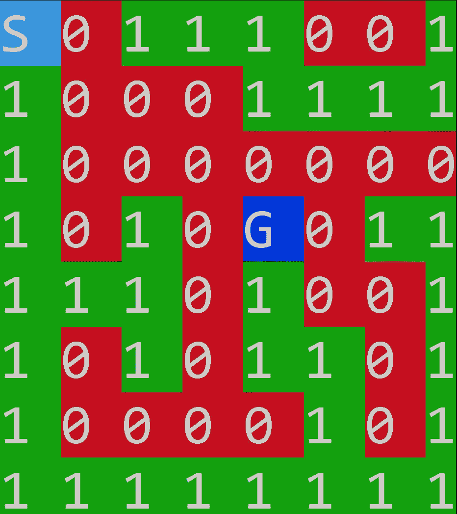

# Python 中的迷宫问题

> 原文：<https://medium.com/analytics-vidhya/maze-problem-in-python-b303797b03ee?source=collection_archive---------2----------------------->

在这篇文章中，我们将看看非常重要的面试观点问题(迷宫问题)以及如何用 python 一步一步地解决这个问题。

*如果你来这里只是为了节目滚动到文章的最后*

迷宫是一个 2D 矩阵，其中一些细胞被堵塞。其中一个单元格是源单元格，我们必须从这里开始。另一个是目的地，我们必须到达的地方。我们必须找到一条从源到目的地的路径，而不进入任何被封锁的小区。



迷惑

无 taions

> 1:可步行路径
> 
> 0:不可行走的路径
> 
> s:起点(起点将是(0，0))
> 
> 目标(在程序中我们用整数 9 来表示目标)

当你看到问题时，你首先想到的应该是如果起点不可行走怎么办(0)如果起点不可行走，那么你应该立即返回假或不可能。在解决问题时，思考边缘案例非常重要，因为在网上判断时，你不会因此出错，而在电话面试中，这表明你对问题有多清楚。

在我们的例子中，我们的起点是可步行的，所以我们可以开始我们的算法

我们使用 BFS 回溯，这个问题也可以用 DFS 解决。

关键步骤:

1:定义全局(开始、结束、可行走、不可行走、迷宫维度)

这里我们的迷宫大小是 8 x 8

2:BFS 实施步骤

> 步骤 1:初始化队列
> 
> 步骤 2:初始化已访问列表/集合

在这里，我们初始化我们的队列，并看到设置。注意，我使用“seen”作为 set，因为它提供了 0(1)个查找时间。但是如果你需要输出路径，你也可以声明一个单独的列表来跟踪路径，因为集合是无序的，我们不能依赖它

> 第三步:检查我们是否达到目标

这一步是不言自明的，我们正在检查我们是否在目的地，如果是，终止程序

> 步骤 4:遍历所有可能的方向(东、西、北、南)
> 
> 第五步:检查条件

> 在第 1 行，我们有允许方向的方向元组
> 
> 第 2 行:我们正在检查我们是否在有效列
> 
> 第 3 行:我们正在检查我们是否在有效行
> 
> 在第 4 行，我们检查当前单元格是否是墙
> 
> 在第 5 行，我们检查我们是否访问了这个单元

如果所有 4 个条件都为真，那么我们知道我们在有效的单元，我们标记该单元被访问，并继续我们的循环，直到没有单元留下，如果路径存在，我们要么到达目标，否则程序将返回无

# 完整的项目

```
Usage: Python filename.py
```

它将要求输入粘贴在 CMD 块下面

```
8 8
1 0 1 1 1 0 0 1
1 0 0 0 1 1 1 1
1 0 0 0 0 0 0 0
1 0 1 0 9 0 1 1
1 1 1 0 1 0 0 1
1 0 1 0 1 1 0 1
1 0 0 0 0 1 0 1
1 1 1 1 1 1 1 1
```

就这样，祝贺你已经在矩阵上实现了 BFS，现在像这样多练习。

这个问题有很多变化，比如他们可能会给你自定义的目的地坐标，你只能向两个方向或四个方向移动等等。但是一旦你理解了基本的概念，就很容易实现其他的变化

请继续关注下一篇文章，我们将在那里解决来自 leet code/二分搜索法的问题