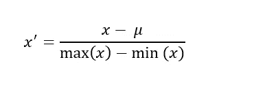
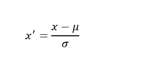
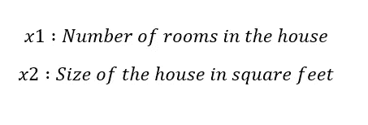
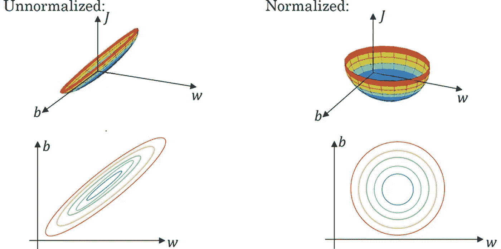

# 均值归一化和特征缩放-简单解释

> 原文：<https://medium.com/analytics-vidhya/mean-normalization-and-feature-scaling-a-simple-explanation-3b9be7bfd3e8?source=collection_archive---------1----------------------->

至少可以说，均值归一化和特征缩放的概念是最少涉及的。所以，到这篇文章结束的时候，你就会清楚这两个概念了。

为了理解这两个概念，我们必须首先回答几个问题。

1.  什么是特征缩放？
2.  什么是均值归一化？
3.  我们什么时候使用这些概念？
4.  为什么我们需要这些技术？

让我们一个一个地检查这些问题。

# **1。**什么是特征缩放？

特征缩放是将机器学习问题的所有特征带到相似的规模或范围的过程。定义如下

> **特征缩放**是一种用于归一化自变量范围或数据特征的方法。

特征缩放可以对机器学习模型的训练效率产生显著影响，并且可以改进训练模型所花费的时间。具体细节将在下面讨论。

# 2.什么是均值归一化？

均值归一化是实现特征缩放的一种方式。均值归一化的作用是计算并减去每个要素的均值。通常的做法也是将该值除以范围或标准偏差。

作者图片

当同样的过程完成后，标准偏差被用作分母，那么这个过程被称为**标准化**

作者图片

# 3.我们什么时候使用这些概念？

通常，当要素不具有相同范围的值时，使用要素缩放。为了解释这一点，让我们以房价为例。在这个问题中，可能有许多特性需要考虑，但为了简单起见，我们只考虑其中的两个。

作者图片

现在，x1 的范围可以从 2 到 5，x2 的范围可以从 2500 到 5000。现在，当我们看范围时，我们可以看到有一个巨大的差异。这种差异会减缓模型的学习。

# 4.为什么我们需要这些技术？

现在最重要的问题是，我们为什么需要这些概念和技术？上一节已经部分回答了。为了详细讨论，我们需要理解一个名为**等高线**的数据可视化图形。

> **轮廓**图是在二维平面上显示三维表面的一种方式。

来源:deeplearning.ai |吴恩达

当我们看一下上面的图像，我们可以看到，非标准化的轮廓是歪斜的，并采取了椭圆形。它旁边的图像显示了一个归一化的轮廓，该轮廓呈圆形且间距均匀。

当我们在两种情况下应用梯度下降时，可以看到，如果输入被归一化，梯度下降会更快地收敛到最小值。然而，如果输入没有被归一化，梯度下降在收敛到最小值之前需要很多步骤，这会减慢模型的学习过程。

# 结论

总之，如果输入被归一化，梯度下降收敛到最小值的速度更快，这与模型的学习直接相关。如果特征范围相差很大，建议进行特征缩放。